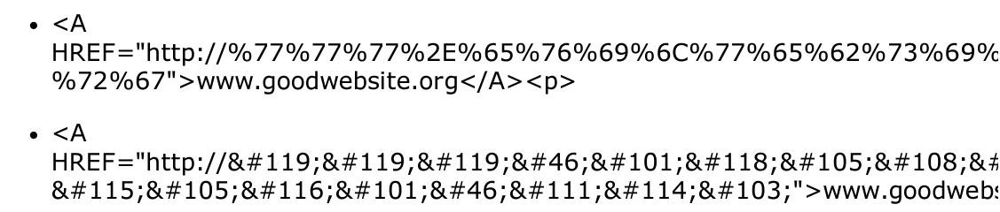
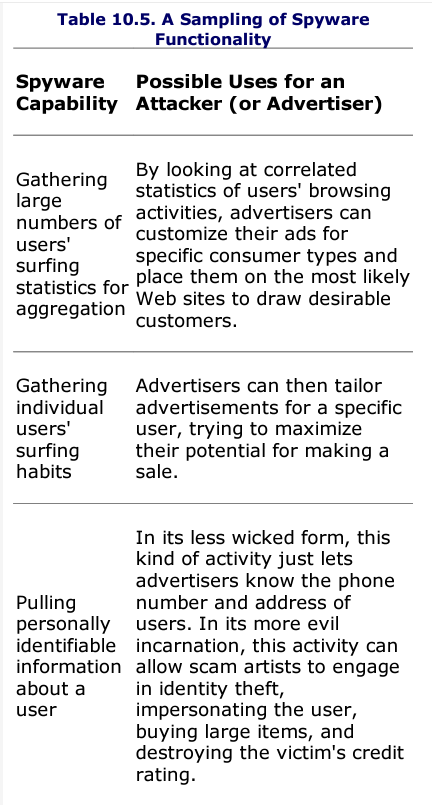

# Notes

After completing phase 3, the attacker has gained access to the target system. This chapter discusses the tools and techniques they use to keep access and control systems. To achieve these goals, attackers utlize techniques based on malicious software such as Trojan horses, backdoors, bots, and rootkits.

# Trojan Horses

Trojan horse software consists of programs that appear to have a benign and possibly even useful purpose, but hide a malicious capability. An attacker can trick a user or even administrator into running a Trojan horse program by making it appear attractive and disguising its true nature.

- At some level, a trojan horse is an exercise in social engineering: can the attacker dupe the user into believing that the program is beneficial or con the user into running it? The moral of the story: Beware of geeks bearing gifts!

Whereas some Trojan horse tools are merely destructive, other Trojan horse programs are even more powerful, allowing an attacker to steal data or even remotely control systems.

# Backdoors

A backdoor software allows an attacker to access a machine using an alternative entry method. Normal users log in through front doors, such as login screens with user IDs and passwords, token-based authentication (using a physical token such as a smart card), or cryptographic authentication (such as the logon process for Windows or SSH).

- Attackers use backdoors to bypass these nromal system security controls that act as the front door and its associated locks.
- Once attackers install a backdoor on a machine, they can access the system without using the passwords, encryption, and account structure associated with normal users of the machine.

## Netcat as a Backdoor on UNIX Systems

A simple yet powerful backdoor can be created using Netcat to listen on a specific port.

To use Netcat as a backdoor, the attacker must compile it with its `GAPING_SECURITY_HOLE` option, so that Netcat can be used to start running another program on the victim machine, attaching standard input and output of that program to the network. This option can be easily configured into Netcat while the attacker is compiling it. With a version of Netcat that includes the `GAPING_SECURITY_HOLE` option, the attacker can run the program with the `-e` flag to force Netcat to execute any other program, such as a command shell, to handle traffic received from the network. After loading the Netcat executable onto the victim machine, an attacker who has broken into the fred account on a system can type this:

```
# nc -l -p 12345 -e /bin/sh
```


This command will run Netcat as a backdoor listening on local TCP port 12345.

An attacker can also create a very similar backdoor on a Windows system using the Windows version of Netcat with the Windows command shell, cmd.exe. the command to execute to create such a listener is:

```
C:\>nc -l -p 12345 -e cmd.exe
```


# The Devious Duo: Backdoors Melded Into Trojan Horses

These programs appear to have a useful functoin, but in reality, allow an attacker to access a system and bypass security controls--a deadly combination of Trojan horse and backdoor characteristics.

## Roadmap For the Rest of the Chapter

Throughout the rest of the chapter, there will be discussions about several tools that fall into the Trojan horse backdoor genre, all operating at different layers of our systems: application-level Trojan horse backdoors, user-mode rootkits (which modify or replace critical operating system executable programs or libraries), and kernel-mode rootkits (which modify the kernel of the operating system).

- As we progress through these layers, the attacker's ability to hide increases significantly.


# Nasty: Application-Level Trojan Horse Backdoor Tools

Application-Trojan horse backdoors are tools that add a separate application to a system to give the attacker a presence on the victim machine.

- This software could provide the attacker with backdoor command-shell access to the machine, give the attacker the ability to control the system remotely, or even harvest sensitive information from the victim.

## Remote-Control Backdoors

With a remote-control backdoor, the attacker can read, modify, or destroy all information on the system.

The figure below displays the simple architecture of these tools.


The attacker installs or tricks the user into installing the remote-control backdoor server on the target machine. Once installed, the backdoor server waits for connections from the attacker, or polls the attacker asking for commands to execute. The attacker uses a specialized remote-control client tool to generate the command for the remote-control backdoor server. When it receives a command, the server executes the commands and sends a response back to the client. The attacker installs the client on a separate VM or system.

Whenever you investigate an attack associated with a remote-control backdoor, you tyically should search websites that list similar signatures. In addition you can narrow down the backdoor specifying its registry keys, port numbers, or file artifcats found with the attacker's tool.

### What Can a Remote-Control Backdoor Do?

Although the functionality of various remote-control backdoors varies, most of them draw from a basic set of similar underlying functions.

The following table provides a round-up of various capabilities included in a majority of the tools listed at the Megasecurity web site.


As an example of these capabilities implemented in one venerable remote-control backdoor, consider the figure below, which shows an image of the BO2K screen. The attacker has configured BO2K to watch the GUI of the victim, dump the encrypted password representations from the target machine, and activate a keystroke logger. The attacker is now about to take over mouse control of the victim system.


### Build Your Own Trojans Without Any Programming Skill!

To further increase the likelihood that a user will install a backdoor, the computer underground has released programs called wrappers or binders.

- These tools are useful in creating Trojan horses that install a remote-control backdoor.
- A wrapper attaches a given .EXE application to the remote-control backdoor server executable.
- The two seperate programs are wrapped together in one resulting executable file that the attackers can name anything they want. Two executables enter the wrapper, one leaves with the blended functionality of both input programs.

When the user runs the resulting wrapped executable file, the system first installs the remote-control backdoor, and then runs the benign application.


### Trojan Horses of a Different Color: Phishing Attacks and URL Obfuscation

Another Trojan horse activity associated with e-mail has no attachment at all, but instead a link to a Web site that appears to belong to a legitimate online enterprise.

- These emails are spoofed to appear to come from a trusted source such as a bank, e-commerce company, or other financial services organization dealing with sensitive data.

With phishing, instead of distributing a Trojan horse backdoor as an e-mail attachment, the e-mail simply points to a Web site that is itself the Trojan horse. IT sure looks like the user's bank, but it is, in fact, an evil duplicate.

- Often attackers use an <href>tag to display certain text for the link on an HTML-enabled e-mail client screen, with the link actually pointing somewhere else.</href>

First and perhaps most simply, the attacker could dupe the user by creating a link that displays the text `www.goodwebsite.org` on the screen but really links to an evil site. To achieve this, the attacker could compose a link like the following and embed it in an e-mail message or on a website:

```
<A HREF="http://www.evilwebsite.org">www.goodwebsite.org</A><p>
```

Most subtle methods of disguising URLS can be achieved by combining this tactic with a different encoding scheme for the evil Web site URL.

- The vast majority of browsers and e-mail clients today support encoding URLs in a hex representation of ASCII or in Unicode (a 16-bit character set designed to represent more characters than plain old 8-bit ASCII). Using any ASCII-to-Hex-to-Unicode calculator, an attacker could convert their website into the following ASCII or Unicode representations and include them in the HREF tag



# Also Nasty: The Rise of the Bots

Another class of application-level Trojan horse backdoor raises the ante significantly: bots.

Bots are simply software programs that perform some action on behalf of a human on large numbers of infected machines.

- Using bots, an attacker could have dozens, hundreds, thousands, or even more system under control simultaneously, each with bot software installed to maintain and coordinate that control as illustrated below.


Most bot-nets, are controlled via IRC, a protocol that gives the attackers numerous advantages.

- First, many networks, especially those ripe with poorly secured systems like home user machines and university student systems, allow outbound IRC communication.
- But even more important, IRC offers the attackers a built-in one-to-many communications path, in effect implementing a multicast channel.

The various bots are all configured to log into a single IRC channel. The attacker then logs into this channel and sends commands across the channel to all of the bots, which then execute the commands.


\]

By default, IRC traffic is carried over TCP port 6667 listening on the IRC server.

Bots can be spread from system-to-system via worms

# Additional Nastiness: Spyware Everywhere

Spyware, spies on users to watch their activities on their machine on behalf of the spyware author or controller.

- Some of the most popular spyware capabilities are summarized in the table below.




# Defenses Against Application-Level Trojan Horse Backdoors, Bots, and Spyware

## Bare Minimum: Use Antivirus and Antispyware Tools

Antivirus programs include signatures to detect these artifacts created by each tool on a hard drive and in system memory.

All of the major antivirus program vendors have released versions of their software that can detect and remove the most popular evil backdoors and bots.

## Looking For Unusual TCP and UDP Ports

Many of the remote-control backdoors and bots we've discussed listen on a given TCP or UDP port. These ports can be discovered using a variety of mechanisms that we discussed in the scanning chapter. On Linux and UNIX machines, the `netstat` command comes in handy as well, along with the `lsof -i` command.

## Knowing Your Software

Understand who wrote your software and what it is supposed to do. Consider if the developer is trust worthy.

To determine if a software is trusted, authors will sometimes use digital fingerprints which take an MD5 or SHA1 hash of the program so that users can compare their own hash with the original.

In this way, fingerprints give users assurance of the integrity of a program.

**MD5 hash of tcpdump helps ensure it hasn't been Trojanized**


## User Education is Also Critical

Finally, educate your user base about phishing attacks, and make sure they don't respond to unsolicited e-mail that appears to come from e-commerce sites or banks.

# Even Nastier: User-Mode Rootkits

The application backdoors we've discussed so far (Netcat listeners, remote-controlled backdoors, bots, and spyware) are separate applications that an attacker adds to a system to act as a backdoor.

- These are typically easy to detect since they are independent application-level programs running on a machine.

User-mode rootkits are a more insidious form of Trojan horse backdoor than their application-level counterparts.

- They raise the ante by altering or replacing existing OS software, as shown in the figure below.


Rather than running as a foreign application (like Netcat or a bot), user-mode rootkits modify critical operating system executables or libraries to let an attacker have a backdoor access and hide on the system. They are called user-mode rootkits because these tools alter the programs and libraries that users and admins can invoke on a system, not the system itself.

User-mode rootkits have been around for well over a decade, with the first very powerful rootkits detected in the early 1990s on UNIX systems.

## What Do User-Mode Rootkits Do?

Contrary to what their name implies, rootkits do not allow an attacker to gain root access to a system initially. Rootkits depend on the attackers' having already obtained super-user access.

- A rootkit is a suite of tools that let the attacker maintain super-user access by implementing a backdoor and hiding evidence of the system compromise.

## Linux/UNIX User-Mode Rootkits

Most Linux and UNIX user-mode rootkits replace critical OS files with new versions that let an attacker get backdoor access to the machine and hide the attacker's presence on the box.

- Most Linux/UNIX rootkits include several elements, including backdoors, sniffers, and various hiding tools, each of which we explore next.

## Linux/UNIX User-Mode Rootkit Backdoors

Some of the most fundamental components of many user-mode rootkits for Linux and UNIX are a full complement of backdoor executables that replace existing OS programs on the victim machine with new rootkit versions.

When you log into a system, whether by typing at the local keyboard or accessing the system across a network using telnet, the `/bin/login` program runs. Alternatively, if you log in using SSH, the ssh daemon runs, typically located in `/usr/sbin/sshd`.

- The system uses the login or ssshd executables to gather and check the user authentication credentials, such as the user's ID and password for `/bin/login` and the user's public key for specific configurations of `sshd`.
- Once the user provides credentials the `login` or `sshd` program checks the system's password file or the SSH credentials to determine whether the authentication credentials are accurate.

Many user-mode rootkits replace the `login` and `sshd` programs with modified versions that include a backdoor password for root access hard-coded into the `login` and `sshd` executables.

- These by definition make them backdoors and trojan horses since they look like normal, happy programs.

The figure below shows a user logging onto a system before and after a user-mode rootkit is installed.


To detect backdoors like this, system administrators sometimes run various executables like the `login` and `sshd` programs through the strings command, a Linux/UNIX program that shows sequences of consecutive ASCII characters in a file. If an unfamiliar sequence of characters is found, it might be a backdoor password.

## Linux/UNIX User-Mode Rootkits: Sniff Some Passwords

Once a system is taken over, attackers install a sniffer to attempt to gather passwords and sensitive data going to other systems on the network.

## Linux/UNIX User-Mode Rootkits: Hide That Sniffer!

System admins can run the program `ifconfig` to show the characteristics of the network interfaces. Furthermore, `ifconfig` also displays which interfaces are in promiscuous mode. The interface is placed in promiscuous mode if a sniffer is running on a system, gathering all data from the network without regard to its destination MAC address. By running `ifconfig` on some UNIX varieties, the admin can detect the sniffer as shown below.


Of course, the attackers do not want the system admins to discover their presence, so they counter this technique of searching for promiscuous mode. Most user-mode rootkits for UNIX include a Trojan horse version of `ifconfig` that lies about the PROMISC flag, preventing sys admins from detecting that rootkit.

### Additional Linux/UNIX User-Mode Rootkit Hiding Techniques

The majority of rootkits replace far more than the login and sshd programs with backdoor versions and the `ifconfig` command that hides promiscuous-mode. The same technique applied to `ifconfig` for hiding critical evidence about an attacker's presence are also employed against numerous other programs used by the system administrator.

The table below shows some of the programs commonly replaced by Linux and UNIX rootkits to mask the attacker's activities on the system.


Each of these critical system programs are replaced with a Trojan horse alternative.

### User-Mode Rootkits: Covering the Tracks

Rootkits are designed to be as stealthy as possible, and include several techniques to mask the fact that a system is compromised.
- Many system administrators discover intrusions by observing changes in the last modified date of critical system files. Most user-mode rootkits for Linux and UNIX can alter the creation, modification, and last access time for any rootkit replacement files by setting these times back to their original value. 
- The changed values are undetectable, because they are reset to their original value before the installation of the rootkit. 

### Some Particular Examples of Linux/UNIX User-Mode Rootkits
The Linux RootKit 6 (Irk6), written by Lord Somer, is among the most fully featured rootkits available today. As its name implies, Irk6 targets Linux systems, and includes Trojan horse versions of the following programs:


## Windows User-Mode Rootkits
Most Linux and UNIX user-mode rootkits replace critical OS program files with evil substitutes. Most Windows user-mode rootkits opt for a slightly different approach: altering the memory of running processes associated with the operating system. 
- By altering the memory of a running process such as Task Manager or an executing ```netstat``` program, the attacker can hide processes and TCP and UDP port usage, without even changing the file associated with these executables on the hard drive. 

This change in tactics for Windows systems is caused by several factors, but two are important:
- **The difficulty Windows puts on altering critical files in the file system.** Microsoft uses a built-in file integrity checker in Windows systems called Windows File Protection (WFP). If any file changes are detected, WFP will instantly roll it back to its original version.
- **The ease with which Windows lets on running process access another process**. The Windows OS includes various API calls that let one running process connect to and debug another running process, as long as the first process has debug rights. 

### Windows User-Mode Rootkit Hiding Tactics
Most Windows applications used by administrators to look for evidence of malicious processes rely on a handful of API calls into the various Windows libraries, especially ```ntdll.dll```, a big library used by many programs to interact with Windows itself. 

A running rootkit can overwrite these API calls in each running process so that they point not to normal Windows code to implement the function, but instead to the attacker's own code. This process of using debug privileges to overwrite API calls in running processes is called API hooking. So a process like Task Manager will make an API call to get a list of running processes on the machine. 

Beyond Task Manager and the NTQuerySystemInformation API call, many Windows user-mode rootkits hook more than a dozen different API calls to hide various aspects of the system. The table below lists a handful of the most poular API calls on the Windows machines that user-mode rootkits hook. 


### Implementing Windows User-Mode Rootkit Backdoors
In addition to API hooking for stealth capabilities, many Windows user-mode rootkits include a command-shell backdoor, similar in functionality to the Netcat command shell listeners discussed earlier. 
- It is important to note that the backdoor program's file, runnign process, and port number are all hidden using various API hooking mechanisms. 

### Some Particular Examples of Windows User-Mode Rootkits
One of the msot popular user-mode rootkits for Windows is Hacker Defender (also known as hxdef), written by a rootkit designer who calls himself "holy father". 

Hacker Defender is designed to defend the bad guys. The tool is centered around API hooking, which it uses to hide an enormous number of artifacts on a system that attackers might want to mask. Its features include the following:
- Hiding files, processes, system services, system drivers, Registry keys and values, and TCP and UDP ports.
- Lying to users and admin about how much free space is available on the hard drive, so an attacker can mask the size of archives of pirated software, sniffed passwords, pornography, and other items the attacker has deposited on the system. 
- Hiding the alterations it makes to running processes when hooking APIs to thwart investigators using debuggers. 
- Creating a remotely accessible command-shell backdoor, made invisible on the local system through the API hooking mechanism. 
- Implementing a relay that redirects packets across a network, obscuring their source, like the Netcat relays 

**The System Before Hacker Defender is Installed**


**The System After Hacker Defender is Installed**


All of this functionality is achieved by a new service introduced into the system, called hxdef by default, that runs in the background and monitors system activities to make sure everything is hidden appropriately. 

All of this action is controlled by a configuration file that is included with Hacker Defender. In this INI fille, the attacker has to specify in advance each of the elements that needs to be hidden, using a convenient syntax, such as ```[Hidden Ports] TCP:port_num``` and ```Hidden RegValues [reg_key_name]```.

Besides Hacker Defender, another popular user-mode rootkit for WIndows is the AFX Windows Rootkit, written by a developer who calls himself Aphex. 
- This tool was originally released in 2003, but has been updated several times since then
- AFX Windows Rootkit uses API hooking techniques to hide files, processes, registry keys, and TCP and UDP ports. 
- It uses a single hidden directory to bypass the issue of attackers forgetting to list artifacts in the INI file. 

The figure below illustrates how the attacker places the AFX Widnows Rootkit executable in one directory on the victim machine and runs it. 


# Defending Against User-Mode Rootkits
## Don't Let The Bad Guys Get Super-User Access in The First Place!
By preventing an attacker from getting root, SYSTEM, or administrator access in the first place, you prevent them from installing rootkits. 

One set of tools that can help you harden your systems is created by the Center for Internet Security (CIS), a volunteer group focused on improving the security state of systems on the internet. Their hardening templates, available for free are a great way to start. 

### File Intergrity Checkers
One of the best ways to detect user-mode rootkits is to use cryptographically strong digital fingerprint technologies to periodically verify the integrity of critical system files.
- Make sure you use more than one hash mechanisms (MD5, SHA256 etc) 

Tripwire is a wonderful file integriry checking tool. 
- On Linux and UnixTripwire can look for changes in the ```login, sshd, ifconfig, ls, ps,``` and ```du``` files, among the many other executables frequently changed by user-mode rootkits. 
- On Windows, Tripwire can look for additions or changes to the critical ```system32``` directory where many Windows rootkits drop executables and libraries that tweak the system's behavior. 

## Uh-Oh...They Rootkitted Me. How Do I Recover?
If you detect a rootkit on your system, you have a signficant problem. An attacker has gained super-user-level access to your system. 

Fixing just the things the file integrity checker flags is not good enough since there may be hidden backdoors and trojans throughout the system.

The be truly sure you elimintate all of the little suprises left by an attacker with super-user access, you should really completely reinstall all operating system components and applications, just to make sure your system is clean. 

# Nastiest: Kernel-Mode Rootkits
Kernel-mode rootkits are a highly active area of development in the computer underground, with new examples being released on a regular basis. 

In most OS's the kernel is the fundamental, underlying part of the OS that controls access to network devices, processes, system memory, disks, and so on. All resources on the system are controlled and coordinated through the kernel. 
- Kernel mode rootkits give an attacker complete control of the underlying system, a powerful position to be in for an attacker.

The figure below shows why kernel-mode rootkits are more devious than their user-mode siblings. Whereas a user-mode rootkit alters the eyes and ears of a system admin, a kernel-mode rootkit actually alters part of the system administrator's brain. 
- Kernel-mode rootkits take advantage of this by modifying the kernel to transform the system completely and transparently to conform to the attacker's needs. 


## The Power of Execution Redirection
Many kernel-mode rootktis include a capability called execution redirection. This feature intercepts calls to run certain applications and maps those calls to run another application of the attacker's choosing. 
- Ex: The user or admin says to run program foo, the kernel pretends to run foo, but then the kernel actually runs a different program called bar. 

## File Hiding With Kernel-Mode Rootkits
With file hiding, the attacker configures the victim machine so that anyone looking around the file system will see only what the attacker wants. 
- A kernel-mode rootkit can modify the kernel to lie to the intact ```ls``` program, the ```echo *``` command, and any other file listing command you attempt to run. 
- Similarly, on a Windows machine, the attacker can alter the underlying Windows kernel to lie to your Windows File Explorer and ```dir``` commands to hide the bad guy's items stored in your file system. 

## Process Hiding With Kernel-Mode Rootkits
Another common feature of kernel-mode rootkits is the ability to hide any running processes of the attacker's choosing. The attacker might setup a Netcat backdoor listener. Any application that tries to lookup the process table will get a wrong answer from the kernel, conveniently omitting the results the attacker doesn't want you to see.

## Network Hiding With Kernel-Mode Rootkits
When a process listens on a specific TCP or UDP port, it can be dtected using the command 	```netstat -na```, as discussed in chapter 6. 
- This command relies on the kernel to determine which ports are currently active and listening. 
- To avoid attacker's backdoor listeners etc, many kernel-mode rootkits offer capabilities for masking particular network port usage. 

For example, the attacker can direct the kernel to lie about TCP port number 2222 when anyone asks for a port listing. Regardless of the program run on the local system to determine which ports are open (netstat or whatever else, such as lsof -i on UNIX or TCPView, ActivePorts, or Fport on Windows), the rotten kernel will mask the backdoor listener on this port. 

Whereas network hiding works for all requests for network port usage run locally on the victim machine, a port scan across the network (using a tool like Nmap discussed in Chapter 6) will show the listening port. 
- The remote tool measuring for open ports across the network will not be blinded by the kernel, which tricks all local commands that are run on the victim machine. 

## Some Particular Examples of Kernel-Mode Rootkits 
A wide variety of kernel-mode rootkits are available. 

### Adore-ng: A Linux Kernel-Mode Rootkit
Adore-ng is a kernel-mode rootkit that targets Linux systems running kernel 2.4, 2.5, 2.6. The tool has been proted to FreeBDS. It includes the following features

- Promiscuous mode hiding: The attacker can hide the running sniffer program itself easily using file and process hiding. However, sniffers typically put the ethernet interface in promiscuous mode to gather all packets from the LAN, which the admin can detect using the ```ip link``` commands on some versions of Linux and ```ifconfig``` on some versions of UNIX. Adore-ng is smart and checks to see if the sniffer is run by an admin or the attacker. If an admin fires up the sniffer, the system displays promiscuous mode like normal. But if an attacker runs a sniffer, the kernel will lie about its promiscuous effects. 

- Process hiding: Adore-ng can take any running process and cloak it. At the request of the attacker, the kernel suprresses all information about the given process. While the process continues to run, all use of the ```ps, lsof```, or other process viewing commands will not show the process. 

- Kernel-module hiding: On Linux, the ```lsmod``` command provides a list of kernel modules currently installed on a machine. The attacker does not wnat the system administrator to see the Adore-ng module loaded into the system's kernel. The Adore-ng tool therefore hides itself from ```lsmod```, tweaking the kernel to lie about the kernel's own status. 

## The Windows FU Kernel-Mode Rootkit
This very full-featured rootkit directly manipulates Windwos kernel memory on Windows 2000, XP, and 2003 machines. 
- This tool consists of a special device driver, named ```msdirectx.sys```, which some users might mistake for Microsoft's own DirectX tool, an environment for developing graphics, sound, music, and animation programs such as games.

FU can hide an attacker's process on the machine. Additionally FU can alter the privileges of any running process to any level the attacker wants, on the fly without even stopping the process. 

Futhermore, FU hides selected types of events from the Windows Event Viewer, so an administrator will not be able to see specific actions taken by the attacker when running the Event Viewer locally on the machine. 

# Defending Against Kernel-Mode Rootkits
## Fighting Fire with Fire: Don't Do it!
Don't install a rootkit on your own system to prevent attackers from doing it. 

This is a bad idea for several reasons. 
1. You might make your system more vulnerbale to a highly skilled attacker who understands the tool better than you do.
2. A kernel-mode rootkit makes the system inherently more difficult to understand and analyze. 
3. Theoretically, multiple kernel-mode rootkits of different types could be installed on a system at the same time, possibly without interacting with each other in a negative way. 

## Don't Let Them Get Root in The First Place!
You must configure your systems securely, disabling all unneeded services and applying all relevant security patches. Without super-user access, an attacker cannot install a kernel-mode rootkit. 

Hardening your systems and keeping them patched are the best preventative means for dealing with kernel-mode rootkits. 

## Control Access To Your Kernel
You also might want to turn to some freely available tools to help limit attackers' actions on your systems. One noteworthy free tool for identifying and controlling the flow of action between user mode and kernel mode on Linux and UNIX is Systrace. 
- Systrace tracks and limits the system calls that individual applications can make. 

## Automated Rootkit Checkers
Basically in the name

## File Integrity Checkers Still Help!
Although they can be tricked, you should still use them just in case an attacker slips up. 

## Antivirus Tools Help Too!
Most antivirus solutions have signatures for dozens of different rootkits, both of the user-mode and kernel-mode varieties. When they detect a file from a rootkit, most antivirus tools prevent the program from being accessed. 

## Trusted CDs for Incident Handling and Investigations
When investigating a potential rootkit attack, rememebr that the OS software itself might lie to you about what's happening on the machine. 
- First get a solid backup of the machine before even considering shutting it down. 
- Next get a copy of a trusted CD designed for incident handling and upload that instead


# Summary
After gaining access to a target machine, attackers want to maintain that access. They use Trojan horses, backdoors, and rootkits to achieve this goal. A torjan horse is a program that looks like it has some useful purpose, but really hides maliicous functionality. Backdoors give an attacker access to a machine while bypassing normal security controls. 

Backdoors and Torjan horses are the most damaging when they are melded together. The resulting Trojan horse backdoors can operate at a variety of levels. Application-level Torjan horse backdoors invovle running a seperate application on the target machine that looks innocuous, but gives the attacker access to and control of the victim machine. Remote-control programs, bots, and spyware are three of the most popular categories of application-level Trojan horse backdoor. These tools can be used to access any file on the victim's machine, watch the user's actions in the GUI, and log keystrokes, among numerous other features. The best defense against application-level Trojan horse backdoors is to utilize up-to-date antivirus and antispyware tools and avoid malicious software. 

User-mode rootkits go to a depeer level of the OS than application-level Trojan horse backdoors. User-mode rootkits replace critical system executable programs, such as the ```login``` and ```sshd``` programs in UNIX and Linux. Attacker replace them with another version that includes a backdoor password. Additionally, attackers rely on user-mode rootkits to replace many other programs, such as ```ifconfig, ls, ps, and du``` all of which act as the eyes and ears of a system administrator. By altering these programs, the attackers can mask their presence on the system. Alternatively, on a Windows machine, the bad guys use debug privileges to inject code into running processes to hook their API calls. 

Kernel-mode rootkits are the nastiest Trojan horse backdoors we face on a regular basis today. Using these tools, the attacker alters the kernel of the target OS to provide execution redirection to remap a user's request to run a program so that a program of the attacker's choosing is executed. Kernel-mode rootkits also support hiding files, directories, TCP and UDP port usage, and running processes. 

To defend against kernel-mode rootkits, you should keep attackers from gaining super-user access in the first place by applying system patches and host-based IPSs. Tools such as Chkrootkit and Rootkit Hunter for Linux and UNIX, as well as Rootkit Revealer and Blacklight for Windows, look for anomalies introduced on a system by various user-mode and kernel-mode rootkits. 