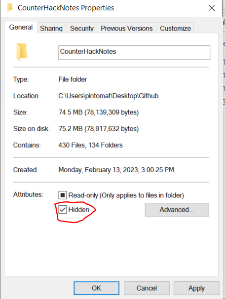
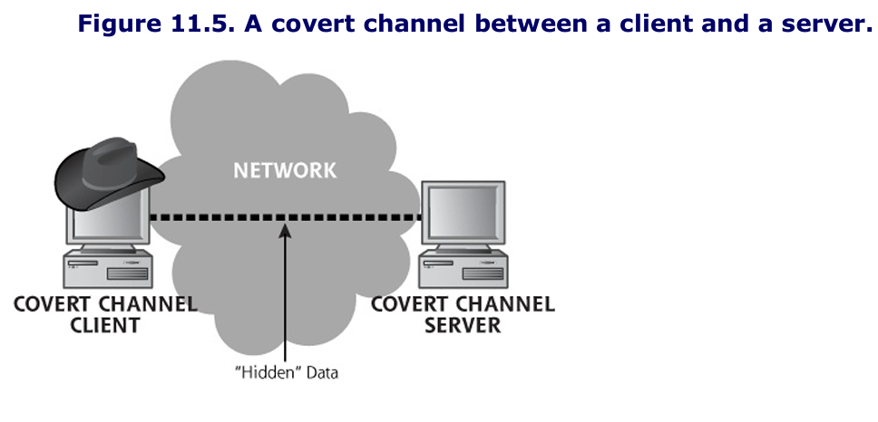
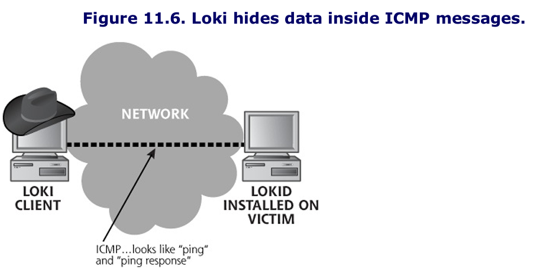
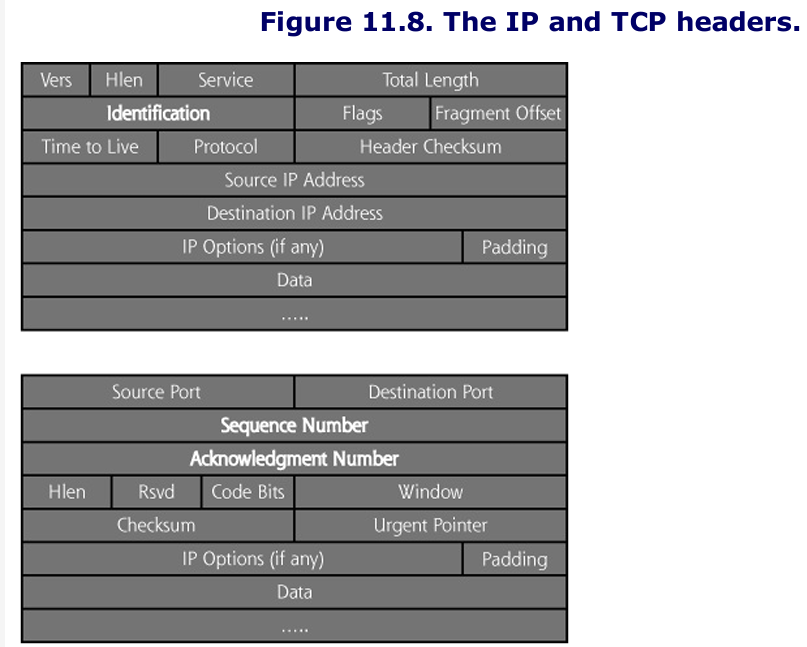
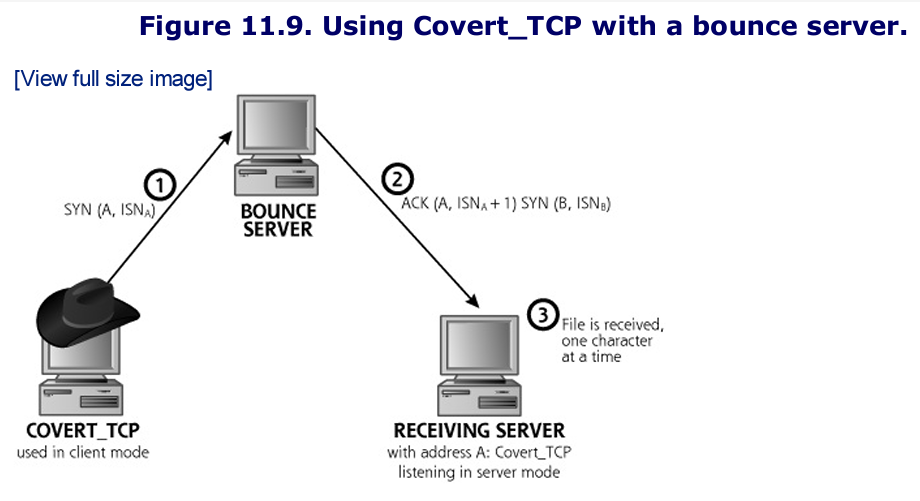
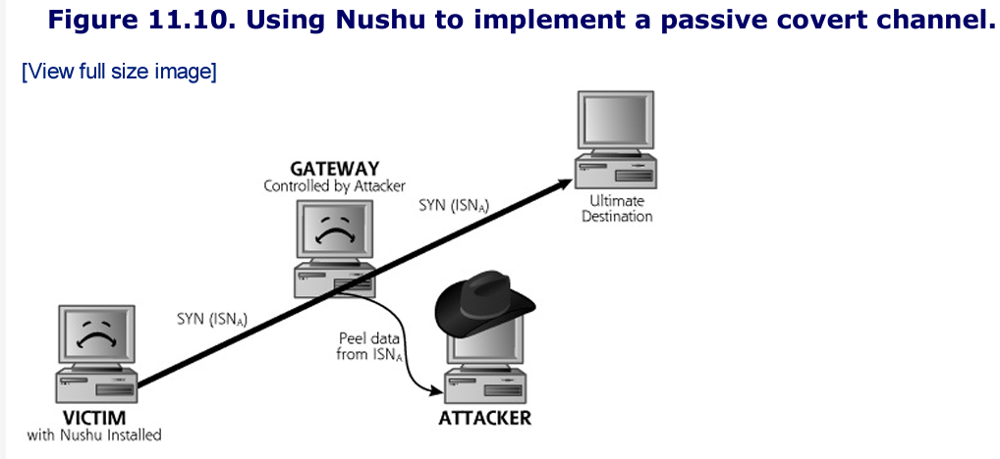
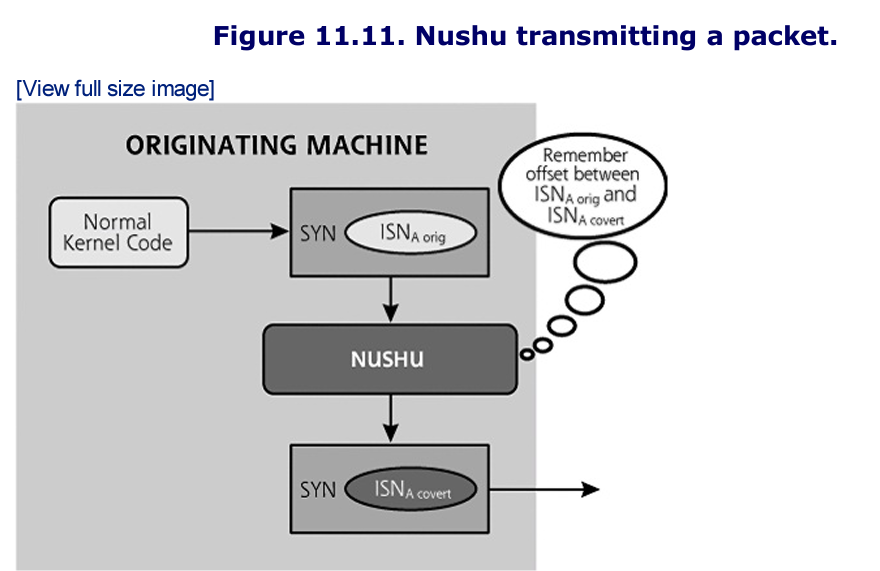
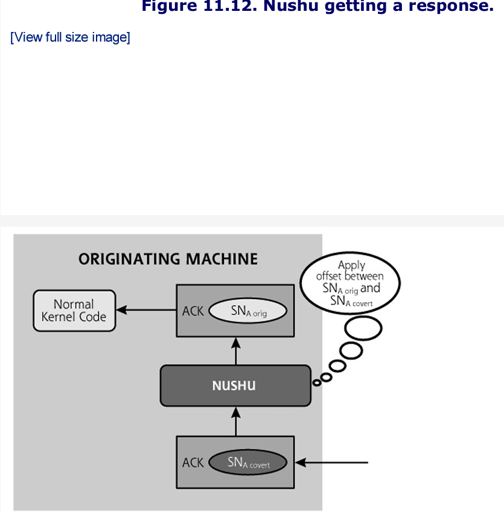

# Notes

Attackers who desire quiet, unimpeded access to computing systems and sensitive data conduct the vast majority of attacks.

# Hiding Evidence by Altering Event Logs

Even an attacker who uses the most powerful and stealthy rootkit will need to remove particular events from logs associated with gaining access, elevating privileges, and installing their backdoors or rootkits in the first place.

- Events like failed logins, error conditions, stopped and restarted services, and file access and update times must be purged from the logs or altered to avoid having these activities spotted by an alert admin.

Attackers want to edit the system logs on a line-by-line basis to keep normal events in the logs, while removing the suspicious events generated by their activities.

## Attacking Event Logs in Windows

### Event Logging in Windows

On Windows systems, the event logging service, known as EventLog, produces a set of files where it temporarily places information about logged system and application events, such as a user logon, access control violation, service failure, and so on.

This information is constantly being written into files, which are named SECURITY.LOG, SYSTEM.LOG, and APPLICATION.LOG. The event information, however doesn't stay in these .LOG files. Each of these .LOG files is periodically and automatically rewritten by Windows, which moves the event information into the system's main event logs: the SECEVENT.EVT, SYSEVENT.EVT, and APPEVENT.EVT files. It is actually these files that are the main event logs in Windows, and it is the .EVT

The Event Viewer tool, showing events from the SECEVENT.EVT file is shown below.

The SECEVENT.EVT file is the most often targeted because it contains the majority of the events that attackers wants to remove, such as failed logon attempts and access violations that were triggered by their attempts to gain access to a system.


### Altering Event Logs in Windows

To erase traces of activity, attackers would, at a minimum, want to alter SECEVENT.EVT. However, to be more confident that all traces of their activity are gone, the attackers would possibly want to alter the SYSEVENT.EVT and APPEVENT.EVT files as well. But all three .EVT files are "locked" on a running Windows machine, and cannot be opened or edited with a standard file-editing tool.

Event log editing tools are available that allow an attacker with admin privileges to purge a running WindowsNT/2000 system.

Use Winzapper tool, OUTDATED

## Attacking System Logs and Accounting Files in Linux and UNIX

### Linux and UNIX System Logs

On Linux and UNIX systems, the vast majority of log files are written in standard ASCII text, not a specialized binary format like the logs of Windows machine.

- Thus to edit Linux and UNIX logs, an attacker requires only root privileges or the privileges of a specific application that generates the logs, such as a Web server daemon.

Inexperienced attackers use automated scripts to delete log entries, problem is they need to be sure it is the exact same distro and version of Linux/UNIX or else it will attempt to delete nonexistent files

More sophisticated attackers begin by looking at the `syslogd` configuration file, normally found in `/etc/syslog.conf`, to determine where the log files themselves are located. This configuration file tells `syslogd` where in the file system to put the logs.

Once the log location is discovered, an attacker with root privileges can directly edit the logs. Because logs are plain ASCII text, with root privileges, attackers can alter the log files by using their favorite editor.

### Altering Accounting Entry Files in Linux and UNIX

Beyond the main log files, as described in Chapter 3, the main accounting files in Linux and UNIX are the `utmp, wtmp, and lastlog` files. Whereas the vast majority of Linux and UNIX log files are written in standard ASCII format, the `utmp, wtmp and lastlog` files are written with a special binary format.

- The `utmp` and `wtmp` files are stored as so-called `utmp` structures, and `lastlog` is stored in a variety of different formats on different Linux and UNIX machines.

To edit these accounting files, an attacker must use a tool that can read and rewrite the special binary format that they use. An attacker can choose from several tools, with a complete inventory available at www.packetstormsecurity.org/UNIX/penetration/log-wipers.

## Altering Linux and UNIX Shell History Files

One additional type of accounting and logging of particular concern to attackers is individual users' shell history files.

- The shell history file stores a list of all commands recently entered by the user into the command line.

If an attacker takes over a user's account, or creates a brand new account to attack from, the shell history file will contain a list of all commands entered by the attacker.

- Shell history files are typically stored in individual users' home directories, and have names such as `.bash_history`.

Like standard UNIX log files, shell histories are written in plain ASCII, and can be easily edited using the attacker's favorite text editing tool. Wiley attackers remove all lines associated with their nefarious activities to throw off administrators and investigators.

- Additionally, the attacker can configure the length of the shell history file to simply be "zero" so that no history will be maintained for an account used for attacks.

However, by simply opening the shell history file to edit it, the bad guy faces a problem. It's important to remember that shell history is written when the shell is exited. Therefore, you won't see your most recent commands in the shell history; they are stored in memory until the shell is exited gracefully.

- The attacker's command used to invoke the editor will be placed in the shell history file, so an investigator might see something like `vi .bash_history`.

With computers, if you ever face a chicken-and-egg problem, you need to find out how to kill the chicken or break the egg. There are two widely used solutions to this dilemma for the attacker:

1.  First, the bad guy could simply set the shell history size to zero
2.  Kill the shell instead of gracefully exiting it, this deprives the shell the ability to write its history.

To kill the shell run this command: `$ kill -9 [pid_of_shell_process]`

# Defenses Against Log and Accounting File Attacks

To mount an effective defense, it is critical to prevent attackers from having the ability to alter logs.

- Logs that have been tampered with are less than useless for investigative purposes, and conducting a forensic investigation without adequate logging is like trying to drive your car while wearing a blindfold: difficult if not impossible, and certainly messy.

## Activate Logging, Please

The first step in ensuring the integrity and usefulness of your log files is quite simple: Activate logging on your sensitive systems!

- Organizations must have a policy that logging will be done
- Periodically audit your systems to ensure that logging is activated in accordance with this policy

## Setting Up Proper Permissions

Another commonsense defense for protecting critical system logging and accounting information is to set proper permissions on the log files, as well as (for Linux and UNIX systems) `utmp, wtmp, lastlog,` and users' shell histories

## Using a Separate Logging Server

One of the most effective techniques for minimizing an attacker's capability to alter logs involves setting up a separate logging server.

- This centralizes logs for better analysis
- It makes attackers who compromise other systems unable to remove their traces since logging occurs on another system

Does not work for shell histories and Linux files sadly.

## Encrypting Your Log Files

When attackers try to edit these files, they will not be able to alter them meaningfully without the decryption key.

- Attackers could only really delete the logs which will be very noticeable

## Making Log Files Append Only

On Linux and some UNIX systems, you might want to make your log files append only, particularly if you use a separate syslog server. To do this, use the change attribute command as follows:

```
$ chattr +a [logname]
```

If attackers try to edit a log file that has been set to "append only", they will find it write protected, as it has been changed to allow operations only to append data to the file.

## Protecting Log Files Using Write-Once Media

A more thorough way of protecting the logs on any type of system (Windows, Linux, UNIX, or others) is simply to store the logs on unalterable media, such as a non-rewriteable DVD or CD-ROM.

When all six of these techniques are applied together (activating logging, setting minimal permissions, using a separate logging server, encrypting the log files, setting the logs to append only, and storing them on write-once media), you can have a far better degree of confidence in the integrity of your log files.

# Creating Difficult-To-Find Files and Directories

Another technique used by attackers to cover their tracks on a system involves creating files and directories with special names or other attributes that are easily overlooked by users and system administrators.

- Attackers often create "hidden" directories and files to store other information belonging to the attacker.

## Creating Hidden Files and Directories in UNIX

On UNIX systems, attackers often name their files with a period at the start of the name to make the files less likely to be noticed by users and system administrators.

- This is because by default UNIX `ls` command used for viewing the contents of a directory does not display files with names that begin with a period.
- Applications often use files or directories named in this way to store configuration information specific to an individual account, and there are usually many files of this type in each user's home directory.

Attacks could go a step further and name directories or files " ." or ".. " which would look just like the "." and ".." directories.

## Creating Hidden Files in Windows

Modern Windows systems offer users the option of setting a file or directory with the attribute "hidden" so that it will be omitted from view by default. By simply right-clicking on the file or directory in Windows Explorer and selecting Properties, the user is presented with an option to make the file hidden as shown below.



A far more powerful and subtle technique for hiding information in Windows involves using Alternate Data Streams (ADS), which relies on options included with the NTFS file system.

- The basic capabilities' of NTFS are described in Chapter 4.
- NTFS allows every file or directory to have multiple "streams" of data associated with it.

You might think that special programs are required to create and access ADS data, but our attacker can actually create another stream behind `notepad.exe` using only the built-in Windows commands coupled with input/output redirection. For our example, the attacker wants to take the file `stuff.txt` and hide it in a stream behind `notepad.exe`. The attacker could use this command:

```
C:\>type stuff.txt > notepad.exe:data.txt
```

This command copies the contents of the `stuff.txt` file into a stream named `data.txt` behind the file `notepad.exe`. The colon followed by a stream name indicates in which stream to put the data.

- The attacker could give the stream any name at all and create any number of streams for each file, as long as the partition on which `notepad.exe` resides is NTFS.
- It is not compatible with FAT or FAT32 file system streams.
- The new stream named `data.txt` is automatically created by this command and tacked onto the end of the `notepad.exe` file.
- After deleting the file `stuff.txt` no remnants of the file `stuff.txt` will be visible in the directory.
- All the contents of `stuff.txt` are hidden behind the Notepad executable

At a later time, the attacker can come back to the system and retrieve the hidden data from the stream by using only built-in Windows commands again, as follows:

```
C:\> more < notepad.exe:data > stuff.txt
```

# Defenses From Hidden Files

Use file integrity checking tools that look at the contents of files and directories to make sure no additional data, files, or directories have been hidden in them.

- A file system integrity checker like Tripwire has this capability, as do numerous others discussed in Chapter 10
- Host-based IDS and antivirus tools can check the contents of directories to determine if a malicious hidden file is present.

# Hiding Evidence on The Network: Covert Channels

Once attackers installed backdoor listeners on a system and cleaned up their tracks in the logs, they still need to communicate with their nefarious programs on the victim machine to control them.

- To avoid detection, some attackers utilize stealth mechanisms to communicate with the backdoor system across the network.
- A truly paranoid attacker will use both a covert channel to hide information and cryptography to scramble the contents of the information as well

The techniques required for establishing covert channels across the network require both a client and a server.

- The server must be installed on a victim's system, acting as a sentinel, ready to exchange data with the client.
- The client packages up data using stealth techniques, and the server unpackages the data and reacts to it.
- The covert channel can be used to control a system remotely, to transmit files secretly, or to hide any other application capability the attacker needs to disguise. The figure below depicts a typical generic exchange of data using a covert channel between a client and a server.
    

How does a covert channel server acting as an endpoint for the covert channel get installed on a victim's machine in the first place? We have seen attackers employ countless techniques in real-world cases, including these scenarios:

- An attacker can take over a system and place a backdoor listener on it through a vulnerability such as a buffer overflow.
- The attacker could e-mail an unsuspecting internal user an executable Trojan horse program, worm, or virus, which implements a covert channel server.
- And many more examples

## Tunneling

Covert channels often rely on a technique called tunneling, which allows one protocol to be carried over another protocol. Any communications protocol can be used to transmit another protocol. Information theory says it must be so. Consider a hypothetical protocol called TCP/CP. TCP/CP marries a modern-day computer protocol to an ancient mechanism for delivering messages, resulting in a slow, yet remarkably effective communication tool for intermediate distances.

In a real-world example of tunneling techniques, the SSH protocol can be used legitimately to carry other TCP-based services.

- With a rock-solid SSH session in place any other TCP services, such as telnet, FTP, or even an X-Window session, can be transmitted securely over SSH.

### Loki: Covert Channels Using ICMP

Many networks allow incoming ICMP packets so users can ping or traceroute to their Web sites for troubleshooting. Suppose an attacker takes over such a Web server, installs a backdoor listener, and wants to communicate with it. Sure, the bad guy could set up a backdoor listener on a specific port, but that might be detected.

- A more stealthy approach would be to utilize ICMP as a tunnel to carry on interactive communications with the backdoor listener.
- ICMP messages don't require an open port that might be detected by a curious system admin using the `netstat` or `lsof` commands.

Loki was written by daemon9 to provide shell access over ICMP, making much more difficult to detect than other (TCP or UDP-based) backdoors.

- The tool runs on Linux and may be ported to Windows
- As shown in the figure below, the attacker types in commands at a prompt into the Loki client. The Loki client wraps up these commands in ICMP and transmits them to the Loki server (known as lokid).
- Lokid unwraps the commands, executes them, and wraps the responses in ICMP packets. All traffic is carried in the ICMP payload field.



As far as the network is concerned, a series of ICMP packets are shot back and forth: Ping, Ping-Response, Ping, Ping-Response.

The only trace of Loki is a root-level process ring ICMP back and forth. It can not be detected by netstat since ICMP does not use a port.

## Reverse WWW Shell For HTTP

Know that you can use an HTTP for a reverse shell, but overall this seems outdated

## Covert Channels and Malware

Malware authors found that the simplest solution to not tripping an alert is to piggyback outbound communication on that of a program or protocol that is already allowed to access the network.

- Many malicious programs these days install themselves as a Browser Helper Object (BHO), a plug-in to extend the browser.
- Acting as a BHO makes the malicious code, in effect, a part of the web browser

### More Covert Channels: Using the TCP and IP Headers to Carry Data with Covert_TCP and Nushu

Covert channels can also be constructed by inserting data into unused or misused fields of protocol headers themselves. The TCP/IP protocol suite is particularly useful in carrying covert channels. Many of the fields in the TCP and IP headers have huge openings through which data can be sent.



Covert_TCP allows for transmitting information by entering ASCII data in the following TCP/IP header fields, shown in the figure above:

- IP Identification
- TCP sequence number
- TCP acknowledgment number

The problem with using some of the other fields is that in certain instances they are altered or trimmed by various routers along the hops it takes between its source and destination.



Nushu is a tool that creates passive covert channels. Instead of sending its own packets to exfiltrate data, Nushu inserts its data for the covert channel inside of packets generated by other applications running on the machine where Nushu is installed.

As illustrated below, Nushu sends packets out across the network in its normal course of operation.

- These packets represent the actions of users and services potentially including HTTP, SMTP, FTP or other protocols.
- Nushu sitting silently on the victim machine, waits for new TCP connection initiations.
- When it sees the kernel of the victim system generate a new TCP session using the three-way handshake, Nushu alters the ISNa of that packet to insert its data inside of it.
    
    Nushu is implemented using a special Linux kernel module, altering the kernel to intercept packets on their way out of the victim machine, as shown below.



Next, we can see why remembering that offset is important. As shown below, when a response packet is received from the ultimate destination, Nushu has to map the acknowledgment number back to the original sequence number.



# Defenses Against Covert Channels

Defending against covert channels occurs in two places: on the end host and on the network.

- On the end host we must absolutely strive to prevent the attackers from gaining access in the first place

No defense is 100 percent effective. Even though the OS is hardened, attackers could still gain access and install a ocvert channel server on a system.

- To help ensure quick detection of such a server, system administrators must be familiar with which processes are running on their critical systems.
- Only by knowing what is normal on a system can we determine what is abnormal

Many of the discussed covert channels rely on a predictable packet structure, several of these tools leave tell-tale fingerprints that can be detected on the network.

# Summary

After installing Trojan horse backdoor tools to maintain access, attackers often cover their tracks by manipulating the system. One of the most important ways to avoid detection is to edit individual events out of the logs. They usually edit events that would show their method of compromising the machine, such as failed login attempts, use of specific accounts, and the running of certain security-sensitive commands. On Windows systems, attackers can use the WinZapper tool to delete specific security events. On UNIX systems, a variety of tools, most of them found on the box to begin with, support log editing.

To defend against log editing attacks, you should utilize separate logging servers for critical networks, such as your Internet DMZ. Additionally, you might want to consider encrypting your log files so attackers cannot alter them if they are able to take over a system. Finally, by periodically burning your logs to write-once media (such as DVD), you can have a permanent record of the logs that an attacker cannot modify.

Attackers can employ various operating system functions to make files and directories more difficult to find. On UNIX systems, file or directory names that begin with a period (.) are much less likely to be noticed. Furthermore, files or directories that are named period-space (. ) or period-period-space (.. ) are even more stealthy. Hiding files on a modern Windows system can be done using ADS on a NTFS partition using only built-in system commands. Files and directories hidden in this manner cannot be detected without the use of third-party tools.

To defend against such hidden files, you should employ host-based IDSs and antivirus tools that can detect malicious software stored in hidden files and directories. On Windows, it is important to confirm that antivirus and antispyware tools are ADS aware.

Steganography is the process of hiding data. An attacker could hide data in images or sound files. Alternatively, an attacker could hide data during transmission. Using covert channels, an attacker can send hidden data across the network. This data could consist of files to be transferred or commands for a backdoor running on a victim machine. Tunneling is a technique for carrying one protocol on top of another protocol. A large number of tools implement tunneling of command shells over various protocols, including ICMP and HTTP. Attackers can use the extra space in the TCP and IP headers to carry information between systems without the knowledge of system admins, employing either active or passive covert channels. Viruses and spyware also employ covert channels to transmit information, and often will "ride" on other, trusted programs for network access to avoid detection.

To defend against convert channels, you should prevent attackers from installing software to send or receive covert data in the first place. Additionally, for sensitive systems, you need to know the purpose of all running processes on the machine, particularly those with super-user privileges. If a process starts running with high privileges that are not typical for the system, you should investigate. Network-based IDS tools also help identify abnormal traffic patterns that could indicate covert channels.