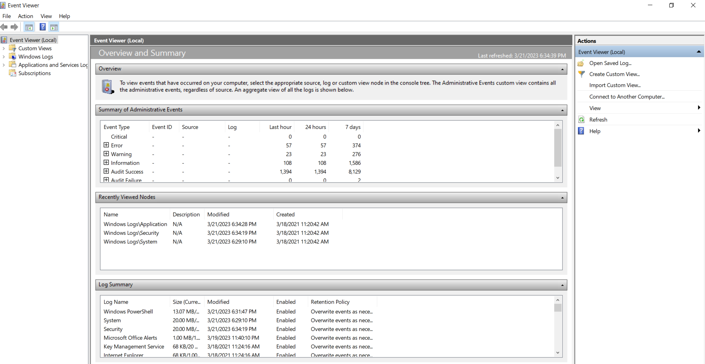

# Notes
Attackers who desire quiet, inimpeded access to computing systems and sensitive data conduct the vast majority of attacks. 

# Hiding Evidence by Altering Event Logs
Even an attacker who uses the most powerful and stealthy rootkit will need to remove particular events from logs associated with gaining acess, elevating privileges, and installing their backdoors or rootkits in the first place.
- Events like failed logins, error conditions, stopped and restarted services, and file access and update times must be pruged frmo the logs or altered to avoid having these activites spotted by an alert admin.

Attackers want to edit the system logs on a line-by-line basis to keep normal events in the logs, while removing the suspicious events generated by their activites. 

## Attacking Event Logs in Windows
### Event Logging in Windows
On Windows systems, the event logging service, known as EventLog, produces a set of files where it temporarily places information about logged system and application events, such as a user logon, access control violation, service failure, and so on. 

This information is constantly being written into files, which are named SECURITY.LOG, SYSTEM.LOG, and APPLICATION.LOG. The event information, however doesn't stay in these .LOG files. Each of these .LOG files is periodically and automatically rewritten by Windows, which moves the event information into the system's main event logs: the SECEVENT.EVT, SYSEVENT.EVT, and APPEVENT.EVT files. It is actually these files that are the main event logs in Widnows, and it is the .EVT

The Event Viewer tool, showing events from the SECEVENT.EVT file is shown below. 

The SECEVENT.EVT file is the most often targeted because it contains the majority of the events that attackers wants to remove, such as failed logon attempts and access violations that were triggered by their attempts to gain access to a system. 



### Altering Event Logs in Windows
To erase traces of activity, attackers would, at a minimum, want to alter SECEVENT.EVT. However, to be more confident that all traces of their activity are gone, the attackers would possibly want to alter the SYSEVENT.EVT and APPEVENT.EVT files as well. But all three .EVT files are "locked" on a running Windows machine, and cannot be opened or edited with a standard file-editing tool.

Event log editing tools are available that allow an attacker with admin privileges to purge a running WindowsNT/2000 system. 

Use Winzapper tool, OUTDATED

## Attacking System Logs and Accounting Files in Linux and UNIX
### Linux and UNIX System Logs
On Linux and UNIX systems, the vast majority of log files are written in standard ASCII text, not a specialized binary format like the logs of Windows machine. 
- Thus to edit Linux and UNIX logs, an attacker requires only root privileges or the privileges of a specific application that generates the logs, such as a Web server daemon. 

Inexperienced attackers use automated scripts to delete log entries, problem is they need to be sure it is the exact same distro and version of Linux/UNIX or else it will attempt to delete nonexistant files 

More sophisticated attackers begin by looking at the ```syslogd``` configuration file, normally found in ```/etc/syslog.conf```, to determine where the log files themselves are located. This configuration file tells ```syslogd``` where in the file system to put the logs. 
# Summary
