# Notes

The Transmission Control Protocol/Internet Protocol (TCP/IP) is a name applied to an extremely popular protocol used for computer-to-computer communication across networks.

Focus of this chapter is TCP/IP because it is the most commonly used protocol in the world.

The Open Systems Interconnection (OSI) Reference Model was based on the idea of protocol layering.

- Protocol layering is when two computers wants to communicate with each other, a series of small software modules on each system would do a set of tasks to foster the communication.
- One module focuses on data formatting/organization while another focuses on retransmission of lost packets, and yet another module transmits the packets from hop to hop across the network.
- We can substitute module for layer in our case, a collection of these modules would be considered a protocol stack because they consist of a bunch of these layers, one on top of the other.

## OSI Model Breakdown

In a layered communication stack, a layer on the sending machine communicates with the same layer on the receiving machine.

- Lower layers provide services to higher layers. Lower layers are able to retransmit lost packets on behalf of a higher layer.
    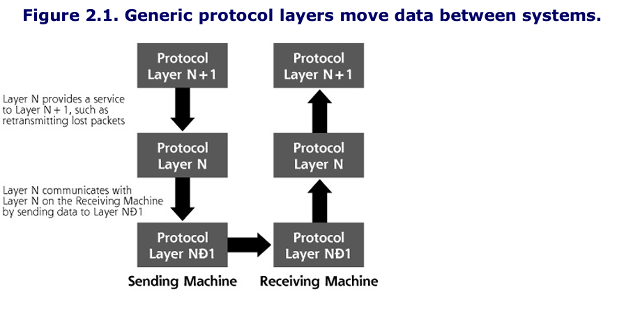

There are 7 layers in the OSI Model
Layer 1: The Physical Layer
Layer 2: The Data Link Layer
Layer 3: The Network Layer
Layer 4: The Transport Layer
Layer 5: The Session Layer
Layer 6: The Presentation Layer
Layer 7: The Application Layer

TCP/IP adheres to layers 4 and 3 of the OSI Model

To pass data between layers, each layer tacks on some information in front of (and in some cases, behind) the data it gets from the layer above it.

- Information added to the front of the data is called the header, and includes critical information for the layer to get its job done.

When an application makes a web request, the Transport Layer adds a header to this data, which will likely include information about where on the destination machine the packet should go.

- If TCP is used, the header is called a TCP segment
- The TCP segment would then be passed to the network layer which would prepend information about the source and destination address in the IP header that is added to the packet.
- The resulting packet is called an IP datagram

This package is sent to the Data Link and Physical Layers, where a header (and trailer) are added to create a frame, so the data can be transmitted across the link.

Upon receiving the data, the destination system opens all the envelopes, layer by layer.
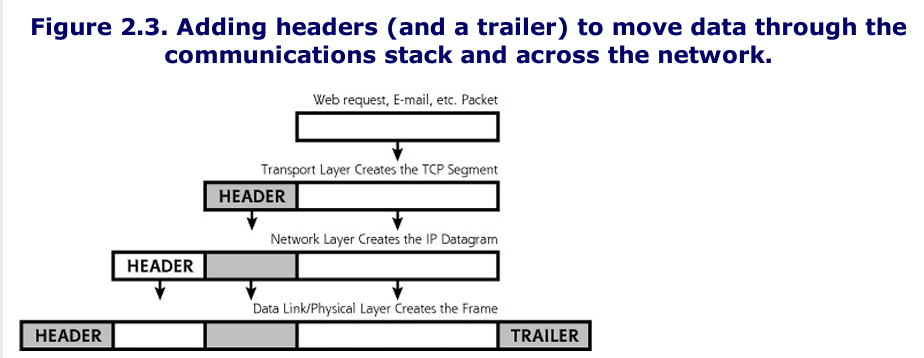

## TCP/IP Family

The TCP/IP family of protocols includes several components: TCP, UDP, IP, and Internet Control Message Protocol (ICMP)
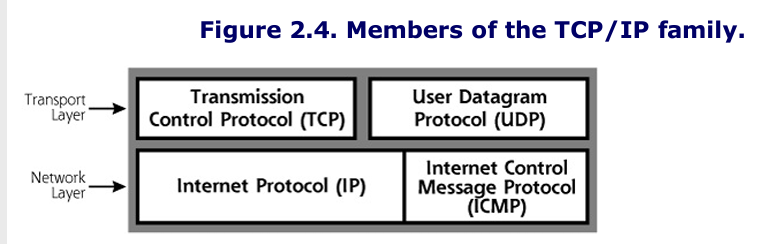

TCP/IP stack does not allow for confidentiality and integrity. We use a protocol extension named IPSec

- Most modern Windows and Linux machines have built in support for IPSec.
- Each communicating system must have IPSec configured properly, along with a method for distributing its cryptographic keys to other machines.

### TCP

TCP is the workhorse of the Internet. Applications that use TCP:

- Web browsing, using HTTP
- SSH
- FTP
- SMTP and POP (Email)

Each of these applications generate a packet and passes it to the TCP/IP stack of a local machine. The TCP layer software creates TCP packets by placing a TCP header at the front of each packet.
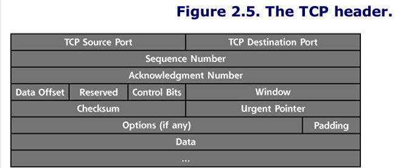

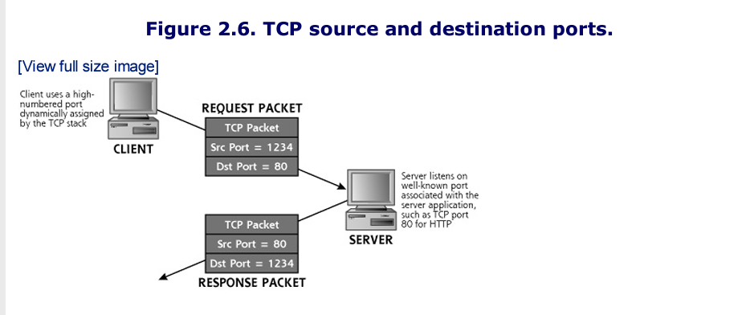

To see which ports are in use on a Windows, Linux, or UNIX system, you can use the `netstat` command locally on the machine. If you type `netstat -na` all ports receiving and listening to data will be shown

- The `-na` flags in the command mean show all ports, and list the network addresses in numerical form (don't print out the full machine and service names)
    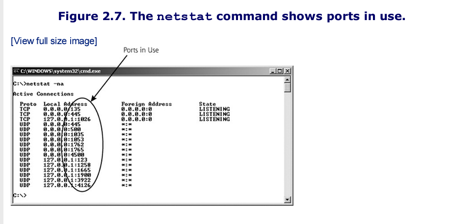

### TCP Control Bits, The Three-Way Handshake, and Sequence Numbers

The TCP control bits, also known as the TCP flags, are a particularly useful part of the TCP header.

- Some of these eight small fields (each only one bit in length) describe what part of a session the TCP packet is associated with, such as session information, acknowledgement, or session tear down.
    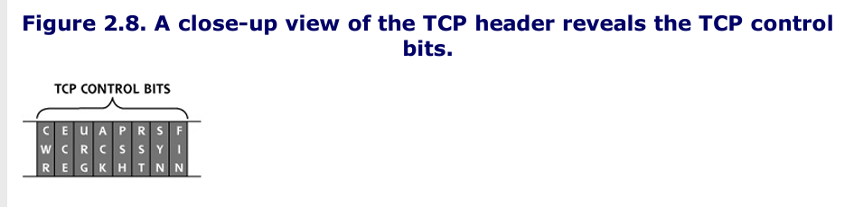

One or two control bits are set to one in a given packet. The original six individual control bits have the following meanings:

- URG: The urgent pointer in the TCP header field is significant. There is important data in here that needs to be handled quickly.
- ACK: The acknowledgement field is significant. This packet is used to acknowledge earlier packets.
- PSH: This is the Push function, used to flush data through the TCP layer immediately rather than holding it waiting for more data
- RST: The connection should be reset, due to error or other interruption.
- SYN: The system should synchronize sequence numbers. This control bit is used during session establishment
- FIN: There is no more data from the sender. Therefore, the session should be torn down.

With RFC 3168 two new control bits were added directly in front of the original six bits bringing the total number of control bits to equal 8.

- CWR: Congestion Window Reduced, which indicates that, due to network congestion, the queue of outstanding packets to send has been lowered
- ECE: Explicit Congestion Notification Echo, which indicates that the connection is experiencing congestion.

All legitimate TCP connections are established using a three-way handshake, a fundamental tool used by TCP to get its job done.

- 3-way handshake allows system to open a communication session, exchanging a set of sequence numbers for packets to use throughout the session.

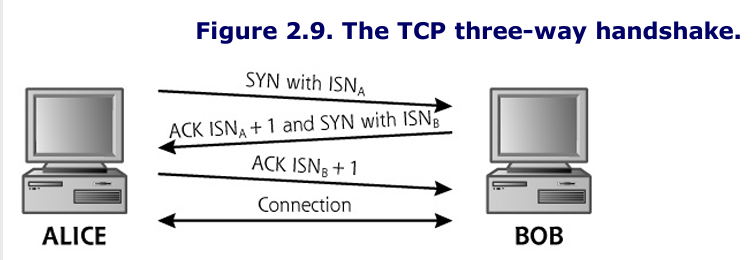
**Three Way Handshake Steps**

Step 1: Alice sends a packet with the SYN control bit set and with the sequence number set to some initial value, known as the initial sequence number.
Step 2: Bob receives this TCP SYN packet form Alice. If the destination port in the packet is open on Bob, Bob performs the second part of the 3-way handshake. Bob sends back a single packet with both the ACK and SYN control bits set.
Step 3: On receiving Bob's response, Alice will complete the 3-way handshake by sending a packet with the ACK control bit set, and an acknowledgement to ISNB+1 again to indicate that Alice is expecting the next octet.

In this way, Alice and Bob have used the control bits to establish a TCP session. All packets going from Alice and Bob will have incrementally higher sequence numbers, with the number increasing by one for each octet of data going from Alice to Bob, starting at ISNA+1. Likewise, all packets going from Bob to Alice will have sequence numbers starting at ISNB+1.

The exchange and agreement on sequence numbers allows for TCP to ensure all packets in the session arrive in the proper order.
\- Therefore the 3-way handshake and the sequence numbers that result from it allow TCP to have reliable, sequenced transmissions.

## Other 6 Control Bits/ TCP Flags

The FIN control bit is used to tear down a session. Each side sends a packet with the FIN control bit set to indicate the session should end.
The RST control bit is used to stop connections and free up the sequence numbers in use.

- If a machine receives a packet that is not expecting (such as a packet that includes the ACK bit set when no session has been established), it could respond with a packet that has the RST bit set

The URG control bit means that the data stream includes some urgent data. If the URG control bit is set to one, the Urgent pointer field indicates where in the data stream the really urgent data is.

The PSH control bit means that the TCP Layer should flush the packet through the stack quickly, not queuing it up for later delivery.

The CWR and ECE control bits are associated with managing congestion on a link, and are independent of a three-way handshake.

## Other Fields in the TCP Header

Beyond the TCP header fields, we've already discussed, several other fields are included in the TCP header. These additional fields are as follows:

- Data offset: This field describes where in the TCP packet the header ends and the data starts. It is equal to the length of the TCP header in 32-bit words.
- Reserved: This field is reserved for future use
- Window: This field controls the number of outstanding octets that can be sent from one system to another on a given connection.
- Checksum: Verifies that the TCP packet (header and data) was not corrupted in its journey across the network.
- Urgent Point: This field has a pointer into the data of the packet to indicate where urgent information is located
- Options: This set of variable length fields can indicate additional information about the TCP processing capabilities of either side of the connection.
- Padding: This field includes enough bits set to zero to extend the length of the TCP header so that it ends on a 32-bit boundary. Its just fluff included in the header to make sure everything lines up evenly.

## User Datagram Protocol (UDP)

An app developer cannot use TCP and UDP at the same time. UDP is another option to TCP, they are like cousins.

Services that utilize UDP include streaming audio and video applications, database query/response-type services, and typical Domain Name System (DNS) queries and responses.

UDP is connectionless--the protocol doesn't know or remember the state of a connection. It has no concept of session initiation, acknowledgement, tear down, or anything else. It also does not retransmit lost packets, nor does it put them in proper order.

UDP is inherently unreliable, but sometimes unreliability is acceptable, particularly when it can buy you speed. Some applications don't want to overhead of 3-way handshakes, sequence numbers, and acknowledgements.

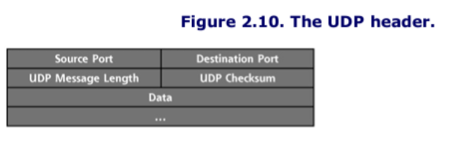

UDP has 16-bit port numbers, so there are 65,536 possible UDP ports (including UDP port zero, which is reserved).

UDP based services include the following:

- UDP port 53
- The Trivial File Transfer Protocol (TFTP), UDP port 69
- The Simple Network Management Protocol (SNMP), UDP port 161
- Real Player Data (Audio/Video), a range of UDP ports including 7070, although some clients can be configured to use only TCP ports if desired

Controlling UDP is more difficult than securely handling TCP because firewalls have an easier time analyzing TCP traffic since it can follow it. UDP comes from nowhere.

## Internet Protocol (IP) and Internet Control Message Protocol (ICMP)

Once the transport layer generates either a TCP or UDP packet, it must be passed to the Network layer of the OSI model.

- IP is the most commonly used Network Layer today, and is used for all traffic moving across the internet.

In receiving information from the Transport layer, the IP layer generates a header. The header is added to the front of the TCP packet to create a resulting IP packet, which will carry the entire contents across the network.

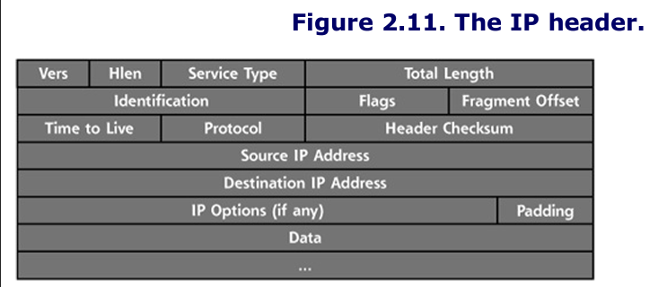

### LANs and Routers

Complete networks are typically made up of fundamental building blocks called LANs.

- A LAN is simply a bunch of computers connected together using a hub, switch, or wireless access point, with no routers separating the systems.
- LANs are typically geographically small, usually within a single building or small campus.

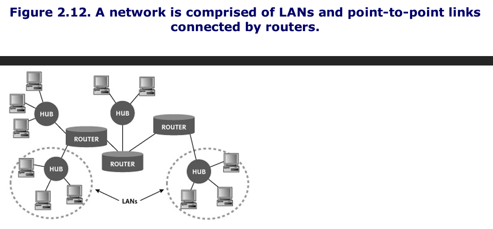

LANs are connected together using routers. A router's job is to move packets between the LANs, thereby creating a big network like the image above. One or more Network layer protocols move data end to end across the network.

Also some systems are directly connected to routers or each other using point-to-point links. The internet is a gigantic collection of LANs and point-to-point links.

## IP Addresses

IP addresses identify a particular machine on the network, and are 32 bits in length for IPv4. Every system directly connected to the internet has a unique IP address.

IP addresses are written in dotted-quad notation. Each of the four eight-bit bundles of the IP address are written as decimal numbers between 0 and 255. resulting in an IP address of the form w.x.y.z, such as 10.21.41.3.
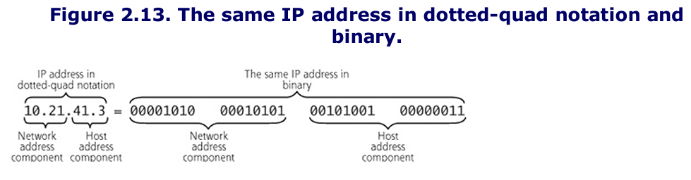

Every IP packet contains a source IP address and a destination IP address.

### Netmasks

Every IP address consists of two components: the network address and the host address on that particular network.

- The network address describes the particular LAN where traffic can be directed for delivery.
- The host address identifies the particular machine on the given LAN.

A computer knows which part is which through the use of a netmask. The netmask defines which bits are in the network address (and all the rest of the bits in the IP address are in the host component of the address).

- The netmask is a binary number that has its bits set to 1 when a given bit in the IP address is part of the network address.
- Therefore you can figure out what the network address is by simply combining the whole IP address with the netmask using the logical AND function.

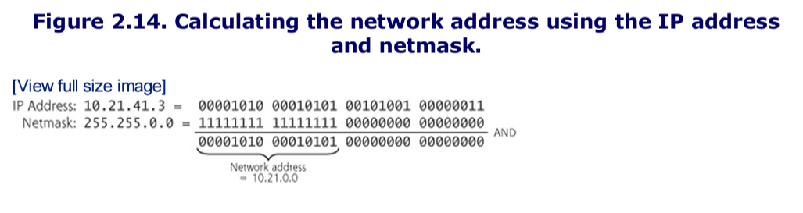

Sometimes netmasks are indicated using Classless Inter-Domain Routing (CIDR) notation, where the IP address is followed by a slash and then a number (10.21.0.0/16). The number after the slash indicates the number of 1 bits in the netmask, or in other words, the number of bits of the given IP address that are associated with the network component of that IP address.

### Packet Fragmentation in IP

Given the latency associated with sending information to a satellite, longer packets are better for performance, and shorter packets give better performance across low-latency networks.

To optimize packet lengths for various communications links, IP offers network elements the ability to slice up packets into smaller pieces, an operation called fragmentation.

- The end system's IP layer is responsible for reassembling the fragments into the original packet before passing the data up to the Transport layer.

The IP header offers a few fields to support this fragmentation operation.

- First, the fragment offset field tells a system where the contents of a given fragment should be included when the entire packet is reassembled.
    - This offset refers to the number of eight-octet slots (that's 64-bit chunks) in the data field of the original packet to place the given fragment.
- Secondly, IP identification fields are used to support fragment reassembly.
- Third, two flags in the IP header, the Don't Fragment bit and the More Fragments bit, specify information about fragmentation.
    - The more fragments bit indicates whether more fragments of the original packet are still on the way.
    - These two bits can have the following values:
        - Flag Bit 1, the Don't Fragment bit: 0 = may fragment, 1 = don't fragment
        - Flag Bit 2, the More Fragments it: 0 = last fragment, 1 = more fragment

### Other Components of the IP Header

The IP header includes:

- *Version*: These four bits describe which version of IP is in use. IP version 4 is the one in widespread use all over the internet. We're starting to see a very long and slow transition to IPv6.
- *Hlen*: This field is the Internet Header Length, the total length of the IP header.
- *Service Type*: This field is associated with quality of service, indicating to network elements how sensitive the traffic might be to delays.
- *Total Length*: This item identifies the total length of the IP packet, including the IP header and its data.
- *Identification*: This field is used to support fragment reassembly, with each original packet getting a unique IP identification value from the originating system.
- *Flags*: These bits include the Don't Fragment bit, and the More Fragments bit.
- *Fragment Offset*: This number indicates where this fragment fits into the over-all packet.
- *Time-to-Live*: This field is used to indicate the max number of router-to-router hops the packet should take as it crosses the network.
- *Protocol*: This field describes the protocol that is being carried by this IP packet. IT is often set to a value corresponding to TCP or UDP.
- *Header Checksum*: This information is used to make sure the header does not get corrupted. It is recalculated at each router loop.
- *Source IP address*: This field indicates the network and host where the packet originates.
- *Destination IP address*: This field indicates the network and host where the packet is going.
- *Options*: A variable length field indicate extended information for the IP layer, namely used for source routing.
- *Padding*: Catch-all field used to round out the length of the IP header so that it lines up on a 32-bit boundary.

## ICMP

ICMP is like a network plumber, its job is to transmit command and control information between systems and network elements to foster the transmission of actual data and to report errors.

One system can use ICMP to determine whether another system is alive by sending it a ping, which is an ICMP Echo message.

- If the pinged system is alive, it will respond by sending an ICMP Echo Reply message.
- EX: a router can use ICMP to tell a source system that it does not have a route to the required destination (an ICMP destination unreachable message)
- One host can tell another system to slow down the number of packets it is sending with an ICMP Source Quench message.
- **BOTTOM LINE: ICMP is used for systems to exchange information about how data is flowing (or not flowing) through the network**

ICMP uses the same header format as IP for source and destination IP addresses, packet fragmentation, and other functions. The protocol field of the IP header is loaded with a value corresponding to ICMP. After the IP header, in the data component of the IP packet, ICMP adds a field known as the ICMP type. Format depends on which ICMP type is chosen.
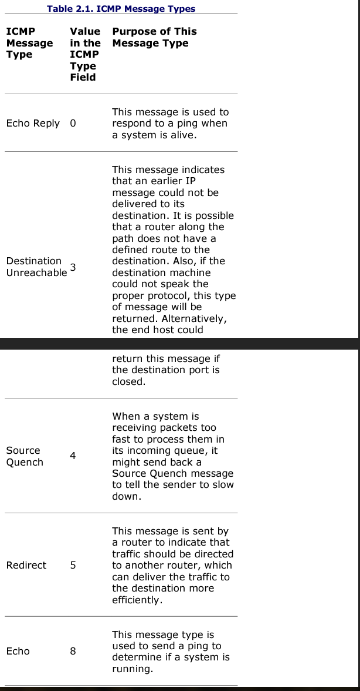
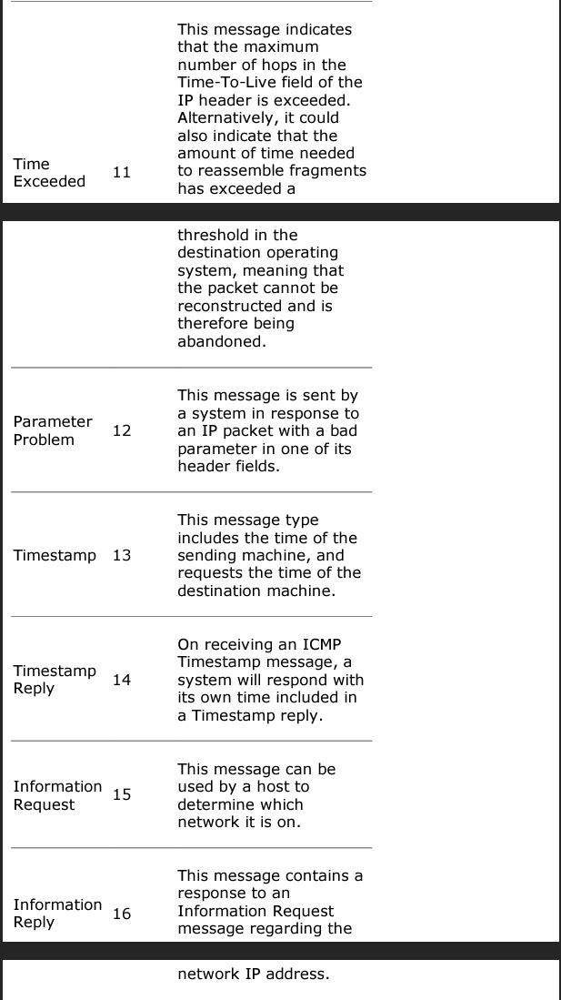

## Other Network-Level Issues

### Routing Packets

Routing is the process of moving a packet from one network to another network, with the goal of advancing the packet towards its destination in a relatively efficient way. Routers accomplish routing. They determine the path that packets should take across the network, specifying from hop to hop which network segments the packets should bounce through as they travel across the network.

Most Routers today use dynamic routing, where the routers themselves determine the path the packets will use.
Routing protocol examples include:

- Routing Information Protocol (RIP)
- Open Shortest Path First (OSPF)
- Border Gateway Protocol (BGP)

Another routing option involves static routes. With a static route, all traffic with the same destination address is always sent the same direction, regardless of potential link damage or any capacity concerns.

- used when addresses seldom change or where security concerns may appear
- Static routers are often used in an organization's Internet gateway, where they are hard-coded into the firewalls and routers making up the Internet connection point.

### Network Address Translation

Because of increasing numbers of IP addresses, the IETF set aside some address numbers for creating private IP networks in RFC 1918. You can build your own IP network using these set-aside IP addresses such as 10.x.y.z, 172.16.y.z, or 192.168.y.z.

Network Address Translation (NAT) maps these "illegal" IP addresses to a valid IP address.

To implement NAT, a gateway (which might be a router or firewall) sits between the network with the illegal or set-aside network and the Internet.

- As packets reach the gateway, it alters the private source IP address of the internal network in the packet header with a unique, routable IP address.

The gateway can map the addresses for NAT in a variety of ways, including the following:

- Mapping to single external IP address: On the internet, all traffic appears to be coming from the NAT device's IP address. Many NAT devices set a unique source port number in all outbound packets whose address has been translated, so that responses coming back to that port can be mapped back to the proper internal IP address and the original internal port.
- One-to-one mapping: The gateway could map each machine on the internal network to a unique valid IP address associated with each single machine. Therefore all traffic would appear to come from a group of IP addresses. This technique is used to map user requests across the Internet to servers on a perimeter network, such as a Web server on the DMZ.
- Dynamically allocated address: The gateway could multiplex a large number of unrouteable IP addresses to a smaller number of valid IP addresses.
    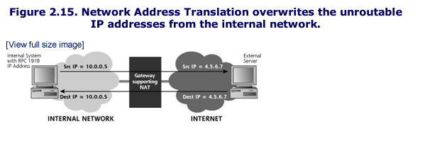

NAT by itself is not good enough for security

### Firewalls: Network Traffic Cops and Soccer Goalies

Firewalls are tools that control the flow of traffic going between networks.

Firewalls must allow at least some outgoing connections, so internal users can access the external network, while denying most incoming connections, except for specified services.
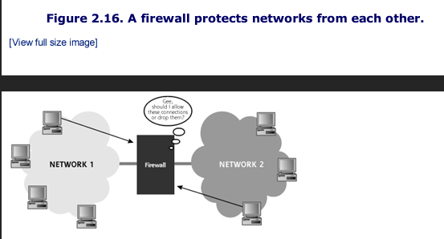

#### Traditional Packet Filters

Packet filters focus on individual packets, analyzing their header information and direction. Traditional packet filters make this decision based on the following information:

- Source IP address: Does this packet appear to come from an IP address that should be allowed on the network. (From IP header)
- Destination IP address: Is the packet going to a server that should receive this type of traffic? (From IP header)
- Source TCP/UDP port: What is the source port for the packet, and does it signify a specific application? (From TCP or UDP header)
- Destination TCP/UDP port: What is the destination port? Because common services often use the well-known ports in that list maintained by the IANA, the destination port is used to allow some services while denying others. (From TCP or UDP header)
- TCP control bits: Does this packet have the SYN bit set, meaning it is part of a connection initiation, or does it have the ACK bit set, implying it is part of an already-established connection?
- Protocol in use: Should this protocol be allowed into the network? The packet filter might allow TCP packets while denying UDP, or vice versa.
- Direction: Is the packet coming into the packet-filtering device, or leaving from it?
- Interface: Did the packet come from a trusted network or an untrusted network? The packet-filtering device can transmit or drop packets based on the network interface on which they arrive.

Firewall rules are referred to as Access Control Lists (ACLs)
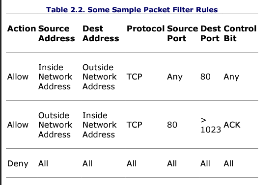

#### Stateful Packet Filters

A stateful packet filter can remember earlier packets that went through the device and make decisions about later packets based on this memory. Their memory is implemented in a state table, which stores information about each active connection and other memorable packets. The state table is dynamic, updated in real time as packets traverse the device.
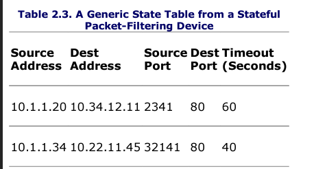

State tables remember packets for a set amount of time, usually ranging between 10 and 90 seconds, or even longer in some implementations. After that interval, if no further packets are associated with the entry in the state table, the entry is deleted, meaning no further packets are allowed for that connection.

#### Proxy-Based Firewalls

Proxies represent an entirely different approach to controlling the flow of information through a fire-wall. Rather than obsessing over packets, proxies focus on the application level, analyzing the application information passing through them to make decisions about transmitting or dropping.

A client interacts with the proxy, and the proxy interacts with a server on behalf of the client. All connections for other applications, clients, or servers can be dropped.
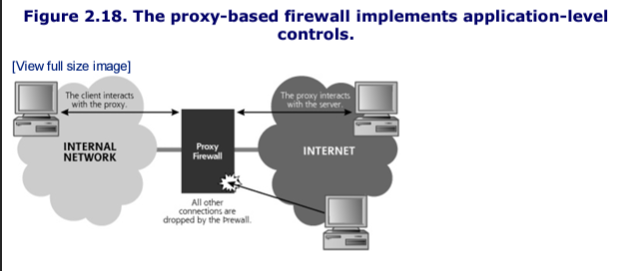

Given its focus on the application level, a proxy-based firewall can comb through the application-level protocol to ensure that all exchanges strictly conform to the protocol message set.

- Ex: Proxy can make sure entire packets follow HTTP request format instead of just checking port 80 and TCP connection, it can also allow or deny specific function like FTP GET or FTP PUT

#### Network-Based Intrusion Prevention Systems (IPSs)

They are not exactly firewalls but they do share many important characteristics. They monitor traffic across a network and match it against a set of signatures that identify various kinds of attacks, such as the buffer overflows and related exploits.

- Some IPS even maintain a sense of normal traffic behavior and look for deviations from normal patterns consistent with a scan or propagating malicious code such as worms.

Unlike IPSs, firewalls don't have signatures for specific kinds of attack, nor do they typically have knowledge of normal traffic patterns.
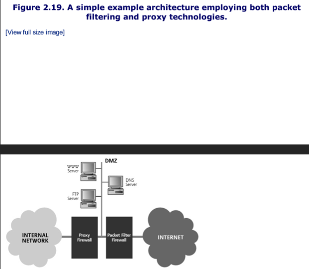

## Don't Forget About the Data Link and Physical Layers

The data link layer consists of the software drivers for your network interface card, plus some firmware on the card itself. The physical layer is the hardware of your network interface card, plus the actual physical media (the wires, fiber, or radio frequency spectrum) making up the network.

The Data Link and Physical Layers are used to construct LANs, point-to-point connections, and Wide Area Network (WAN) links. The IP layer generates an IP packet, and passes it down to the Data Link and Physical layers, which transmit the data across a single link (the LAN, point-to-point connection, or WAN) on behalf of the IP Layer.

Additionally these layers are used to move packets from one router to another router. The two most popular LAN technologies today are Ethernet for wireline communication and the 802.11 family of protocols for wireless communication.

### Ethernet: The King of Wireline Connectivity

Numerous options are available today for implementing the Data Link and Physical Layers for wireline transmissions, each based on a different LAN technology. Wireline LAN technologies include Fiber Distributed Data Interface (FDDI), token ring, Ethernet, and numerous others.

Ethernet is by far the most used wireline LAN technology. Several different versions of Ethernet have evolved, each with different speeds: 10 megabits per second, 100 megabits per second, Gigabit ethernet, and beyond.

Each type of Ethernet includes the concept of a Media Access Control (MAC) address.

- MAC is a subset of the Data Link Layer associated with controlling access to the physical network wire.
- MAC is not limited to just Ethernet, as it is used in various LAN technologies, including wireless technologies we discuss later in this chapter.
- In the ethernet realm, each and every Ethernet card has a unique MAC address, which is 48 bits long.
- To ensure these MAC addresses are globally unique, each Ethernet card manufacturer has received a specific allocation of addresses to use, wiring, a unique address into every Ethernet card manufactured.

### ARP ARP ARP!!

When a machine has data to send to another system across a LAN, it has to figure out what physical node should receive the data. Remember, the data that was pushed down the TCP/IP stack includes a destination IP address in the header. However, we can't just blurt out the data to an IP address somewhere on the LAN, because the IP Layer isn't sitting listening to the wire.

- The network interface card (NIC) can be identified using the MAC address.
- How would we know which MAC address to send the packet to, given that the TCP/IP stack has just passed us the destination IP address?
- We use Address Resolution Protocol (ARP) to map IP addresses to given MAC addresses so that packets can be transmitted across a LAN.

When one system has a packet to send across the LAN, it sends out an ARP query. The query is typically broadcast to all systems on the LAN, and asks "Who has the MAC address associated with IP address w.x.y.z?"

Systems use an ARP cache which stores recent IP to MAC address mappings tp minimize future ARP traffic. The ARP cache effectively maps Layer 3 (The IP address) to Layer 2 (The MAC address), and is stored on each system communicating on the LAN.

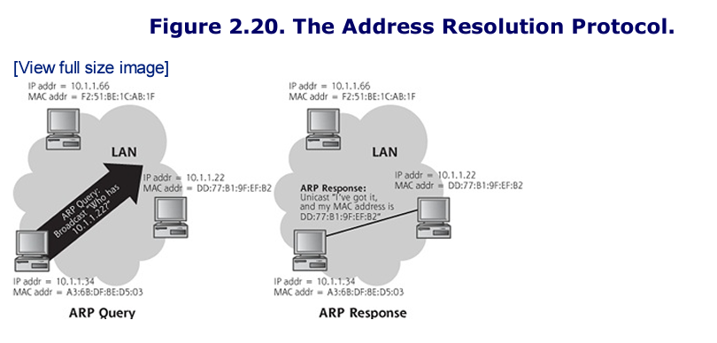

ARP only exists between layers 2 and 3 does not expand into the rest of the OSI model

### Hubs and Switches

Ethernet LANS are constructed through hubs or switches, devices that have various physical interfaces for plugging in Ethernet cables.

- A hub broadcasts all information received on one physical interface to all other connections on the box.
- A switch on the other hand, has additional intelligence so that it doesn't have to broadcast on all physical interfaces using stored MAC addresses.
    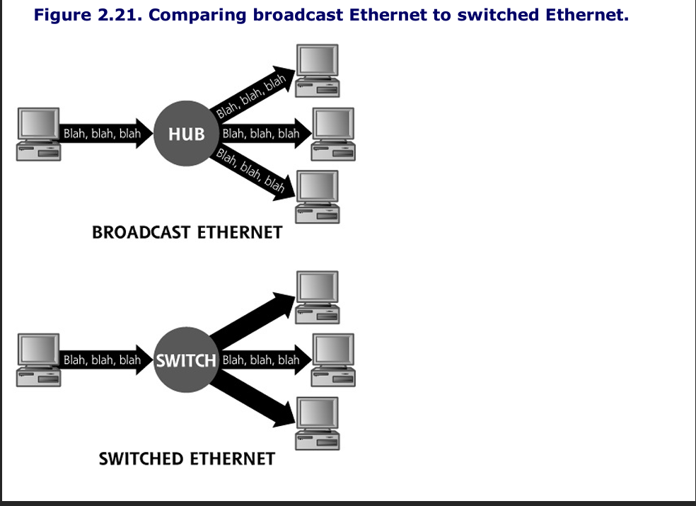
    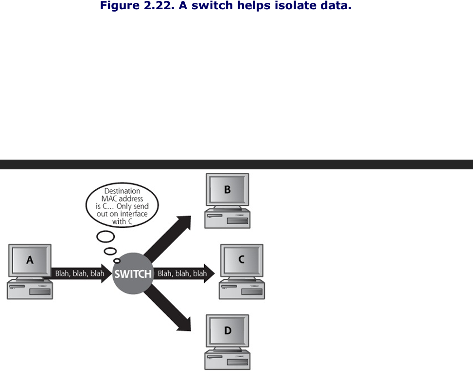

### 802.11: The King of Wireless Connectivity

The 802.11 family of protocols are designed as a seamless replacement of the Data Link and Physical Layers of Ethernet.

One important similarity between Ethernet and the 802.11 family is their reliance on MAC addresses, the ARP protocol, and ARP caches. Just as systems on wireline Ethernet LANs use ARP to create a mapping of IP addresses to MAC addresses, so too do systems communicating on a WLAN. Wireless MAC addresses are also 48 bits in length.

The 802.11 family includes numerous members, but some of the most popular and important protocols within this family include the following:

- 802.11: Originally defined in 1997, was the first standard in the family describing the MAC layer and frequency-hopping techniques, providing a paltry maximum bandwidth of 2 Mbps. Today this term is applied to the whole family of 802.11 protocols, instead of just that one ancient standard from 1997.
- 802.11a: Second 802.11 standard defined in 1999, with a max bandwidth of 54 Mbps.
- 802.11b: Third physical layer defined in the family in 1999, became the first widely deployed given its low cost and acceptable maximum bandwidth of 11 Mbps.
- 802.11g: Finalized in 2003, has widespread acceptance from its higher bandwidth (maxing out at 54 Mbps) and low cost, combining the best features of 802.11a and 802.11b
- 802.11i: Ratified in 2004 ,offers improvements to the security of 802.11, including stronger encryption and better key exchange using a protocol called the Temporal Key Integrity Protocol (TKIP)

WLANs implemented using 802.11 technologies can operate in two modes: independent (sometimes called peer-to-peer) mode, where each system is an equal partner on the LAN or infrastructure (sometimes called access-point) mode, where one system is in charge.

- In independent mode, a group of wireless computers can create an ad-hoc network and start exchanging data directly with each other.
- In infrastructure mode, an administrator deploys an access point, a central point for the WLAN then send all data through that access point.

Regardless of whether the network is independent or infrastructure in nature, all 802.11 wireless communications must be controlled with various management frames, special packets sent by the devices communicating wirelessly to coordinate communication. The wireless management frame types support by 802.11 include the following:

- **Beacon**: In infrastructure networks, access points use these frames to announce the existence of a WLAN, sending them at regular intervals, typically approximately every 100ms by default. 

- **Probe request**: Wireless devices can use these frames to find existing 802.11 networks requesting which access points are nearby.

- **Probe Response**: An access point can respond to a probe request with this type of frame, indicating that it is present.

- **Association Request**: This frame is sued to join a WLAN.

- **Association Response**: An access point uses this frame to grant access to the WLAN.

- **Disassociation**: This frame is used to tear down a relationship with a WLAN.

These management frames are highly useful to attackers in a variety of ways in locating and attempting to undermine a wireless access point. 

## Security Solution For the Internet
Traditionally TCP/IP stacks offer no real protections for ensuring the confidentiality, integrity, authentication, and availability of data as it is transmitted through the network. There have been some advances in implementing application layer security post production.

### Application-Level Security
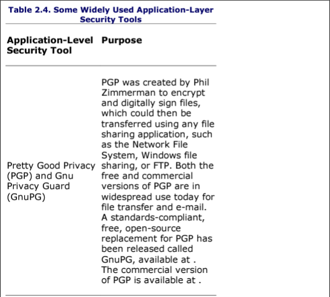
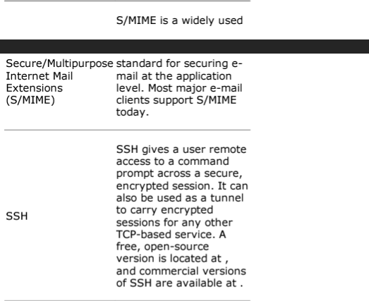

### The Secure Sockets Layer (SSL) and Transport Layer Security (TLS)
Another option for providing security services to TCP/IP applications involves implementing security at a layer just above TCP/IP known as the Sockets Layer. An application can include its own implementation of a Sockets Layer that has security capabilities, which sits between higher level application functions and the TCP/IP stack. 
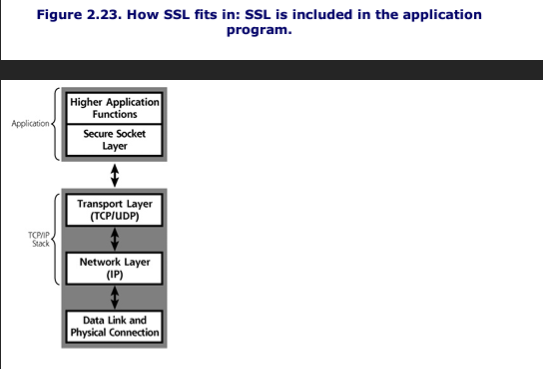

SSL and TLS allow applications to have authenticated, encrypted communications across a network. Both communicating sides of the application requiring security must include an implementation of SSL, which encrypts all data to be transported and sends the information to the TCP/IP stack for delivery. 
- SSL relies on digital certificates to authenticate systems and distribute encryption keys. These digital certificates act like cryptographic identification cards, which can be used to verify another party's identity. 
- A certificate contains the public key of a given machine, which has been digitally signed by a certificate authority the other side needs to be configured to trust. 
- SSL can support one or two way authentication 

To establish an SSL session between two systems, SSL defines a carefully orchestrated handshake so the two machines can agree on various encryption algorithms and settings, as well as exchange keys. 
- The systems first complete the TCP 3-way handshake 
- Next the client an SSL CLIENT_HELLO message that specifies the particular cryptographic algorithms it can support, compression algorithms it wants to use, an SSL session ID number, and the highest SSL or TLS protocol version it can handle. 
- This message also includes some random data that will be used in the session key generation process later. 
- The server responds with, as you might guess, a SERVER_HELLO message, which includes the server's choice of SSL or TLS version, the particular encryption algorithms to use, and chosen compression methods, all sent with the same SSL session ID number. 
- The server follows up with some pretty important data, the CERTIFICATE message, which includes the server's digital certificate, that crucial data structure holds the server's public encryption key digitally signed by a certificate authority. This public key corresponds to a private key stored on the server 
- The server completes its part of the communication with a SERVER_DONE message. 
- REVIEW THIS MORE IN THE BOOK 
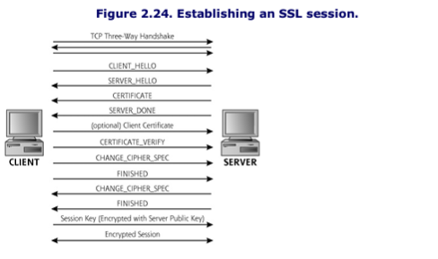

If the server certificate is bogus, this whole operation is for nothing. 

### Security At The IP Level: IPSec
IPSec can be used to create VPNs.

IPSEC functions at the Layer, offering authentication of the data source, confidentiality, data integrity, and protection against replays. Any two systems with compatible versions of IPSec can communicate securely over the network. 

Because IPSec is offered at the IP Layer, any higher layer protocol, such as TCP, UDP, or anything else, can take advantage of IPSec. More important, any application riding on the top of that higher layer protocol will benefit from the security capabilities of IPSec. 

IPSec is really made up of two protocols, the Authentication Header (AH) and the Encapsulating Security Payload (ESP), each offering its own security capabilities. It should be noted that AH and ESP can be used independently or together in the same packet. 

#### The IPSec Authentication Header 
The AH provides authentication of the data source, data integrity, and, optionally protection against replays. In essence, AH provides digital signatures for IP packets so that attackers cannot send packets impersonating another machine, or alter data as it moves across the network. 
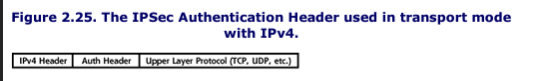

The AH format itself, includes several parameters. Of particular interest are the Security parameters index (SPI), the Sequence Number Field, and the Authentication Data. 
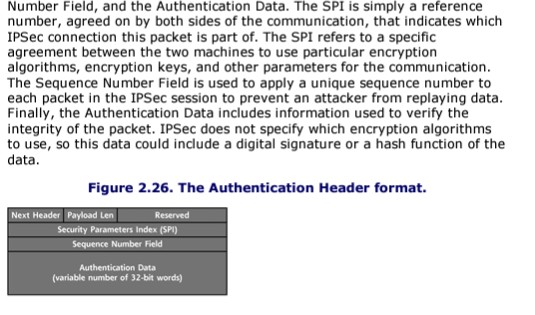

#### The IPSec ESP
ESP is the other protocol of IPSec, it supports confidentiality, and optionally supports authentication of the data source,  data integrity, and protection against replays. In essence, it encrypts packets so attackers cannot understand protected, and to support digital signatures. 
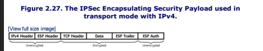
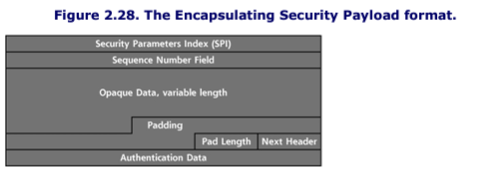

# Summary
The TCP/IP suite of protocols is widely used for computer communications today. The OSI reference model is based on the concept of protocol layering, where each layer provides a specific function for the communicating systems. The OSI mode includes seven layers, and TCP/IP roughly corresponds to two middle layers of the model: the Transport Layer and the Network Layer.

The primary members of the TCP/IP family are TCP, UDP, IP, and ICMP.

TCP is the primary transport layer used for a majority of the applications on the Internet, such as Web browsing, file transfer, and e-mail. Every TCP packet includes a header with source and destination port numbers, which act as little logical doors on a machine that packets go out of and come into. Particular services usually listen on a set of well-known ports, which are defined by the IANA.

TCP flags or control bits indicate the role each TCP packet plays in the exchange of data. 

All legitimate TCP connections begin with 3-way handshakes. The 3way handshake lets the two communicating systems agree on sequence numbers to use for connection, so that TCP can retransmit lost packets and put packets in the proper order.

UDP is simpler than TCP; it offers unreliable transmission because it has no mechanism to obtain lost packets or organize out of order packets. 

IP, the network layer protocol used on the internet, has a header that includes the source and destination IP address of the packet. IP addresses are represented in dotted-quad form such as 10.21.41.3. IP packets can be broken down into smaller packets called fragments to optimize transmission performance.

ICMP is used to transmit command and control information between systems. Common ICMP messages are ping (Echo Request), Destination Unreachable, and Source Quench.

Routing is the process of moving packets from one network to another network. Routing can be done using dynamic routing protocols, static routes, or source routing, where the originating systems determines the route. 

NAT involves overwriting the IP addresses of packets as they move through a router or firewall. NAT allows a large number of machines to use a small number of valid IP addresses when accessing the Internet.

One of the most widely used Data Link and Physical layers is ethernet. Every ethernet network interface card includes a 48-bit MAC address. ARP is used to map IP addresses to MAC addresses.

Ethernet hubs implement a broadcast medium so all machines connected to the LAN can see all data on the LAN, regardless of its destination. Switches look at the MAC address of Ethernet frames so that data is only sent to the particular switch plug where the destination machine resides.

The 802.11 family of protocols are the most popular WLAN types today. 

Because TCP/IP has historically included no strong security features, many applications have been developed with built-in-security. These applications are in widespread use today, and include PGP and SSH, as well as e-mail standards like S/MIME.

The SSL protocol can be used to add security to applications. It is most widely used for secure Web browsing, in the form of HTTPs.

IPSec is an add-on to the current widely used version of IP, IPv4, IPSec is built into the next-generation version of IP, IPv6. IPSec includes the AH and ESP, two protocols providing authentication, integrity, confidentiality, and other security services. 
