# Notes

## The BAD (Before Active Directory) Old Days
With the advent of Windows 2000, Microsoft introduced a new method of organizing networks called Active Directory services.
- With the birth of Active Directory, Microsoft dramatically shifted the security architecture of its entire OS. 
- Active directory is kind of all-in-one service that allows (or disallows) users and programs to find the "stuff" they need within the hodgepodge of interconnected layers in the average modern organization.  

## Windows Domains: Grouping Machines Together
The concept of the Windows domain was central to Windows networking prior to the arrival of Active Directory, and even though it is currently deprecated, it is still an important concept when discussing Windows networking. 
- A domain is simply a group of one or more networked Windows machines that share an authentication database
- An authentication database is a single collection of usernames and password representations that allows a user with the correct credentials to access the resources within that domain. 
- The advantage to users is that they can log on to the domain to access resources and services on various machines within the domain, rather than having to log on individually to each server

For a domain to exist, there must be at least one special type of server called a domain controller. 
- They have a number of uses but their primary usage is to authenticate users to the domain

 The most important single server in a domain, the first one you install when you set up a domain, is called, unsurprisingly, the Primary Domain Controller (PDC). The PDC keeps and updates the master copy of the domain authentication database, which is sometimes called the SAM database, because it is stored in a file that is named for the Security Accounts Manager, one of the subsystems in Windows. 
 - Prior to the advent of Active Directories, PDCs were the sole guardians of the SAM database, and the other domain controllers on the network behaved differently. 

## Shares: Accessing Resources Across the Network
From a user perspective, shares are the single most important function of a Windows network, whether in a workgroup, regular domain, or Active Directory environment. 

A share is a connection (usually remote) to a particular network device such as a hard-drive. Shares are very similar in concept to Network File System mounts in Linux and UNIX, although the underlying protocols and mechanisms differ significantly. 

Most users connect to a share using Window's Explorer's My Network Places category, then finding the icon with the appropriate location and double-clicking it. Alternatively, users can use the command prompt to enter this to mount a share:
```
C:\> net use \\[IP address or hostname]\[share name] [password] /user:[username]
```

Once they are connected to a share, users can access objects (eg, files, directories, etc) depending, of course, on the particular permissions that apply to these objects. 

# The Underlying Windows Operating System Architecture
The following figure, provides a high-level depiction of the architecture of operating systems based on the original Windows NT core (XP, 2000, 2003). Windows is designed as a series of layers, with each higher layer communicating only with the layers above and below it. **THIS IS HEAVILY OUTDATED**

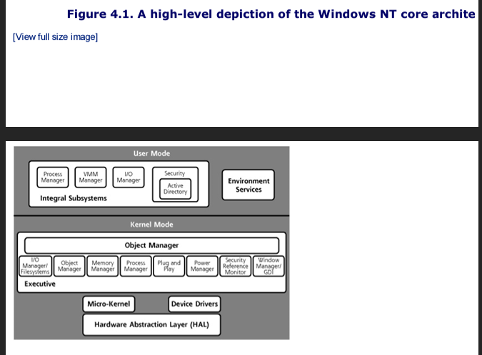

# User Mode
Portions of the OS that provide support for user interaction. 

It uses application programming interfaces (API) to communicate with hardware in kernel mode

User mode itself is split into two different types of services:
1. Those offered natively within Windows itself, called Integral subsystems 
2. Those offered in support of other operating systems, called Environment services

Environment services has several individual subsystems that each provide an API that is specific to applications for a particular alternate operating system type. One benefit of designing the Environment services in this way is that it is possible to add support for applications for other operating systems by simply writing a new subsystem and plugging it into the existing architecture. 

Integral subsystems provide the APIs that Win32 applications call to perform important operating system functions, such as creating windows on the screen and opening files. Integral subsystem functions include:
- process management
- virtual memory management (VMM)
- functions (allocating, sharing, and protecting process memory)
- input and output (I/O)
- functions (to the network, printer, drives, serial ports, parallel ports)
- security functions including portions of the active directory

Applications running in user mode cannot place calls directly to the Win32 kernel functions themselves, but rather they interact through subsystem Dynamic Link Libraries (DLLs.)
- subsystems DLLs files translate the documented Win32 system API calls into the undocumented Windows system service calls into the kernel itself. In this way, these user mode subsystems are tied into their kernel mode counterparts in the kernel executive subsystem. 

### Security Functionality in User Mode: LSASS
Security-related functions are handled by the Security subsystem, also known as the Local Security Authority Subsystem Service (LSASS), which plays a critical role in Windows security. 
- Simply put, this user mode subsystem determines whether logon attempts are valid.
- When a user enters his or her username and password during the logon process, the security subsystem sends these entries to a facility called the SAM.
- SAM files has two passwords due to backwards compatibility reasons (NT hash and LM representation)

Each line of the SAM database consists of a set of entries: the account name, a unique number identifying each user known as the relative ID, the LM password representation and the NT hash, and several other optional fields.


# How Windows Password Representations Are Derived
The LM and NT password representations for each account in Windows are derived in two fundamentally different ways.

The LM representation is derived by adjusting passwords shorter than 15 characters in length to exactly 14 characters, by padding the password with blank characters.
- If a password is15 or more than 15 characters, no LM representation is stored for that password. 

After padding, the resulting padded password string is then divided into two equal parts, each seven characters in length. One character of parity (needed for Data Encryption Standard [DES] encryption) is added to each part, and each part is used as a key for DES encryption of a hexadecimal number. 
- This makes LM representation incredibly weak, splitting the string into two seven-character parts to form the LM representation allows an attacker to guess pieces of the password independently of one another, speeding up the process of password cracking. 
- Even if mixed-case password is used, LM representation is calculated only after all characters have been converted to uppercase, dramatically decreasing the number of possible character combinations. 

NT password hashes are far stronger, but not unassailable. For the NT representation of the password, the MD-4hashing algorithm is used three times to produce a hash of the password. 

Passwords in LM and NT are not salted. 

This information is slightly outdated, most windows systems now use Password Hash Synchronization (PHS) or Pass-through Authentication (PTA) hashing algorithms instead of the NT hash. 
- LM passwords are about 890 times easier to crack than NT hash 

# Kernel Mode
Although both user and kernel modes have built-in security, kernel mode, which is reserved for fundamental operating system functionality, is more secure of the two.

**NOTE: Each subsystem in Windows is implemented as a separate DLL and communicates with the rest of the operating system through a well-defined set of interfaces**

Several of the important subsystems within kernel mode are collectively called the Executive subsystems. These include:
- Input/ Output manager
- security reference monitor
- process manager
- memory manager
- graphics driver interface subsystems 

The Security Reference monitor approves or denies attempts to access kernel mode. It also verifies users and programs have appropriate permissions before accessing objects. 

Object manager is a critical subsystem that manages objects within the system. 

Windows is in a very limited sense, a type of object-oriented operating system in that it allows for hierarchical relationships between some types of objects. 

The kernel also performs all of the "normal" underlying operating system functions such as controlling the scheduling of processes and input/output operations

Finally, the kernel also includes something called the Hardware Abstraction Layer (HAL).
- This layer of software is designed to specifically deal with the underlying hardware in a high-level manner. 
- Allows the rest of the operating system to function regardless of hardware level changes

# From Service Packs and Hotfixes To Windows Update and Beyond
As vulnerabilities are continuously discovered, every operating system vendor releases upgrades and fixes for their product; Microsoft is by no means the exception to this rule.

Fixes and upgrades come in usually two flavors:
1. Service Packs (SPs): Tightly bundled set of fixes
2. Hotfixes: Deal with one specific problem


If you are supporting a large number of Windows machines, Microsoft has software available called Windows Server Update Services (WSUS), which allows you to create, in essence, your own local Windows Update server. 

# Accounts and Groups 
Accounts and groups are central to the security of every operating system, and Windows is no exception. 

## Accounts 
In Windows there are two types of accounts: default accounts and accounts created by administrators. 

### Default Accounts
In a Windows domain (and on individual machines), two accounts, Administrator and Guest, are automatically created when the first domain controller is installed. The default Administrator account has the highest level of privileges of any logon account, rather like the root account in UNIX. 

- Making a second administrator account is critical to hardening your system, if only the default account exists, unlimited password guessing ("brute force") attacks against this account can occur. 

The second default account is the Guest account. If enabled, this account can provide an easy target for attackers. Anyone can log on to an active Guest account. 
- It's existence reduces the challenge for an attacker.

### Other Accounts
Additional accounts, such as user accounts or accounts for specific services or applications, can be created by administrators as needed. 
- Many applications also create their own, single-purpose accounts during installation. 

### Securing Accounts: Some Strategies
First, rename the default administrator account to a neutral name such as "extra". 

Another measure is to create an additional nonprivileged account with the name Administrator to act as a decoy account. 

As described earlier, leaving the default Guest account disabled is a very important step in securing Windows. Applying a difficult password to the guest account is also a good idea on the chance it is re-enabled.

## Groups
In most Windows deployments, groups are used to control access and privileges, not individual user accounts. By aggregating users into groups, admins can more easily manage privileges and permissions. 

### Default Groups 
A number of default groups are created when the first domain controller is installed. 
- Most group names are self explanatory except for the replicator group which controls the Windows replicator function used in fault-tolerant installations, and the Power Users group, which can perform any task except those reserved for Administrators. 

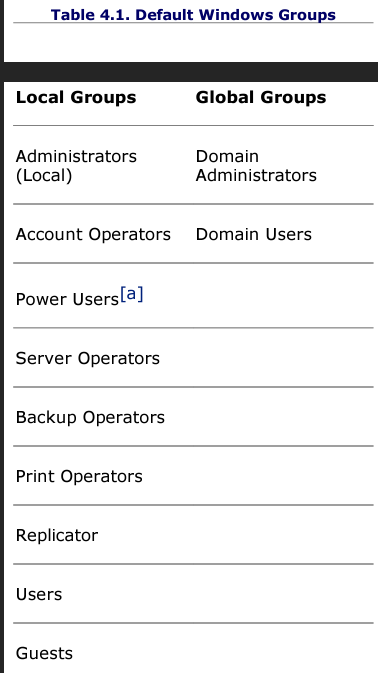
Beyond these default groups there are also special groups intended for controlling certain types of system functionality. You cannot add or delete users from special groups...thats why they're special. 
- SYSTEM is the holy grail special group--nothing in Windows has a higher level of privileges than SYSTEM. 
- However, SYSTEM is not a logon ID; no one can log on to a machine as a part of the SYSTEM group. 
- Only various local processes run with SYSTEM privileges, and it is by compromising one of these processes that an attacker can gain SYSTEM privileges and completely "own" a machine. 

Other groups include INTERACTIVE (users logged in locally), and NETWORK (another group of users who have active network logon sessions). 

### Other Groups
Global and local groups can be created and deleted as necessary. 

# Privilege Control
In Windows, the capacity to access and manipulate things, collectively known as privileges, is broken down into two areas: rights and abilities. 
- Rights are things users can do. Rights can be added to or revoked from user accounts and groups 
- Abilities cannot be added or revoked; they are built-in capabilities of various groups that cannot be altered

As far as privileges of logged-on users go, Administrator privileges are the highest level for any logon ID in Windows, acting somewhat like the root account in Linux and UNIX. 
- Operator groups get bits and pieces of Admin privilege's 

After admin privileges, power user privileges are the next highest privilege followed by User-level privileges and then Guest privileges. 


To view these rights, run the security policy management console typing ```secpol.msc```

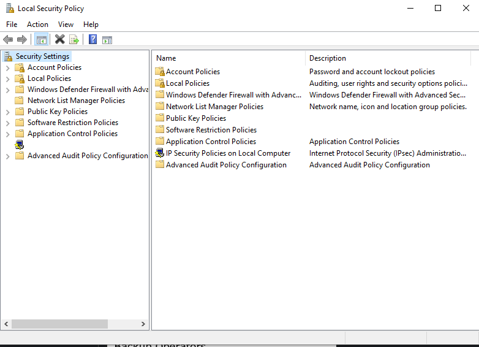

# Policies
In Windows, a system admin can implement a variety of policies that affect security. Each policy is a collection of configuration settings that can be applied either to local machines or to the domain as a whole. 

## Account Policy
The most basic type of policy in Windows is the Account Policy, which applies to all accounts within a given domain. 
- Account policy parameters include keeping a history of used passwords to prevent reuse, requiring a maximum password age and a minimum password age
- Account Lockout Policy parameters include lockout duration, lockout thresholds, and control over how accounts are reset after lockout

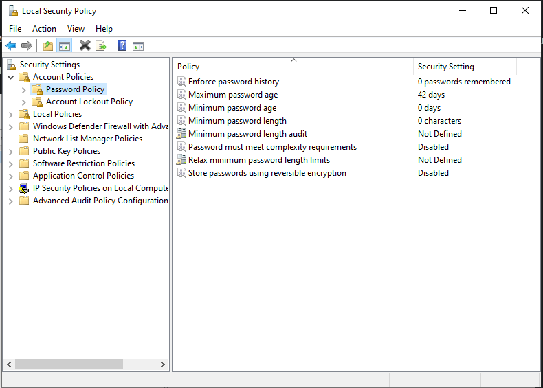
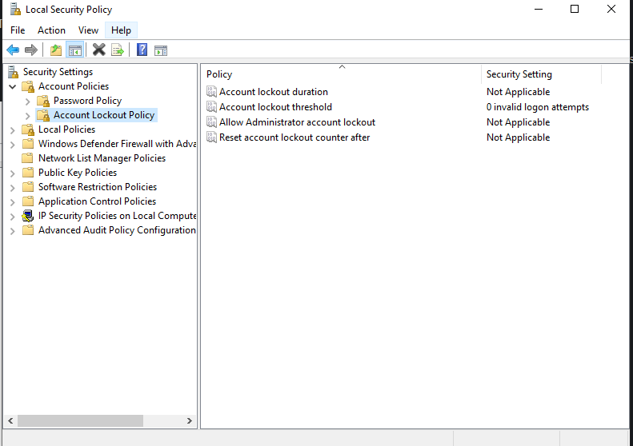

## User Properties Settings
Although User Properties are not properly called "policies" in Windows, they serve virtually the same function for security. 
- They are similar in principle to account policy settings, except they can be set differently for every user account
- You can look for user properties by invoking the local user manager Microsoft control typing ```lusrmgr.msc``` in the console
- 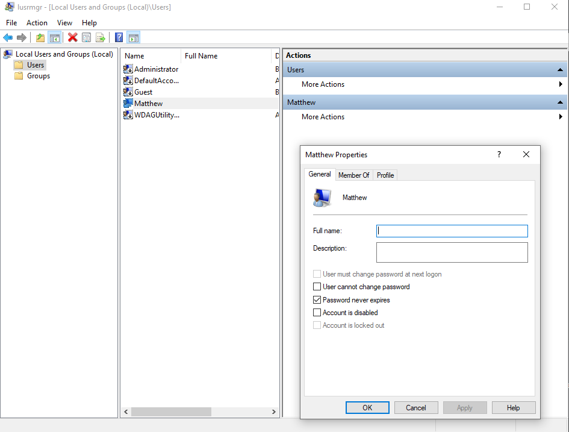

# Trust
Trust in Windows extends the single-domain logon model to other domains, which can be a real convenience for users who need access to resources within those domains. 

If established properly, Windows domain-based trust relationships can be relatively secure because system administrators have control over the exact level of access that trust affords. 

There are four possible trust models that can be implemented in Windows, as follows:
- No Trust: No trust is the most secure, but is also the most inconvenient for users because they cannot easily access other domains
- Complete Trust: This model means that every domain trusts every other domain. It is the worst for security because it involves helter-skelter trust that goes everywhere. This model should be avoided.
- Master Domain: This model is well suited to security because user accounts are set up in a central accounts domain where they can be carefully managed, while resources (such as files, shares, printers, and such) are placed in resource domains. Users obtain access to resources in resource domains via trust relationships. This gives a kind of central control capability for mapping users (through groups) to resources. 
- Multiple Master Domain: This model is similar to the master domain model, except that user accounts are distributed among two or more account domains. This involves less central control over user accounts than the master domain model, it still is far superior to the complete trust model. 

Windows trust, because it is based on a challenge-response mechanism (and on Kerberos authentication under Active Directory) is by default fundamentally more secure than trust in many other operating systems. 

Despite these strengths of the Windows trust relationships, it is still important to observe some basic principles if trust is to be as secure as possible. 
1. There are some operational contexts that require such high levels of security that trust should be avoided altogether
2. You should periodically check trust relationships to determine which ones exist, because attackers might create unauthorized trust relationships as backdoor mechanisms.


# Auditing
Windows offers three types of logging: System logging, security logging (also sometimes simply called auditing), and Application logging. 
- Security logging is configurable and yields at least a moderate amount of data about events such as logons, logoffs, file and object access, user and group management, use of rights, and so forth. 

By default, detailed auditing is disabled under all Windows operating systems. Below are the audit policy settings within the Security Settings Manager


# Object Access Control and Permissions
A member of built-in mechanisms control access to objects such as files and printers in Windows. Let's look at these control mechanisms in more detail.

## Ownership
In Windows, every object has an owner. Even if permissions deny the owner access to an object, the owner can always change these permissions, and then do anything with it. In Windows, ownership of an object means everything. 

## NTFS and It's Permissions
Windows supports a variety of file systems, most notably the old File Allocation Table (FAT) file systems for backend compatibility with older versions of Windows, and the newer NTFS file system for increased robustness and security. 
- REMEBER: FAT partitions offer no access control and should always be avoided in situations that require any degree of security. 
- This is the single most important reason why all the OS that evolved from the original Windows line (Windows 95, 98, Me) cannot be considered secure: They were all based on a file system that offered no access control

NTFS, originally included in Windows NT and then carried forward into Windows 2000, XP, and 2003 is a more sophisticated file system that was designed to provide good performance, while delivering recoverability in case something goes wrong during a write to media. 

Standard NTFS permissions that can be applied to file or directories include the following:
- No Access: no read/write/execute or interaction with the object in any way
- Read: Gives read and execute capabilities to a user for an object. Remember the standard Read permission also includes the ability to execute
- Change: Which gives a user read, execute, write, and delete capabilities for an object
- Full Control: Everything in Change plus the ability to change permissions and take ownership of an object. 

### Boosting File and Directory Security
It is always best to use the principle of least privileges when assigning access permissions--allow only the level of access that each user needs to do his or her job related responsibilities and nothing more. 

Finally, it is important to limit the kinds of access the EVERYONE group gets. 

### Share Permissions
Beyond individual object permissions, Windows also allows users to configure the permissions on the various components of the file system that they intend to share with others. 
- On a shared folder, a user can right-click and select properties to view these details on the sharing tab. Figure below

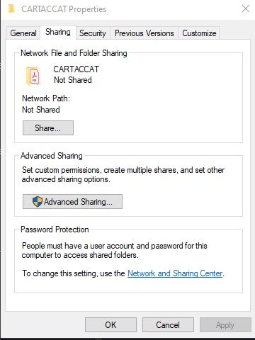
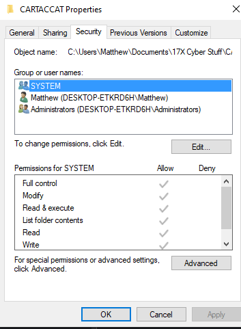

# Weak Default Permissions and Hardening Guides
Even if a partition uses NTFS, many of the Windows default permissions for system directories and files can charitably be described as "faulty". 
- For example: The default permissions for the ```\Windows``` directory allow Modify, Read & Execute, List Folder Contents, Read, and Write to Power Users. Leaving this default would allow such users to read or completely replace the repair directory, which is the backup information needed to repair the system in the event of catastrophic problems. 

The repair directory ```\Windows\repair``` (on Windows XP) holds several security-related files and other important information. A spare copy of the SAM database is included in the repair directory, which can be stolen somewhat easily if these default permissions are left in place. 
- The SAM database can be fed into a password-cracking tool.

The default permissions for the ```\Windows\system32``` directory in Windows XP also grants widespread access to Power Users. 
- With this default, an attacker could cause havoc with any number of critical system files by compromising an account in the Power Users group

Some good starting points for finding system hardening "how-to" guides are the Center for Internet Security (www.cisecurity.org), the SANS Institute (www.sans.org) or the Information Security Forum (www.securityforum.org).

# Network Security
So far, this chapter has concentrated on system-related considerations for security. Because nearly all useful Windows systems are connected to a network, we must explore in more detail the security implications of Windows networking. Kerberos, a protocol that provides strong network authentication, is used to identify users.

## Limitations in Basic Network Protocols and APIs

### SMB/CIFs
Share access is based on an implementation of the Server Message Block (SMB) protocol that Microsoft calls the Common Internet File System (CIFs). 
- All current versions of the Windows operating system are capable of encapsulating SMB/CIFs in TCP.

This establishes a connection between the client and the server that has weak authentication mechanisms by default, as well as loopholes in backward compatibility mechanisms. 

### NetBEUI and NetBIOS
Outdated components of the Windows network environment. Newer variations of Windows do not install NetBEUI by default.

### Microsoft's Internet Information Service (IIS)
A built in web server that comes with Windows servers. IIS uses a virtual directory system in which each virtual directory accessible through the Web interface refers to an actual directory on the Web server's file system. 
- Many vulnerabilities, may be easier to deploy other web server like Apache and Zeus Web

# Windows 2000 and Beyond: Welcome To The New Millennium

Microsoft has added gobs of new security-specific features to Windows 2000+ that are of more interest to us, including the following:
- A Microsoft implementation of Kerberos, a protocol that provides strong network authentication to identify users.
- The SSPI, a package that supports a variety of different authentication mechanisms.
- Microsoft's implementation of Internet Protocol Security (IPSec), which extends IP to provide system authentication, packet integrity checks, and confidentiality services at the network level, as described in Chapter 2.
- The Layer Two Tunneling Protocol (L2TP), which provides encrypted network transmissions, helping protect the privacy of the contents of traffic
- Active Directory, the Windows 2000+ directory services that act as the central nervous system of all Window 2000+ functionality, including all security related capabilities
- An architecture that provides strong support for smart cards, allowing them to be used in authentication, certificate issuance and other contexts. 
- The Encrypting File System (EFS), which provides for encryption of stored files, helping protect the contents from unauthorized access.

## Native versus Mixed Mode
Native Mode: All domain controllers run Windows 2000 or newer operating systems 
Mixed Mode: Current and Older windows NT domain controllers.

Native Mode is better for security

## Deemphasizing Domains
Active Directory simplified the mechanisms for finding network resources and administering them.

Now a domain in Windows 2000+ isn't so much about network organization as it is about a common set of policy settings.
- Domains can be deployed in either a tree or forest structure.
- A tree is a linking of domains via trust in a manner that results in a continuous namespace to support locating resources more easily using Active Directory
- This means as one starts at the topmost domain name in the tree structure and goes down, the domain name of the domain immediately below starts with the name of the parent domain immediately above, (see below)
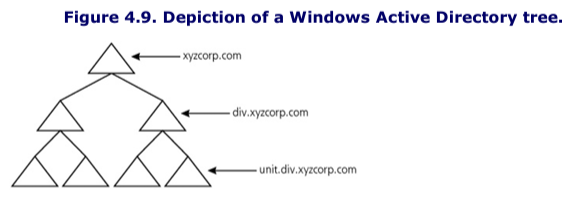
- Alternatively a forest produces a noncontiguous namespace by cross-linking domains via trust. In a forest, there is no structured namespace and consequently, resource location again becomes a difficult proposition. 

## Active Directory: Putting All Your Eggs in One Huge Basket
Based on the lightweight directory access protocol (LDAP), Active Directory services take a lot of the sting out of finding where resources and services reside on the network, a major advantage to both users and programs in today's far-flung network environments. 

Active Directory is a kind of all-in-one service. Using DNS, Active Directory disseminates appropriate information to other hosts. 
- Active Directory's health depends on whether DNS is running properly.  
- Dynamic DNS (DDNS) provides Active Directory with dynamic updates, such as when a new site (a host or set of hosts running Active Directory) connects to the network.
- AD also serves as a massive data repository, storing information about accounts, organizational units (OUs), security policies, files, directories, printers, services, domains, inheritance rules, and Active Directory itself. 
- It stores user password hashes in a file named ```ntds.nit```.

## Security Considerations in Windows 2000+ 

### Protecting Active Directory
Privilege Escalation provides the best opportunity. 

Installing Active Directory in the main ```\Windows``` or ```\winnt``` directory of your server is **not** a good idea as far as security is concerned because it puts AD on the same partition as the boot sector, system files, and the IIS. 

Active Directory, furthermore has very large disk space requirements and can create significant I/O overhead at times; it thus deserves its own partition. 

A good way to divide partitions on servers, therefore is as follow:
- C: Boot and system files
- D: Active Directory
- E: User files and applications

### Physical Security Considerations 
One of the easiest ways to compromise Kerberos is to physically access a Kerberos server (called a Key Distribution Center [KDC]) to gain access to Kerberos credentials (tickets) that reside therein. 

For clients, Kerberos credentials are stored in workstation caches. Ensuring that workstations have at least a baseline level of security is thus a sound move for security. 


### Templates 
The Windows 2000+ Security Configuration Tools include templates and wizards that can be used in securing just about everything that is important to security in Windows 2000+.
- The command-line tool ```secedit``` can be used to analyze or configure the security of the machine.

## Architecture: Some Refinements Over Windows NT
The Windows 2000+ architecture, like Windows NT, is divided into user mode and kernel mode. 
- Kernel Mode in Windows 2000+ includes some additional components, including the Plug and Play Manager, Power Manager, and Window Manager, among other components. 

## Accounts and Groups
As in Windows NT, securing accounts and groups is fundamental in the effort to secure Windows 2000+ systems. Default accounts in Windows 2000+ include Administrator and Guest, the latter of which is disabled by default. 

The default groups in Windows 2000+ are almost identical to the default groups in Windows NT. One of the most significant changes is the addition of the Power Users group, a privileged group built into Windows NT workstations, that is now a default group in Windows 2000+ client and server platforms. 

Windows 2000+ includes three kinds of security groups: domain local (for access to resources only within the same local domain), global (which can only be assigned access to resources in the domain where they are defined), and universal (which can contain groups and users from every domain within any forest, thus cutting across domain and tree boundaries)

### Organizational Units (OUs)
OUs in Windows 2000+ allow hierarchical arrangement of groups of users who can inherit properties and rights within a domain. They are very flexible, and can inherit properties and rights within a domain. They are very flexible, and can be used to control a number of security-related properties such as privileges.

OUs constitute a potentially big advantage in Windows 2000+ because they support delegation of privileges. Each OU can be assigned a particular level of privileges. Children OUs below the parent can never be given more rights than the parent has. 
- This ensures runaway privileges are not a problem within any domain. 

- One downside of OUs is that they are not recognized outside the particular domain in which they have been created. 

## Privilege Control
Windows 2000+ includes many significant alterations to the way privileges are handled.

### The Nature of Rights in Windows 2000+ 
Rights in Windows 2000+ include Change System Time, Debug Programs, Log On Locally, Replace a Process Level Token, and many others.
- They are considerably more granular than in Windows NT
- There is no distinction between standard and special rights in Windows 2000+, but rather more or less just a big set of rights, some of which are extremely powerful, others of which are not. 
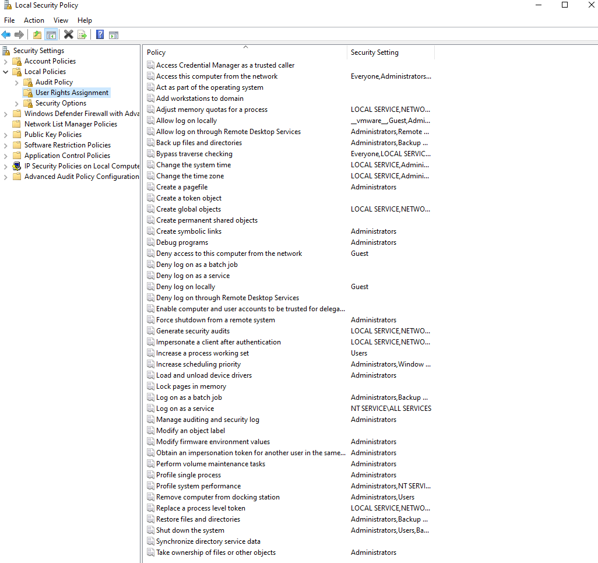

There are usually multiple ways to set up a rights assignment scheme in Windows 2000+. Suppose someone needs only to create and delete accounts.
- One way to achieve that would be to include that person's account in the Account Operator group
- Alternatively, the appropriate rights can be assigned directly to the individual user. 
- OUs, however, potentially provide the most suitable way to assign rights because delegation of rights is possible.

### RunAs
RunAs provides the ability to launch processes with a different user context. Someone who is already one account use a command line to bring up the RunAs command. 
- The major advantage is to allow privileged users to execute programs in nonprivileged context, thereby helping to control against the dangers of privilege escalation.
- This capability is therefore roughly analogous to the UNIX sudo applications. 

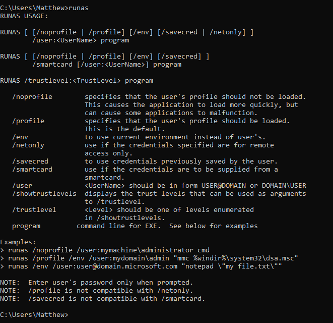

## Policies
### Group Policy Objects
The major change in Windows 2000+ policies is the introduction of Group Policy Objects (GPOs). GPOs allow different policies to be applied to different users, OUs, computers, or even entire domains. 
- To look at Group policy settings for a local system, go to console and type ```mmc``` to bring up the Microsoft Management Console screen
- Then go to console Add/Remove Snap-in and click Add. Choose Group Policy, click Add, and then click Finish when you see the Local Computer GPO.
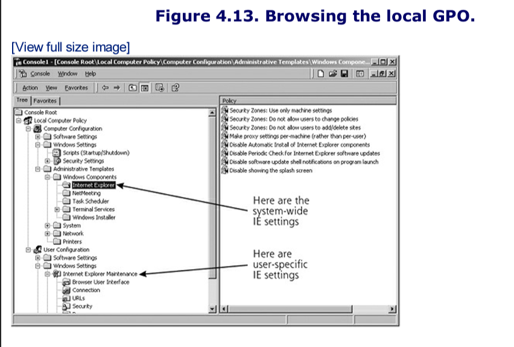

# Summary
Microsoft's Windows operating system is very popular as a target for attackers. As of this writing, the most widely deployed version is Windows XP ( :()  )

Domains are used to group Windows machines together with a shared authentication database. Within a domain, users can authenticate to a domain controller and access objects (directories, files, etc) in the domain. The PDC holds and maintains the main authentication database for the domain, called the SAM database. BDCs contain copies of this database, but cannot update it. In native mode Windows 2000+ networks, the concept of PDCs and BDCs has been eliminated and all domain controllers are authoritative. 

Microsoft release fixes for Windows in the form of SPs and monthly patches. Patches apply to a specific problem, whereas SPs are more general updates of the system.

The Windows NT core architecture is divided into user mode and kernel mode. User mode supports user interaction, including subsystems to verify whether logon attempts are valid. 

The SAM database contains representations of each user's password. In many installations, two types of password representations are stored: the LM password representation and the NT hash. The LM representation is very weak and is included for backward compatibility with Windows for Workgroups and Windows 95,98 systems. The NT hash is far more secure, and is used to authenticate users with Windows NT and 2000+ systems. Neither the LM representation nor the NT hashes are salted making them easier to crack.

Kernel mode includes the Security reference monitor, which enforces access control on objects when users or programs try to access them. 

Windows supports accounts for users, services, and applications. Several default accounts are included, such as the Admin account and guest account. Admin is analogous to root accounts in UNIX. Guest is disabled on all versions of Windows

Groups are used to aggregate users to simplify the assignment of privileges and permissions. Global groups can allow access to any resource in a domain, whereas local groups allow access on a particular server or workstation. Global groups can be included in local groups to allow users across a domain to access local resources on a single machine. 

Admins can configure Windows domains to trust other domains, giving users transparent access to resources across domain boundaries. Windows trust is not transitive. Also, Windows trust does not rely solely on IP addresses for authentication, unlike UNIX trust relationships implemented with the r-commands.

Windows supports logging system, security, and application events. 

Every object has an owner called the CREATOR OWNWER. The NTFS file system offers access control capabilities on individual objects. Standard NTFS permissions include No Access, Read, Change, and Full control. Windows shares have the same permissions as well. 

Windows network security is based on a variety of options and protocols. Among these, the basic authentication protocol supports a challenge-response mechanism that does not require clear-text transmission of passwords. Windows networking also supports packet filtering and network-level encryption using Microsoft's implementation of the Point-to-Point Tunneling Protocol (PPTP). 

Microsoft's IIS offers Web and FTP servers within the Windows environment. Numerous security vulnerabilities are in the IIS server. 

Windows can be deployed in either native mode or mixed mode.

Domains are less important in Windows 2000+ because Active Directory is the primary mechanism for interaction between systems. Domains can be deployed in tree or forest structures. Trees have continuous namespace, and are ordered as a top-down hierarchy. Forests involve cross-linking domains and do not have continuous namespace. 

Active Directory helps users and programs find resources and services. It also acts as a massive database storing information about accounts, OUs, security policies, password representations and so on. 

The Windows 2000+ Security Configuration Tools provide a graphical interface for viewing and configuring security options throughout Windows 2000+. The command-line tool ```secedit``` provides similar functions. Windows 2000+ also offer prepackaged and customizable templates for security configuration. 

Windows 2000+ adds the Power Users group by default.

Windows 2000+ supports three types of security groups: domain local, global, and universal. Additionally, OUs allow for the hierarchical arrangements of groups, and the delegation of privileges. OUs are only recognized in the domain in which they were created.

