# Notes
When launching an attack, the most effective attackers do their homework to discover as much about their target as possible. 
- Before firing up scanning tools, some teams take a day to multiple days performing recon
- recon isn't always tech oriented

# Low-Technology Reconnaissance: Social Engineering, Caller ID Spoofing, Physical Break-In, And Dumpster Diving

## Social Engineering
Social engineering exploits the weaknesses of the human element of our information systems, skilled attackers can achieve their goals without even touching a keyboard. 

When conducting a social engineering assault, the attacker first develops a pre-text for the phone call, a detailed scenario to dupe the victim. 

Good book on Social Engineering *The Art of Deception* By Kevin Mitnick

### In-House Voice Mailboxes and Spoofing Caller ID to Foster Social Engineering
A good way to establish almost instant credibility in some organizations is to have a phone number within the organization. 

The steps to establish this are:
1. After thoroughly researching the target organization, we pose as a new employee and call individuals there to ask them for the phone number of the computer desk
2. We then call the help desk and ask them for the number of the voice mail administrator.
3. Finally, we call the voice mail administrator, often posing as a new employee or an administrator, and request voice mail service. 
4. From there we can contact other employees, leaving them voice mails asking for sensitive information or password resets. 

The simplest way to spoof caller ID involves using a caller ID spoofing service. Several Internet-based exchanges allow their customers to place phone calls to a given number, sending a caller ID number of the attacker's choosing. 
- Star38 and Telespoof are two such organizations that sell their services to law enforcement agencies and investigators
- Camophone is targeted to the general public 

Many users have discovered that they can use Voice over IP (VoIP) services to make calls and alter their caller ID information. 
- By reconfiguring their VoIP equipment--especially using highly configurable, free VoIP Private Branch exchanges (PBXs) like Marc Spencer's Asterisk for Linux, OpenBSD, and Mac OS X-users can send any caller ID numbers they choose. 
- The specific procedure for altering the caller ID number depends on both the VoIP equipment and the VoIP service provider. 
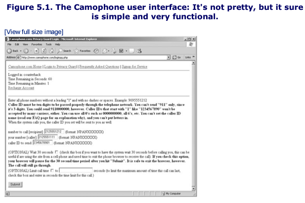

### Defenses Against Social Engineering and Caller ID Spoofing Attacks
User awareness is the best way to defend against social engineering and caller ID spoofing attacks is user awareness. 

Never give sensitive data over the phone no matter how friendly or urgent the request. 

Caller ID information cannot be trusted as a sole method for verifying someone's identity. 

## Physical Break-In 
Some attackers if possible, will break into the area they are attempting to attack. Just by plugging into the ethernet in the wall, attackers can begin scanning the network. 

Some attackers can even join companies just to steal their data. 

### Defenses Against Physical Break-Ins
Security badges issued to each and every employee are an obvious and widely used defense against physical break-in. 
- Make proper badge checks a deeply ingrained part of your organization. 

Access control vestibules work well for more sensitive areas

Track computer systems

Add locks to computer room doors and wiring closets. 

Consider installing a filesystem encryption tool on laptop machines with sensitive data

## Dumpster Diving 
Dumpster diving is a variation on physical break-in that involves rifling through an organization's trash, looking for sensitive information. 

### Defenses Against Dumpster Diving
Paper and Media shredders are the best defense against dumpster diving.


# Search The Fine Web (STFW)
In the computer industry if you ask someone a question with an obvious answer, you might be told to "RTFM" (Read the Fucking Manual)

Searching the Fine Web (STFW) is a great strategy for an attacker

## The Fine Art of Using Search Engines and Recon's Big Gun: Google
To maximize the usefulness of search engines in computer attacks, attackers must carefully formulate their queries. There are four important elements of Google's technology:
1. The Google Bots: These programs, which run on Google's own servers constantly surf the Internet, acting as Google's sentinels. They crawl Web site after Web site, following hyperlinks to retrieve information about what's out there. 
2. The Google Index: Based on what Google bots retrieve, Google creates a massive index of web sites. When you submit a query to Google, this index is what it searches through. Using an algorithm called PageRank, google associates similar web pages together 
3. The Google Cache: As the Google bots scour the Internet, they bring back a copy of the text of each document in the index, pulling in up to 101k of text for each page, including HTML, DOC, PDF, PPT, and a variety of other file types. These documents are stored in the Google cache, an immense amount of information represents Google's very own copy of a large portion of the Internet. 
4. The Google API: In addition to the normal Web-page interface for Google that was designed for us humans. Google has also created a method for computer programs to perform searches and retrieve results, known as the Google API. A program can create an Extensible Markup Language (XML) request and send it to Google using a protocol called Simple Object Access Protocol (SOAP). To use the Google API for your own programs or with programs written by others, you need a Google API key. 

Attackers try to maximize the precision of their search, using a variety of search directives and other search operators to retrieve items of max value. 

When searching Google with or without these directives, keep in mind these additional important tips:
- Remember to avoid putting a space between the directive and at least one of your search terms. The items should be smashed together (i.e., ```site:www.counterhack.net``` is good, but ```site wwwcounterhack.net``` with a space in it is usually bad). 
- Google searches are always case insensitive
- Google allows up to a maximum of 10 search terms, including each directive your provide. In other words ```site:counterhack.net skoudis``` contains two search terms, not one or three.

**[INSERT PICTURE HERE ON PAGE 199]**

Things get really interesting when attackers combine various search directives and operators to find useful information about given targets. For example, suppose an attacker wants to go after a large financial institution called the Freakishly Big Bank with a Web site located at ```www.thefreakishlybigbank.com``` The attacker could perform a search like this:
```site:thefreakishlybigbank.com filetype:xls ssn```

This search causes Google to look for all Microsoft Excel spreadsheets on the bank's site that contain "ssn", a common abbreviation for Social Security Numbers

Now instead of looking inside of spreadsheets or presentations, suppose the attacker wants to scour an entire site for references to SSN information. This type of search can be best done as follows:
```site:thefreakishlybigbank.com ssn -filetype:pdf```

The ```-filetype:pdf``` on the end filters out all PDF documents. Most PDFs are just forms for customers to fill out so not a whole lot of information there. 

Another useful alternative involves looking for active scripts and programs on the target site, including Active Server Pages (ASPs), Common Gateway Interface (CGI) scripts, PHP Hypertext Preprocessor (PHP) scripts, JavaServer Pages (JSPs) and so on. Given that there could be 1,000 or more of these types of pages in a given domain, I typically search for each one individually, looking for:
```
site:thefreakishlybigbank.com filetype:asp
site:thefreakishlybigbank.com filetype:cgi
site:thefreakishlybigbank.com filetype:php
site:thefreakishlybigbank.com filetype:jsp
```

With these results, I've harvested the target domain for various forms of user-activated scripts and programs that run on the Web site itself, each of which might have a security flaw. 

Johnny Long maintains a list of more than 1,000 useful searches to find vulnerable servers in his Google Hacking Database (GHDB) located at ```http://johnny.ihackstuff.com``` <-- You will need a wayback machine to reach this site

There are tools that automate Google recon for vulnerabilities. These tools are essentially nifty graphical front ends that query Google using its API and your Google API key to look for evidence of vulnerabilities in a site of your choosing. 
- Two of the most popular tools in this category are Foundstone's SiteDigger ```www.foundstone.com/resources/proddesc/sitedigger.htm``` and Wikto by Roelof (```www.sensepost.com/research/wikito)``` 
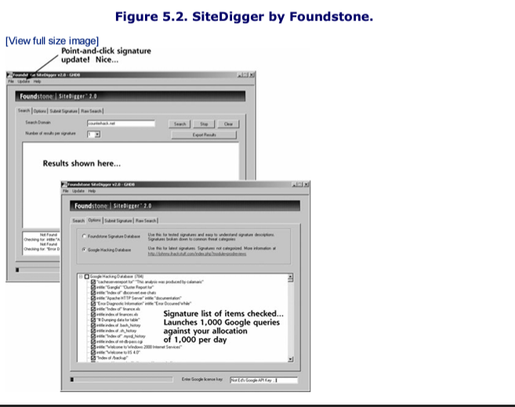

Google can be used for looking at flights as well
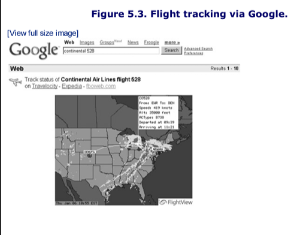

## Listening in At The Virtual Water Cooler: Newsgroups 
Another realm with great promise for an an attacker involves Internet newsgroups so frequently used by employees to share information and ask questions. News-groups often represent sensitive information leakage on a grand scale. Employees submit detailed questions to technical newsgroups about how to configure a particular type of system, get around certain software coding difficulties, or troubleshoot a problem. Attacks love this kind of request because it often reveals sensitive information about the particular vendor products a target organization uses and even the configuration of these systems.

## Searching An Organization's Own Web Site
In addition to search engineer recon and newgroup analysis, smart attackers also look extra carefully at a target's own Web site. Web sites often include very detailed information about the organization, including the following:
- Employees' contact information with phone numbers. These numbers can be useful for social engineering, and can even be used to search for modems in a war dialing exercise
- Clues about the corporate culture and language: Most organizations' web sites include significant information about product offerings, work locations, corporate officers, and star employees. An attacker can digest this information to be able to speak the proper lingo when conducting a social engineering attack. 
- Business partners: Companies often put information about business relationships on their web sites. Knowledge of these business relationships can be useful in social engineering. Additionally, by attacking a weaker business partner of the target organization, an attacker might find another way into the target
- Recent mergers and acquisitions: Many organizations forget about security issues or put them on the backburner during a merger. 
- Technologies in use: Some sites even include a description of the computing platforms and architectures they use. For example, many companies specifically spell out that they have built their infrastructure using Microsoft IIS Web servers and Oracle databases. 
- Open Job Requisitions: This type of data is really useful for attackers. If your websites says you are looking for NetScreen firewall administrators, it says two things: First, you are likely running NetScreen firewall. Second, and perhaps even more important, you don't have enough experienced staff to run your existing firewalls.

## Defenses Against Search Engine and Web-Based Reconnaissance
Start at home, by establishing policies regarding what type of information is allowed on your own Web servers. 

You can tell google not to index pages on your website. Google respects the following markers for data:
- The robots.txt file is a world-readable file in a Web server's root directory that tells well-behaved Web crawlers not to search certain directories, files, or the entire Web site. 
- The ```noindex``` meta tag tells well-behaved crawlers not to include the given Web page in an index
- The ```nofollow``` meta tag tells well-behaved crawlers not to follow links on a page in an effort to find new pages
- The ```noarchive``` meta tags says that a given page should be indexed (so it can be searched for) but should not be cached
- The ```nosnippet``` meta tag specifies that Google shouldn't grab summary snippets of your Web page for display with search results on Google

An example of some of these tags that you could place at the top of a Web page to keep it out of Google's index and archive would be as follows:
```<meta name="robots" content="noindex,noarchive"```

# Whois Databases: Treasure Chests of Information
Other useful sources of information are the various whois databases on the Internet, which act like Internet white pages listings. 
- These databases contain a variety of data elements regarding the assignment of domain names, individual contacts, and even Internet Protocol (IP) addresses. 
- When your organization establishes an internet presence for a World Wide Web server, e-mail servers, or any other services, you setup one or more domain names for your organization wit ha registration company known as a registrar. 

## Researching .com, .net .org, and .edu Domain Names
Registrars for domain names ending with .com, .net, .org, and .edu are commercial entities, competing for customers to register their domain names. The Internet Corporation For Assigned Names and Numbers (ICANN) has established an accreditation process for new and competing registrars. 
- Some registrars charge a handsome price and offer a variety of value-added services, whereas others are bare bones, offering free registration in exchange for ad space on your Web Site.

**List of Accredited Registrars on the InterNIC site**
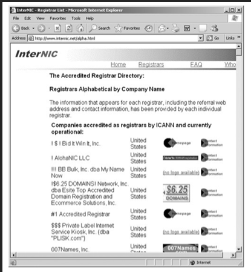


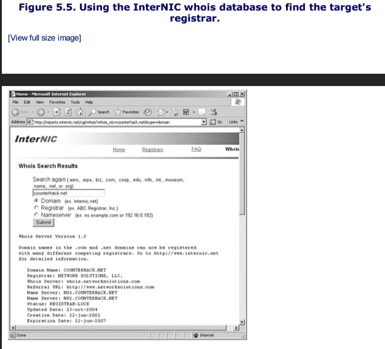

## Researching Domain Names Other Than .Com, .Net, .ORG, .EDU, .AERO, .ARPA,.BIZ, .COOP, .INFO, .INT, and .MUSEUM
For organizations outside of the US, one of the most useful research tools is the Uwhois Web site. This site includes a front end for registrars in 246 countries, ranging from Ascension Island (.ac) to Zimbabwe (.zw). Uwhois points you to the appropriate registrar for any particular country you need to research. 

Additionally, for US military organizations, a quick trip to the whois database at ```www.nic.mil/dodnic``` reveals registration information. 


### We've Got Registrar, Now What?
At this stage of reconnaissance, the attacker knows the target's registrar, based on data retrieved from InterNIC, Uwhois, or one of the other whois databases. Next, the attacker contacts the target's particular registrar to obtain the detailed whois entries for the target. 

Using the whois database, you can conduct searches based on a variety of different information including the following:
- Domain name, such as coutnerhack.net
- NIC handle (or contact), by typing a convenient alphanumeric value assigned to each record in the whois database, such as ESI1234
- IP address, by typing the dotted-quad IP address notation, such as 10.1.1.48

**Looking up a domain name at a particular registrar**
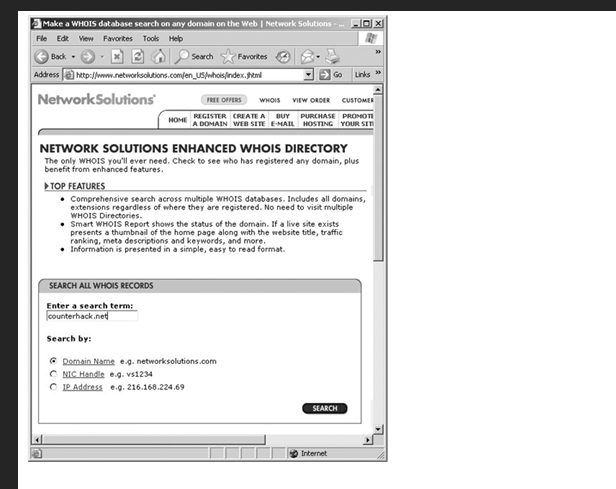

So if the attacker only knows the name of the target, they can use this whois database to search for more information about the given organization, including registered domain names, name servers, contacts, and so on.

**Results of the WhoIs Database**
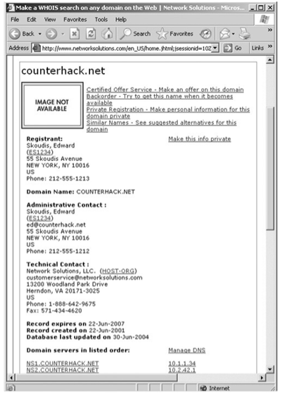

## IP Address Assignments Through ARIN and Related Sites
An organization called the American Registry for Internet Numbers (ARIN) maintains a Web-accessible whois style database that allows users to gather information about who owns particular IP address ranges, based on company or domain names, for organizations in North America, a portion of the Caribbean, and subequatorial Africa. 

So whereas the registrar whois database tells users about particular contact information, ARIN database contains all IP addresses assigned to a particular organization in those geographies. You can access the ARIN whois database at ```www.arin.net/whois/arinwhois.html``` You'll need another wayback machine.

## Defense Against WhoIs Searches
You can't and shouldn't try to defend against WhoIs searches. Its important that we can tie organizations back to their domains and IPs in case their systems are being used in attacks. 


# The Domain Name System
DNS is an incredibly important component of the Internet and another immensely useful source of recon information. DNS is a hierarchical database distributed around the world that stores a variety of information, including IP addresses, domain names, and mail server information. 
- DNS servers also referred to as name servers, store this information and make up the hierarchy
- DNS makes the Internet usable by allowing people to access machines by typing a human-readable name without having to know the IP address. 

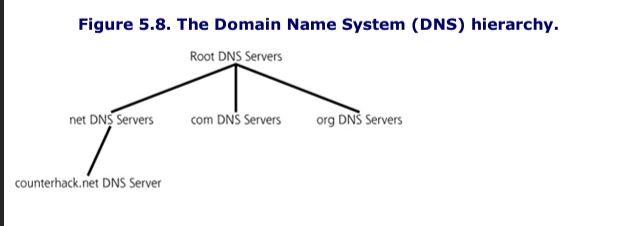

At the top of the DNS hierarchy are the root DNS servers, which contain information about the DNS servers in the next level down the hierarchy. Various authorities around the world maintain and run the 13 root DNS servers on the Internet, which act as a starting point for DNS searches. 

The next level down the hierarchy includes DNS servers for the .com, .net, and .org domains as well as many others. Note that in the DNS hierarchy, the preceding dot (".") is not inlcuded in front of the com, net, and org DNS server names.

Going down the hierarchy another level, we find DNS servers for individual organizations and networks. These DNS servers contain information about other lower level DNS servers, as well las the IP addresses of individual machines. 

Using a process called resolving, users and programs search the DNS hierarchy for information about given domain names. 

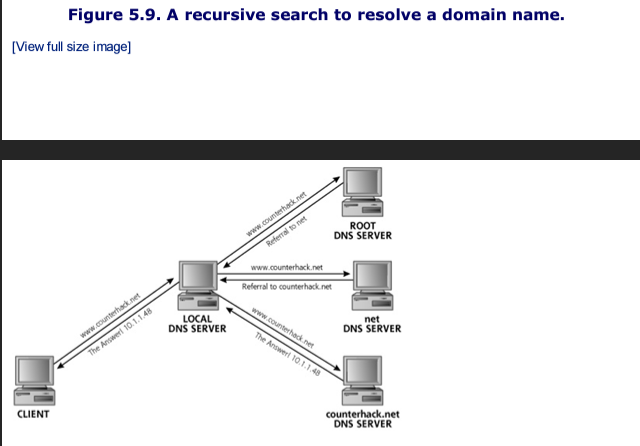
To begin a DNS search for a name like www.counterhack.net, client software first checks a local configuration file (called the hosts file) as well as a local cache on the client machine to see if it already knows the IP address associated with the domain name. 

If not a client sends a DNS request to its local DNS server asking for the IP address associated with the domain name as shown in the figure above. 

If the local DNS server has the information cached from a previous DNS search, or has the required record in its own DNS master files, it sends a response. If the local DNS server doesn't have the information, it resolves the name by doing a search of the DNS servers on the Internet. 
- The most common type of search done by local DNS servers is recursive search where various servers in the DNS hierarchy are systematically queried to find the desired information. 

On a windows machine you can dump your client's DNS cache by typing the command ```ipconfig /displaydns``` at a command prompt shown in the figure below. 
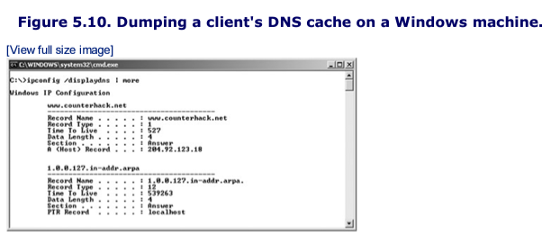

A DNS server just houses a bunch of DNS records like those shown below. For example, the DNS server might have 20 address records for the addresses of mail servers, File Transfer Protocol (FTP) servers, and Web servers, one or two MX records specifying which server will accept mail, and two DNS server records spelling out DNS servers themselves. 
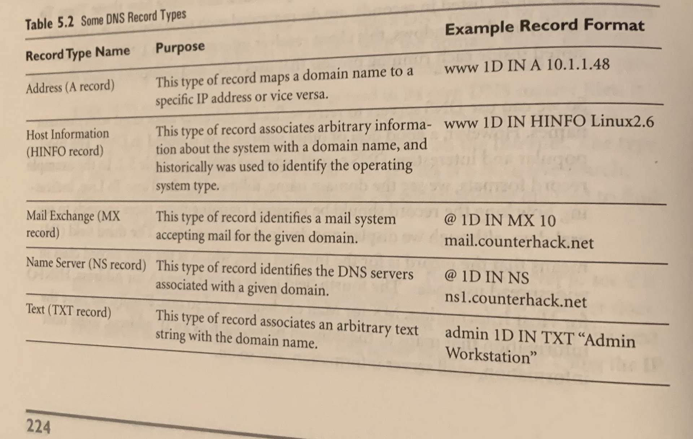

## Interrogating DNS Servers
First, the attacker needs to determine one or more DNS servers for the target organization. This information is readily available in the registration records obtained from the registrar's whois database searches, as discussed in the previous section. 

In the registrar records, these DNS servers for the target organization are listed as name servers and domain servers, depending on the specific registrar. In our example from figure 5.7, the DNS servers have IP addresses 10.1.1.34 and 10.2.42.1. The first is the primary DNS server and  the other is the secondary DNS server. 

Using this DNS server information an attacker has a variety of tools to choose from getting DNS information. 
- One of the most common tools used to querry DNS servers is the ```nslookup``` command, which is included in modern versions of Windows and most variations of UNIX and Linux. 
- By simply typing "nslookup" an attacker can invoke the program and begin interrogating name servers. Attackers typically attempt to perform a zone transfer, an operation that asks the name server to send all information is has about a given domain, a group of information referred to collectively as a zone file. 
- Zone transfers were originally created so secondary DNS servers can get updates from primary DNS servers. 

To conduct a zone transfer, the nslookup command must be instructed to use the target's primary and secondary DNS server, using ```server [target_DNS_server]``` command. Then, nslookup must be instructed to look for any type of record by using the ```set type=any``` directive at the command-line. The zone transfer is initiated by entering ```ls -d [target_domain]```, which requests the information and displays it in the nslookup output. The following commands show a zone transfer for the counterhack.net domain:
```
 $ nsloookup
 Default: Server: evil.attacker.com
 Address: 10.200.100.45
 
 > server 10.1.1.34
 
 Default Server: ns1.counterhack.net
 Address: 10.1.1.34
 
 > set type=any
 > ls -d counterhack.net
 
 1D IN NS server = ns1.counterhack.net
 ssytem1 1D IN A 10.1.1.36
 ...
 
```
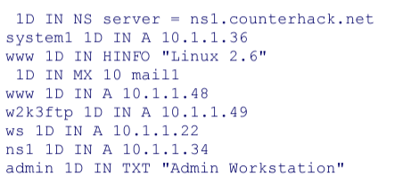
This zone transfer output is abbreviated for readability. Note that using a zone transfer, we have found some extremely interesting information. The first column of our output tells us a bunch of system names. One of these names (w2k3ftp) appears to indicate the operating system type and purpose of the machine. In the last column, we have the payoff: IP addresses, mail server names, and even operating system types. The text record points out an admin workstation, surely a worthwhile target. 

Unfortunately on most modern Linux machines, the nslookup command has been partially incapacitated so it can no longer perform zone transfers. Therefore to run zone transfers you would need another command such as the ```dig``` command built into most Linux distributions. To make dig do a zone transfer, run the dig command like this:
```$ dig @10.1.1.34 counterhack.net -t AXFR```

This command tells dig to query the DNS server located at 10.1.1.34, send a request for information about the counterhack domain and asks for the entire zone file (which is indicated by the -t AXFR syntax)

## Defenses From DNS-Based Reconnaissance
Don't include more information than you have to in DNS. 
- Make sure domain names do not indicate any machine's operating system type or function. 

Next, you should restrict zone transfers. Zone transfers are usually required to keep a secondary DNS server in sync with a primary server. No one else has any business copying the zone files of your DNS server. The primary DNS server should allow zone transfers only from the secondary DNS server. 
- To limit zone transfers, you need to configure your DNS server appropriately. For the most commonly used DNS server, BIND, you can use the allow-transfer directive or the xfernets directive to specify exactly the IP addresses and networks you will allow to initiate zone transfers. 
- Configure firewalls and filtering rules to allow access to TCP port 53 on your primary DNS only from those machines that act as secondary DNS servers. While DNS uses UDP 53, TCP is what is used for zone transfers. 
- Don't allow the secondary DNS server to accept zone transfers from anyone

Employ a technique called split DNS to limit the amount of DNS information about your infrastructure that is publicly available. The general public on the Internet only needs to resolve names for a small fraction of the systems in your enterprise, such as external Web, mail, and FTP servers. There is no reason to publish on the internet DNS records for all of your sensitive internal systems. 
- A split DNS allows you to separate the DNS records that you want the public to access from your internal names. 
- The figure below displays a split DNS infrastructure, the internal DNS is configured to forward requests from internal users for external machines to the external DNS server. The Internal DNS acts rather like a proxy server getting a request from the inside and forwarding it out. 
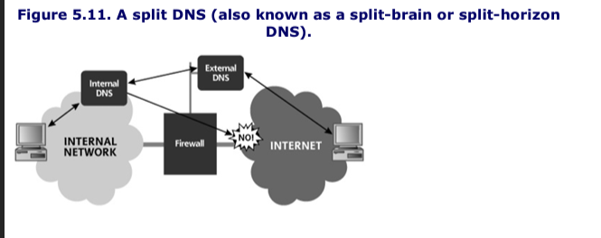
## General-Purpose Reconnaissance Tools

### Sam Spade: A general Purpose Recon Client Tool
AS OF 2004 NO LONGER IN SERVICE 
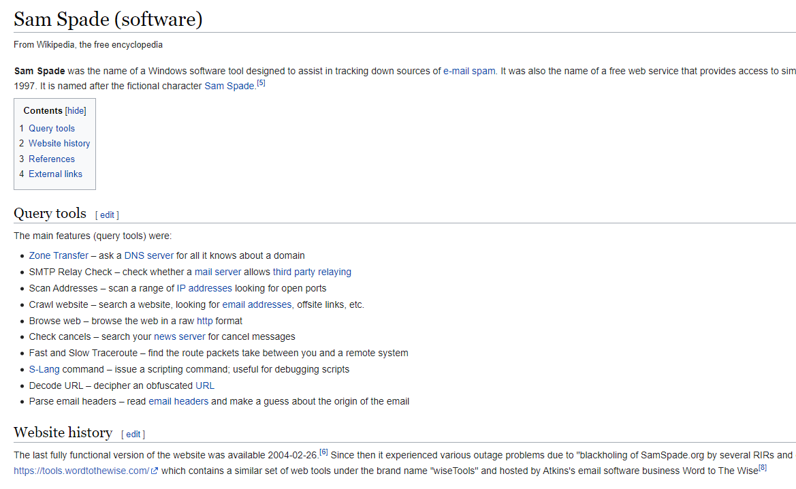

### Web-Based Reconnaissance Tools: Research and Attack Portals
Some of the most interesting Web-based reconnaissance and attack tools include the following:
- www.samspade.org
- www.dnsstuff.com
- www.traceroute.org
- www.network-tools.com
- www.cotse.com/refs.htm
- www.securityspace.com
- www.dslreports.com/scan

David Rhoades has created a web site called AttackPortal.net featuring a searchable database with more than 100 different Web-based recon and attack tools like those listed previously. 
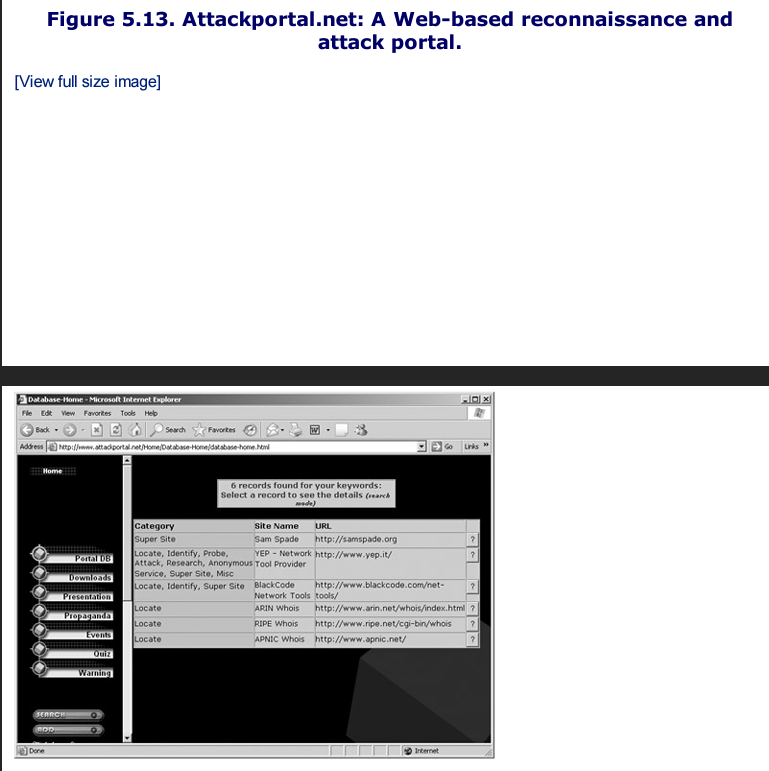


# Summary
Many attacks start with a recon phase, whereby an attacker tries to gain as much information about a target as possible before actually attacking it. 

The Web is a cornucopia of useful info for an attacker. Many orgs put info on their sites that can be quite valuable to an attacker, such as employees' contact information, business partners, and technologies in use. Attackers use web search engines, especially Google to research targets, gaining knowledge about aspects of and events in the target organization. 

Whois databases provide information about a target's Internet addresses, domain-names, and contacts. The InterNIC provides a whois database from .com, .net, .org and several other top-level domain names. 