 # Notes
After the recon phase, the attacker is armed with some vital information about the target infrastructure: a handful of telephone numbers, domain names, IP addresses, and technical contact information--a very good starting point. Most attackers then use this knowledge to scan target systems looking for openings. This scanning phase is akin to a burglar turning doorknobs and trying to open windows to find a way into a victims house

This phase heavily favors the attackers. 

# War Driving: Finding Wireless Access Points
War driving is where attackers search a target organization for accessible and unsecured Wireless Local Area Networks (WLANs). 

Many users leave their routers unsecure with default settings and employ poor or nonexistent security. 

Even though a standard access point typically requires a user to be within approximately 100 meters or less to send traffic across a LAN, war-driving attackers don't have to reliably send traffic; they just need to merely detect the LAN. 
- Using a high-gain antenna, various wireless researchers have conducted war-driving exercises at distances of more than two kilometers! 

Most war-driving attackers use omnidirectional antennas because they capture signals from all over, letting the attacker harvest a large number of possible wireless targets. 
- Some attackers will use directional antennas to hone-in on a target
- The best attackers will choose suitable antennas based on their mission.

The war driver's immediate goal is to locate WLANs and determine their Extended Service Set Identifier (ESSID), an up-to-32-character name of a given WLAN.
- ESSID is not a security feature like a password
- The ESSID is transmitted across the air in clear text by access points and all wireless cards using the access points. 

Access points automatically transmit beacon packets approximately every 100 milliseconds to synchronize timing and frequency information. 
- These beacons, which are sent in clear text, carry the ESSID in most default configurations. Thus, a war driving attacker can retrieve the ESSID quite easily by just listening for the beacons. 
- The bottom line is you should NEVER rely on ESSID for security

ESSIDs are not the only way of referring to a WLAN or its constituent elements. Service Set Identifiers (SSIDs) come in two flavors: 
- ESSIDs: refers to to the name of a WLAN configured into the access point
- BSSID is set to the hardware address (that is, the media access control (MAC) address) of a wireless access point or a client. 
- The collective term SSID is used to refer to either or both types of SSID 

There are 3 techniques to finding wireless access points and determining their ESSIDs:
1. Active Scanning
2. Passive Scanning 
3. Forcing De-authentication

## War Driving Method 1: Active Scanning-- Sending Probe Packets with NetStumbler
One of the most straightforward methods for war driving involves broadcasting 802.11 probe packets with an ESSID of "Any" to see if any nearby access points or clients send a probe response containing the ESSID of the WLAN. 

NetStumbler, a free (but closed-source) war-driving tool written by Marius Milner, employs this active scanning approach.
- Net Stumbler detects 802.11a, b, and g networks and clients, optionally tying in Global Positioning System (GPS) data from a GPS receiver attached to the war-driving computer to determine the physical location of the NetStumbler machine using geosynchronous satellites when it discovers each WLAN. 
- NetStumbler records the lat/long coordinates of each discovered access point

Below is the result of a single 1-hour war driving exercise in Manhattan NY. 


As you can see, NetStumbler gathers the MAC address, ESSID, wireless channel, and relative signal strength of each access point it discovers. 
- If configured properly, NetStumbler can also grab the IP address associated with the target network based on the underlying operating system sending out a DHCP request and receiving a response. 
- The lock icon means the access point uses a form of Wired Equivalent Privacy (WEP), the flawed encryption protocol that tries to protect the WLAN. 

Because NetStumbler works solely by sending out a probe request with "Any" as an ESSID, access points configured to ignore such probes are invisible to NetStumbler. 
- Another limitation of NetStumbler is the fact it is too nosiness. The constant "any" probes will tip off most IDS/IPS 

## War Driving Method 2: Listening For Beacons and Other Traffic with Wellenreiter 
A fair stealthier and more reliable way of discovering WLANs involves putting the wireless card into so-called rfmon mode, also known as monitor mode, so that it sniffs all wireless traffic from the air, a more passive way of discovering wireless systems. 

Wellenreiter, grabs wireless packets over transit without associating with any of them. Even if the wireless information is encrypted, the ESSID information itself is still sent in clear text, so the attacker can nab the ESSID from any user transmitting data cross the WLAN. 
- It sniffs wireless traffic, capturing all data sent, including the entire wireless frames of all packets with their associated SSIDs. 
- The user can configure Wellenreiter to dump all captured wireless packets into a tcpdump or Ethereal packet capture file. 
- Like NetStumbler, Wellenreiter also interfaces with GPS devices, storing the physical location of the war-driving computer when each WLAN is detected.

Wellenreiter first harvests ESSIDs using rfmon mode. Once it discovers a wireless access point or client, Wellenreiter then listens for ARP or DHCP traffic to determine the MAC and IP address of each discovered wireless device. 
- If an access point is configured to omit its ESSID from its beacons, and no other users are sending traffic to the access point, Wellenreiter will not be able to determine the ESSID. 

Kismet is another sniffer like Wellenreiter. It can identify the presence of wireless networks and record their traffic on an entirely passive basis. 
- While Kismet is designed for detailed packet capture and analysis, Wellenreiter is still designed for war driving. 
- Good to use both tools in one's arsenal 


## War Driving Method 3: Forcing De-authentication With ESSID-Jack
There is a third way to get the SSIDs from WLANs, implemented in a tool called ESSID-Jack, part of the Air-jack toolkit written by Mike Lynn. 
- Suppose we have a WLAN that is configured to ignore probes with an ESSID of "Any" and to omit ESSID information from beacons, while also not sending traffic with any ESSID information in it.
- There are some clients who have previously authenticated to this access point 

With ESSID-Jack, the attacker first sends a wireless de-authenticate message to the broadcast address of the LAN in Step 1, spoofing the MAC address of the access point. The attacker must obtain this MAC address for the attack to work, typically grabbing it from various beacon, management, or data frames using a wireless sniffer such as Wellenreiter or Kismet. Because wireless clients accept wireless control messages from access points without any authentication, the attacker can force the clients off the WLAN by merely spoofing the access point's MAC address in the de-authenticate message. 

After being knocked off the WLAN, in step 2, the clients then automatically try to re-associate themselves to the access point, using the appropriate ESSID for the access point. The client sends an association frame with the intention of joining the wireless network. This association frame contains the ESSID, in clear text.

In Step 3, the attacker sniffs the air for the association frame and collects the ESSID information. In essence, the attacker is injecting traffic into the LAN (the de-authenticate message) to get useful information out of it (the ESSID). 


## War Driving Defenses
A multipronged approach is the best course of action.

### Setting the ESSID
First, set the ESSID to a value that doesn't bring unwanted attention to your network.

### Configuring Access Points and Using Wireless Security Protocols
Next, configure your access points to ignore probe requests that don't include the ESSID, and set them up to omit the ESSID from beacon packets.
- Attackers can still obtain SSID information, but this evades the more casual war-drivers

Next, require some form of strong authentication to your access points. It's crucial to note that wireless card MAC addresses are not a good form of authentication at all, they can be easily spoofed.
- In Linux/UNIX you can change your MAC address using the ifconfig commands as follows
```
# ifconfig [interface_name] hw ether [desired_MAC_address]
```

Instead of MAC addresses, require a stronger form of authentication, based on cryptographically sound protocols.
- The original 802.11 cryptographic solution, WEP, was found to be significantly flawed, with a variety of cryptographic mistakes in its implementation, including problems with the reuse of cryptographic initialization vectors and crypto key managements. WEP by itself is not secure enough for transmitting sensitive information or keeping bad guys off of WLAN in a hostile environment.  
- Newer security protocol WPA (Wi-Fi Protected Access) improves security over the standard WEP (This is outdated, we are at WPA3 now)
-
## Going All The Way With A VPN
In addition to improving authentication, most VPNs provide a layer of encryption to prevent interlopers from grabbing traffic and violating users' confidentiality. 
- VPN encryption applies a layer of protection on top of the wireless protection inherent in WPA and 802.11i. 
- Most organizations have deployed a VPN for employee access across the big, scary internet. 
- The VPN device should be configured to drop all unauthenticated and unencrypted traffic. 
- When a user accesses your network through a wireless access point, all traffic will be encrypted at the user's machine by the VPN client, transmitted across the wireless hop in a strongly authenticated and encrypted fashion, received by the access point, and then directed to the VPN gateway, where it can be authenticated and decrypted before entering your network. 

### Detecting the Bad Guys
Additionally, there are several solutions to identify wireless attackers in your midst. Wireless Intrusion Detection Systems (IDs) and services, marketed by AirDefense, AirMagnet, and IBM, look for unusual messages sent by intruding wireless clients (including ESSID-less probe broadcasts and unexpected de-authenticate messages) by deploying wireless sensors throughout your environment. 
- Kismet, the great free wireless sniffer, also includes detection capabilities for telltale war-driving packets and wireless intrusion attempts.

### A Little Physical Protection Never Hurt Anyone
Turn down the transmit power for access points near your buildings' perimeters, such as near exterior walls or top floors. 
- You can also deploy directional antennas to control signal bleed out of the building from these perimeter wireless devices, in effect bathing only trusted areas in wireless signal. 
- You can theoretically paint your walls and windows to block excess wireless signal from bleeding through the building

# War Dialing: Looking For Modems In All The Right Places
Although hacking WLANs is popular sport, don't ignore the still widely used attack vector of unsecured modems in your infrastructure, discovered through a process called war dialing. 
- In war dialing, the attacker searches for a modem in the target's telephone exchange to access to a computer on their network. 

## A Toxic Recipe: Modems, Remote Access Products, And Clueless Users 
Often, unaware users connect a modem to their desktop computer in the office so they can access the machine from home without having to mess with finicky VPNs or limiting firewalls. 
- These users sometimes employ PC remote control products, such as RealVNC's Virtual Network Computing (VNC) software, Symantec's pcAnywhere, DameWare's Mini Remote Control, or Laplink's Gold program so they can have complete control of the machine from home. 
- Users set up a modem and remote control product because they simply want to get more work done. However, if they aren't careful, they could jeopardize the most carefully designed security controls on your network. 

Many users configure these tools with very easy-to-guess passwords, allowing an attacker to run an automated password-guessing tool to gain access.
- To gain complete access to the target machine, all the attacker has to do is find the modem on the given telephone line using a war dialer, recognize the connect string from the remote control product, and connect using the appropriate remote control client. After guessing the password, the attacker has total control over the machine, and can then try to attack the network to which the victim machine is connected. 

## SysAdmins and Insecure Modems
Clueless users are not the only offenders here. Frustratingly, system administrators, vendors, and service providers sometimes leave systems connected to modems with little or no security. 
- Most organizations give modern access to vendors and service providers so they can troubleshoot device remotely via telephone, even if the existing IP network goes down. 

## Finding Telephone Numbers to Feed Into A War Dialer
War dialers require a range or series of numbers to dial, using a telephone exchange associated with a particular target network. 

There are many options for determining the phone numbers of a target organization, including the following:
- The Internet
- Whois databases
- An organizations website
- social engineering

Attackers scour these sources looking for individual telephone numbers. They then war dial all telephone numbers in a range centered around the discovered numbers, trying 1,000 numbers before and after to find modems. 

### THC-Scan 2.0 
THC-Scan is one of the most full-featured, free war-dialing tools in widespread use. 


On the THC-Scan screen, the modem window on the left shows the commands sent from THC-Scan to the system modem, in Hayes-compatible modem lingo with its familiar ATDT syntax. The log window shows what types of lines are discovered, the time time of discovery, and other important messages from the system. 


When THC-Scan is running, it can rely on the local modem on the war-dialing machine to determine whether the dialed line has a modem, is busy, or times out because a pesky human answered the phone. 

### The War Dialer Provides a List of Lines with Modems: Now What?
After the scan, the war dialer logs contain a list of the phone numbers with modems and the results of nudging each modem.
- The nudging function of the war dialer often reveals a warning banner or login prompt.
- Many systems' prompts explicitly state what platform they are running 

THC-Scan relies on the attacker to go through the logs and recognize the types of system running at target numbers. It does not automatically identify the system type, instead relying on the attacker's own knowledge or a database of known system types.
- Attackers often compile and share long lists of various types of systems' nudge behavior, ranging from variants of UNIX to mainframes to remote access products. 
- A commercial war-dialing tool, Sandstorm Enterprises' PhoneSweep, includes automated system identification, eliminating the need for a list of system nudge behaviors for those users willing to pay for PhoneSweep. 

Based on the war-dialer output, the attacker might find a system or two without passwords. 
- The attacker can connect to such systems, look through local files, and start to scan the network (we discuss more about scanning and exploring networks later). 
- If all of the discovered systems with modems are password protected, the attacker will then resort to password guessing, firing password after password at the target in an attempt to log in. 

## Defenses Against War Dialing 
As with most solid defenses, a strong policy is the best place to start.

## Modem Policy
A clear, documented modem and dial-up line policy is a crucial first line of defense against war dialers. 
- Tell your user population that they cannot use modems on desktop machines in your office facilities. 
- All dial-up remote access must have a centralized modem pool, which is subject to audit to ensure its security. 
- Better yet, avoid modems all together, and rely on secure VPN instead.
- Train users regarding the modem policy and the use of secure remote access services, such as your corporate modem bank or VPN

### Dial-Out Only?
If a user has a business need for a modem to dial out of your network only, you can configure the PBX so that a particular telephone line supports outgoing calls only.
- No incoming calls will be allowed to that line, preventing an attacker from discovering the modem and gaining access.
 
### Find Your Modems Before the Attackers Do
In addition to a strong modem policy and modem registration, you should periodically conduct a war-dialing exercise against your own telephone numbers.
- If you find the renegade modems before an attacker does, you can shut them down and prevent an attack. 

When war dialing against your own network, how do you determine which telephone numbers to dial?
- At a minimum, you should get a list of all analog lines from your PBX.

A major concern in finding all of your incoming telephone lines involves those lines not accessible through your PBX.
- A user might have called the telephone company and requested a phone line to be installed directly to one of your buildings.


# Network Mapping
At this stage of the attack, bad guys sit in one of three places:
1. On the other side of the Internet, staring at the target DMZ discovered via thorough reconnaissance
2. Hanging off of a WLAN, identified through war driving 
3. Connected to a system, with a modem, found during a war-dialing attack

At this point, most attackers want to scope their prey, determining the addresses of additional targets and gaining an understanding of the network topology from where they sit. 
- Attackers will start wherever they can in your network

Regardless of where the attacker sits, the same tools and overall methodology are used to map a target network. 

## Sweeping: Finding Live Hosts 
To build an inventory of accessible systems, attackers sometimes attempt to ping all possible addresses in the target network to determine which ones have active hosts. 

Because many networks block incoming ICMP messages, an attacker could alternatively send a TCP packet to a port that is commonly open, such as TCP port 80 where web servers typically listen
- If the port is open, the system at the target address responds with a SYN-ACK packet, indicating that there is a machine at that address. 
- An attacker could also send a UDP packet to an unusual port on the target system, if the port is closed many machines respond with an ICMP Port Unreachable message

In essence, we have three methods for identifying whether a host is alive: ICMP pings, TCP packets to potentially open ports, and UDP packets to likely closed ports 

## Traceroute: What are the Hops?
Once attackers determine which hosts are alive, they want to learn your network topology. They use a technique called tracerouting to determine the various routers and gateways that makeup your network infrastructure. 
- Tracerouting relies on the Time-to-Live (TTL) field in the IP header. 
- According to the Request for Comments (RFC) that defines IP, this field is decremented by each router that receives the packet based on the number of seconds the router takes to route the packet or one, whichever is more. 

So how does the TTL field work? When a router receives any incoming IP packet, it first decrements the value in the TTL field by one. 
- For example, if the incoming packet has a TTL value of 29, the router will set it to 28. Then before sending the packet on toward its destination, the router inspects the TTL field to determine if it is zero.
- If the TTL is zero, the router sends back an ICMP Time Exceeded message to the originator of the incoming packet, in essence saying "Sorry, but the TTL wasn't large enough for this packet to get to its destination."
- The ICMP Time Exceeded message originates at the router that dropped the packet, which transmits it to the original sender. 
- The TTL field was created so that packets would have a finite lifetime, and we wouldn't have phantom packets caught in routing loops, circling the Internet for eternity. 

We can use this TTL feature to determine the paths that packets take across a network. By sending a series of packets with various low TTL values and waiting for the Time Exceeded responses, we can trace all routers from a given source to any destination. That's what tracerouting is all about. As shown below, we'll send a packet from a source machine with a TTL of one. 


The first router receives the packet, decrements the TTL to zero, and sends back an ICMP Time Exceeded message. The source address of the ICMP Time Exceeded message is the IP address of the first router on the path to our destination. 

Now we send a packet with a TTL of two. The first router decrements the TTL to one and forwards the packet. The second router in the path decrements the TTL to zero and sends an ICMP Time Exceeded message. 

This process continues until I reach my destination. At this point, we'll know every hop between us and the target.


To automate this process, most Unix varieties include a version of the traceroute command, which sends UDP packets with incremental TTL values, while looking for the ICMP Time Exceeded message in return. Modern Windows systems also include the same type of tool, but it is named tracert, to conform to the ancient eight-character naming structure from MS-DOS. 
- To be different, tracert sends out ICMP packets (not UDP packets like UNIX) with incremental TTL values, waiting for the ICMP Time Exceed Message to come back. 

The figure below shows the output from the Windows tracert command. Note that each line of the 11 hops between my machine and the destination are shown on the right side of the screen. 


Attackers use traceroute to determine the path to each host discovered during the ping sweep. By overlaying results form tracerouting to each target and reconciling the various routers and gateways, an attacker can re-create the target network topology. 
- Using this information the attacker can create a network diagram like the figure below.


## Defenses Against Network Mapping 
You need to filter out the underlying messages that these tools rely on by using firewalls and the packet filtering capabilities of your routers. 
- At your internet gateway, you should block incoming ICMP messages, except to hosts that you want the public to be able to ping

Additionally, you might want to filter ICMP Time Exceeded messages leaving your network to stymie an attacker using traceroute. 
- Although this filtering inhibits users and network management personnel who want to use traceroute, it also limits the information an attacker can discern about your environment. 
- If you ever see a bunch of stars (******) and not an ip address, that's because it isn't responding with an ICMP Time Exceeded message.

# Determining Open Ports Using Port Scanners
At this point in the attack, the attacker knows the addresses of live systems on the target network and has a basic understanding of the network topology. Next, the attacker wants to discover the purpose of each system and learn potential entryways into the machines by analyzing which ports are open. 

Each machine with a TCP/IP stack has 65,536 TCP ports and 65,536 UDP ports.
- Every port with a listening service is a potential doorway into the machine for the attacker, who carefully takes an inventory of the open ports using a port-scanning tool.
- Web servers typically run on port 80, DNS on port 53 

Using a port scanner, the attacker sends packets to various ports to determine if any service is listening there. 

Most port-scanning tools can scan a list of specific ports, a range of ports, or all possible TCP and UDP ports. In an attempt to avoid detection by sending fewer packets, the attacker might choose to scan a limited set of ports, focusing on the ones associated with common services like telnet, FTP, e-mail, Web traffic, and various Windows file and print sharing services.  Alternatively, an attacker might develop a complete inventory of ports to determine every possible way into a system.

## NMAP: A Full-Featured Port-Scanning Tool
Nmap, the most popular port-scanning tool in the world, was created and is maintained by a skilled software developer named Fyodor. 
- Nmap runs on most distributions of Unix/Linux, and Windows 

Most users activate Nmap and use it from the command line. However, a very capable GUI front end has been created, called the Nmap front end (Nmapfe)


When scanning for open ports, the scanning system sends packets to the target to interact with each port. What type of packets does the scanning system send and how does the interaction occur? 
- The types of packets and the modes of interaction depend on the type of scan being conducted.
- The numerous types of scanning supported by Nmap are summarized below.


## Types of Nmap Scans
All legitimate TCP connections are established using a three-way handshake 

In 3-way handshakes, the initiating system sends a packet with some inital sequence number (ISNa) and the SYN TCP control bit set. 

If a service is listening on the port, the destination machine resopnds with a packet that has both the SYN and ACK control bits set, an acknowledgement of ISNa+1, and an initial sequence number for responses (ISNb). 

On receiving this SYN-ACK packet, the initiator finishes the three-way handshake by sending an ACK packet, including an acknowledgement of the recipient's sequence number, ISNb+1. 

At this point the three-way handshake is complete. Sequence numbers will continue to increase with each packet sent. 


Given this understanding of TCP, we next analyze some of the scan types supported by Nmap. 

### The Polite Scan: TCP Connect
TCP Connect scans, sometimes called "plain vanilla" scans, attempt to complete the TCP three-way handshake with each target port on the system being scanned. 
- Because they are the most polite scan, adhering to the defined TCP specifications, there is little chance a Connect scan will crash the target system.
- They could still flood a target
- To conduct a connect scan, the attacker's system sends out a SYN and awaits a SYN-ACK response from the target port. 
- If the port is open, the scanning machine completes the three-way handshake with an ACK, and then gracefully tears down the connection using FIN packets 

If the target port is closed, the target returns no SYN-ACK response. For closed ports, the attacker's system receives no response, a RESET packet, or an ICMP Port Unreachable packet, depending on the system type and the target network configuration. **Any of these messages means the port is closed**.

Connect scans are very easy to detect. A complete connection is made to the end system, which might record the connection in its logs if full connection log is activated.
- If an attacker scans a web server, the web server's log file indicates that a connection was opened from the attacker's IP address. 

### A Little Stealthier: TCP SYN Scans
Whereas Connect scans follow the TCP three-way handshake completely, SYN scans stop two-thirds of the way through the handshake.
- SYN scans invovle the attacking machine sending a SYN to each target port.
- If the port is open, the target system sends a SYN-ACK response.
- The attacking machine will then send a RESET packet, aborting the connection before it is completed.
- **In a SYN scan, only the first two parts of the three-way handshake occur**

If the target port is closed, the attacker's system receives no response, a RESET packet, or an ICMP Port Unreachable packet, again depending on the target machine type and network architecture. 

There are 2 primary benefits to SYN scans over Connect scans.
1. SYN scans are stealthier, in that most end systems do not record activity in their logs because a true connection does not occur. (They still can be recorded by IDS/IPS, firewalls etc.)
2. A second advantage of SYN scans is speed. Connect scans require sending more packets and waiting for the entire three-way handshake and connection tear down to complete. SYN scans require sending only SYN packets, and waiting only for the SYN-ACK. 

One area of concern with SYN scans is the possibility that the target system could become flooded with outstanding SYNs, resulting in an accidental DoS attack. 
- Nmap sends the RESET packet quickly to help prevent this, but it still could overwhelm older systems. 

### Violating the Protocol Spec: TCP FIN, Xmas Tree, and Null Scans
Connect scans followed the TCP specification perfectly, TCP SYN scans followed them two-thirds of the way. The FIN, Xmas Tree, And Null scans all violate the protocol by sending packets that are not expected at the start of the connection. 

A FIN packet instructs the target system that the connection should be torn down. However during a FIN scan no connections are established. The target system just sees a bunch of packets arriving saying to tear down nonexistent connections. 
- According to TCP specification, if a closed port receives an unexpected FIN when no connection is present, the target system should respond with a RESET. Therefore RESET indicates that the port is closed. 
- If the port is open and an unexpected FIN arrives, the port sends nothing back. Therefore, if nothing comes back there is a raesonable chance the port is open and listening (although a firewall may have blocked the incoming packet or the response.)

In a similar manner, an Xmas Tree scan sends packets with the URG, ACK, PSH, RST, SYN, and FIN control bits set. 
- If a router or firewall is looking for specific control bits set before it allows packets in, it'll find them in an Xmas Tree scan, becuase they're all lit up with a value of 1. 
- Furthermore, because this combination of bits is not a valid setting according to the RFC that defines TCP, some older IDSs ignore such packets. 

A null scan invovles sending TCP packets with no control bits set.

An xmas tree and Null scan expect the same behavior from the target system as a FIN scan: A closed port sends a RESET, and a listening port sends nothing.

Unfortunately, this technique does not work against Windows-based systems, which don't follow the RFCs regarding when to send a RESET if a FIN, Xmas, or Null packet comes in. For other platforms, these scan types are very useful. 

### Kicking the Ball Past the Goalie: TCP ACK Scans
Like FIN, Xmas Tree, and Null scans, an ACK scan also violates the protocol specification, allowing an attacker to be stealthier and get through some packet filtering devices.
- Packet filters, which can be implemented in routers or firewalls, allow or deny packets based on the contents of their packet headers, both the IP header and the TCP or UDP header. 
- By looking at the source and destination IP addresses, source and destination ports, and TCP control bits, a packet filter determines whether it should transmit a packet or drop it. 

In a common architecture, many networks are configured to allow internal network users to access an external network (most often, the Internet). In this scenario, shown below, an external packet-filtering device allows outbound traffic so that the internal machines can access servers on the external network. 

- This packet filtering device could be a router or firewall supporting traditional packet filtering.  
- For example, if we want to allow outbound Web access (HTTP), users need to make connections from high-numbered source ports on internal machines to destination TCP port 80 on external systems. 
- We define a rule allowing such traffic on the packet-filtering device. 

However, when an internal user accesses the external network, we have to handle the response traffic. 
- We allow outgoing web requests to destination TCP port 80, but how do the Web pages get back in?
- Using a traditional packet filter, we can only filter based on information in the packet headers: the IP address, port numbers, and control bits. WE can't just allow packets to come in if they start at a given source port, because then attackers could simply set their port scanners to use a source TCP port of 80 and scan the entire network 

The resolution implemented in many traditional (nonstateful) packet filters invovles checking the TCP control bits of incoming packets. 
- We will drop all incoming connections that don't have the ACK control bit set.
- All responses to internally initiated traffic, which we ant to allow, will have the ACK bit set. This way no sessions can be initiated from the external network, because they would have a SYN control bit. 
- The middle shows these incoming ACK packets. These packets with the ACK bit set are often referred to as established connection, because they are responses to connections already established using packets from the inside. 


So we have not solved the problem of allowing incoming responses to our outgoing sessions. An attacker could still send packets with the ACK control bit set and bypass the packet filtering. 

The figure below shows how an attacker can conduct an ACK scan to determine which ports through the firewall allow established connection responses. 
- In an ACK scan, Nmap sends an ACK packet to each of the target ports
- If a RESET comes back from the target machine, we know that our packet got through the packet-filtering device, and there appears to be a system at the given address that needs to be scanned.
- When this happens, Nmap classifies the target port as unfiltered in its output, because the packet-filtering device allows established connections to that target port on the internal network. 
- If no response or an ICMP Port Unreachable message is returned, Nmap labels the target port as filtered, meaning that it appears something is obstructing the response, likely a packet filter. 


Unfortunately, different operating systems respond in different manners to ACK packets sent to open or closed ports. Some operating systems send a RESET if the port is open, whereas others send it if the port is closed. Thus, ACK scanning is not useful in determining if a port is open or closed; it is useful in measuring filtering capabilities of simple routers and firewalls, as well as determining which addresses are in use. 

### Obscuring the Source: FTP Bounce Scans
The last thing an attacker wants is for their source IP address to show up in the logs of a target system or network, because an investigator will be able to find the system used to launch the scan. 
- For particularly nasty attacks, an investigator may even call law enforcement, diligent police officers might show up with handcuffs, and the attacker would have a very bad day indeed. 

To obscure their location, attackers sometimes use Nmap's FTP Proxy Bounce scan option, which utilizes an old feature of FTP servers. 
- FTP servers supporting this old option allow a user to connect to them and request that the server send a file to another system
- With this FTP file forwarding feature, an FTP client can request that a file be forwarded to another machine. 
- This feature may be severely outdated

Using this feature, an attacker can bounce an Nmap TCP scan off of an innoncent FTP server to help obscure the source of the attack. As shown in the figure below. 


Nmap opens an FTP control connection to the FTP server configured to support the file-forward feature. Then, the attacker's tool requests that the innocent FTP server forward a file to a given port on the target's system. 

Only by analyzing the FTP server's logs can the true source of the scan be identified. 

### Idle Scanning: An Even Better Way to Obscure The Source Address

Now, suppose the attacker cannot find an FTP server supporting this bounce capability, but still wants to obscure the source of a scan so the target doesn't know the attacker's IP address. 
- Nmap supports a more wider source-obscuring option called Idle scanning

To understand Idle Scanning we need to revisit the IP header format we discussed in Chapter 2. 
- The IP header includes a field named IP Identification (also known as IP ID)
- This field is used to group together a bunch of packet fragments that all belong to one larger packet, so when a large packet is broken into smaller packets they will all have the same IP ID value to tell the end system that they should all be reassembled together into a larger IP packet. 
- The reason we use this is because some network links have better performance with smaller packets, so we let router or other gateway devices fragment packets to achieve better speed and link utilization.

For each packet a system sends, its IP stack must assign a unique number in the IP ID field. 
- If a machine were to generate two different packets with the same IP ID value and send them across the network at the same time, and if both of those packets get fragmented, the end system will try reassembling them together into a single packet, seriously mangling the information.

Many operating systems achieve a unique number for the IP ID field by just incrementing the field by one for each packet that they send. 
- So if the first packet that gets sent has an IP ID of X, the second packet will have an IP ID of X+1

To use idle scanning, the attacker first picks a machine to blame for the attack. 
- The Idle scan makes it appear that this blamed machine launched the scan against the target, from the target's perspective.
- This blamed machine could be any system on the internet that the attacker can send packets to and receive packets from, such as a popular web server, a client machine hanging off of a cable modem, or someone's mail server. 

This blamed machine must have two highly related characteristics:
1. The blamed machine must have a predictable IP ID field (ideally incrementing by one for each packet it sends). Most windows machines will do nicely
2. The blamed machine cannot send much traffic, it has to be idle, which gives this scan type its name.

These two characteristics related in that, if the blamed machine weren't idle, it would send traffic incrementing the IP ID field. 
- The IP ID field wouldn't then be very predictable because it would keep changing for each packet that the blamed system spews out.

Consider the figure below which shows how the attacker gets ready to launch an idle scan.


In Step 1, the attacker sends a SYN packet to the blamed machine. The attacker responds with a SYN-ACK in step 2. This response includes an IP header, with an IP ID field we'll call X . In Step 3, the attacker remembers X. The bad guy might run through steps 1 through 3 a dozen or more times, just to make sure X changes in a predictable fashion. 

Now, on the scan, shown in the figure below, in Step 4, the attacker selects a port that is going to be tested on the target machine. The attacker sends a SYN packet to the target's destination port. The attacker spoofs the source IP address in this SYN packet so that it appears to be coming from the blamed machine. 


If the target port is listening in step 5, the target sends a SYN-ACK response back to the apparent source address of the SYN packet. That is, the target sends a SYN-ACK to the blamed machine if the port is listening. When the blamed machine receives a SYN-ACK out of the blue, it won't understand why the target sent a response for a never-initiated connection.

In Step 6, the blamed machine therefore responds with a RESET. Because it is a RESET packet, the IP ID field on the machine that gets blamed will be incremented, to X+1, if the port is listening. 

Now, if the target port is closed, Step 5 either has no traffic going from the target to the blamed machine, or it sends something like a RESET message. Either way, if the target port is closed, no traffic is sent in Step 6. Therefore the IP ID field will remain at X if the port is not listening. 

In Step 7, the attacker needs to measure the IP ID field on the blamed machine by sending a SYN packet to it. In Step 8, the blamed machine responds with a SYN-ACK. Of course, the SYN-ACK response will increments the IP ID field by one. 

Now, by analyzing the IP ID field from Step 8, the attacker can determine if the port is open or closed on the target. If the IP ID value is X+2, the attacker knows it was incremented once because of Step 7. Therefore, it must have been incremented another time. Because the blamed machine was idle, it was likely incremented because Step 6 occurred and included a RESET packet. This means that the port is therefore open.

The logic is even more compelling if the port is closed. If, in step 8, the IP ID value is X+1, the blamed machine could not have sent a RESET in step 6. Of course, if it didn't send a RESET, no SYN-ACK could have occurred in Step 5. Without a SYN-ACK the port must have been closed. 

From the target's perspective, thee whole scan appears to be coming from the blamed machine, leaving the attacker stealthy and happy. An attacker using Nmap doesn't have to understand all of this, Nmap will do all of this for you. 

## Don't Forget UDP 
Because UDP is much more simpler, Nmap has far fewer options for UDP scanning, and UDP scans from any port-scanning tool are inherently less reliable. 

All the previously mentioned techniques work with TCP because of things like its control bits etc

## Version Scanning
Nmap also includes a Version-scan feature that allows the attacker to detect which ports are open and also the particular service and software version listening on those ports. 

Not all services listen on their "official" port. A web server could run on port 35567 because it helps hide that it is a web server. Nmap Version-scan capability will still smoke out the Web server, even detecting applications that are running over Secure Sockets Layer (SSL). 

Nmap starts with a normal port scan and gathers a list of all open ports on a target. For TCP ports after the 3-way handshake, some applications will present their banners indicating the service type and version number. If Nmap receives a banner, its version scanning functionality matches the banner against an internal version-scan database and attempts to find a matching application to display for the attacker. 

## OH Yes, Ping Sweeps Too
Nmap's ping scan capability supports identifying live hosts on the target network. 
- Nmap sends an ICMP Echo Request packet to all addresses on the target network to determine which have listening machines
- Furthermore, Nmap can conduct a sweep of addresses using TCP packets, instead of ICMP. 

## Find Those Insecure RPC Programs
Nmap also supports an application-level scanning option focused on RPCs, which are convenient tool for software developers creating distributed systems. 
- As shown in the figure below, an RPC program takes the software developer's concept of a procedure call and extends it across a network.
- Code executes on one computer until it needs information from another system
- Then the originating program calls an RPC program on another machine, where processing continues.
- When the remote system ahs finished the procedure, it returns its results and execution flow to the original machine

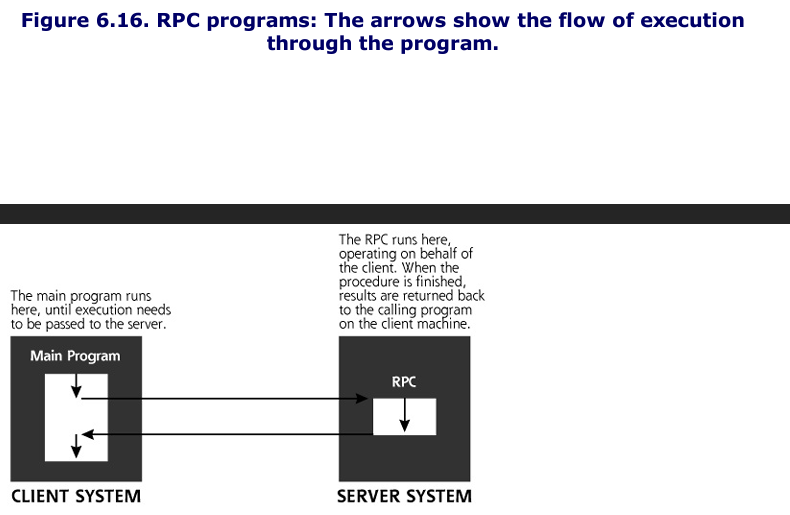

Familiar RPC services on Unix and Linux environments include:
- Rpc.rstatd: a service that returns performance stats from the server's kernel
- Rwalld: a service allowing message to be sent to users logged into a machine
- Rup: displays current up time and load average of the server
- Sadmind: an older service used to administer Solaris systems
- Rpc.statd: a service associated with locking files and sending reboot notification for the Network File System (NFS)

## Setting Source Ports For A Successful Scan
To improve the chances that the packets generated by the scanner will get through routers and firewalls protecting the target network, attackers typically choose specific TCP and UDP source ports for the packets transmitted during a scan.
- Remember, the scanner sends the packets to the target system, varying the destination port to determine which are open or closed. 
- The source port is also included in the header, and might be used by the target network to determine whether the traffic should be allowed.
- The goal here is to use the source port so that the packets appear like normal traffic, thereby increasing the chance they'll be allowed into the network and lowering the potential for detection. 
- Nmap can be configured to use various source ports for all packets in the scan.

TCP port 80 is a popular choice for a source port during a scan, as the resulting traffic might appear to be coming from a Web server. Attackers also widely use source TCP port 25, which appears to be traffic from an internet mail server using the Simple Mail Transfer Protocol (SMTP). 

Another interesting option involves using a TCP source port of 20, which will look like an FTP data connection. As shown in the figure below, when you FTP a file, you actually create two connections, an FTP control connection and a FTP data connection. 


The FTP control connection is opened from client to server, and carries commands to the server, such as logging in, requesting a file list, and so on. After receiving a request for a file, the FTP server opens a connection back to the FTP client. That's what makes standard FTP somewhat harder for simple routers and firewalls to handle--the FTP data connection starts from the server and comes back to the client. 

Some attacks try to take advantage of networks that allow standard inbound FTP data connections by conducting a port scan using a TCP source port of 20. As shown in the figure below. 


Same can be done with UDP port 53, since it can often appear to be DNS

### Decoys Aren't Just For Duck Hunters Anymore
In addition to the FTP Bounce and Idle Scans, Nmap can hide the attacker's address by inserting spoofed decoy source addresses in various scans.
- When configuring Nmap with decoys, the attacker enters a complete list of IP addresses that will be used as the apparent source of the packets. 
- For each packet it sends during a scan, Nmap generates a copy of the packet appearing to originate at each decoy address. 

So if an attacker enters four decoys, Nmap generates five packets for each port to be checked--one with a source of the attacker's actual IP address, and one from each of the four decoys

These decoys are designed to confuse the target the target with a bunch of traffic from innocent sources 

The attacker's actual address needs to be included in each barrage of packets or the attacker will not be able to get the results from the scan. 

## A Critical Feature: Active Operating System Fingerprinting 
An attacker may want to determine which underlying operating system the target machine is running. By determining the operating system type, the attacker can further research the machine to determine particular vulnerabilities for that type of system. 

To determine the operating system type, Nmap uses a technique called active operating system fingerprinting. 

Because RFCs are more used to explain how something does work, there is a lack of a coherent standard in regards to TCP stack responses. For example, a Windows TCP stack responds differently from a Linux machine to illegal control bit sequences. Nmap uses this inconsistency to determine the operating system type of the target machine by sending out a series of packets to various ports on the target including the following:


This overall process of sending traffic to measure the operating system type is called active operating system fingerprinting because the attacker interacts with the target, sending packets to make the operating system measurement. 

Xprobe2 is another software that performs OS fingerprinting it has two major differences compared to Nmap
- Sends fewer packets because of its embedded tightly coded logic tree
- Gives probabilities of what OS a system might have instead of just giving most likely answer 

Good idea to run both systems

## Useful Timing Options 
An attacker might want to send packets very slowly to a target to help spread out the appearance of log entries resulting from the scan. Additionally, if a scan occurs too quickly against a slow target, it is possible for open ports to be missed, or the target system could even crash in a flood of packets. 

Nmap includes different timing options for scans. These timing options have wonderfully descriptive names such as:
- paranoid: Sends one packet approximately every 5 minutes resulting in a super-slow scan
- sneaky: Sends one packet approximately every 15 seconds
- polite: Sends one packet approximately every 0.4 seconds
- normal: Runs as quickly as possible without missing target ports
- aggressive: waits a maximum of 1.25 seconds for any response
- insane: Waits a max of 0.3 seconds for any response. You will lose traffic in this mode, getting false negatives listing open ports as closed because you were too impatient to wait for their responses. 

### A Little Bit of Fragmentation Never Hurt Anyone
Nmap supports slicing IP packets into smaller chunks, which can foil some network based IPS/IDS

# Defenses Against Port Scanning
## Harden Your Systems
The best way to prevent an attacker from discovering open ports on your machine is to close all unused ports. 

When you bring a new system online, you should be very familiar with the ports that are open on the box and why they are required. All unneeded ports and their related services must be shut off. You should also create a secure configuration document that describes how a new machine should be securely hardened. 

Also, check periodically to see which TCP and UDP ports are in use on your machine, either from across the network (using a port scanner like Nmap) or locally. The procedure for checking locally listening ports and shutting off unneeded ones varies between Windows and Linux/UNIX.

On Windows you can run ```netstat -na``` from a command prompt to see which ports are in use. To be even more specific and look for just listening ports, you can type 

```C:\> netstat -na | find "LISTENING"```


You can add the ```-o``` flag for ```nestat -nao``` which shows the listening ports, as well as the process ID (PID) of the listening process. 

A cleaner way to disable a listening port, if the listening process was started as a Windows Service, involves disabling the service itself. You can do this by running the services control, easily invoked by going to Start-> Run... and typing ```services.msc``` Then double-click the offending service, click Stop and set its Startup to Disabled. 

If you are more command-line oriented, you can do the same thing using the Service Controller command, ```sc```, built into Windows XP and Windows 2003. To get a list of services and their status, type ```sc query```. To stop a service temporarily, until the next reboot type ```sc stop [service]```
- To permanently disable a service type ```sc config [service] start= disabled```

On Linux you can use the ```-p``` flag on netstat so ```netstat -nap``` to view PIDs and program names. We can get even more details about process listening on ports using the ```lsof``` command. 
- Run the ```lsof``` command using the ```-i``` flag to list all TCP and UDP ports in use. 
- Then using the PID of the process I can review it in more detail using ```lsof -p [pid]``` as shown in the figure below.
- BASED ON CURRENT LINUX, THIS MAY NO LONGER WORK


To stop a process on Linux or UNIX, you can use the kill [pid] command. The procedure for disabling a service listening on a port permanently depends on whether the service is invoked by ```inetd, xinetd```, or one of the service initialization scripts. 

1. If the service is started by ```inetd``` you can comment out its line in ```/etc/inetd.conf``` by placing a ```#``` at the beginning of the line
2. If the service is started by ```xinetd```, you can delete the file ```/etc/xinetd.d/[service]``` or edit that file so that it contains a line that says ```disable=yes```
3. If the service is started by one of the service initialization scripts, it will have a linked called ```S[Number] [Service]``` in the directory ```/etc/init.d``` You can shut off such services by editing the ```rc.d``` directory for each runlevel on your system. 

Furthermore, for critical systems, you might want to delete the program files associated with the unneeded service. Even if the service software is not actively running on the machine, it could allow a malicious user with access to the system to do nasty things. 
- Leaving GUI software disabled but not removed off the system is an example
- Leaving a C compiler in a production web server, is another example

Leaving these tools on the system makes the attacker's job easier. Try these changes first on a test infrastructure mimicking your production environment to make sure your systems operate properly. 

### Find the Opening Before the Attackers Do
As with war driving and war dialing, you should scan your systems before an attacker does to verify that all ports are closed except those that have a defined business need.
- You can use Nmap to scan each of your internet accessible systems, as well as critical internal machines. 

### Be Careful: Don't Shoot Yourself in the Foot!
It is critical to note that you could very easily cause mayhem on your network by running any one of the scanning tools described in this chapter against your system. A periodic ping to the target machine can help you verify that it is alive while scanning occurs. 

### Add Some Intelligence: Use Stateful Packet Filters or Proxies
Scans using the FTP data source port and ACK scans, along with other techniques supported by Nmap take advantage of limitations in traditional packet filters. 
- These filters make decisions based on the contents of the packet's header, a very limited view of what's really happening on the network
- If you use a router or firewall with only traditional packet-filtering capabilities, an attacker can scan past your defenses

Conversely, stateful packet filters can remember earlier packets and allow new packets through a barrier if they are associated with earlier packets. This capability is tremendously helpful in protecting against ACK scans and the FTP data source port scans. 
- Using stateful packet filtering, an ACK packet will be allowed into a network only if it comes form the proper address and ports used by an earlier SYN packet that was allowed out of the network. 
- The stateful packet filter remembers all out-going SYNs in a connection table, and checks incoming packets to verify their association with an earlier SYN. 

Alternatively, proxy-based firewalls operate at the application level, so it knows when a session is present. 
- An incoming ACK packet will be dropped because there is not an outgoing session at the application level
- An FTP data connection will only be allowed if the proxy ahs an established FTP control connection. 

## Determining Firewall Filter Rules With Firewalk
Additional port-scanning techniques give an attacker even more information about the target network infrastructure. In particular, Firewalk allows an attacker to determine which packets are allowed through a packet-filtering device, such as a router or firewall. 
- Knowing which ports are open through your firewall is incredibly useful information for an attacker.

There is a crucial difference between Nmap and Firewalk. 
- Remember Nmap is used to send packets to an end system to determine which ports are listening on that given target machine. 
- If you Nmap a firewall itself, it will show you the ports listening for packets sent to the firewall itself, not what the firewall is allowing through
- Firewalk is used to send packets through a packet filter device (firewall or router) to determine which ports are open through it.
- **Nmap cannot differentiate between what is open on an end machine and what is being firewalled**
- Firewalk on the other hand, can determine if a given port is allowed through a packet-filtering device.
- **Firewalk allows an attacker to determine your firewall rule set**

As we have seen, Nmap's ACK scanning capability allows an attacker to determine a packet-filtering firewall's rule set regarding which ports allow established connections. That is, the firewall will allow responses back into the internal network if they are destined for these given ports. 

Firewalk goes much further than ACK scanning. 
- Firewalk allows an attacker to determine which ports are allowed through a firewall for opening new connections, not just sending data along established connections with the ACK bit set. 

Attackers use the information provided by Firewalk to probe target DMZs and internal systems through the proper ports. 
- For example: If you allow TCP port 2391 through your firewall, but nothing is listening on your DMZ on TCP port 2391, you might feel safe, but the just because the firewall will let these packets in, there is nothing on the protected side of the systems to answer these requests. 
- Using Firewalk, an attacker can discover the open port through your firewall, even though nothing on your DMZ has that port open. 

### How Firewalk Works
Similar to the traceroute tool discussed earlier in this chapter, Firewalk utilizes the TTL field of the IP header. 
- Because TTL is part of the IP header, an attacker can use Firewalk to determine which ports are filtered for either UDP or TC, both of which ride on top of IP. 

Firewalk requires the attacker to enter two IP addresses to start its scan. The first address belongs to the network hop before filtering takes place, typically the external address of the packet-filtering device itself, which might be your firewall or border router. The second IP address is associated with a destination machine on the other side of the packet-filtering device. 
- Based on this input, Firewalk gathers its data by conducting two phases: network discovery and scanning.

During the network discovery phase, shown below, Firewalk sends a series of packets with incrementing TTLs to determine how many network hops exist between the tool and the firewall. 
1. First a packet with a TTL of 1 is sent
2. Then a packet with a TTL of 2 and so on, incrementing the TTLs until the packet-filtering device is reached. 

This is essentially traceroute except the output is a simple count of the number of hops betweeen the attacker and the filtering function not a list of routers between source and destination. 
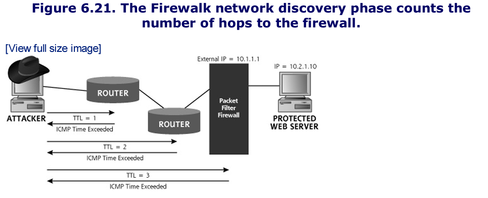

We then proceed to the scannning phase

For the scanning phase shown below, Firewalk creates a series of packets with a TTL set to one greater than the hop count to the filtering device. 
- The destination address of the packets in this phase is the protected server on the other side of the packet-filtering device. 
- This type of scan even works if the filtering device is configured for one-to-one Network Address Translation (NAT) to hide the protected server. 
- Such a filter merely changes the IP address of packets that traverse it from some externally viewable address to the protected inside address and vice versa. 
- In such instances, the attacker just inserts a target address of the outside viewable address of the protected server behind the one-to-one NAT. 

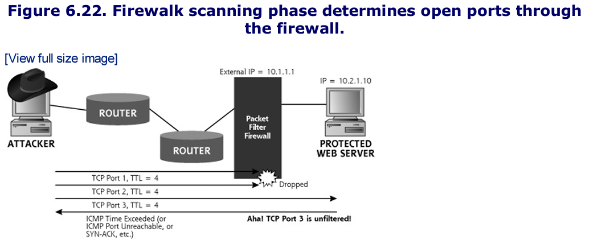

When doing the scan of the target address with a TTL of one greater than the hop count to the filter, these packets will get to the filtering device, and potentially one hop beyond it.
- If a packet gets through the filter, an ICMP Time Exceeded message will be sent by the system immediately on the other side of the filter (possibly a router). Or, the protected server itself might receive the packet, if it is the next hop, and resopnd with an ICMP Port Unreachable or even a SYN-ACK response. 
- **If any response comes back, regardless of the type, Firewalk knows that the port is open through the firewall, because the packet lived through enough hops to make it through the firewall to trigger that response.**
- Note: To determine outbound rules, the attacker would have to conquer a target on the protected network, and Firewalk outward.

### Firewalk Focuses on Packet Filters, Not Proxies
For Firewalk to work properly, the packet-filtering device must transmit packets without clobbering the TTL field. 
- Firewalk works against both traditional and stateful packet filters, which both just decrement the TTL by one.
- It does not however work against proxy firewalls, because proxies do not forward packets, they instead absorb packets on one side of the gateway and creates a new connection on the other side, destroying all TTL information in the process. 

### Layered Filtering
Additionally, many networks today apply a series of filters on their inbound traffic, perhaps a router with access control lists (ACLs) up front, followed by a packet-filtering firewall or two before reaching a DMZ. 
- The attacker can Firewalk through such networks as well, configuring the tool to look for the filtering rules for each hop near the end of the network, one by one. 
- Now, with Firewalk, the attacker will be able to see the exact inbound filter on the first layer the attacker has access to (such as the outmot border router).
- Then for the second layer (behind the first), the attacker will only be able to see those ports allowed through the first layer AND second layer.
- This process is rather like looking through a series of screened doors to see if openings line up all the way through. 

### Putting Firewalk Output to Use
So how can an attacker use a list of the ports allowed through a firewall? 
- If attackers place nasty software on a internal system listening for connections from the outside world, they'll need to know which ports are open so they can communicate with their nasty internal programs. 
- The output from Firewalk tells the attacker the ports that are allowed into the target network. 

Furthermore, having discovered the open ports allowed through your firewall, an attacker can easily set up a script to check if any DMZ systems suddenly have new services enabled on those ports. 

### Firewalk Defenses
There are several options in defending against Firewalk-type attacks.
1. First, accept that such attacks are possible and harden your firewall
2. Replace your packet-filtering devices with proxy-based firewalls. 
	1. Because proxies do not transmit TTL information, an attacker cannot Firewalk through a proxy


# Vulnerability-Scanning Tools
The table below summarizes what the attacker has learned about the target using the IP-based tools discussed in this chapter.

Clearly the attacker's scanning has proven fruitful--they have a lot of useful information about the target. But they still don't know about how to get into the target systems. The next class of tools provides that information: a list of vulnerabilities on the target system that an attacker can exploit to gain access.
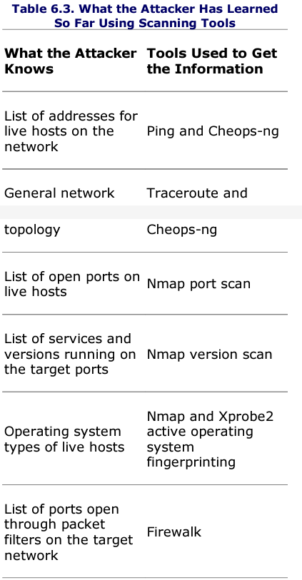

Vulnerability scanners are based on a simple idea: **automating the process of connecting to a target system and checking to see if vulnerabilities are present.**
- By automating the process, we can quickly and easily check the target systems for many hundreds of vulnerabilites.
- Most vulnerability-scanning tools automatically check the network for the following types of vulnerabilities on target systems:
	1. *Common Configuration Errors*: Numerous systems have poor configuration settings, leaving various openings for an attacker to gain access
	2. *Default Configuration Weaknesses*: Out of the box, many systems have very weak security settings, sometimes including default account and passwords
	3. *Well-known system vulnerabilities*: Every day, volumes of new security holes are discovered and published in a variety of locations on the Internet. Vendors try to keep up with the onslaught of newly discovered vulnerabilites by creating security patches. 

Although particular implementations vary, most vulnerability-scanning tools can be broken down to the following common set of elements: illustrated below
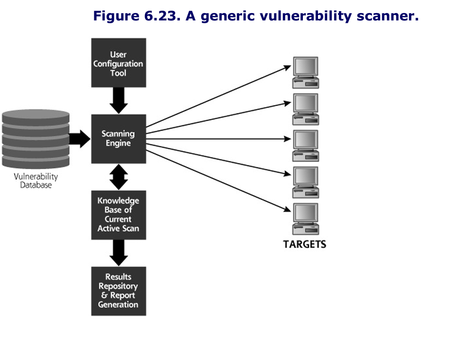
- *Vulnerability Database*: This element is the brain of the vulnerability scanner. It contains a list of vulnerabilities for a variety of systems and describes how those vulnerabilities should be checked.
- *User Configuration tool*: By interacting with this component of the vulnerability scanner, the user selects the target systems and identifies which vulnerability checks to run.
- *Scanning Engine*: This element is the arms and legs of the vulnerability scanner. Based on the vulnerability database and user configuration, this tool formulates packets and sends them to the target to determine whether vulnerabilites are present. 
- *Knowledge base of current active scan*: This element acts like the short-term memory of the tool, keeping track of the current scan, remembering the discovered vulnerabilities, and feeding data to the scanning engine.
- *Results repository and report generation tool*: This element generates pretty reports for its user, explaining which vulnerabilties were discovered on which targets and possibly recommending remedial actions for dealing with the discovered flaws. 

## A Whole Bunch of Vulnerability Scanners
A large number of very effective commerical vulnerability scanners are available today (in 2005), including the following:
- Harris STAT Scanner (www.stat.harris.com)
- ISS's Internet Scanner (www.iss.net)
- GFI LANguard Network Security Scanner (Www.gfi.com/lannetscan)
- E-eye's Retina Scanner (www.eeye.com)
- Qualys'QualysGuard, a sub-based scanning service that scans their cusotmers' systems across the Internet on a regular basis
- McAfee's Foundstone Foundscan, another sub-based scanning service

Nessus is free and still reliable, another high-quality free, open source scanner similar to Nessus is the Attacker Tool Kit (ATK)


## Nessus: The Most Popular Free Vulnerability Scanner Available Today
The Nessus vulnerability scanner was created by the Nessus Development Team. Its advantages include the following: 
- The freedom to write your own vulnerability checks and incorporate them into the tool.
- The knowledge that a large group of developers is invovled around the world creating new vulnerability checks
- The price is right. It's free!

### Nessus Plug-Ins
Nessus includes a variety of vulnerabilty checks, implemented in a modular architecture. Each vulnerablity check is based on a small program called a plug-in. One plug-in conducts one check of each target system. Together, these plug-ins comprise the Nessus vulnerability database. Nessus sports more than 1,000 distinct plug-ins that check for a variety of vulnerabilities. Plug-ins are divided into the following categories:
- *Backdoors*: These checks look for signs of remote control and backdoor tools installed on the target system, including Virtual Network Computing (VNC) and some of the more common bots.
- *CGI abuses*: These checks look for vulnerable CGI scripts, and related Web Technologies, including Active Server Pages (ASPs), Java Server Pages (JSPs), Cold Fusion scripts, and more. These various types of scripts are run on Web servers, and are used to implement web applications. 
- *Cisco*: This category of plug-ins looks for various flawed versions and common misconfigurations in Cisco products, especially the Internetwork Operating System (IOS) router software and VPN concentrator products.
- *Default Unix Accounts*: This set looks for various common UNIX accounts with easily guessed passwords, including "guest" and "demos".
- *DoS*: These attacks look for vulnerable services that can be crashed across the network. Many of these tests will actually cuase the target system to crash, but some merely check version numbers of the services.
- *Finger abuses*: These checks all center around the Finger service that was historically used on UNIX machines to get a list of current users. 
- *Firewalls*: These checks look for misconfigured firewall systems
- *FTP*: This category includes a very large number of checks for misconfigured and unpatched FTP servers.
- *Gain a shell remotely*: This category of plug-ins looks for vulnerabilities that allow an attacker to gain command-line access to the target systems.
- *Gain root remotely*: These plug-ins look for the holy grail of vulnerabilities, the ability to have super-user access on the target system across the network. 
- *General*: This catch-all category includes a variety of checks, such as gathering the server type and version number for Web servers, FTP servers, and mail servers.
- *Miscellaneous*: This is another catch-all category of plug-ins, including tracerouting and system fingerprinting.
- *Netware*: This small number of plug-ins looks for flaws in Novell Netware servers.
- *NIS*: These checks look for vulnerabilities in the Network Information Service (NIS) used by UNIX machines to share account information and other system data.
- *Peer-to-peer file sharing*: These plug-ins look for the presence of various file-sharing applications, such as KaZaA and Gnutella, as well as common misconfigurations in these tools.
- *Remote File Access*: These checks look for vulnerabilities in file sharing, including the Network FIle System (NFS) and Trivial File Transfer Protocol (TFTP)
- *RPC*: These plug-ins scan for vulnerable RPC programs, rather like the Nmap RPC scanning capability we discussed earlier in this chapter.
- *SMTP problems*: These plug-ins look for vulnerable mail servers
- *SNMP*: Looks for vulnerable systems managed via the Simple Network Management Protocol (SNMP) and attempts to extract sensitive configuration information using it.
- *Windows*: This category focuses on attacks against Windows systems, ranging from Windows 9x to Windows 2003 and later.
- *Useless Services*: These checks determine whether the target is running any services that have doubtful functional value, including the daytime and cargen services.

Nessus also includes Nmap as a built-in port-scanning tool, increasing its usefulness tremendously.

### The Nessus Architecture
Nessus is based on a classic client-server architecture, where the client hosts a user configuration tools, results repository, and report generation tool. The Nessus server includes a vulnerability database (the set of plug-ins), a knowledge base of the current active scan, and scanning engine. The Nessus client-server architecture is shown below. 
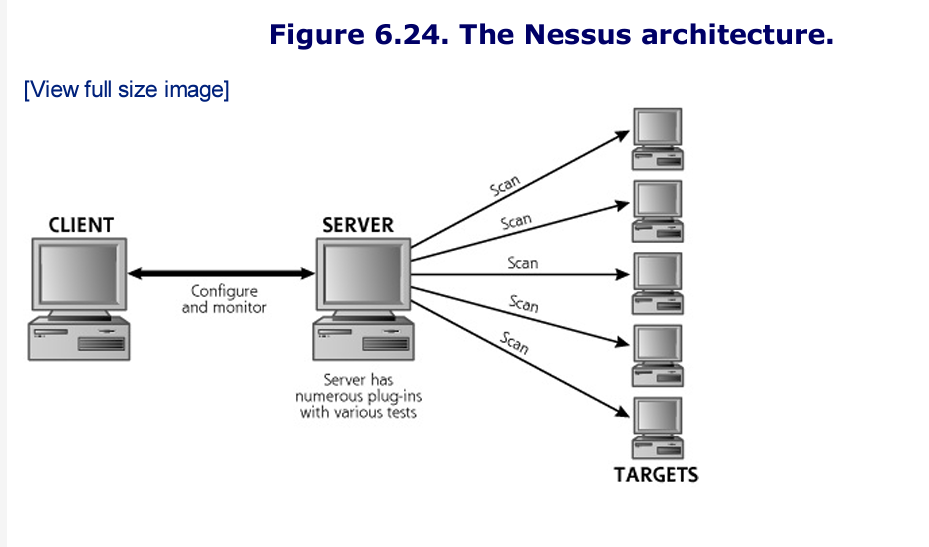

### Configuring Nessus for a Scan
Nessus includes an easy-to-use GUI that allows for the configuration of the tool, via the GUI, a user can configure the following:
- Which plug-ins to run
- Target systems (network ranges or individual systems)
- Port range and types of port scanning (all Nmap scan types are supported)
- The port for Nessus client-server communication
- Encryption algorithms for client-to-server communication
- E-mail address for sending the report

### Write Your Own Attack Scripts
One of the best features of Nessus is the ability to write your own plug-ins, a capability not supported in many major commerical scanners. 
- Users can write their own plug-ins in the C language or a custom Nessus Attack-Scripting Language (NASL).

### Reporting the Results
Nessus includes a reporting tool that allows for viewing and printing results, as shown in the figure below. 
- Reports can be exported to a file in a variety of formats, including Hypertext Markup Language (HTML), LaTeX, ASCII,and XML, a really nice feature. 

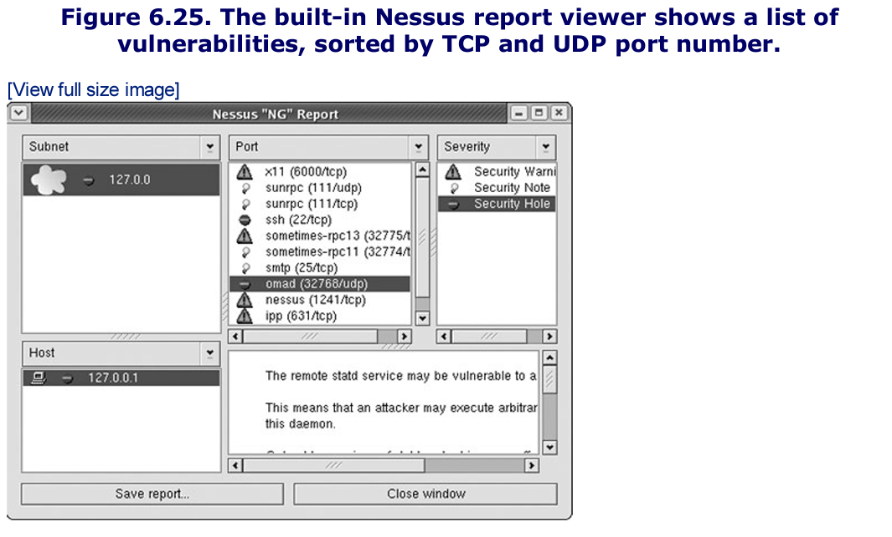

### So, What Does an Attacker Do With These Results?
At this point of the scan, the attacker now has a list of vulnerabilities on the target systems discovered by the vulnerability-scanning tool. Most attackers take this list and search for particular exploits based on them.

## Vulnerability Scanning Defenses
### Close Unused Ports and Keep your Systems Patched 
A recurring theme throughout this chapter, and indeed the whole book, is that you must close all unused ports and apply patches to your systems. 

### Run the Tools Against Your Own Networks
You should run a basic vulnerability-scanning tool against your own network on a periodic basis to identify vulnerabilites before an attacker does. 

### Be Careful with Denial of Service and Password Guessing Tests!
When you run vulnerability scanners against your own network, make sure you understand what you're doing! 
- Some plug-ins are dangerous and could impair or even crash the target machine. 
- Be careful with password guessing tools because if the scanner tried a number of invalid attempts, the actual user may not be able to authenticate

## Be Aware of Limitations of Vulnerability-Scanning Tools
Vulnerability-scanning tools are extremely useful because they automate security checks across a large number of systems over the network. 
- A major limitation is that these tools only check for vulnerabilities that they know about
- Keep the vulnerabilities database up to data. 
- Another major limitation of vulnerabilitity-scanning tools invovles the fact that they look for vulnerabilities on the target addresses that you configure and don't really understand the network architecture. 
- Vulnerability-scanning tools only give their user a snapshot in time of the system security. 

# Intrusion Detection System and Intrusion Prevention System Evasion
Thus far in the attack, the bad guys have had great success in gathering sensitive information about the security secrets of the target computing infrastructure. 
- A lot of what was discussed thus far in this chapter is incredibly noisy. 

## How Network-Based IDS and IPS Tools Work
Network-based IDS and IPS tools gather packets associated with normal use of the network and attacks alike. 
- The network-based IDS and IPS must sort through this mountain of data to determine if an actual attack is underway.
- Today, many network-based IDS and IPSs have a database of attack signatures that they try to match against network traffic. 
- We are seeing more behavior-based IDS and IPS tools, which look for attacker activity based on what the attacker does (such as stealing important data or configuration files)

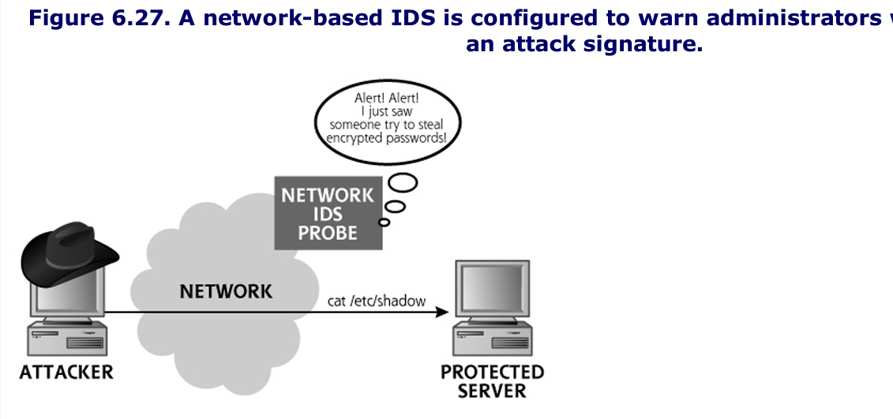

The figure above shows a typical network-based IDS installation, where we have a network based IDS probe looking for signs of an attack. 
- This probe includes a signature that tries to detect the theft of a password file from a UNIX system, by searching the arriving network traffic for the string ```"cat/etc/shadow"```, the common location of encrypted passwords on a UNIX machine.

## How Attackers Can Evade Network-Based IDSs and IPSs
The attackers want to fly under the radar screen of the IDS and IPS. How can this very important goal be accomplished? Attackers will take advantage of the interaction of the following related factors to avoid detection:
- *Mess with the appearance of traffic so it doesn't match the signature*: This mostly means altering the packet structure or syntax in a way that the IDS or IPS does not anticipate.
- *Mess with the Context*: Network-based IDS and IPS tools do not have complete context of how the packets they are capturing will be interpreted by the end system. They are peering in on someone else's conversation, and don't really know what the end system will do with the packets they are monitoring. 

## IDS and IPS Evasion at the Network Level
As discussed in Chapter 2, large IP packets must be broken down into fragments. IDS and IPS systems must store fragments in a buffer until the entire packet can be loaded in. 
- Virtual Fragment reassembly buffers are typically loaded into RAM and populated with fragments as they arrive. Thus, gathering and analyzing fragments requires a great deal of memory and processing power on the IDS and IPS part. 
- Furthermore, to analyze the communication reflected in the fragments, the IDS or IPS must reassemble all of these packets in the same way that the target system performs reassembly. 

### The Tiny Fragment Attack and the Fragment Overlap Attack
The tiny fragment attack is designed to fool the IDS and IPS by creating two fragments, neither of which includes enough infromation to trp the signature on the IDS or IPS.
- The packet is sliced in the middle of some data that would otherwise trigger the IDS or IPS.
- As we discussed before, suppose the signature is looking for the ``` cat /etc/shadow``` 
- Because the IDS or IPS is looking for this string to make alerting or blocking decisions, it might ignore the tiny initial fragment as it passes. 
- After all, the first fragment doesn't match the signature, and the second packet independently doesn't match a signature either
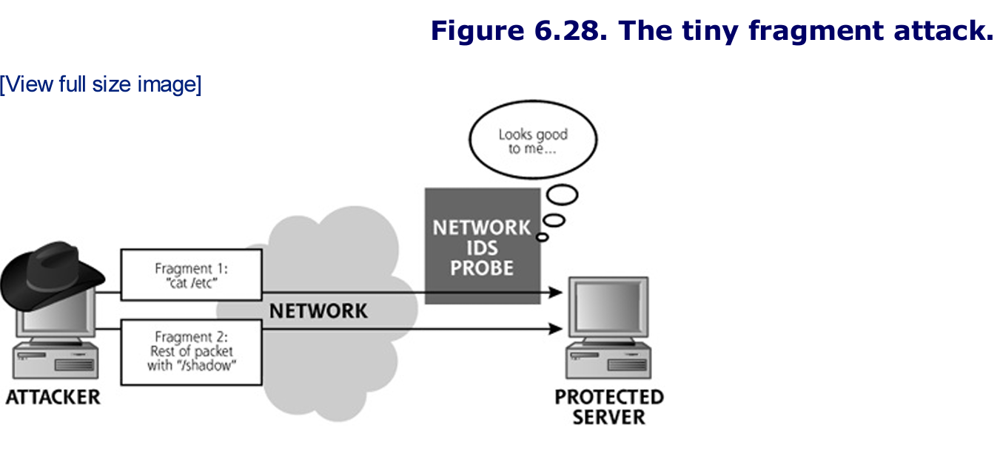

A far more insiduous fragmentation example is the fragment overlap attack, which is based on manipulating the fragment-offset field of the IP header.
- The fragment-offset fieldtells the destination system where the given fragment fits in the overall bigger packet that was sliced apart into fragments. 
- For this scenario, the attacker creates two (or more) fragments for each IP packet. 
- One fragment has the TCP header, and a piece of innocuous-looking data tath doesn't trigger the signature like ```cat /etc/fred```
- The second fragment has an offset value that is a lie, the offset is too small, so that when the fragments are reassembled, they overlap and "shadow" overwrites fred. 
- When the two fragments are reassembled at the targeted protected server, they reassemble into the evil packet. TCP/IP stack passes the packet to the application, which receives ```cat /etc/shadow``` The attacker has evaded the IDS or IPS
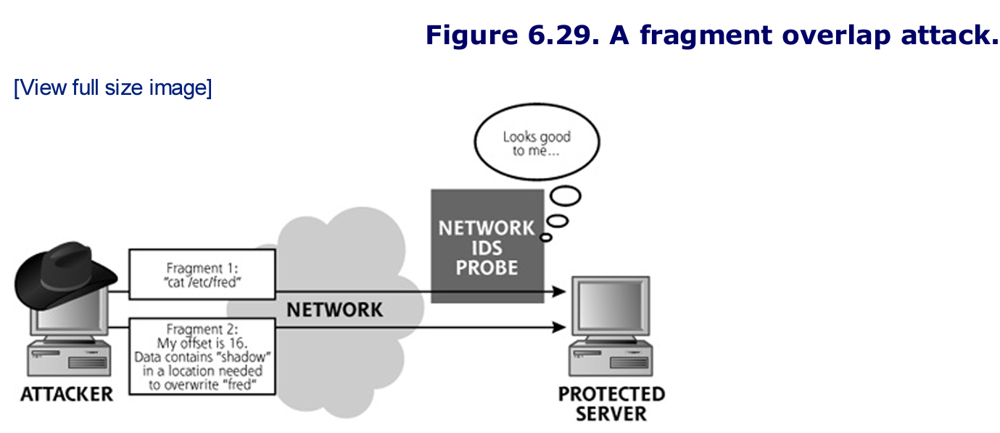

In a sense, the IDS and IPS don't know how the end system is going to reassemle the packet, so they can't be sure what impact these unusually overlapped fragments will have there. 

### FragRouter: A Nifty Tool for Conducting Fragmentation Attacks to Evade IDS and IPS Tools
FragRouter implements a variety of fragmentation attacks.
- FragRouter runs on BSD, Linux, and Solaris. 
- It supports more than 35 different ways of slicing and dicing packets to maniuplate the flow of data between a source and destination, including the options shown in the table below.

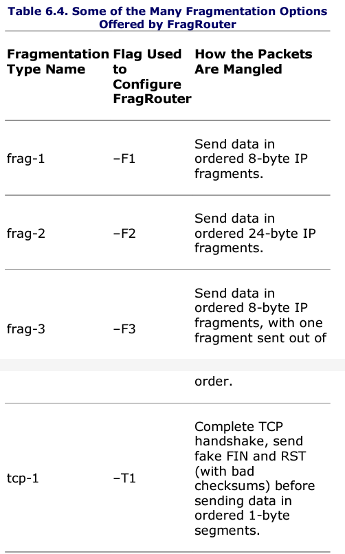
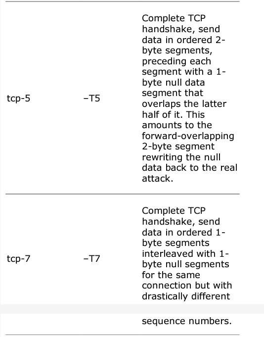

The beauty of FragRouter is that it separates the attack functionality from the fragmentation functionality. As the name implies, it really is a router, implemented in software. As displayed in the figure below, attackers install it on one of their own systems and then use any attack tool to send packets through the machine with FragRouter installed.
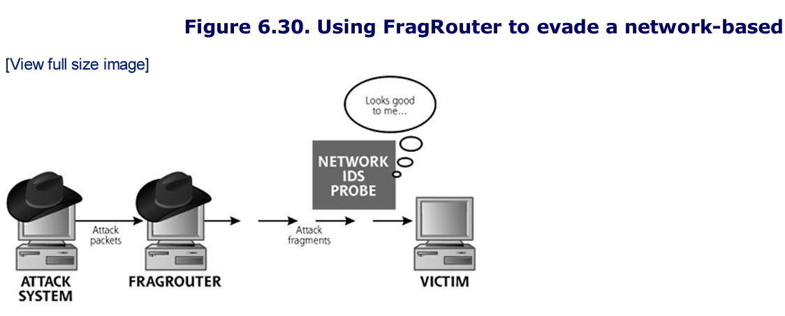

In using FragRouter, the attacker first chooses a particular attack tool to launch against a target. This tool generates attack packets. These packets are funneled through FragRouter, which slices and dices the packets according to any one of its 35 fragmentation and scrambling options. 

Then FragRouter forwards these packets across the network to their ultimate destination, the target. The separation of the fragmentation function from the particular attack tool allows an attacker to choose any tool, such as a network mapper, port scanner (like Nmap), firewall rule scanner(like Firewalk) or vulnerability scanner (like Nessus)

FragRoute was released as a follow-up tool. It differs from the older FragRouter tool in that it doesn't route. The attack tool has to sit on the same machine as FragRoute itself. 

## IDS and IPS Evasion At The Application Level
Although FragRouter and FragRoute allow an attacker to manipulate a data stream at the network level, application-level IDS and IPS evasion techniques let the bad guy modify particular application-level syntax to confuse an IDS or IPS. 
- Whisker, was the first free tool to implement some application level IDS and IPS evasion tactics. 

### Nikto: A CGI Scanner That's Good at IDS and IPS Evasion
Nikto, is an actively updated Web server scanner with a multitude of features, freely available. It provides similar functionality to the older Whisker tool, but has been extended to do much more.

Nikto scans for more than 2,500 potentially vulnerable Web scripts and related material and understands version-specific configuration problems for more than 230 different Web server version types. 

Most Web applications use some sort of active scripiting technology running on the Web server, such as CGI, ASP, JSP, and PHP scripts. A user might supply information to a CGI script through a form on his or her browser. 
- When the the form's data is sent to the Web server, the CGI script runs on the Web server, makes calculations, gathers appropriate data, 


# Summary
 
