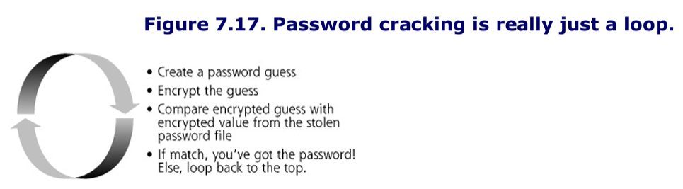
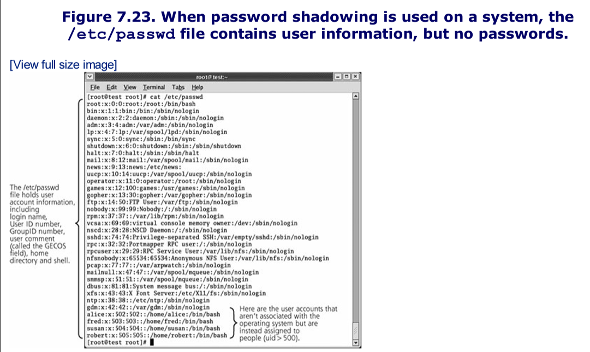
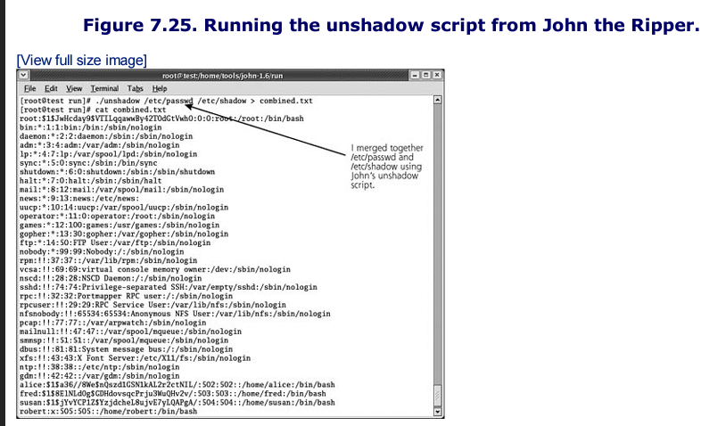
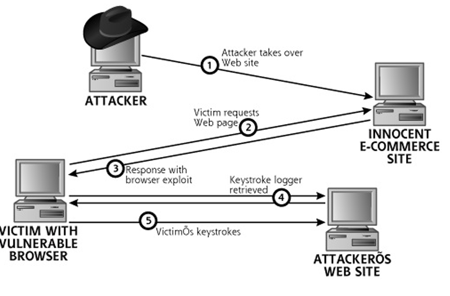

# Notes
At this stage of the siege, the attacker has finished scanning the target network, developing an inventory of target systems and potential vulnerabilities on those machines. Next, the attacker wants to gain access on the target systems. The particular approach to gaining access depends heavily on the skill level of the attacker, with simple script kiddies trolling for exploits and more sophisticated attackers using highly pragmatic approaches.

# Script Kidde Exploit Trolling
To gain access, the average script kiddie typically just takes output from a vulnerability scanner and surfs to a Web site offering vulnerability exploitation programs to the public. 

Web sites offering large databases chock full of exploits include:
- Packet Storm Security
- The Metasploit Project

Although this indiscriminate attack technique fails against well-fortified systems, it is remarkably effective against huge numbers of machines on the Internet with system administrators who do not keep their systems patched and configured securely. 

# Pragmatism For More Sophisticated Attackers
Phase 3, of the five step attack process described in this book tends to be very free-form in the hands of a more sophisticated attacker. 
- Although the other phases of the attack are more systemic, the techniques used to gain access depend heavily on the architecture and configuration of the target network, the attacker's own expertise and predilections, and the level of access with which the attacker begins.
- There is no clearly defined order for this phase of the attack, so techniques discussed in this chapter can happen in any configuration. 

# Buffer Overflow Exploits
Buffer overflows are extremely common today, and offer an attacker a way to gain access to and have a significant degree of control over a vulnerable machine.
- Read "Smashing the Stack for Fun and Profit" - By Aleph One

Buffer overflow vulnerabilities are based on an attacker sending more data to a vulnerable program than the original software developer planned for when writing the code for the program. The buffer that is overflowed is really just a variable used by the target program. 
- In essence, these flaws are a result of sloppy programming, with a developer who forgets to create code to check the size of user input before moving it around in memory. 
- Based on this mistake, an attacker can send more data than is anticipated and break out of the bounds of certain variables, possibly altering the flow of the target program or even tweaking the value of other variables. 

## Stack-Based Buffer Overflow Attacks
Right now, if your computer is booted up, it is processing millions of computer instructions per second, all written in machine language code. The figure below highlights the relationship of a system's processor and memory during execution. 

\

When you run a program, your machine's Central Processing Unit (CPU) fetches instructions from memory, one by one, in sequence. The whole program itself is just a bunch of bits in the computer's memory, in the form of a series of instructions for the processor. The CPU contains a very special register called the instruction pointer, which tells it where to grab the next instruction for the running program. 
- After the CPU executes an instruction, the instruction pointer is incremented to point to the next instruction
- When a jump or branch is encountered, the instruction pointer's value is altered to point to the new location in memory, where sequential fetching of instructions begins anew. 

### Function Calls and the Stack
Most high-level languages include the concept of a function call, used by programmers to break the code down into smaller pieces. The figure below shows some sample code written in the C programming language. 


When the program starts to run, the ```main``` procedure is executed first. The first thing the ```main``` procedure does is to call our sample function. All processing by the program will not transition from the ```main``` procedure to the sample function.

The system has to remember where it was operating in the ```main``` procedure, because after ```sample_function``` finishes running, the program flow must return back to the main procedure. The system uses a stack to remember this information associated with function calls.

A stack is a data structure that stores important information for each process running on a computer. The stack acts kind of like a scratch pad for the system.
- They behave like a stack of dishes (last in, first out (LIFO))
- When a computer puts data onto its stack, it pushes data element after data element on the stack. When it needs to access data from the stack, the system first takes off the last element it placed on the stack, a process known as popping an item off the stack.

Stacks store information associated with function calls. As shown in the figure below, a system pushes various data elements onto the stack associated with making a function call.


First, the system pushes the function call arguments onto the stack. This includes any data handed form the main procedure to the function
- To keep things simple, the example code in Figure 7.3 included no arguments

Next, the system pushes the return pointer onto the stack. This return pointer indicates the place in the system's memory where the next instruction to execute in the main procedure resides
- For a function call, the system needs to remember the value of the instruction pointer in the main procedure so that it knows where to go back to for more instructions after the function finishes running 
- The Instruction pointer is copied onto the stack as a return pointer

Next, the system pushes the Frame Pointer on the stack. This value helps the system refer to various elements on the stack itself. 

Finally, space is allocated on the stack for the local variables that the function will use. In our example, we've got one local variable called ```buffer``` to be placed on the stack. These local variables are supposed to be for the exclusive use of the function, which can store its local data in them and manipulate their values. 

After the function finishes running, printing out its happy message of "Hello World", control returns to the main program. 
- This transition occurs by popping the local variables from the stack (in our example the ```buffer``` variable). 
- The Stack pointer now moves down to its value before the function was called
- The saved Frame Pointer is also removed from the stack and squirreled away in the processor
- Then the return pointer is copied from the stack and loaded into the processor's Instruction Pointer register

Finally, the function call arguments are removed, returning the stack to its original (pre-function-call) state.

### What is a Stack-Based Buffer Overflow?
Consider the sample vulnerable program below


For this program, the main routine prints a "Hello World!" greeting and then calls the ```sample_function```. In ```sample_function```, we create two buffers, ```bufferA```, which holds 50 characters and ```bufferB```, which holds 16 characters. Both of these are local variables of the ```sample_function```, so they will be allocated space on the stack as shown in the figure below


We then prompt the user for input by printing "Where do you live?" The ```gets``` function from a standard C library will pull input from the user. 

Next we encounter the ```strcpy``` library call. This routine is used to copy information from one string of characters to another. In our program, ```strcpy``` moves characters from ```bufferA``` to ```bufferB```

There are a couple problems with the code as presented:
1. The ```gets``` library puts no limitation on the amount of data a user can type in, if the user types in more than 50 characters, ```bufferA``` will be overflowed, letting the attacker change other nearby places on the stack. 
2. The ```strcpy``` library call is also very sloppy, because it doesn't check the size of the either string, and happily copies from one string to the other until it encounters a null character in the source string. 
3. So even if the attacker doesn't overflow ```bufferA``` with more than 50 characters of user input in the ```gets``` call, the attacker has a shot at overflowing ```bufferB``` simply by typing between 17 and 50 characters into ```bufferA```, which will be written to ```bufferB```. 

The attacker's input will run through both buffers and spill into other parts of the program. If the attacker can overwrite the return pointer which is located below the local variables and saved Frame Pointer, they can inject their own malicious shellcode. 
- **The attack could overwrite the return pointer with a value that points back into the buffer, which contains the commands he or she wants to execute**

The resulting recipe, as shown in the figure below, is a stack-based buffer overflow attack, and will allow the attacker to execute arbitrary commands on the system. 


Focusing on just cramming too much input into ```bufferA``` via that vulnerable ```gets()``` call. The attacker gets a program to fill one of its local variables (a buffer) with data that is longer than the space allocated on the stack, overwriting the local variables themselves with machine language code. 
- The system doesn't stop at the end of the local variables
- It keeps writing data over the end of the buffer, clobbering the saved Frame Pointer, and even overwriting the return pointer with a value that points back to the machine language instructions the attacker loaded into the ```bufferA``` on the stack. 

When the function calls finishes, the local buffers containing the instructions will be popped off the stack, but the information we place in those memory locations will not be cleared. 
- The system then loads the now-modified return pointer into the processor, and starts executing instructions where the return pointer tells it to resume execution.
- The processor will then start executing the instructions the attacker had put into the buffer on the stack. 

This whole problem is the result of a developer not checking the size of the information he or she is moving around in memory when making function calls. 

The most useful thing an attacker can place on the stack is a command shell, because then the attack can feed the command shell (such as the UNIX and Linux /bin/sh or Windows cmd.exe) any other command to run. 
- This can be achieved by placing the machine language code for executing a command prompt in the user input. 
- Most OSs include an exec system call to tell the operating system to run a given program. 
- Some attackers force their shell to make a connection to a given TCP or UDP port, listening for the attacker to connect and get a remote command prompt. 
- Others prefer to add a user to the local administrator's group on behalf of the attack. Still other attackers might force the shell to install a backdoor program on the victim system.

Alternatively, instead of invoking the attacker's code in the stack, the attacker could change a return pointer so that it doesn't jump into the stack, but instead resumes execution at another point of the attacker's choosing.
- Some attackers clobber a return pointer so that it forces the program to resume execution in the heap, another area of memory we discuss a little later.
- Or the attacker could have the program jump into a particular C library the attacker wants to invoke, a technique known as "return to libc" attack

It is important to note that an attacker's program will run with the permissions of the vulnerable program. 

Buffer overflow attacks are very processor and operating system dependent, because the raw machine code will only run on a specific processor, and techniques for executing a command shell differ on various operating system.

## Exploiting Stack-Based Buffer Overflows
To exploit a buffer overflow, an attacker enters data into the program by typing characters into a GUI or command line, or sending specially formatted packets across the network. 
- In this input to the program, the attacker includes the machine language code and new return pointer in a single package.
- If the attacker sends just the right code with just the right return pointer formatted just the right way to overflow a buffer of a vulnerable program, a function in the program will copy the buffer to the stack and ultimately execute the attacker's code

## Finding Buffer Overflow Vulnerabilities
Other C and C++ functions that often cause such problems include the various string and memory handling routines like these:
- ```fgets```
- ```gets```
- ```getws```
- ```sprintf```
- ```strcat```
- ```strcpy```
- ```strncpy```
- ```scanf```
- ```memcpy```
- ```memmove```

Beyond these function calls, the developer of the program might have created custom calls that are vulnerable. Some exploit developers reverse engineer executables to find such flaws

Alternatively, exploit creators might take a more brute force approach to finding vulnerable programs. They sometimes run the program in a lab and configure an automated tool to cram massive amounts of data into every input of the program. The program's local user input fields, as well as network inputs, will be inundated with data.

Exploit creators are looking for a program to crash under this heavy load of user input, but to crash in a meaningful way. They'd like to see their repeated input pattern (like the character A, which in hex is 0x41) reflected in the instruction pointer when the program crashes. 
- This technique of varying the user input to try to make a target system behave in a strange fashion is sometimes called fuzzing

Consider this example of the output dump of a debugger showing the contents of a CPUs registers when a fuzzer trigger an overflow using a bunch of A characters


Glancing at the instruction pointer (EIP), we see the series of long A's represented through its hex of 0x41 meaning we have overflowed the buffer through user input and reached the return pointer and then transferred into the instruction pointer. 

Once the attackers find out that some of the user input made it into the instruction pointer, they need to figure out which part of all those As was the element that landed on the return pointer. 

They determine this by playing a little game. 
- They first fuzz with all A's as we saw before.
- Then, they fuzz with an incrementing pattern, perhaps all of the ASCII characters, including ABCDEF and all other characteres repeated again and again. 
- They then wait for another crash. Now, suppose the attacker sees that DEFG is in the return pointer slot. The attacker then fuzzes with each DEFG pattern of the input tagged, such as DEF1, DEF2, DEF3, and so on. 
- Finally, the attacker may discover that DEF8 is the component of the user input that hits the return pointer.
- The attacker now knows where in the user input to place the return pointer. 

Automated tools exist, which can play this game, which will identify the location in the user input where the new return pointer should be placed. 

Because the stack is very dynamic, it can be difficult to find the exact location of the start of the executable code the attacker pushes onto the stack. 
- To address this dilema, the attacker usually prepend their machine language code with a bunch of No Operation (NOP) instructions. Most CPUs have one or more NOP instruction types, which tell the processor to do nothing for a single clock cycle. 
- By putting a large number of NOP instructions at the beginning of the machine language code, the attacker improves the odds that the guess return pointer will work.
- As long as the guessed address jumps back into the NOP sled somewhere, the attacker's code will execute. 

The code will do nothing, nothing, nothing, and then run the attcker's code to exec a shell. 

You can think about the value of a NOP sled by considering a dart game. When you throw a dart at the target, you'd obviously like to hit the bull's eye.
- The guess of the return pointer is something like throwing a dart. If you guess the proper location of the start of the machine language code on the stack, that code will run
- Otherwise the program will crash, something akin to your dartboard exploding
- A NOP sled is like a cone placed around the bull's eye on the dartboard. As long as your dart hits the cone (the NOP sled), the dart will slide gently into the bull's eye and you'll win the game.

Attackers prepend as many NOP instructions at the front of their machine language code as they can, based on the size of the buffer itself. 
- If the buffer is 1,024 characters long, and the machine language code takes up 200 bytes, that leaves 824 characters for NOPs. 
- Bigger buffers ironically only make it easier to attack a program with a buffer overflow exploit.

The NOP instructions used by an attacker in the NOP sled could be implemented using the standard NOP instruction for the given target CPU type, which might be detected by an IDS when a large number of NOPs move across the network. 
- Craftier attackers might choose a variety of different instructions that, in the end, still do nothing, such as adding zero to a given register, multiplying a register by one, or jumping down to the next instruction by memory.

As we have seen, the fundamental package for a buffer overflow exploit created by an attacker consists of three elements:
1. A NOP sled
2. Machine language code designed to exec a shell
3. A return pointer to make the whole thing execute

The structure of a common buffer overflow exploit is shown below:


## Heap Overflows
So far, our analysis of buffer overflow flaws has centered on the stack, the place where a process stores information associated with function calls. However, there's another form of buffer overflow attack that targets a different region of memory: the heap. 
- The stack is very organized, in that data is pushed onto the stack and popped off of it in a coordinated fashion in association with function calls, as we've seen.

The heap is quite different. Instead of holding function call information, the heap is a block of memory that the program can use dynamically for variables and data structures of varying sizes at runtime. 
- Suppose you are writing a program and want to load a dictionary in memory.
- In advance, you have no idea how big that dictionary might be. 
- Using the heap, you can dynamically allocate memory space as your program reads different dictionary terms as it runs.
- The ```malloc``` library call is the most common way to allocate space in the heap. It is short for memory allocation, and this function grabs some space from the heap so your program can tuck data there.

If a developer uses ```malloc``` to allocate space in the heap where user input will be stored, but again forgets to check the size of the user input, we will get a heap-based overflow vulnerability. To illustrate this concern refer to the figure below. 


Our program starts to run and creates some pointers where we'll later allocate memory to hold a user's color preference and name, called ```color_pref``` and ```user_name```, respectively. 

We then use the ```malloc``` call to allocate tne characters in the heap to each of these variables. The heap typically grows in the opposite directoin as the stack in most OS and processors.

Next, our program uses the ```strncpy``` call, wich copies a fixed number of characters into a string. We copy into the ```user_name``` a fixed value of "fred", only four characters in length. This ```user_name``` is hard coded, and shouldn't be alterable by the user in any way.

Next, we quiz our user, asking his or her favorite color. Note that the users used the ```gets``` function to load the user input into the ```color_pref``` variable on the heap.

The program finishes by displaying the user's favorite color and user name on the screen. 


To see what happens when this program runs, consider the figure below, which shows two sample runs of the program.
- In the first run the user types a favorite color of blue. the program prints out a favorite color of blue and a user name of fred.
- For the next run, the user is an evil attacker, who types in a favorite color of blueblueblueblueroot. That's 16 characters of blue followed by root/

Because the developer put no limitation on the size of the user input with that very lame ```gets``` call, the bad guy was able to completely overwrite all space in the ```color_pref``` location on the heap, breaking out of it and overwriting the ```user_name``` variable with the word root!
- This would not change the User ID of the running program itself in the OS, but it would allow the attacker to impersonate another user named root within the program itself.

Note that the attacker has to type in more than just ten characters (in fact, 16 characters are required, as in blueblueblueblue) to scoot out of the ```color_pref``` variable.
- That's because the ```malloc``` call sets aside a little more space than we ask for to keep things lined up in memory for itself. 


## The Exploit Mess and the Rise of Exploitation Engines
There was a huge surge in exploits developed for these systems and script kiddies ran wild with them. 

The quality of individual exploit scripts varied greatly. Some exploit developers fine-tuned their wares, making them highly reliable in penetrating a target

To help tame this mess of different exploits, Metasploit was related. Metasploit is an exploit framework for the development and use of modular exploits to attack systems, available for free. 
- It is written in Pearl and runs on Linux, BSD, and Microsoft Windows

In a sense, Metasploit and these commercial tools act as an assembly line for the mass production of exploits, doing about 75 percent of the work needed to create a brand new, custom exploit. 

Exploit frameworks are not simply another take on vulnerability scanners. 
- A vulnerability scanner attempts to determine if a target machine has a vulnerability present, simply reporting on whether or not it thinks the system could be subject to exploitation. 
- An exploit framework goes further, actually penetrating the target, giving the attacker access to the victim machine. 

To understand how Metasploit works, let's look at its different parts, as shown in the figure below. 
- First, the tool holds a collection of exploits, little snippets of code that force a victim machine to execute the attacker's payload, typically by overwriting a return pointer in a buffer overflow attack.


Next, Metasploit offers a huge set of payloads, that is, code the attacker wants to run on the target machine, triggered by the exploit itself. An attacker using Metasploit can choose from any of the following payloads to foist on a target:

- **Bind Shell to Current Port**: This payload opens a command shell listener on the target machine using the existing TCP connection of a service on the machine. The attacker can then feed commands to the victim system across the network to execute at a command prompt.
- **Bind Shell to Arbitray Port**: This payload opens a command shell listener on the target machine using the existing TCP connection of a service on the machine. The attacker can then feed commands to the victim system across the network to execute at a command prompt.
- **Reverse Shell**: This payload shovels a shell back to the attacker on a TCP port. With this capability, the attacker can force the victim machine to initiate an outbound connection, sent to the attacker, polling the bad guy for commands to be executed on the victim machine. So, if a network or host-based firewall blocks inbound connections to the victim machine, the attacker can still force an outbound connection from the victim to the attacker, getting commands from the attacker for the shell to execute. The attacker will likely have a Netcat listener waiting to receive the shoveled shell.
- **Windows VNC Server DLL Inject**: This payload allows the attacker to control the GUI of the victim machine remotely, using the Virtual Network Computing (VNC) tool sent as a payload. VNC runs inside the victim process, so it doesn't need to be installed on the victim machine in advance. Instead it is inserted as a DLL inside the vulnerable program to give the attacker remote control of the machine's screen and keyboard.
- **Reverse VNC DLL Inject**: This payload inserts VNC as a DLL inside the running process, and then tells the VNC server to make a connection back to the attacker's machine, in effect shoveling the GUI to the attacker. That way, the victim machine initiates an outbound connection to the attacker, but allows the attacker to control the victim machine.
- **Inject DLL into Running Application**: This payload injects an arbitrary DLL of the attacker's choosing into the vulnerable process, and creates a thread to run inside the DLL. Thus, the attacker can make any blob of code packaged as a DLL run on the victim.
- **Create Local Admin User**: This payload creates a new user in the administrators group with a name and password specified by the attacker. 
- **The Meterpreter**: This general-purpose payload carries a very special DLL to the target box. This DLL implements a simple shell, called the Metasploit Interpreter, or Meterpreter for short, to run commands of the attacker's choosing. However, the Meterpreter isn't just a tool that executes a separate shell process on the target. On the contrary, this new shell runs inside of the vulnerable program's existing process. It's power lies in 3 aspects
	1.  First, the Meterpreter does not create a separate process to execute the shell (such as cmd.exe or /bin/sh would) but instead runs it inside the exploited process.
	2.  Second, the Meterpreter does not touch the hard drive of the target machine, but instead gives access purely by manipulating memory. Therefore, there is no evidence left in the file system for investigators to locate. 
	3.  Third, if the vulnerable service has been configured to run in a limited environment so that vulnerable program cannot access certain commands on the target file system (known as the chroot environment), the Meterpreter can still run its built-in commands within the memory of the target machine, regardless of the chroot limitation. 

To support a user in selecting an exploit and payload to launch at a target, Metasploit includes 3 different user interface options: 
1. A command-line tool suitable for scripting
2. A console prompt with specialized keywords
3. A point-and-click Web interface accessible via a browser (see figure below)


In addition to the exploits and payloads, Metasploit also features a collection of tools to help developers create brand new exploits and payloads. 
- Some of these tools review potentially vulnerable programs to help find buffer overflow and related flaws in the first place
- Others help the developer figure out the size, location, and offset of memory regions in the target program that will hold and run the exploit and payload, automating the ABCDEF game discussed earlier.
- Some of the exploit development support tools include code samples to inject a payload into the target's memory, and still others help armor the resulting exploit and payload to minimize the chance it will be detected or filtered at the target.

## Advantages For Attackers
Exploit frameworks like Metapsloit offer significant advantages for the bad guys, including those who craft their own exploits and even the script kiddies just looking for low-hanging fruit. 
- For the former, exploit frameworks shorten the time needed to craft a new exploit and make the task a lot easier
- They have also increased the quality of exploit code, making the bad guys a lot more lethal.

## Benefits For the Good Guys Too?
Exploit frameworks aren't just evil. Tools like Metasploit can also help security professionals to improve our practices as well. 
- One of the most valuable aspects of these tools to InfoSec pros involves minimizing the glut of false positives from our vulnerability-scanning tools.
- Chief Information Security Officers (CISOs) and auditors often lament the fact that many of the high-risk findings discovered by a vulnerability scanner turn out to be mere fantasies, an error in the tool that thinks a system is vulnerable when it really isn't. 
- Such false positives sometimes comprise 30 to 50 percent or more of the findings of an assessment. 

Metasploit can help alleviate this concern. After the assessment team runs the vulnerability scanner and generates a report they can run an exploit framework for each of the vulnerabilities they find to verify the presence of the flaw. 
- The Metasploit framework can give a really high degree of certainty that the vulnerability is present, because it lets the test gain access to the target machine. 

## Buffer Overflow Attack Defenses
There are a variety of ways to protect your systems from buffer overflow attacks and related exploits. These defensive strategies fall into the following two categories:
1. Defenses that can be applied by system administrators and security personnel during deployment, configuration, and maintenance of systems
2. Defenses applied by software developers during program development 

Both sets of defenses are very important in stopping these attacks, and they are not mutually exclusive. 

### Defense for System Administrators and Security Personnel
You must at a minimum keep your systems patched. 

In addition to monitoring mailing lists looking for new vulnerabilities, you also must institute a program for testing newly patched systems and rolling them into production. 
- You cannot just apply a vendor's security fix to a production system without trying it in a test environment first
- Once it does work in the test environment, deploy it ASAP

Also, you need to strictly control outgoing traffic from your network. Most organizations are really careful about traffic coming into their network from the internet.
- To avoid the problem of reverse shells, you need to strictly filter your outgoing traffic only for services with a defined business need.

A final defense against buffer overflows that can be applied by system administrators and security personnel is to configure your system with a nonexecutable stack.
- If the system is configured to refuse to execute instructions from the stack, most stack-based buffer overflows won't work.
- The mainstream Linux kernel does not have built-in nonexecutable system stack functionality, but separate tools can be downloaded to give Linux that functionality. 

Unfortunately, Windows does not currently support nonexecutable stack or heap capabilities. Currently Microsoft has added a feature called Data Execution Prevention (DEP). This capability marks certain pages in memory, such as the stack and heap, as nonexecutable. 

There is hardware and software DEP, for hardware it depends on the processor.

### Buffer Overflow Defenses For Software Developers
Although system administrators and security personnel can certainly do a lot to prevent buffer overflow attacks, the problem stems from sloppy programming. 
- Developers should make sure they avoid using functions with known problems in regards to memory allocation. 

To help this process, there are a variety of automated code-checking tools that search for known problems, such as the appearance of frequently misused functions that lead to buffer overflows like the ```gets``` function discussed earlier. 
- ITS4 (which stands for It's the Software, Stupid--Security Scanner), available at www.cigital.com/its4
- RATS (Rough Auditing Tool for Security), available at www.securesw.com/rats/
- Flawfinder, available at www.dhwheeler.com/flawfinder

A final defensive technique for software developers can be implemented while compiling programs, altering the way the stack functions. Two tools, Stack-Guard and Stack Shield, can be invoked at compile time for Linux programs to create stacks that are more difficult to attack with buffer overflows. 

StackGuard changes the stack by inserting an extra field called a canary next to the return pointer on the stack. The canary is essentially a hash of the current return pointer and a secret known by the system. 
- The canary operates much like its namesakes
- If the canary on the stack gets altered, the system knows something has gone wrong with the stack, and stops execution of the program, thereby foiling a buffer overflow attack
- When a function call finishes, the operating system first rehashes the return pointer with its special secret. If the hashed return pointer and secret match the canary value, the program returns from the function call normally.
- If they do not match, the canary value, return pointer, or both have been altered. The program then crashes gracefully. 

Stack Shield, which is also free and runs on Linux, handles the problem in a slightly different way than StackGuard. Stack Shield stores return pointers for functions in various locations of memory outside of the stack. 
- Because the return pointer is not on the stack, it cannot be overwritten by overflowing stack-based variables.
- Both Stack Shield and StackGuard offer significant protection against buffer overflows, and are worth considering to prevent such attacks.

Although none of the techniques discussed in this section for preventing buffer overflows is completely foolproof, the techniques can, if applied together in a judicious manner, be used to minimize this common and nasty type of attack. 

# Password Attacks
Passwords are the most commonly used computer security tool in the world today. In many organizations, the lowly password often protects some of the most sensitive secrets imaginable, including health care information, confidential business strategies, sensitive financial data, and so on. 

Passwords place the burden of security on users since they are the ones who have to choose them. 

## Guessing Default Passwords
Many applications and operating systems include built-in default passwords established by the vendor. Often, overworked, uninformed, or lazy administrators fail to remove default passwords from the systems. 

### Password Guessing Through Login Attacks
Another technique for guessing weak passwords is running a tool that repeatedly tries to log in to the target system across the network, guessing password after password. 
- The attacker configures the password-guessing tool with a common or known user ID on the target system
- The password-guessing tool then guesses a password, perhaps using a wordlist from a dictionary. 
- The attacker pointers the tool at the target machine, which might have a command-line login prompt, web front-end dialog box, or other method of requesting password. 
- The attacker's tool transmits its user ID and password guess to the target, trying to log in, and then automatically determines if the guess was successful. If not another guess is tried. Guess after guess is launched until the tool discovers a valid password. 

One of the most fully functional and easy-to-use tools for automating this password guessing attack is Brutus. Available for free at www.hoobie.net/brutu. It runs on Windows, has a point-and-click GUI, shown below and is remarkably effective. 


The attacker configures Brutus with the following information:
- The target system address or domain name
- The source of password guesses, which can be a file of words or a brute-force selection of all possible character combinations
- The protocol to use when interacting with the target, which could be HTTP with Basic Authentication, HTTP with an HTML form, Post Office Protocol 3 (POP3) email, FTP, Windows authentication and file sharing with Server Message Block (SMB) protocol and Telnet
- The text that Brutus will receive if authentication is successful 
- The text the application generates when authentication fails 

Then, the attacker simply clicks the Start button. Brutus grinds away for between minutes and weeks, and starts popping back with answers.

Brutus yields many false positives due to bugs in the code, not problems with this overall type of attack.

If you want a more Unix/Linux-friendly password-guessing tool with better accuracy, you should check out THC Hydra, available for free at http://thc.org/the-hydra. 
- This tool includes a command line interface and a GUI option if you really want it.
- It can even work on windows if you get the Cygwin environment
- Hydra has a generous amount of protocol support, it can guess passwords for more than a dozen different application-level protocols including: Telnet, FTP, HTTP, HTTPS, HTTP-PROXY, LDAP, SMB, SMBNT, MS-SQL, MYSQL, REXEC, SOCKS5, VNC, POP3, IMAP, NNTP, PCNFS, ICQ, SAP/R3, Cisco auth, Cisco enable, Cisco AAA.

Beyond being time consuming, this password-guessing technique has additional limitations. The constant attempts to log in to the target generate a significant amount of regular network traffic and log activity, which could easily be noticed by a diligent sys admin or an IDS. 
- An additional issue is account lockout,. Some systems are configured to disable a user account after a given number of incorrect login attempts with faulty passwords.

## The Art And Science of Password Cracking 
Guessing default passwords usually doesn't work, because many administrators change the defaults. Password guessing with an automated tool could take a very long time, and, at its worst, it could get an attacker detected or lock out accounts. 
- A much more sophisticated approach to determine passwords that avoids these problems is password cracking, an approach totally separate from password guessing. 
- We must first understand how passwords are stored on systems.

When you log into most machines, whether they are Linux systems, Windows boxes, Novell servers, Cisco routers, or any other type of machines you typically provide a user ID and password to authenticate. 

System designers, realizing this dilemma of requiring a list of passwords to compare to for user login without having a huge security hole, decided to solve the problem by applying cryptographic techniques to protect each password in the password file,
- Thus for most systems, the password file contains a list of user IDs and representations of the passwords that are encrypted or hashed. 
- Regardless of how they are encrypted or hashed, the password is altered using the crypto algorithm so that an attacker cannot determine the password by directly looking at its encrypted value in the password file. 

When a user wants to log in to the system, the machine gathers the password from the user, applies the same cryptographic transformation used to generate the password file, and compares the results. 

## Let's Crack Those Passwords
Most systems include a password file that contains encrypted or hashed representations of the passwords.
- Password cracking involves stealing the encrypted password representations and trying to recover the original clear text password using an automated tool. 
- A password-cracking tool operates by setting up a simple loop shown in the figure below



A password-cracking tool can form its password guesses in a variety of ways. Perhaps the simplest method is to just throw the dictionary at the problem, guessing one term after another from a dictionary. 
- A large number of dictionaries are available online, in many languages, including English, Russian, Japanese, French, and Klingon
- Most password-cracking tools come with a small but effective wordlist. For example, John the Ripper's list includes approximately 2,000 words
- Cain wordlist includes a whopping 306,000 entries.

For other wordlists that are quite effective, check out two sources: the CERIAS wordlist collection and the Moby wordlist.
- Both lists are free, and include hundreds of thousands of words from a variety of languages
- Of course, if the target's passwords are not dictionary terms they will fail. 

Beyond guessing dictionary terms, many password-cracking tools support brute force cracking. 
- For this type of attack, the tool guesses every possible combination of characters to determine the password. 
- This can take an enormous amount of time, ranging from hours to centuries

Hybrid password-cracking attacks are a nice compromise between quick but limited dictionary cracks and slow but effective brute-force cracks.
- In a hybrid attack, the password-cracking tool starts guessing passwords using a dictionary term, then it creates other guesses by appending or prepending characters to the dictionary term
- The best hybrid generators even start to shave characters off of dictionary terms in their guess-creating algorithms

From an attacker's perspective, password cracking is fantastic, because the cracking loop does not have to run on the victim machine
- Attackers can run the password-cracking tool on their own systems, in the comfort of their own homes or on any other machine that suites their fancy

Some of the most notable password-cracking tools in widespread use today include the following:
- Cain, a fantastic free tool available from Massimiliano Montoro at www.oxid.it/cain.html
- John the Ripper, a powerful free password cracker for UNIX/Linux and some Windows passwords, written by Solar Designer available at www.open-wall.com/john
- Pandora, a tool for testing Novell Netware, including password cracking, written by Simple Nomad, and available at www.nmrc.org/project/pandora
- LC5, the latest incarnation of the venerable L0phtCrack password cracker, an easy-to-use but rather expensive commercial password cracker at www.atstake.com/products/lc/purchase.html

### Cain and Abel: Cracking Windows (and Other) Passwords with a Beautiful GUI
Cain and Abel are a dynamic duo of security tools that can be used for either attacking systems or administering them. Typically a user will rely on Cain to gather information about the system and manipulate it directly, while Abel usually runs as a background process a user can access to remotely dump information about the target environment.

Cain includes the following functionalities:
- Automated WLAN discovery, in essence a war-driving tool that looks quite similar to NetStumbler
- A GUI-based traceroute tool, using the same traceroute techniques we discussed in the context of the traceroute and tracert.
- A sniffer for capturing interesting packets from a LAN, including a variety of user IDs and passwords for several protocols
- A hash calculator, which takes input text and calculates its MD2,MD4, MD5, SHA-1, SHA-2, and RIPEMD-160 hashes, as well as the Microsoft LM, Windows NT, MYSQL, and PIX password representation of that text. 
- A network neighborhood exploration tool to scan for and find interesting Windows servers available on the network
- A tool to dump and reveal all encrypted or hashed passwords cached on the local machine, including the standard Windows LM, and NT password representations, as well as the application-specific passwords for Microsoft Outlook
- An ARP cache poisoning tool, which can be used to redirect traffic on a LAN so that an attacker can more easily sniff in a switched environment
- A remote promiscuous mode checker, to try to test whether a given target machine is running a sniffer that places the network interface in promiscuous mode
- Numerous other features, with new functionality added on a fairly regular basis. 

The Abel tool, on the other hand, has no GUI. Instead, it runs as a service in the background, giving remote access capabilities to a lot of functionality, including the following:
- A remote command shell, rather like backdoor command shells
- A remote route table manager, so an admin can tweak the packet routing rules on a Windows machine
- A remote TCP/UDP port viewer that lists local ports listening on the system running Abel, rather like the Active Ports and TCPView tools we discussed in the previous chapter.
- A remote Windows password hash dumper, which an attacker can use to retrieve the encrypted and hashed Windows password representations from the Security Accounts Manager (SAM) database, suitable for cracking by the Cain tool 

Cain is able to crack passwords for more than a dozen different operating systems and protocol types. Just for the Windows operating system, Cain can crack the following password representations:
- Microsoft LM
- The LM challenge passed across the network
- Windows NT hash
- NTLMv1
- NTLMv2
- MS-KErbero5 Pre-Auth

## Retrieving The Password Representations From Windows
The attacker first grabs a copy of the password representations stored in the SAM database of the target machine. 
- To accomplish this, Cain includes a built-in feature to dump password representations from the local system or any other machine on the network.
- However, this built-in password dump capability requires administrator privileges on the system with the target SAM database. These admin rights are required because the password dump function must attach to the running Windows authentication process to extract the SAM database right from their memory space, a process that requires admin privileges. 

Cain offers one final option for getting password representations: sniffing them off the network. Cain includes a very powerful integrated network capture tool that monitors the LAN looking for Windows challenge-response authentication packets, which Windows will send in a variety of different formats, depending on its configuration, including LM Challenge-Response, NTLMv1, NTLMv2, and Microsoft Kerberos. 
- Whenever users try to authenticate to a domain or mount a remote file share or print server, their Windows machine authenticates to the server using one of these protocols. 

## Configuring Cain
Cain is very easy to configure, as shown below. The attacker can setup the tool to do dictionary attacks (using any wordlist of the attacker's choosing as a dictionary, or the integrated 306,000-word dictionary Cain includes).
- Cain also supports hybrid attacks that reverse dictionary guesses, apply mixed case to guesses, and even append the numbers 00 through 99 to dictionary words. 
- It also offers complete brute-force password cracking attacks, attempting all possible character combination to form password guesses. 


Finally, instead of forming, encrypting, and comparing the password guesses in real time, Cain supports a password-cracking concept sometimes called Rainbow tables. 
- With a Rainbow-like attack, the bad guy computes an encrypted dictionary in advance, storing each password each password along with its encrypted form in memory or in a file on the hard drive. 
- This table is typically indexed for fast searching based on the encrypted password representation
- Then, when mounting a password-cracking attack, the bad guy bypasses the guess-encrypt-compare cycle, instead just grabbing the cryptographic password representation from the victim machine and looking it up in the Rainbow table.  
- After spending the initial time and energy to create the Rainbow tables, all subsequent cracking is much quicker, because the tool simply has to look up the password representations in the table. 

## Cracking Passwords With Cain 
After loading the password representations, selecting a dictionary, and configuring the options, the attacker can run Cain by clicking the start button. 
- Cain generates and tests guesses for passwords very quickly. 


The main Cain screen, illustrated below, shows the information dumped from the target's SAM database. As Cain runs, each successfully cracked password is highlighted in the display. 
- There is one especially interesting column below: the "<8" notation. This column is checked for each password with an LM representation that ends in AAD3B43.... That's because, the original password was seven characters or less, padded to be exactly 14 characters by the LM algorithm. 
- When LM splits the resulting string into two seven-character pieces, the high end will always be entirety padding. 
- Encrypted padding, with no salts, always has the same value, AA#3B43 and so on.

The presence of this "<8" illustrates two things: that the passwords are split into two seven-character pieces by LM, and that no salts are used in Windows. 


## Using Cain's Integrated Sniffer
Cain allows an attacker to sniff challenge-response information off of the network for cracking.
- How do attackers force users to send this information across the network?...Attackers could either position their machine or take over a system on the network at a point where they will see all traffic for users authenticating to the domain or a very popular file server..

Of course it might be very difficult for attackers to insert themselves in such a sensitive location. To get around this difficulty, an attacker can trick a user via e-mail into revealing his or her password hashes. 
- Consider the email shown below, which was sent by an attacker, pretending to be the boss
- Note that the message includes a link to a file share on the machine SOMESERVER, in the form of file:/SOMESERVER. 
- On this SOMESERVER machine, the attacker has installed Cain and is running the integrated sniffing tool


When the victim clicks the file:\\ link, the victim's machine attempts to mount the share on the attacker's server, interacting with the server using a Windows challenge-response protocol such as LM Challenge, NTLMv1, NTLMv2, or Kerberos, depending on the system's configuration. 
- Once the victim clicks the link, the attacker's sniffer displays the gathered challenge and response shown in the figure below


To complete the attack, the attacker can save this captured data and feed it into Cain to retrieve the user's password, as shown in the figure below. 
- This technique, which combines social engineering via e-mail, sniffing data from the network, and password cracking, really demonstrates the power of several aspects of Cain.


### Cracking UNIX (and Other) Passwords Using John The Ripper
Despite its ability to attack other operating systems, Cain still runs just on Windows. Another free, high-quality password cracker that can run on more environments is John The Ripper, one of the best tools today focused only on password cracking.
- Although John is focused on cracking UNIX and Linux passwords, it has some extended modules that can crack other password types, including Windows LM representations of NT hashes. 

Further showing its great flexibility, John can be used to crack passwords from a variety of UNIX variants, including Linux, FreeBSD, OpenBSD, Solaris, Digital Unix, and many more. 
- Although it was designed to crack UNIX passwords, John can also attack LM hashes from Windows machine.

## Retrieving The Encrypted Passwords
Linux systems store password information in the ```/etc``` directory

Most modern UNIX variants include an option for using shadow passwords. In such systems, the ```/etc/passwd``` file still contains general user account information, but all encrypted passwords are moved into another file, usually named ```/etc/shadow``` or ```/etc/secure```.  The two figures below display the ```/etc/passwd``` and the ```/etc/shadow``` files respectively, from a system configured to use shadow passwords.
- A shadow password file is only readble by users with root-level privileges. 
- To grab a copy of a shadow password file, an attacker must find a root-level exploit, such as a buffer overflow of program that runs as root or a related technique, to gain root access. 
- After achieving root-level access, the attacker makes a copy of the shadow password file to crack.

Another popular technique used on systems with or without shadow passwords involves causing a process that reads the encrypted password file to crash, generating a core dump file. 
- On UNIX machines, the OS will often write a core file containing a memory dump of a dying process that might have been a victim of a buffer overflow that simply crashed the target process. 
- After retrieving a copy of a core file from a process that read the encrypted passwords before it died, an attacker can comb through it to look for the encrypted passwords. 
- 
- 

## Configuring John The Ripper
The attacker must feed John a file that includes all user account and password information. On a UNIX system without shadow passwords, all of this information is available in the ```/etc/passwd``` file itself, so that's all John requires. On a system with shadow passwords, this information is stored in ```/etc/passwd``` and ```/etc/shadow```. 
- To merge these two files into a single file for input, John includes a program called, suitably enough, unshadow, which is shown in the figure below.


Another nice feature of John is its ability to detect automatically the particular encryption algorithm to use during a cracking exercise, differentiating various UNIX and Linux password encryption techniques from each other, as well as the Windows LM representation. 
- This autodetect capability is based on the character set, length, and format of the given file containing the passwords.
- Although the autodetect function is nifty, the absolute greatest strength of John is its ability to create many permutations quickly for password guesses based on a single wordlist.
- Quite simply, John has the best hybrid guessing engine available publicly today

With all of this slicing and dicing of words to create password guesses, John acts like a dictionary food processor. 
- The process of creating permutations for password guesses is defined in a user-configurable rule set
- The default rules that John ships with are exceptionally good, and most users won't have to tinker with them. 

When conducting a password-cracking attack, John supports several different modes of operation including the following:
- "Single-crack" mode: This mode is the fastest and most limited mode suppported by John. It bases its guesses only on information from the user account, including the account name and General Electric Computer Operating System (GECOS) field, a block of arbitratry text associated with each account. 
- Wordlist mode: As its name implies, this mode guesses passwords based on a dictionary, creating numerous permutations of the words using the rule set.
- Incremental mode: This is John's mode for implementing a complete brute-force attack, trying all possible character combinations as password gueses. A brilliant feature of this mode is to use character frequency tables to ensure the most widely used characters have a heavier weighting in the guessing.
- External mode: You can create custom functions to generate guesses using this external mode

By default, John starts using single-crack mode, moves onto wordlist mode, and finally tries incremental mode. Even in the face of all of this flexibility, John's default values are well tuned for most password-cracking attacks. By simply executing the John program and feeding it an unshadowed password file, the attacker can quickly and easily crack passwords, as shown below. 


While John is running, it displays successfully cracked passwords on the screen, and stores them in a local file called john.pot. 
-	Always make sure to clean up after yourself by removing john.pot files

## Defenses Against Password-Cracking Attacks
Cain and John the Ripper represent the best of breed password-cracking tools, and can quickly determine passwords in most environments. In my experience at numerous organizations, Cain or John often return dozens of passwords after running for a couple of minutes.
- To defend against password-cracking attacks, you must make sure your users do not select passwords that can be easily guessed by an automated tool. 

### Strong Password Policy
A strong password policy is a crucial element in ensuring the security of your systems. Your organization must have an explicit policy regarding passwords, specifying a minimum length and prohibiting the use of dictionary terms. 
- Passwords should be at least nine characters long, and should be required to include nonalphanumemric characters.

In reality, we should push to have a limit of 15 or more characters. 
- This is because if you set a password to 15 characters or more, the system will not store a LM hash at all for that password, instead relying solely on the stronger NT hash in the SAM database. 

Furthermore, passwords should have a defined max lifetime of 90, 60, or 30 days, depending on the particular security sensitivity and culture of your organization. 

### User Awareness
To comply with your password policy, users must be aware of the security issues associated with weak passwords and be trained to create memorable, yet difficult-to-guess passwords. 
- A security awareness program covering the use of passwords is very important. 

### Password Filtering Software
To help make sure users do not select weak passwords, you can use password filtering tools that prevent them from setting their passwords to easily guessed values.
- When a user establishes a new account or changes his or her password on a system, these filtering programs check the password to make sure that it meets your organization's password policy. 

For filtering software to be effective, it must be isntalled on all servers where users establish passwords, including UNIX servers, Windows Domain Controllers, and other systems. 

### Where Possible, Use Authentication Tools Other Than Passwords
Of course, on of the main reasons we have this password-cracking problem in the first place is our excessive use of traditional reusable passwords.
- If you get rid of access through passwords, you deal a significant blow to attackers trying to utilize password-cracking program.
- For particularly sensitive systems or authentication across untrusted networks, you should avoid using traditional password authentication.
- Instead consider one-time password tokens or smart cards for access.

### Conduct Your Own Regular Password-Cracking Tests
To make sure your users are selecting difficult-to-guess  passwords and to find weak passwords before an attacker does, you should conduct your own periodic password-cracking assessments.
- Make sure you have permisson from management prior to conducting this exercise

### Protect Your Encrypted or Hashed Password Files
A final very important technique for defending against password-cracking tools is to protect your encrypted or hashed passwords.
- If the attackers cannot steal your password file or SAM database, they will not be able to crack your passwords enmasse. 
- On all Linux systems that support it, make sure that you activate password shadowing, which stores password representations in the ```/etc/shadow``` file readble only by root. 
- For Windows, disable the incredibly weak LM representation

Finally, whenever you make a backup using the Ntbackup.exe program, remember to delete or alter the permissions on the copy of the SAM database stored in the %systemroot%\repair\sam._ file. 
- Using these techniques, you can significantly lower the chances of an attacker grabbing your password hashes. 

# Web Application Attacks
SSL is not a one solution to fix to preventing web attacks, there are plently of web attacks that exist despite SSL and TLS applications. 

## Account Harvesting
Account harvesting is a good example of a technique that has been applied to all kinds of systems for decades, but now seems to be a particular problem with Web applications. 
- Using this technique, an attacker can determine legitimate user IDs and even passwords of a vulnerable application. 
- Account harvesting is really a simple concept, targeting the authentication process when an application requests a user ID and password. 

Consider the error message screens for the application shown below. These screens are from a proprietary Web applicatoin called Mock bank. The first screen shows what happens when a user types in a wrong user ID, and the second shows what happens when a user types in a correct user ID and incorrect password. 


The actual HTML and appearance of the browser in both pages are identical. However, look at the locatoin line in the browers of each figure a bit more closely. 
- Notice that when the user ID is incorrect, error nummber 1 is returned
- When the user ID is valid and the password is wrong, error number 2 is returned. This discrepancy is exactly what an attacker looks for when harvesting for credentials. 

Based on this difference in error messages in the URL, an attacker can write a custom script to interact with the Web application, conducting a dictionary or brute-force attack guessing all possible user IDs, and using an obviously fake password. 
- The script will try each possible user ID. If an error message is returned indicating that the user ID is valid, the attacker's script writes the user ID to a file, otherwise the next guess is tested. 
- This is pure user ID guessing through scripting, adding a bit of intelligence to discriminate between invalid and valid user IDs. 
- In this way, an attacker can harvest a large number of valid user Ids from the target application. 

After running a script to harvest good user IDs, the attacker can try to harvest passwords. If the target applicatoin doesn't lock out user accounts due to a given number of invalid password attempts, the attacker can write another script or use the Brutus or Hydra tools we discussed earlier in this chapter to try password guessing across the network

## Account Harvesting Defenses
For all of your Web applications, you must make sure that you use a consistent error message when a user types in an incorrect user ID or password.
- Rather than telling the user, "Your user ID was incorrect", or "Your password was incorrect," your application should contain a single error message for improper authentication information. 


## Undermining Web Application Session Tracking And Other Variables
Another technique commonly used to attack Web applications deals with undermining the mechanisms used by the Web application to track user actions. After a user authetnciates to a Web application (by providing user ID and password, or through a client-side certificate on an HTTPS session), most Web applications generate a session ID to track the user's actions for the rest of the browsing session of that site. 
- The Web application generates a session ID and passes it to the client's browser, esentially saying, "Hold this now and give it back to me every time you send another request for the rest of this session". 
- This session ID is passed back and forth across the HTTP or HTTPS connection for all subsequent interactions that are part of the session, such as browsing web pages, entering data into forms, or conducting transactions.
- The application uses this information to track who is submitting the request. In essence, the session ID allows the Web application to maintain the state of a session with the user.

Note that a session ID can have any name the application developer or the development environment used to create the Web application assigned to it.

Furthermore, a session ID is completely independent of the SSL connection in the vast majority of applications. 
- The session ID is application-level data, generated by the application and exchanged by the Web browser and Web server. 
- Although it is encrypted by SSL as it moves across the network, the session ID can be altered at the browser by the browser user without impacting the underlying SSL connection. 

### Implementing Session IDs in Web Applications
So how do WEb applications implement session IDs? Three of the most popular techniques for transmitting session IDs are URL session tracking, hidden form elements, and cookies. 

For URL session tracking, the session ID is written right on the brower's location line, as shown below, and passwed as a parameter in an HTTP GET request. For all subsequent Web requests, the URL is passed back to the server, which can read the session ID from this HTTP field and determine who submitted the request. 


A second technique for tracking session IDs invovles putting the session ID information into the HTML itself, using hidden form elements. With this technique, the Web application sends the browser an HTML form with elements that are labeled as hidden
- One of these form elements includes the session ID. When it dispalys the Web page, the browser does not show the user these hidden elements, but the user can readily see them simply by invoking the browser's view source function for the page.
- In the raw HTML, a hidden form element will have the following appearance. 
```
<INPUT TYPE="HIDDEN" NAME="Session" VALUE="34112323">
```

Cookies are the most widely used session tracking mechanism. A cookie is simply an HTTP field that the browser stores on behalf of a Web server.
- A cookie contains whatever data the server wants to put into it, which could include user preferences, reference data, or a session ID. 
- There are 2 types of cookies: persistent cookies and nonpersistant cookies. 
- A persistent cookie is written to the local file system when the browser is closed, and will be read the next time the browser is executed. There store the most long-term user preferences
- Nonpersistent cookies are stored in the browser's memory and are deleted when the browser is closed. This has a short life, but is primarily used to implement session IDs. 

## Attacking Session Tracking Mechanisms
Many Web-based applications have vulnerabilities in properly allocating and controlling these session IDs.  An attacker might be able to establish a session, get assigned a session ID, and alter the session ID in real time.
- For applications that don't handle session tracking properly, if the attacker changes the session ID to a value currently assigned to another user, the application will think the attacker's session belongs to that other user. 
- In this way, the attacker usurps the legitimate user's session ID, a process sometimes referred to as session cloning. 
- As far as the application is concerned, the attacker becomes the other user. 

Applications can't use IP addresses to determine who has the accurate session ID because IP addresses can change in the middle of the session or the user might be using a single proxy or many-to-one dynmaic NAT device, which maps multiple hosts to one IP address. 

An application with predictable session credentials allows an attacker to do anything a legitimate user can do. 

To perform this kind of attack, the bad guy first needs to determine another user's session ID. To accomplish this, the attacker logs in to the application using a legitimate account assigned to the attacker, and observes the session ID assigned to that session.
- The attacker looks at how long the session ID is and the types of characters (numeric, alphabetic, or others) that make it up. 
- The attacker then writes a script to log in again, and again, gathering hundreds of sessoin IDs to determine how they change over time or to see if they are related in any way to the user ID. 
- Then, applying some statistical analysis to the sampled session IDs, the attacker attempts to predict session IDs that belong to other users.

So how does an attacker actually manipulate the session ID?
1. First, the attacker logs in to the application using his or her own account to be assigned a session ID.
2. Second, the attacker attempts to modify this session ID to clone the session of another user.
3. For many session tracking mechanisms, such modifications are trivial. With URL session tracking, the attacker simply types over the session ID in the URL line of the browser. 
4. The attacker then edits the session ID in the hidden form elements of the local copy of the Web page, and reloads the local page into the browser. By simply submitting the form back to the server, the attacker can send the new session ID and could clone another user's session. 

If sessions are tracked using persistent cookies, the attacker can simply edit the local cookie file. 
- In Mozilla Firefox and Netscape browsers, all persistent cookies are stored in a single file called ```cookies.txt```. 
- For Internet Explorer, cookies from different servers are stored in their own individual files in the Temporary Internet Files directory for each user. 
- An attacker can edit these persistent cookies using any text editor as shown below 
- To exploit a session ID based on a persistent cookie, the attacker can log in to the application to get a session ID, close the browser to write the cookie file, edit the cookies using his or her favorite text editor, and relaunch the browser, now using the new session ID. 
- The browser must be closed and relaunched during this process because persistent cookies are only written and read when the browser is closed and launched.


Editing persistent cookies is trivial. But how can an attacker edit nonpersistent cookies, which are stored in the browser's memory and are not written to the local file system? 
- Many Web application developers just assume that a user cannot view or alter nonpersistent cookies, especially those passed via SSL, so they don't bother worrying about protecting the information stored in such cookies. 

Unfortuantely, attackers use very powerful techniques for altering nonpersistent cookies. To accomplish this, Web application attackers most often rely on a specialized Web proxy tool designed to manipulate Web applications. 
- A web application manipulation proxy sits between the browser and the server, as shown in the figure below.
- All HTTP and HTTPS gets channeled through the proxy, which gives the attacker a window to view and alter all of the information passed in the browsing session, includign nonpersistent cookies. 
- Thus, the bad guy has a very fine-grained level at which to modify any cookies that are passing by. 
- What's more, these specialized proxies let the attacker edit any raw HTTP/HTTPS fields and HTML information including cookies, hidden form elements, URLs, frame defintions, and so on. 


It is crucial to note that these Web application manipulation attacks are not person-in-the-middle attacks where a bad guy changes another user's data going to the application. 
- In these Web application manipulation attacks, the bad guy controls both the browser and the proxy. 
- Attackers use the proxy to alter their own data going to and from the web application, including session ID numbers and other variabels. 
- The attacker applies the browser and Web application manipulation proxy in tandem: The browser browses, while the proxy lets the attacker change the elements inside the HTTP and HTML itself. 

Because this proxy concept is so powerful in attacking Web applications, various security developers have released a large number of these Web application manipulation proxies, both on a free and a commerical basis. 

WebScarab is a free, open source, and actively updated web proxy, with a modular interface for adding new tools and features. You can find WebScarab on www.owasp.org

To launch this kind of attack, the bad guy runs the browser and the Web application manipulation proxy, either on separate systems or on a single machine. 
- When the browser or server sends data, our proxy intercepts it, allowing it to be edited before passing on. 
- In this way, the proxy pauses the browsing session, giving the attacker a chance to alter it. 

Most Web application manipulation proxies support HTTPS connections, which are really just HTTP connections protected using SSL. 
- To accomplish this, as displayed in the figure below, the proxy sets up two SSL connections: one session between the browser and the proxy, and the other between the proxy and the web server. 
- All data is encrypted at the browser and sent to the proxy. 
**Handling HTTPS with a Web application manipulation proxy**


At the proxy, the data is decrypted and displayed to the attacker, letting the bad guy alter it. Then, the data is encrypted across another, separate SSL session and sent to the victim Web server.
- When a response is served up by the server, the same process is applied in the opposite direction. 
- The web server never knows that there is a proxy in the connection. 

As we've seen, an attacker can modify session credentials using these Web application maniuplation proxies, but session credentials only scratch the surface.
- Many Web applications send a great deal of additional variables to the browser for temporrary or permanent storage in cookies or hidden form elements.
- Using a proxy, the attacker can also view or edit any of these very enticing items passed to the browser. 
- Some applications pass back account numbers, balances, or other critical information in cookies, expecting that they will remain unchanged and trusting them when they return from the browser. 

Of particular interest are Web applications taht pass back a price to the browser, such as an e-commerce shopping cart. Of course, an e-commerce application has to pass back a price so that customers can see on the screen how much they are spending, but taht price shhould only be displayed on the screen. 

In such appliacations, the server sends the price to the browser in the form of a cookie or hidden form element, and the browser sends the price back to the server for each subsequent interaction to maintain the shopping cart or add to it.
- There is nothing to say that the user can't edit the price in the cookie or hidden form lement while it's at the browser or in a Web proxy. 
- An attacker can watch the price go through a web proxy, edit it at the proxy, and pass it back to the server.
- The big question is whether the server will trust the modified price. 

For example, consider a web app that sells $50 shirts on the internet. The price is displayed on the screen in HTML, but is also passed in a cookie in a shopping cart. 
- The attacker can use web application maniupluation to edit that cookie to say, "The $50.00 shirt is now changed to ten cents"
- The price will be sent to the Web application, and if the web application is vulnerable, the attaker will get a shirt for ten cents or even free. 
- The web application doesn't need to send the price in the cookie. It should only send a product stock-keeping unit (SKU) number or some other reference to the product, but not its price.

## Defending Against Web Application Session Tracking And Variable Alteration Attacks
To defend your web applications from this type of attack, you must ensure the integrity of all session tracking elements and other snesitive variables stored at the browser, whether they are implemented using URLs, hidden form elements, or cookies. To accomplish this, use the following techniques for protecting variables sent to the browser:
- Digitally hash or sign the variables using a cryptographic algorithm, such as a Hash-Based Message Authentication Code (HMAC), as shown below.
	- When the application needs to pass a variable back to the browser, it creates a hash of the variable using a secure hash algorithmn with a secret key known only to the web application on the web server.
	- The variable and this hash are sent to the user. Evil users who try to change the data (and even the hash itself) will not be able to create a matching hash of their changed data, because they don't know the secret key.
	- Thus, the application can perform an integrity check of all returned values to make sure their data and hashes match, using that secret key. 
	- **Applying an Integrity Check to a variable passed to a browser using HMAC algorithm**
	
	
- If you are passing multiple variables in a single cookie, be careful when concatenating all of them together and loading them into a single cookie.
- Encrypt the information in the URL, hidden form element, or cookie. Don't just rely on SSL, which protects data in transit. In addition to SSL, use some form of encryption of sensitive variables
- Make sure your session IDs are long enough to prevent accidental collisiion. They should be at least 20 characters long
- Consider making your session IDs dynamic, changing from page to page throughout your Web application. That way, an attacker will have a harder time crafting specific session ID numbers for specific users.

If a session ID is improperly protected on a single page, an attacker could find this weakness, clone another user's session on that page, and move on to the rest of the application as that user.

Additionally, defenders can use specialized Web proxy tools to help defend against these attacks. The commerical products AppShield from Watchfire and InterDo by Kavado sit in front of a web application and look for incoming requests in which an attacker manipulated a cookie or other state element that is supposed to remain static for a given browsing session. 

## SQL Injection
Another weakness of many Web applications invovles problems with accepting user input and interacting with back-end databases. Most web applications are implemented with a back-end database that uses Structured Query Language (SQL). 
- Based on interactions with a user, the web application accesses the backend database to search for information or update fields. 
- For most user actions, the application sends one or more SQL statements to the database that include s
- earch criteria based on information entered by the user. 
- By carefully crafting a statement in a user input field of a vulnerable web application, an attacker could extend an application's SQL statement to extract or update information that the attacker is not autheorized to access. 

To accomplish this, the attackers first explore how the Web application interacts with the back-end database by finding a user-supplied input string that they suspect will be a part of a database query (e.g, user name, account number, product SKU, etc).
- The attacker then experiments by adding quotation characters and command delimiters (i.e.,;) to the user data to see how the system reacts to the submitted information.
- In many databases, quotation characters are used to terminate string values entered into SQL statements. 

Additionally, semicolons often act as separating points between multiple SQL statements.
- Using a considerable amount of trial and error, the attacker attempts to determine how the application is interacting with the SQL database. 
- A trial-and-error process is involved because each Web application formulates queries for a back-end database in a unique fashion. 

To get a feel for how SQL injection works, let's look at a specific example from a tool called WebGoat, a free Web applicatoin available for download from www.owasp.org. 
- WebGoat implements a simulated e-commerce application, where users can pretend to buy HDTV equipment and other items.
- However, like the Mock Bank application we looked at earlier, WebGoat is full of various Web vulnerabilities
- By downloading WebGoat and experimenting with it in your lab on a Windows or Linux machine, you can improve your Web application assessment skills in a mock environment. 

WebGoat is an ideal tool for learning as shown below.
- It includes complete lessons plans, a report card on users' progress so far, and almost two dozen different common web application flaws (including SQL injection issues, as well as authentication and session tracking flaws similar to those we discussed earlier). 
**WebGoat is a great environment for learning Web application security assessment techniques** 


One of the flaws designed into WebGoat invovles SQL injectoin. The application lets users review their credit card numbers stored in the application, based on their account numbers. 
- As illustrated in the figure below, the user Joe Snow has two credit numbers entered into the application


Now suppose this Joe Snow user is evil. For SQL injection attacks, this bad guy might start out by entering quotation characters into the application as part of an account number. 
- Remember, many SQL environments treat quotation characters as important terminators of strings. 
- By sending an additional quotatoin character, the attacker might be able to generate an error message from the back-end database.

In the figure below,the evil Joe Snow has submitted an account number of 101". 
- Those closed quotes at the end are going to cause problems in the application
- As a helpful hint about what's going on, WebGoat displays the SQL statement that will be used to query the back-end WebGoat database:
- ```SELECT * FROM user_data WHERE userid = 101```


Of course, real-world applications wouldn't display the SQL itself, but WebGoat does for training purposes. Unfortunately, the application blindly takes anything entered by the attacker in the HTML form and puts it after the ```userid=``` portion of the SQL statement. 
- If Joe Snow just enters a number, the application performs as expected, looking up the account information for that account number. However, if the attacker enters quotation marks, the resulting SQL becomes:
- ```SELECT * FROM user_data WHERE userid = 101"```

Those quotation marks at the end are the problem. Databases don't like to see such things, because they are syntax errors in SQL. Thus, the application indicates this error to Joe Snow by printing out that ugly ODBC Microsoft Access Driver message.
- Although that error might be ugly to most users, for evil Joe Snow, its gold.
- Any time an application responds with a syntax, SQL, SQL Syntax, ODBC, or related error message, we've got a major sign that the application is vulnerable to SQL injection. 

Now to really attack this application, the bad guy injects a little SQL logic into the target application. This time, the bad guy types an account number of 101 or "TRUE". The resulting SQL created by the application will be:

```
SELECT * FROM user_data WHERE userid = 101 or 'TRUE'
```

Because we use a logical OR combined with the qualifer of ``` TRUE ``` anything we append to OR will equate to a True statement. 

Our example from WebGoat showed injection techniques for SQL query statements (a SELECT command in particular). Injected ```UPDATED``` commands can allow an attacker to modify data in the database. Ultimately, if attackers carefully construct commands within SQL, they can get raw access to the back-end database. 

## Defenses Against SQL Injection 
To defend against SQL injectoin and related attacks through user input, your Web application must be developed to filter user-supplied data carefully. Remember, the application should never trust raw user input. 
- It could contain injected commands and all kinds of general nastiness

In particular, the application should screen out the following list of scary characters:
- Quotes of all kinds (', ', ", ", - String terminators
- Semicolons (;) - Query terminators
- Asterisk (*) - Wildcard selectors
- Percent signs (%) - Matches for substrings
- Underscore (_)- Matches for any character
- Other shell metachracters (&\|*?~<>^()[]{}$\n\r), which could get passed through to a command shell, allowing an attacker to execute arbitrary commands on the machine. 

Your best bet is to define which characters your application requires and filter out the rest of the riff-raff users send you. 

For those characters that might be dangerous but really necessary, introduce an escape sequence or substitute. One popular method of substituting innocuous replacements involves using an & and two letters to represent an otherwise scary character. For example, an apostrophe (*) can be changed to &ap, less than (<>) can become &lt, and so on. 

Don't let your Web application have database administrator capabilites on your database! 

In this section, we've looked at three of the most common attacks against Web applications, namely account harvesting, state manipulation, and SQL injection. 
- These are three of the biggest Web application attacks, but there are many other vulnerabilities that Web applications could face, including cross-site scripting and command injection among many others. 
- To learn about such flaws, the single best source freely available on the Internet is the Open Web Application Security Project (OWASP) at *www.owasp.org*. 
- Everything created by OWASP is free and open source. 

## Exploiting Browser Flaws
Thus far, we've focused on attacking Web applications involving bad guys under mining the logic that lives on Web servers for nefarious purposes. 
- However, a significant and scary trend invovles attackers coopting e-commerce sites and using them as a delivery mechanism for malicious code to vulnerable Web browsers. 

Here is the flow of these increasingly common types of attacks:
1. The attacker takes over some e-commerce or other trusted site on the internet. the attacker installs code on this site that can exploit brwoser vulnerabilities.
2. An innocent victim surfs to the infected web site
3. The infected web site responds with a web page that exploits the browser
4. based on the exploitation of step 3, the browser connects to the attacker's site and grabs some malicious code from it, such as a keystroke logger, a bot, or a worm.
5. The evil code on the victim's machine now runs, doing nasty stuff to the user, such as stealing his or her keystrokes. 



## Defending Against Browser Exploits
These browser-based exploits are an increasing threat, but how do you defend against such attacks?

First keep your browsers patched. If there's a new hole reported in a browser, make sure to patch it immediately.

Next utilize an up-to-date antivirus tool on all systems, especially those machines that browse the Internet. 


# Summary

Using info gained from the recon and scanning phases, attackers attempt to gain access to systems.The techniques employed during Phase 3, gaining access, depend heavily on the skill level of the attacker. Less experienced attackers use exploit tools developed by others, available at a variety of Web sites. More sophisticated attackers write their own customized attack tools and employ a good deal of pragmatism to gain access. This chapter explores techniques for gaining access by manipulating applications and operating systems. 

Buffer overflows are among the most common and damaging attacks today. They exploit software that is poorly written, allowing an attacker to enter input into programs to execute arbitrary commands on a target machine. 
- When a program does not check the length of input supplied by a user before entering the input into memory space on the stack or heap, a buffer overflow could result.
- By rewriting the return pointer on the stack, the attacker can make the target system run the executable code. 
- For heap-based buffer overflows, an attacker can manipulate other variables in the heap, and possibly execute malicious code. 

Exploitation frameworks like Metasploit help automate the production and use of exploits, such as stack-based and heap-based buffer overflows. These tools let attacker write modular exploits and payloads, tying the two together in an, easy-to-use interface. 

Defenses against buffer overflow attacks include applying security patches in a timely manner, filtering incoming and outgoing traffic, and configuring systems so that their stacks cannot be used to store executable code. Software developers can also help stop buffer overflows by utilizing automated code-checking and compile-time stack protection tools. 

Password attacks are also very common. Attackers often try to guess default passwords for systems to gain access, by hand or through using automated scripts. Password cracking involves taking encrypted or hashed passwords from a system and using an automated tool to determine the original passwords. 
- Password-cracking tools create password guesses, encrypt or hash the guesses, and compare the result with the encrypted or hashed passwords. 
- The password guesses can come from a dictionary, brute-force routine, or a hybdrid technique.
- Cain is one of the best tools for cracking passwords on Windows machines. 
- On UNIX systems (as well as Windows), John the Ripper is excellent. 

Attackers employ a variety of techniques to undermine Web-based applications. Some of them most popular techniques are account harvesting, undermining Web application session tracking and variables, and SQL injection. Account harvesting allows an attacker to determine account numbers based on different error messages returned by an application. To defend against this technique, you must make srue your error messages regarding incorrect user IDs and passwords are consistent. 

Attackers can undermine Web application session tracking by manipulating URL parameters, hidden form elements, and cookies to try to clone another user's session. To defend against this technique, make sure your applications use strong session tracking information that cannot easily be determined by an attacker and protect all variables passed to a browser. 

SQL injection allows attackers to extend SQL statements in an application by appending SQL elements to user input. The technique allows attackers to extract or update additional information in a back-end database behind a web server. To protect your applications from this technique, you must carefully screen special characters from user input and make sure your web application logs in to a database with minimal privileges.

Numerous browser-based vulnerabilities let an attacker take over a browsing machine that surfs to an infected Web server. By compromsing trust web servers, attackers can spread their browser exploits to a large population. To defend against such attacks, keep your browsers patched, and utilize up-to-date antivirus tools. 