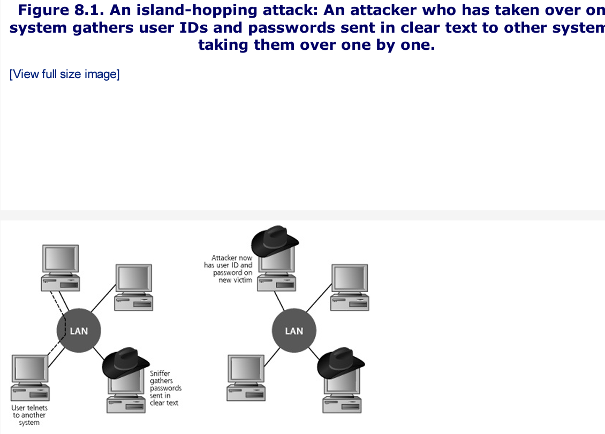
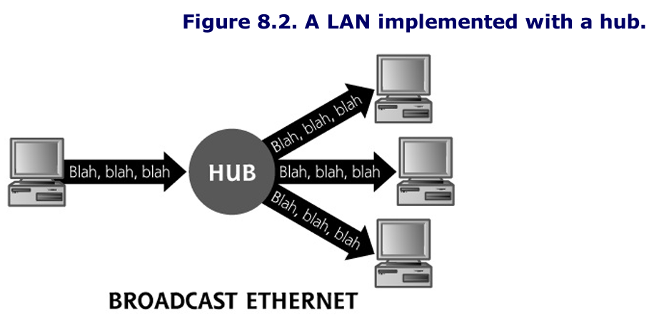
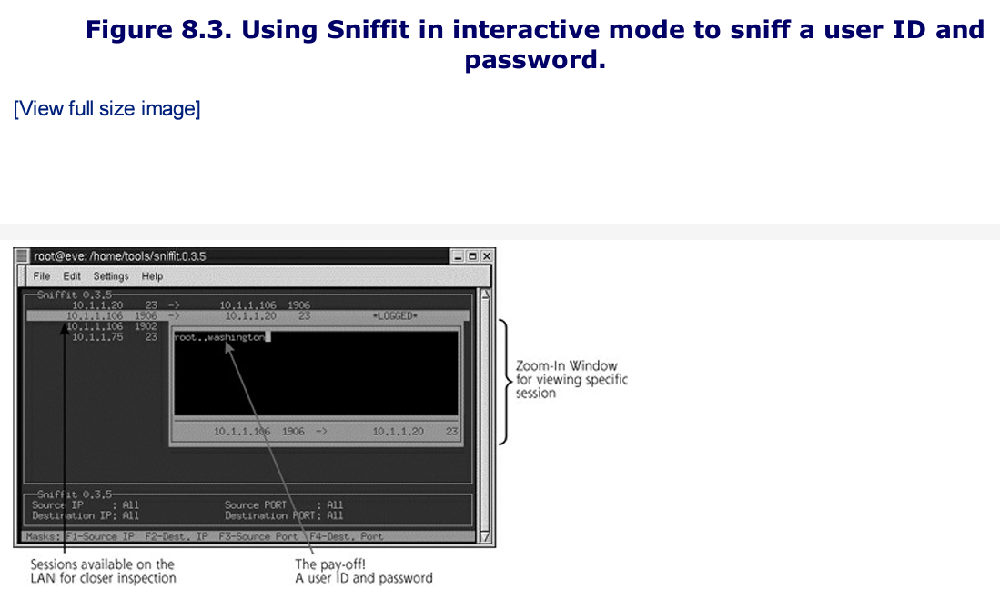
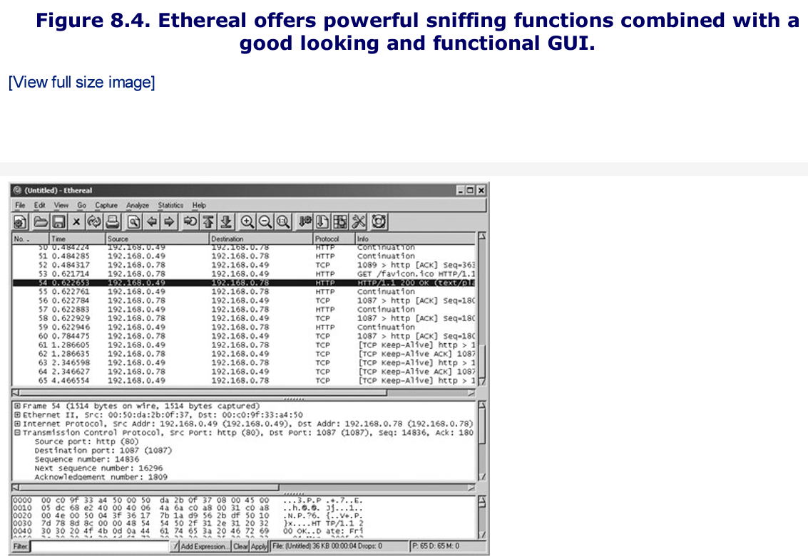
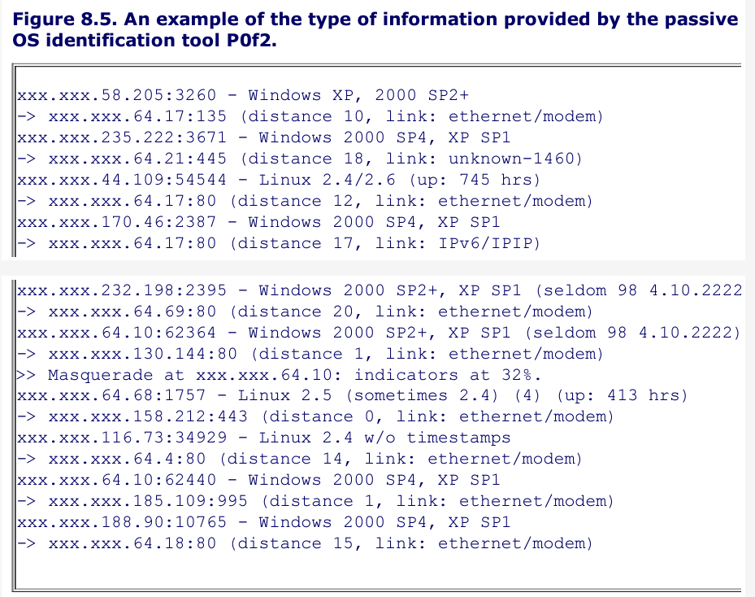
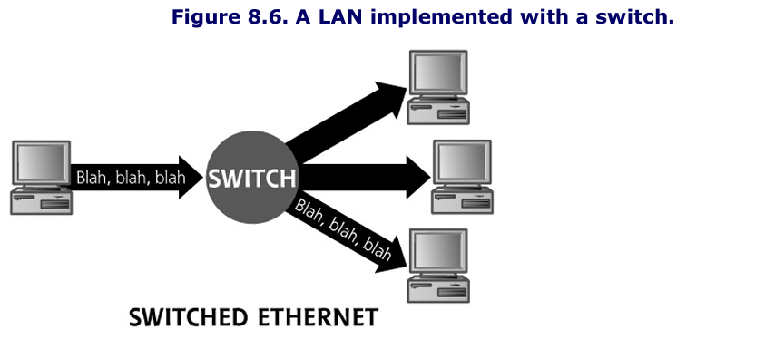

# Notes
As we wind through the scenarios in this chapter, it is important to remember that these network-based attacks will work no matter if our networks are made up of wires, switches, and hubs or if they consist of radio waves and wireless acess points. 

# Sniffing
A sniffer is a program that gathers traffic from the local network, and is useful both for attackers looking to swipe data as well as network administrators trying to troubleshoot problems. 
- Using a sniffer, an attacker can read data passing by a given machine in real time, or store the data in a file for access at a later time. 
- Because a sniffer gathers packets ar the Data Link Layer, it could potentially grab all data passing on the LAN of the machine running the sniffer program. 

A sniffer can grab anything sent across the LAN: user IDs and passwords for telnet sessions, DNS queries and responses, sensitive e-mail messages, FTP passwords, files accessed using the Network File System or Windows shares, and more.
- As long as data is not encrypted and passes by the network interface of the machine running the tool, a sniffer can pick it up. 
- This is because attackers most often use sniffers to gather all traffic from the LAN, putting the interface into so-called promiscuous mode. This mode involves gathering all data, without regard to its destination MAC address. Alternatively, when gathering data only going to or from its host system, a sniffer leaves the interface in its normal nonpromiscuous state. 

An attacker must have an account on a machine from which to run the sniffer. The attacker might have been given the account because he or she is an insider, such as an employee, supplier, or contractor requiring access on the machine. 
- Alternatively, the attacker may have used a method from the previous chapter to reach the system.
- It is important to note that in the vast majority of operating systems, the attacker needs an account with admin or root privileges to run a sniffer because it is reading packets directly from the network devices on a system. 

Attacks often use a sniffer to gather user IDs and passwords from clear-text protocols on the LAN and store them in a local file. At some later data, the attacker logs back into the system to recover the passwords. 

Sniffers are particularly useful in what is known as an island-hopping attack. As shown in the figure below, island hopping attacks involve an attacker taking over a single machine through some exploit. After gaining access to an account through this exploit, the attacker installs a sniffer on this first victim machine. Then, using the sniffer on the first victim, the attacker observes users and administrators logging on to other systems on the same LAN segment or other segments of the network. The sniffer gathers these user IDs and passwords, allowing the attacker to take over more machines. These sniffers allow attackers to hop from system to system taking over more machines. 

An enormous number of sniffing tools are widely available today. The following are some of the most interesting, widely used, and highly functional sniffers:
- windump: a freeware port of tcpdump for Windows
- snort: a freeware sniffer and network-based IDS, available at www.snort.com
- ethereal: freeware for UNIX/Linux and Windows, with a nice user interface and the ability to decode a plethora of protocols, available at www.ethereal.com
- Sniffit: Freeware running on a variety of UNIX and Linux flavors, and widely used in the attacker community
- Dsniff: A free suite of tools built around around a sniffer running on variations of UNIX and Linux, available at www.monkey.org/~dugsong/dsniff

Sniffers can be used on a variety of interface types (such as wireless or Token Ring interfaces). However, given the huge popularity of Ethernet as a LAN technology, the vast majority of sniffer tools target Ethernet.

As we discussed in chapter 2, ethernet-based networks can be implemented using both switches and hubs. 

## Sniffing Through a Hub: Passive Sniffing
Transmitting data across a hub-based LAN is like shouting into a crowded room: Everyone in the room can hear what you shout.
- In a similar manner, a hub implements a broadcast medium shared by all systems on the LAN.
- Any data sent across the LAN is shared with every machine on the LAN
- The figure below illustrates this relationship, if an attacker runs a sniffer on one system, the sniffer can gather data sent to and from any other system on the LAN

The majority of sniffer tools are well suited to sniff data in a hub environment. When used in this way these tools are called **passive sniffers** because they passively wait for data to be sent to them, and then silently gather that data from the LAN. In particular, three of the most useful tools in this realm are Snort, Sniffit, and Ethereal.

### Snort
Snort actually started as a very flexible sniffer program. 
- It works as a very powerful signature-matching and preprocessing IDS
- It works cross platform (Linux and Windows)
- Snort can be employed by an attacker to grab sensitive information from the network, however most bad guys don't use it because it offers far more capabilities than the attackers need. 

### Sniffit
Sniffit has been used in the computer underground for many years in a variety of attacks.
- It can be configured to gather data promiscuously and store it in a local file. 
- It also supports flexibile filtering capabilities so the attackers can zero in on particular hosts or even specific protocols to sniff, like telnet or FTP, based on port numbers, used by the protocol. 
- Sniffit's most interesting feature is its ability to handle the interactive sniffing sessions in real time.

Sniffit's interactive mode is incredibly useful for monitoring session-oriented applications, like telnet, rlogin, and FTP sessions. As shown in the figure below, the attacker is then presented with a slick interface showing all TCP sessions going across the network.

### Ethereal
Ethereal can decode several hundred different protocols used all across the networking spectrum and can break them down to the various fields within the packet to explain what every bit and byte is used for.

Additionally, Ethereal provides a handy "Follow TCP Stream" function that allows you to select a single packet and then see the entire contents of the TCP stream from which it came.

Ethereal has a lot of buffer overflow vulnerabilities

### This book is too old to mention wireshark, but that would work well here too. 

## "Hey Don't I Know You?" Passive OS Identification and Vulnerability Identification

In Chapter 6, Phase 2: Scanning: we discussed many different methods to map a network and look for vulnerable machines. Although all those methods work, they all run some risk of detection, because they all involve sending packets to the target network and receiving a response. 

What if you could perform network recon in an extremly stealthy fashion, mapping a network or even checking for vulnerabilities without ever sending a single packet? Well you can, to an extent, using fancied-up sniffers. Although you won't be able to get the depth of information you could get from say, an Nmap or Nessus scan, you might be suprised at the info that can be gathered in an entirely passive mode, as illustrated in the figure below

Every operating system has its own peculiarities, from the number of buttons on a mouse to the way it displays an error message. Those peculiarities extend to the behavior of the operating system's network software when making a connection. 
- If you were given samples of various packets sent from different operating systems in the course of making standard connections, it is possible to spot enough differences to be able to positiviely identify the source OS based solely on the types of packets they send.

This is the claim to fame for the program P0f2. 
- Available for Linux and Windows 
- Provides users with the ability to identify the OS of a remote machine passively, based on the "fingerprint" of the operating system's network stack
- In addition to identifying the OS, P0f2 cna identify firewall, NAT or load-balancer usage, connection type, and even system uptime, all by simply passively sniffing packets. 

In effect, P0f2 is really just a sniffer that grabs packets, and feeds them to some intelligence that can identify what operating system sent the packets based on their contents, especially the fields in the packet header, such as the TTL and IP ID in the IP header.
- Many systems send out packets with an initial TTL that is near a given power of 2, so by rounding to the nearest power of 2, we might be able to determine which operating system sent it.

Hand in hand with the concept of passive OS identification is the idea behind passive vulnerability scanning. In chapter 6 we discussed vulnerability scanning and introduced Nessus vulnerability scanner. 
- Nessus, while a good tool, does entail a certain risk of detection based on the packets it launches across the network

Passie vulnerability scanning iscurrently cutting-edge technology, with Tenable Network's Security commerical Nevo tool being the major tool in this genre currently available. 

Passive vulnerability scanners work by watching not only for the so-called banner information (information that applications generate that identifies the type and version of the software), but also by using special rules to identify specific "behavioral" clues that might indicate that an application could exhibit vulnerabilitie. 

### Active Sniffing: Sniffing Through a Switch and Other Cool Goodies
Unlike hubs, switched Ethernet does not broadcast all information to all machines on the LAN. Instead, the switch is more intelligent than the hub. It looks at the MAC address associated with each frame passing through it, sending data only to the required connection on the switch. 
- Therefore as shown in the figure below, a LAN built on switched Ethernet is not really a broadcast medium. A switch limits the data that a passive sniffer can gather.

If an attacker activates Snort, Sniffit, Ethereal, tcpdump, or any other passive sniffer on s witched LAN, the sniffer will only be able to see data going to and from one machine- the system with the sniffer installed. 
- All of the other interesting information flowing on the LAN will be unavailable to the sniffer, because the switch won't send it to the attacker's machine. 

To overcome this difficulty of sniffing a switched LAN, attackers have created a variety of tools that actively inject traffic into the LAN to support sniffing in a switched environment. 

## Dsniff: A Sniffing Cornucopia
Dsniff is a collection of several tools used to capture information fom a LAN in a huge number of flexible ways. Dsniff runs on OpenBSD, Linux,Solaris, AIX, and HP-UX. The centerpiece of the Dsniff suite is the sniffer program itself, called appropriately enough, Dsniff. 

### Parsing Packets for a Bunch of Applications
The big advantage of the Dsniff centerpiece sniffer is the amazing number of protocols that it can interpret. 

Dsniff really shines at decoding a large number of application-level protocols, sucking out user IDs and passwords from clear-text protocols including FTP, telnet, SMTP, HTTP, POP, poppass, NNTP, IMAP, SNMP, LDAP, Rlogin, RIP, OSPF, NFS, YP/NIS, SOCKS, X11, CVS, IRC, AIM, ICQ, Napster, PostgreSQL, Metting Maker, Critix ICA, Oracle SQL, Sybase SQL, and Microsoft SQL auth info. 
- The ability to detect and interpret properly and automatically this enormous list of application level protocols is highly useful to both attackers and security professionals.

Beyond its abilities to decode all of these application-level formats, the Dsniff suite's major differentiating feature is its ability to actively manipulate traffic.
- All of the other sniffers we've discussed so far (Snort, Sniffit, Ethereal, tcp-dump) passively monitor ttraffic on the network. 

### Foiling Switches with Floods
Dsniff offers two methods for sniffing data from a switched LAN
1. The first technique is based on MAC flooding using a Dsniff program called Macof. 
	- Dsniff's Macof program works by sending out a flood of traffic with random spoofed source MAC addresses on the LAN. Eventually the switch's memory associated with the CAM table is exhausted, filled with bogus MAC addresses. This causes some switches to forward data onto all other physical ports of the switch, somewhat like a hub. 

### Foiling Switches with Spoofed ARP Messages
Some switches are not subject to this MAC flooding attack because they stop storing new MAC addresses when the remaining capacity of their memory reaches a given limit. 
- With those switches, once the memory is filled, no other MAC addresses can be admitted to the LAN until some existing MAC addresses in the CAM table time out, a period that dpeends on the swtich but typically involves several minutes. 

# Summary