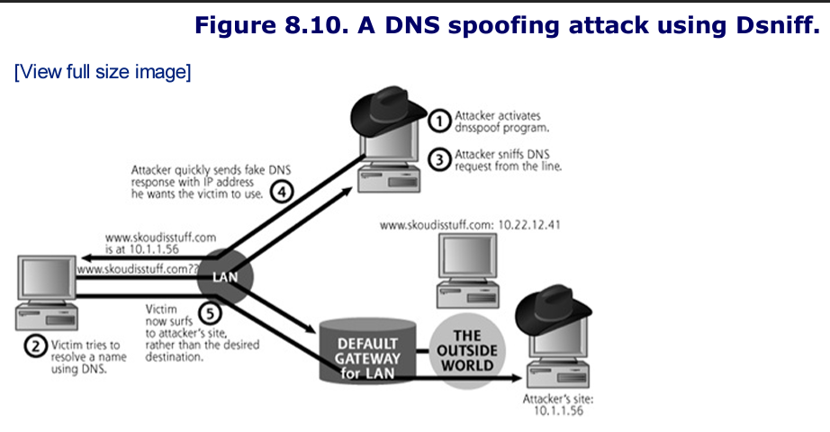
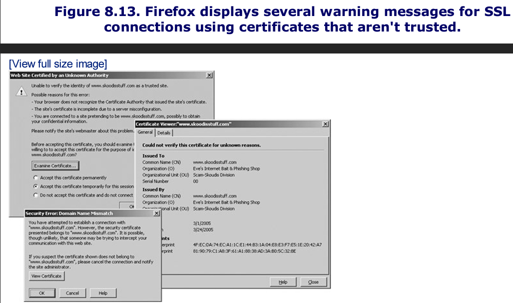
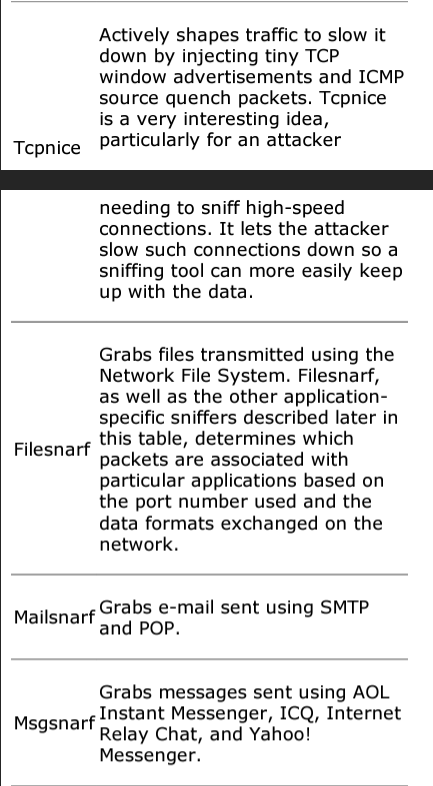

# Notes
As we wind through the scenarios in this chapter, it is important to remember that these network-based attacks will work no matter if our networks are made up of wires, switches, and hubs or if they consist of radio waves and wireless acess points. 

# Sniffing
A sniffer is a program that gathers traffic from the local network, and is useful both for attackers looking to swipe data as well as network administrators trying to troubleshoot problems. 
- Using a sniffer, an attacker can read data passing by a given machine in real time, or store the data in a file for access at a later time. 
- Because a sniffer gathers packets ar the Data Link Layer, it could potentially grab all data passing on the LAN of the machine running the sniffer program. 

A sniffer can grab anything sent across the LAN: user IDs and passwords for telnet sessions, DNS queries and responses, sensitive e-mail messages, FTP passwords, files accessed using the Network File System or Windows shares, and more.
- As long as data is not encrypted and passes by the network interface of the machine running the tool, a sniffer can pick it up. 
- This is because attackers most often use sniffers to gather all traffic from the LAN, putting the interface into so-called promiscuous mode. This mode involves gathering all data, without regard to its destination MAC address. Alternatively, when gathering data only going to or from its host system, a sniffer leaves the interface in its normal nonpromiscuous state. 

An attacker must have an account on a machine from which to run the sniffer. The attacker might have been given the account because he or she is an insider, such as an employee, supplier, or contractor requiring access on the machine. 
- Alternatively, the attacker may have used a method from the previous chapter to reach the system.
- It is important to note that in the vast majority of operating systems, the attacker needs an account with admin or root privileges to run a sniffer because it is reading packets directly from the network devices on a system. 

Attacks often use a sniffer to gather user IDs and passwords from clear-text protocols on the LAN and store them in a local file. At some later data, the attacker logs back into the system to recover the passwords. 

Sniffers are particularly useful in what is known as an island-hopping attack. As shown in the figure below, island hopping attacks involve an attacker taking over a single machine through some exploit. After gaining access to an account through this exploit, the attacker installs a sniffer on this first victim machine. Then, using the sniffer on the first victim, the attacker observes users and administrators logging on to other systems on the same LAN segment or other segments of the network. The sniffer gathers these user IDs and passwords, allowing the attacker to take over more machines. These sniffers allow attackers to hop from system to system taking over more machines. 


An enormous number of sniffing tools are widely available today. The following are some of the most interesting, widely used, and highly functional sniffers:
- windump: a freeware port of tcpdump for Windows
- snort: a freeware sniffer and network-based IDS, available at www.snort.com
- ethereal: freeware for UNIX/Linux and Windows, with a nice user interface and the ability to decode a plethora of protocols, available at www.ethereal.com
- Sniffit: Freeware running on a variety of UNIX and Linux flavors, and widely used in the attacker community
- Dsniff: A free suite of tools built around around a sniffer running on variations of UNIX and Linux, available at www.monkey.org/~dugsong/dsniff

Sniffers can be used on a variety of interface types (such as wireless or Token Ring interfaces). However, given the huge popularity of Ethernet as a LAN technology, the vast majority of sniffer tools target Ethernet.

As we discussed in chapter 2, ethernet-based networks can be implemented using both switches and hubs. 

## Sniffing Through a Hub: Passive Sniffing
Transmitting data across a hub-based LAN is like shouting into a crowded room: Everyone in the room can hear what you shout.
- In a similar manner, a hub implements a broadcast medium shared by all systems on the LAN.
- Any data sent across the LAN is shared with every machine on the LAN
- The figure below illustrates this relationship, if an attacker runs a sniffer on one system, the sniffer can gather data sent to and from any other system on the LAN


The majority of sniffer tools are well suited to sniff data in a hub environment. When used in this way these tools are called **passive sniffers** because they passively wait for data to be sent to them, and then silently gather that data from the LAN. In particular, three of the most useful tools in this realm are Snort, Sniffit, and Ethereal.

### Snort
Snort actually started as a very flexible sniffer program. 
- It works as a very powerful signature-matching and preprocessing IDS
- It works cross platform (Linux and Windows)
- Snort can be employed by an attacker to grab sensitive information from the network, however most bad guys don't use it because it offers far more capabilities than the attackers need. 

### Sniffit
Sniffit has been used in the computer underground for many years in a variety of attacks.
- It can be configured to gather data promiscuously and store it in a local file. 
- It also supports flexibile filtering capabilities so the attackers can zero in on particular hosts or even specific protocols to sniff, like telnet or FTP, based on port numbers, used by the protocol. 
- Sniffit's most interesting feature is its ability to handle the interactive sniffing sessions in real time.

Sniffit's interactive mode is incredibly useful for monitoring session-oriented applications, like telnet, rlogin, and FTP sessions. As shown in the figure below, the attacker is then presented with a slick interface showing all TCP sessions going across the network.


### Ethereal
Ethereal can decode several hundred different protocols used all across the networking spectrum and can break them down to the various fields within the packet to explain what every bit and byte is used for.

Additionally, Ethereal provides a handy "Follow TCP Stream" function that allows you to select a single packet and then see the entire contents of the TCP stream from which it came.

Ethereal has a lot of buffer overflow vulnerabilities


### This book is too old to mention wireshark, but that would work well here too. 

## "Hey Don't I Know You?" Passive OS Identification and Vulnerability Identification

In Chapter 6, Phase 2: Scanning: we discussed many different methods to map a network and look for vulnerable machines. Although all those methods work, they all run some risk of detection, because they all involve sending packets to the target network and receiving a response. 

What if you could perform network recon in an extremly stealthy fashion, mapping a network or even checking for vulnerabilities without ever sending a single packet? Well you can, to an extent, using fancied-up sniffers. Although you won't be able to get the depth of information you could get from say, an Nmap or Nessus scan, you might be suprised at the info that can be gathered in an entirely passive mode, as illustrated in the figure below


Every operating system has its own peculiarities, from the number of buttons on a mouse to the way it displays an error message. Those peculiarities extend to the behavior of the operating system's network software when making a connection. 
- If you were given samples of various packets sent from different operating systems in the course of making standard connections, it is possible to spot enough differences to be able to positiviely identify the source OS based solely on the types of packets they send.

This is the claim to fame for the program P0f2. 
- Available for Linux and Windows 
- Provides users with the ability to identify the OS of a remote machine passively, based on the "fingerprint" of the operating system's network stack
- In addition to identifying the OS, P0f2 cna identify firewall, NAT or load-balancer usage, connection type, and even system uptime, all by simply passively sniffing packets. 

In effect, P0f2 is really just a sniffer that grabs packets, and feeds them to some intelligence that can identify what operating system sent the packets based on their contents, especially the fields in the packet header, such as the TTL and IP ID in the IP header.
- Many systems send out packets with an initial TTL that is near a given power of 2, so by rounding to the nearest power of 2, we might be able to determine which operating system sent it.

Hand in hand with the concept of passive OS identification is the idea behind passive vulnerability scanning. In chapter 6 we discussed vulnerability scanning and introduced Nessus vulnerability scanner. 
- Nessus, while a good tool, does entail a certain risk of detection based on the packets it launches across the network

Passie vulnerability scanning iscurrently cutting-edge technology, with Tenable Network's Security commerical Nevo tool being the major tool in this genre currently available. 

Passive vulnerability scanners work by watching not only for the so-called banner information (information that applications generate that identifies the type and version of the software), but also by using special rules to identify specific "behavioral" clues that might indicate that an application could exhibit vulnerabilitie. 

### Active Sniffing: Sniffing Through a Switch and Other Cool Goodies
Unlike hubs, switched Ethernet does not broadcast all information to all machines on the LAN. Instead, the switch is more intelligent than the hub. It looks at the MAC address associated with each frame passing through it, sending data only to the required connection on the switch. 
- Therefore as shown in the figure below, a LAN built on switched Ethernet is not really a broadcast medium. A switch limits the data that a passive sniffer can gather.


If an attacker activates Snort, Sniffit, Ethereal, tcpdump, or any other passive sniffer on s witched LAN, the sniffer will only be able to see data going to and from one machine- the system with the sniffer installed. 
- All of the other interesting information flowing on the LAN will be unavailable to the sniffer, because the switch won't send it to the attacker's machine. 

To overcome this difficulty of sniffing a switched LAN, attackers have created a variety of tools that actively inject traffic into the LAN to support sniffing in a switched environment. 

## Dsniff: A Sniffing Cornucopia
Dsniff is a collection of several tools used to capture information from a LAN in a huge number of flexible ways. Dsniff runs on OpenBSD, Linux,Solaris, AIX, and HP-UX. The centerpiece of the Dsniff suite is the sniffer program itself, called appropriately enough, Dsniff. 

### Parsing Packets for a Bunch of Applications
The big advantage of the Dsniff centerpiece sniffer is the amazing number of protocols that it can interpret. 

Dsniff really shines at decoding a large number of application-level protocols, sucking out user IDs and passwords from clear-text protocols including FTP, telnet, SMTP, HTTP, POP, poppass, NNTP, IMAP, SNMP, LDAP, Rlogin, RIP, OSPF, NFS, YP/NIS, SOCKS, X11, CVS, IRC, AIM, ICQ, Napster, PostgreSQL, Metting Maker, Critix ICA, Oracle SQL, Sybase SQL, and Microsoft SQL auth info. 
- The ability to detect and interpret properly and automatically this enormous list of application level protocols is highly useful to both attackers and security professionals.

Beyond its abilities to decode all of these application-level formats, the Dsniff suite's major differentiating feature is its ability to actively manipulate traffic.
- All of the other sniffers we've discussed so far (Snort, Sniffit, Ethereal, tcp-dump) passively monitor ttraffic on the network. 

### Foiling Switches with Floods
Dsniff offers two methods for sniffing data from a switched LAN
1. The first technique is based on MAC flooding using a Dsniff program called Macof. 
	- Dsniff's Macof program works by sending out a flood of traffic with random spoofed source MAC addresses on the LAN. Eventually the switch's memory associated with the CAM table is exhausted, filled with bogus MAC addresses. This causes some switches to forward data onto all other physical ports of the switch, somewhat like a hub. 

### Foiling Switches with Spoofed ARP Messages
Some switches are not subject to this MAC flooding attack because they stop storing new MAC addresses when the remaining capacity of their memory reaches a given limit. 
- With those switches, once the memory is filled, no other MAC addresses can be admitted to the LAN until some existing MAC addresses in the CAM table time out, a period that depends on the switch  but typically involves several minutes. 
- For switches that are immune to Mac flooding, Dsniff comes to the rescue (for attackers) by including another method for sniffing through a switch. 

Consider the switch-based LAN shown in the figure below. Under normal circumstances, traffic destined for the outside world is sent from a client machine, through the switch, to the default router for the LAN. The default router is the connection to the outside world, which could consist of other networks or the Internet itself. 
- Note in the figure, however, that an attacker has taken over a machine connected to the LAN. This attacker cannot monitor the victim's traffic using passive sniffing techniques, because the switch sends the traffic only to the physical switch port connected to the default router for the LAN. 

To sniff in a switched environment where MAC flooding doesn't work, Dsniff includes a tool called arpspoof. As its name implies, arpspoof allows an attacker to manipulate ARP traffic on the LAN. 
- Review: Machines use ARP to determine a destination system's MAC address based on the IP address, so traffic can be delivered across a LAN. 
- Essentially, ARP is used to map layer 3 (IP) addresses to Layer 2 (MAC) addresses (unlike a CAM table, which lives in a switch and maps Layer 2 to Layer 1).
- Arpspoof lets an attacker mess up these ARP mappings in a way that can enable the attacker to intercept data in a switched environment 

The figure below shows a step-by-step analysis of arpspoof in action. 


If IP forwarding were not enabled on the attacker's machine, the victim machine would not be able to send any traffic to the outside world, resulting in an inadvertent DoS attack. It is also important to note that this arpspoof technique doesn't target the switch itself. Instead, arpspoof manipulates the mapping of IP address to MAC address in the victim machine's ARP cache to allow sniffing in a switched environment. 

### Foiling Switches with Port Stealing
DSniff isn't the only game in town when it comes to clever tactics for getting around the difficulties that switches represent to an attacker who wants to sniff traffic from a LAN. 
- Ettercap is a powerful, flexible tool that offers the same active sniffing techniques pioneered by DSniff's arpspoof tool and manages to add a few techniques of its own. 

One method for defending against the ARP spoofing techniques used by DSniff is to hard-code specific MAC addresses in the ARP tables of potential target machines on a high-value LAN. 
- That way, these systems will send data to only specific other system MAC addresses, foiling ARP cache poisoning. 
- Ettercap offers a technique of active sniffing with the rather evocative name "port stealing."

To understand how port stealing works, you need to recall that a switch builds an internal representation of which MAC addresses are attached to each of its physical ports in its CAM table and uses that representation to switch frames on the LAN. 
- To port steal, Ettercap begins by flooding the LAN with bogus Ethernet frames that have the attacker's MAC address listed as the destination (which will keep the switch from forwarding to any other port) and with the packet's source set to the MAC address of the victim machine as illustrated in step one of the figure below
- In step 2, these packets cause the switch to associate the MAC address of the gateway machine with the physical port where the attacker's machine resides. The ARP cache on the end system remains intact. 
- Later in step 3, when any system on the LAN transmits packets to the network's default gateway, the switch examines the destination MAC address found on each of the packets and forwards them to the physical port where the switch's internal "map" says the router is located. The end result is that these packets are dumped out onto the wire where the attacker is located. The attacker can now sniff these packets using any old sniffer. 


### Sniffing and Spoofign DNS
In addition t o ARP spoofing, Dsniff also supports redirecting traffic based on sending false DNS information. 
- Dsniff includes a program called dnsspoof that lets an attacker send a false DNS response to a victim, which will make victim's access the attacker's machine when they intended to access another (valid) machine. 
- Suppose ```www.skoudisstuff.com``` is an online bank. If a user wants to surf to ```www.skoudisstuff.com```, the attacker can trick the client into connecting to the attacker's Web server, where the attacker could display a fake bank login screen, gathering the victim's credentials.
- The figure below shows how Dsniff's DNS spoofing works.



In Step 1, the attacker fires up the dnsspoof program from the Dsniff suite. The program sniffs the LAN, looking for DNS queries about specific hostnames, such as ```www.skoudisstuff.com```
- If the LAN is constructed with a hub, the attackers grab DNS queries right off of the LAN using passive sniffing. 
- If the LAN is switched, the arpspoof program can be used to capture them from the target as we saw in the previous section. 

In Step 2, the victim tries to resolve the name ```www.skoudisstuff.com``` using DNS, perhaps by trying to surf to the bank's Web site.

In Step 3, the attacker sniffs the DNS query from the line, and immediately sends a fake DNS response in step 4. 
- This response will be a lie claiming that ```www.skoudisstuff.com``` should resolve to 10.1.1.56 (which is the IP address of a machine belonging to the attacker in the outside world), instead of 10.22.12.41 (which is the real bank's Web site)
- The victim's machine then caches the incorrect DNA entry
- The real answer to the DNS query arrives but will be ignored since the system already received the fake one

In step 5, the victim's browser makes a connection with the system at 10.1.1.56, which it thinks is www.skoudisstuff.com, but will actually be the attacker's website.

For this attack to work, the attacker doesn't even have to be on the same LAN as the victim machine. Instead, the attacker can be located anywhere between the victim and the victim's DNS server. The attacker must be somewhere on this path, such as the victim's LAN, the DNS server's LAN, or any LAN in between where the traffic is carried, so that dnsspoof can see the DNS request and formulate its evil response. 

So as we've seen, Dsniff lets an attacker inject traffic into a network to remap critical information, such as MAC to IP address mappings, or domain names to IP address mappings. In that way, Dsniff performs traffic manipulation to redirect data and implement an active sniffer. 

### Sniffing HTTPS and SSH
The problem exploited by Dsniff lies in the trust of the certificates and public keys.
- For SSL, if a Web server sends a browser a certificate that is signed by a CA that the browser does not recognize, the browser prompts the user asking whether to accept this untrusted certificate. 
- SSH the user will be warned that the server's public key has changed, but will still be permitted to establish a connection. 

Dsniff exploits this problem using a monkey-in-the middle attack. The names of the tools for attacking HTTPS and SSH are webmitm and sshmitm where mitm stands for (monkey-in-the-middle attack)
- In these attacks, the attacker positions themselves between two systems on the network and actively participate in the connection to gather data or otherwise monkey with things. A general attack is shown below


Let's look at a concrete example of how the Dsniff tool webmitm works against HTTPS connections to set up a mitm attack, as shown in the figure below. 


In step 1, the attack first runs the dnsspoof program, configured to send false DNS infomration so that a DNS query for ```www.skoudisstuff.com``` will resolve to the attacker's IP address (10.1.2.3 in our example). Additionally, the attacker activates the webmitm program, which transparently proxies all HTTP and HTTPs traffic it receives 

In step 2, the dnsspoof program detects a DNS request for ```wwww.skoudisstuff.com``` and sends a DNS reply directing the client to the attacker's machine (10.1.2.3).

In step 3, the victim's browser starts to establish an SSL connection. 
- All messages for establishing the SSL connection are sent to the webmitm program on the attacker's machine.

In step 4, webmitm then acts as an SSL proxy, establishing two separate SSL connections: one from the victim to the attacker's machine, and the other from the attacker's system to the actual ```www.skoudisstuff.com``` Web server. 
- As far as the web server is concerned, it has established a valid SSL connection with the client, not knowing that it is actually communicating with the attacker's machine in the middle. 

In step 3 and 4, when establishing the SSL session between the victim machine and the attacker's machine, webmitm sends the victim machine a bogus certificate that the attacker has created. 
- Webmitm must send the attacker's certificate to the victim so it can establish its own SSL connection with the victim to decrypt the data passed from the browser. 
- The victim-to-attacker SSL session will use a session key exchanged with the attacker's own SSL certificate. 
- Dsniff has built-in capabilities for generating and signing a certificate to use in these attacks. 

When the victim's browser is redirected and establishes an SSL session with the attacker's machine, it will notice that the certificate is not signed by a trusted Certificate Authority (because the certificate was generated and signed by the attacker).
- Furthermore, if the attacker is not careful, the browser will notice that the DNS name in the certificate does not match the name of the Web site that the user is trying to access. 

What does the victim see during Step 4?, when a bogus certificate is sent to her machine during the establishment of the SSL connection? It depends on the browser that she's using. Mozilla Firefox displays the rather confusing message shown below. 




Webmitm displays the entire contents of the SSL session on the attacker's screen, as shown in the figure in the figure below. Not e that the output contains all HTTP information sent across the SSL connection. The user ID and password sent across the session are of particular interest to most attackers.


So, we have seen how Dsniff can be used to sniff SSL sessions by conducting a monkey-in-the-middle attack. In a similar fashion, an attacker can use Dsniff's sshmitm tool to view data sent across an SSH session. Just like Web browsers, the SSH client will complain that it doesn't recognize the public key inserted by the attacker. Different SSH clients have different warning messages, but the OpenSSH client displays the following warning: 

****

Both Dsniff and Ettercap support attacks against SSH protocol version 1 only. Although neither tool currently supports SSH protocol version 2, someone likely will implement similar attacks against that protocol. SSH protocol version 2 is a far more complex protocol, however, supporting many more crypto algorithms and options. 
- Thus, a tool implementing such attacks against the later protocol would be more difficult, but not completely impossible, to create.

### Additional Dsniff Odds and Ends
In addition to its amazing sniffing, redirection, and interception tricks, Dsniff also includes a variety of other tools that can help capture and manipulate traffic on a LAN. 




## Sniffing Defenses
Now that we've seen how an attacker can grab all kinds of useful information from your network using sniffing tools, how can you defend against these attacks? 
1. First, whenever possible, encrypt data that gets transmitted across the network. 
2. Use secure protocols like HTTPS for web traffic, SSH for encrypted login sessions and file transfer, Secure Multipurpose Internet Mail Extensions (S/MIME)

Get rid of hubs, because they make sniffing too easy. 

Next, for networks containing very sensitive systems and data, enable port-level security on your switches by configuring each switch port with a specific MAC address. 

Furthermore, for extremely sensitive networks like Internet DMZs, use static ARP tables on the end machines, hard-coding the MAC address to IP address mapping for all systems on the LAN. 

If the attacker manages to squeeze by the preventative measures we just described, there are various tools you can use to detect a sniffer installed on the machine. As we described earlier, if an attacker is grabbing all packets on a LAN, it puts the network interface into promiscuous mode, a very common scenario for sniff usage. 

You can detect promiscuous mode in two ways:
1. across the network: Run ```ifconfig``` on a local system and if you see the word PROMISC in output, the network is in promiscuous mode 
2. locally: Use PromiscDetect 


# IP Address Spoofing 
Like sniffing, another fundamental component of numerous attacks involves changing or disguising the source IP address of a system, a technique commonly referred to as IP address spoofing. Spoofing is helpful for attackers who don't want to have their actions traced back, because the packets will appear to be coming from the system whose address the attacker is using.
- Additionally, IP address spoofing helps attackers undermine various applications, particularly those that dangerously rely on only IP addresses for authentication or filtering

We've already encountered a couple of examples of IP address spoofing in earlier chapters. First, in Chapter 6, during our review of Nmap, we addressed this port-scanning tool's ability to use decoys and conduct idle scans. For both types of scans, Nmap supports spoofing by sending packets that appear to come from another system's source address. 


## IP Address Spoofing Flavor 1: Simple Spoofing--Simply Changing the IP Address


# Summary