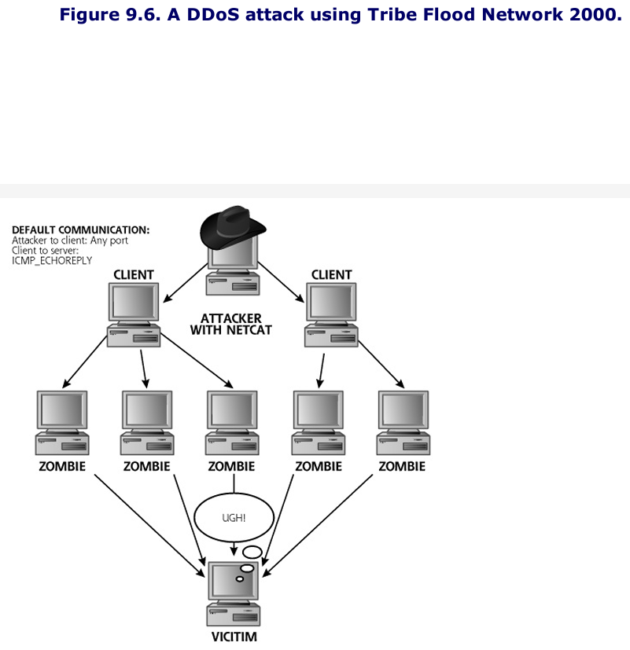

# Notes
Some attackers aren't looking to gain access; they want to prevent access by legitimate users or stop critical system processes. 

Generally speaking, most DoS (Denial of Service) attacks are not technically elegant. The attacker just wants to break things so finesse is not paramount. 

As shown in the figure below, DoS attacks generally fall into two categories: stopping a service and resource exhaustion. 
- Stopping a service means crashing or shutting off a specific program or machine that users want to access. 
- Resource exhaustion still leaves services running but the attacker consumes computer or network resources to prevent legitimate users from reaching the service. 

As pictured below, both categories of DoS attacks can be launched either locally (from an attacker owned account on the machine or against the target network).


# Locally Stopping Services
Using a local account on a machine, an attacker has a great deal of access to create a DoS attack by stopping valuable processes that make up services. 
- For example, on a UNIX system, an attacker with root privileges could stop the ```xinetd``` process. 

An attacker with local account access to a machine has a variety of methods for stopping local services, including the following:
- Process Killing: An attacker with sufficient privileges can simply kill local processes in a DoS attack
- System Reconfiguration: Attackers with sufficient privilege can reconfigure a system so that it doesn't offer the service any more or filters specific users from the machine.
- Process Crashing: Even if the attackers don't have super-user privileges on a machine, they might be able to crash processes by exploiting vulnerabillties in the system. For example, an attacker could exploit a buffer overflow vulnerability by inputting arbitrarily large amounts of random data into a local process. 

## Defenses From Locally Stopping Services 
To prevent an attacker from stopping services locally, you must keep your systems patched, applying the relevant security bug fixes, so that the attacker cannot exploit and crash vulnerable local programs. 

Furthermore make sure to dole out privileges carefully to users on your system. Most users do not require super-user privileges to get their job done. 

Finally, to detect changes quickly to the configuration of your system, you need to run file-integrity-checking programs, such as Tripwire. These programs check to make sure that critical system files (such as configuration files and sensitive executables on the machine) are not altered. If they are changed, the file-integrity-checking program will warn the system adminstrators, using periodic reports, e-mail, pager, SNMP trap, or other alarming mechanisms.

# Locally Exhausting Resources 
Another common type of DoS attack invovles running a program from an account on the target machine that grabs system resources on the target itself. When all system resources are exhausted, the system will grind to a halt, preventing legitimate access. Some common methods for exhausting local resources include the following:
- **Filling up the Process table**: An attacker could write a simple program that simply forks another process to run a copy of itself. That's it. Of course, this forked copy of the program would run, forking off another process to run the same program again, with the cycle repeating itself recursively again and again. Such attacks are sometimes referred to as fork bombs
- **Filling up the File System**: By continuously writing an enormous amount of data to the file system, an attacker could fill up every available byte on the disk partition, preventing other users from being able to write files, and potentially just crashing the system. Alternatively, instead of writing really big files to fill up all data blocks on the drive, the attacker could just create huge numbers of new files, in an attempt to exhaust the file system identification resources.
- **Sending Outbound Traffic That Fills Up Communications Link**: The attacker could write a program that sends bogus network traffic from the target system, consuming the processor and link bandwidth. If the attacker's program generates enough outbound packets from the victim machine, legitimate users will not be able to send traffic to or get responses from the system.

## Defenses From Locally Exhausting Resources
Apply the principle of least privilege when creating and maintaining user accounts. 
- If the operating system supports it, implement per-user limits on the consumption of file space, memory, and CPU usage. 

Finally, consider deplopying host-based IDSs or other system monitoring tools that can warn you when your system resources are getting low, possilby indicating this type of resource exhaustion attack.

# Remotely Stopping Services
Although local DoS attacks are often very simple and quite effective, remote DoS attacks are much more prevalent. DoS attacks across the network are more popular because they do not require the attacker to have a local account on the machine. 

One of the most common methods of remotely stopping a service is a malformed packet attack. Such attacks exploit an error in the TCP/IP stack or a running service on the target machine by sending one or more unusually formulated packets to the target.
- If the target machine is vulnerable, it will crash, possibly shutting down specific processes, all network communication or even causing the target's OS to halt. 

The Table below showcases a collection of malformed packets for Denial-of-Service Attacks


Many items in this exploit zoo rely on a variety of techniques to create packets with a structure that the developers of many TCP/IP stacks did not anticipate. Each one of these exploits sends one, or, at most, a few packets to the target, causing it to crash. Some of the attacks create unusual or illegal packet fragmentation. 

## Defenses From Remotely Stopping Services
As we've seen throughout this chapter, the best defense against many DoS attacks is to apply system patches in a quick, methodical manner. This is especially true for malformed packet DoS attacks, which rely on sloppily written programs like TCP/IP stacks and services. Vendors frequently release patches to their TCP/IP stacks to fix such problems. 

Additionally, some of these attacks, such as Land and TCP RESET spoofing, rely on IP address spoofing. The antispoofing filters can help thwart such attacks. 

To defend against ARP spoofing attacks, you can create static ARP tables on your most sensitive networks to make sure no one can alter IP-to-MAC address mapping on your LANs. Although this technique will make management of the network more difficult, it is a very good idea to use static ARP tables on sensitive networks, such as your Internet DMZ. 

# Remotely Exhausting Resources
Of all the DoS attacks available today, by far the most popular technique involves remotely tying up all of the resources of the target, particularly the bandwidth of the communications link. 
- In this type of attack the bad guys try to suck up all available network capacity using a flood of packets 
- As we saw with logic bombs, extortionists are also using packet floods to force victims into paying money to head off a DoS attack. 

## SYN Flood
As we saw in Chapter 2, all TCP connections begin with a three-way handshake which starts with a packet with the SYN control bit being set being transmitted to an open port. 
- When the destination machine receives the SYN packet it remembers the initial sequence number from the source, and generates a SYN-ACK resopnse. 
- To remember the inital sequence number form the source, the TCP/IP stack on the destination machine typically allocates a small piece of state to track the status of this new half-open connection. 
- A SYN flood attack attempts to undermine this mechanism by sending a large number of SYN packets to the target system, shown below


During a SYN flood, the attacker's goal is to overwhelm the destination machine with SYN packets. When the target receives more SYN packets than it can handle, other legitimate traffic will not be able to reach the victim. 

The first way a SYN flood can impact the target involves filling a data structure on the target called the connection queue, a memory structure used by the end system to remember where it stands in the three-way handshakes of various connection attempts. 

The attacker generating a bunch of SYNs, forces the ateget to allocate slots on its connectoin queue with bogus half-open connections. Once the target receives the SYN packet and it sends its SYN-ACK responses, it waits patiently for the third part of the 3-way handshake using a timeout value that is often set to over a minute by default. 

To help ensure that the connection queue gets filled, many SYN flood tools send SYN packets using spoofed source addresses that are unresponsive on the Internet. As illustrated below, the attacker will choose some set of IP addresses, shown as X1, X2, and X3, that no machine connected directly to internet is currently using. 


A second way that SYN floods can exahust the resources of the target goes beyond the connection queue. If the connection queue is enormosu and can handle a very large number of outstanding SYN packets, the SYN flood could just fill the entire communications link, squeezing out any legitimate traffic. 

## SYN Flood Defenses 
An important first defense against a SYN flood attack is to ensure that you have adequate bandwitdh and redundant paths for all of your critical systems.

If a flood attack does occur, you need to be able to redirect critical traffic quickly through another path, so redundant communication links are required. For particularly sensitive systems that must be constantly connected you must also consider using two or more different ISPs for connectivity. 

Different operating system vendors have developed a variety of techniques for handling SYN floods. Some increase the size of the connection queue, whereas others lower  the amount of time the system will wait on half-open connection. 

Another technique for defending against a SYN flood attack relies on a concept called SYN cookies, which focuses on eliminating the connection queue as a bottleneck in the face of a flood of SYN packets. 
- SYN cookies function by carefully constructing the sequence numbers included in the SYN-ACK packet sent from the target machine, as shown in the figure below. 


When a SYN packet comes to a machine that is using SYN cookies, it applies a cryptographic one-way hash function to the source and destination IP addresses, port numbers, time rounded to the nearest minute, and a secret number to create a single value, which is called a SYN cookie. 
- The calculated SYN cookie is loaded into the initial sequence number (ISNb) of the SYN-ACK response and transmitted across the network. 

## Smurf Attacks
Smurf attacks were a type of Distributed Denial of Service (DDoS) attack that were popular in the late 1990s and early 2000s. While smurf attacks are not as common today as they once were, they can still be used to launch DDoS attacks.

Smurf attacks take advantage of Internet Control Message Protocol (ICMP) and broadcast addresses to flood a victim's network with ICMP echo requests, overwhelming their bandwidth and causing a denial of service. This type of attack can be mitigated by filtering ICMP traffic at the network level or by configuring routers to block traffic from broadcast addresses.

Although smurf attacks are not as prevalent today due to better awareness of network security and improved network protection measures, attackers may still attempt to use them in targeted attacks on specific organizations or networks that may be vulnerable to this type of attack. Therefore, it is still important for organizations to remain vigilant and take appropriate measures to protect against smurf attacks and other types of DDoS attacks.


## Smurf Attack Defenses 
Make sure critical systems have adequate bandwidth and redundant paths. 
- Filter ICMP messages at your border router, but keep in mind that this tactic will mpair your users' ability to ping your systems. 

## Distributed Denial-of-Service Attacks
A simple SYN flood allowed an attcker to generate traffic from one machine. In a DDoS attack, there are no inherent limitations on the number of machines that can be used to launch the attack and how much bandwidth the attacker can consume. 

DDoS attacks firest appeared publicly in 1999 and have gained popularity ever since. 

## DDoS Architecture
A DDoS attack harnesses the distributed nature of the Internet, with hosts run by disparate entitites around the world, to create a massive flood of packets against one or more victims. 
- To conduct a DDoS flood, the attacker first takes over a large number of victim machines, often referred to as bots or zombies. 

The zombie software is the component of the DDoS tool that waits for command from the attacker, who uses a client tool to interact with the zombies. With bot-based zombies, the client software is often an Internet Relay Chat (IRC) client injecting commands into a shared IRC channel used by all of that attacker's bots. 

This communication is depicted in the figure below. 



## (LEGACY) TFN2K: A Powerful DDoS Tool
TFN2K (Tribe Flood Network 2000) was a DDoS (Distributed Denial of Service) tool that worked by coordinating the actions of multiple computers on different networks to flood a target network or website with traffic, rendering it inaccessible to legitimate users.

The TFN2K tool consisted of a master program that could control multiple "agents" or "zombies" (compromised computers) across different networks. The master program would send commands to the agents, instructing them to flood the target network or website with traffic.

TFN2K used a variety of techniques to generate this traffic, including SYN floods, UDP floods, and ICMP floods. These types of attacks overload the target network or website with requests or data, effectively blocking access to legitimate users.

TFN2K was also designed to be difficult to detect, with built-in features that allowed it to hide its presence on the compromised systems and encrypt its communications between the master program and agents. These features made it more challenging for security experts to identify and stop the attack.

While TFN2K is no longer a commonly used tool for launching DDoS attacks, its basic approach of coordinating the actions of multiple systems to overwhelm a target network or website is still used by attackers today, often in the form of botnets or other types of malware.

## Obscuring the Source with Reflected DDoS Attacks
In some DDoS tools, attackers have further refined their craft by implementign reflected DDoS attacks. As shown in the figure below, these reflected attacks take advantage of the TCP 3-way handshake bouncing an attack off of innocent servers using a spoofed soruce address, resulting in a SYN-ACK flood of the victim. 

In a reflected DDoS attack, the bad guy first chooses a half-dozen or more high-profile Internet servers, typically Web sites and mail servers that have a lot of bandwidth. The attacker then configures the DDoS zombie to send SYN packets to these servers, spoofing the source address to appear to come from the intended flood victim. 

When these servers receive the incoming SYN packet, they'll respond with a SYN-ACK directed to the flood victim. When the victims look at where the torrent of SYN-ACK packets is coming from, they'll think the high-bandwidth bounce sites are attacking them. 

Of course, the attackers must choose big sites with lots of load-balanced servers as a reflection point to make sure that their SYN packets don't exhaust the connectoin queues of the bounce servers. 

**Reflected DDoS Attacks Bouncing off of high-bandwidth sites**


## Pulsing Zombies: What a Headache
Pulsing zombies have been a technique used in distributed denial of service (DDoS) attacks in the past, but they are not as commonly used today. Pulsing zombies are a type of DDoS attack that involves sending short bursts of traffic from a botnet to a target server, with the goal of overwhelming the server's resources and making it inaccessible to legitimate users.

However, many DDoS attacks today use other techniques, such as amplification attacks that exploit vulnerabilities in servers or networks to amplify the volume of traffic directed at a target. Additionally, some attackers may use botnets to launch more sophisticated attacks, such as application-layer attacks that target specific vulnerabilities in web applications or APIs.

It's worth noting that DDoS attacks continue to be a significant threat to organizations of all sizes, and attackers are constantly evolving their techniques to bypass mitigation measures. Therefore, it's important for organizations to stay vigilant and have a comprehensive DDoS protection strategy in place to defend against these attacks.

To discover where the packet is really coming from, investigators must first contact the victim machine's ISP. Of course, that ISP is just looking at spoofed packets entering its network, so it will have to look, router by router, to find the ingress point of the packets from another upstream ISP. Then, the investigative team can contact the upstream ISP, trace it through their network and so on. This iterative process takes time. However, tracing back zombies is far easier if they are actively sending the traffic, because an ISP can quickly identifiy the flow of traffic through their network in real time, rather than having to consult (perhaps nonexistant) logs. DDoS tool developers realized investigators were tracing active attacks, so they introduced another twist, called pulsing zombies. 

## From SYN Floods to HTTP Floods
HTTP floods may fool some IDS since it completes the 3-way handshake and appears to look more like normal traffic. 

## DDOS Defenses
First of all, keep your systems patched and exercise safe Internet usage. Vigorously apply patches in a timely manner after testing them carefully. Don't run untrusted e-mail attachments and educate your users to avoid them as well. 

In the event that attackers still break into your system and install a zombie, you must employ egress antispoof filters on your external router or firewall. Such filters drop all outgoing traffic from your network that does not have a source IP address found on your network. 

For flooding: adequate bandwidths, redundant paths through multiple ISPs, and traffic shapping tools are a must for criticial internet connectoins. 

The best defense against a massive DDoS attack invovles rapid detection and the ability to must the incident response forces of your ISP. You need to employ  IDS tools that can quickly alert you when a DDoS attack starts. 


# Summary
DoS attacks do not let an attacker gain access to a system; they let an attacker prevent legitimate users from accessing the system. Although they often aren't technically elegant, DoS attacks can severely impact an organization, making defenses quite important. These attacks fall into two main categories: stopping a service and resource exhaustion. Each of these categories of attack an be launched locally or across the network. 

Stopping services locally prevents users from accessing them. An attacker could kill a process that provides the service, reconfigure the system to stop the service, or even cause the service to crash. A logic bomb is a particularly nasty method for launching a local DoS attack. To defend against local DoS attacks, you must keep your systems patched in a timely manner and be careful when allocating super-user privileges. 

Another DoS technique invovles locally exhausting resources. Attacks in this realm include filling up the process table, consuming the entire file system, or exhausting commmunications links. To defend against such attacks, make sure users have the minimum level of privilege required for their job function. Alos, you must equip systems with adequate memory, disk storage, and communications capacity. 

An attacker could launch a DoS attack by remotely stopping services. A common technique for accomplishing this is to send a malformed packet that exploits a bug in the target OS or application causing it to crash. A large number of malformed packet attack tools are available. To defend against such attacks, you must keep your system patches up to date and apply antispoof filters. 

The final category of DoS attacks is the most popular: remotely exhausting resources. Within this realm, packet-flooding tools dominate. To defend against most of these techniques, you must make sure you have adequate bandwidth and redundant communications paths. 

SYN flooding inovles initiating a large number of connections to a target with-out finishing the TCP three-way handshake. SYN cookies can help to defend against such attacks.

DDoS attacks are particularly damaging. An attacker takes over a large number of systems on the Internet, installs zombie or bot software on each of them, and uses them in a coordinated attack to flood a victim. DDoS attacks allow an attacker to consume enormous amounts of bandwidth. The more zombies an attacker has, the more bandwidth the attack can consume. Attacks launch reflected DDoS attacks to obscure their zombies' location, and utilize pulsing zombies to make tracing attacks even harder. HTTP floods look more like normal traffic than SYN floods, letting the attacker fool some detection systems. To defend against DDoS attacks, you should utilize IDSs to provide an early warning, and be prepared to activate the incident response team of your ISP. 